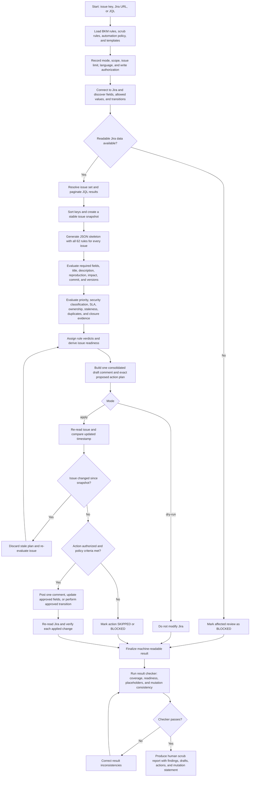

<!-- SPDX-FileCopyrightText: (C) 2026 Intel Corporation -->
<!-- SPDX-License-Identifier: Apache-2.0 -->

# Jira Bug Scrub Skill: High-Level Workflow

## Outcome States

| State | Meaning |
|-------|---------|
| `READY` | All applicable checks pass. |
| `READY WITH FOLLOW-UP` | Only non-blocking information or maintenance remains. |
| `NEEDS INFO` | At least one blocking item requires submitter or owner input. |
| `BLOCKED` | Jira data or permissions prevented a complete review. |

## Safety Boundary

`dry-run` is the default and never modifies Jira. In `apply`, the skill executes
only pre-planned and authorized actions, checks for concurrent issue updates,
and verifies the resulting Jira state. Priority, security, resolution, and
terminal workflow changes have additional authorization requirements.