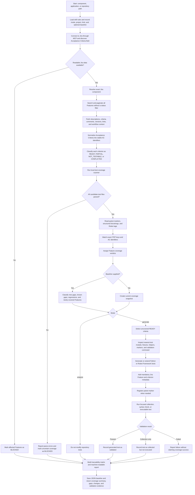

<!-- SPDX-FileCopyrightText: (C) 2026 Intel Corporation -->
<!-- SPDX-License-Identifier: Apache-2.0 -->

# Jira Feature Test Generator: High-Level Workflow

## Coverage States

| State | Meaning |
|-------|---------|
| `COVERED` | Every testable criterion has an exact, collected test reference. |
| `PARTIALLY_COVERED` | At least one criterion is covered, but coverage is incomplete or only feature-level. |
| `UNCOVERED` | No automated test contains the exact Jira Feature key. |
| `NOT_AUTOMATABLE` | All criteria describe work that cannot be validated by an automated test. |
| `NOT_APPLICABLE` | Explicit evidence shows the Feature is outside the selected repository or version scope. |
| `BLOCKED` | Missing Jira or repository evidence prevents a reliable verdict. |

## Generation Boundary

`analyze` is the default and never changes test files. `generate` creates tests
only for criteria classified as `READY`. Generated pytest tests carry a
`jira_feature` marker with the exact `ITEP-xxxxx` key and `AC-x` criterion;
other Python frameworks use structured docstrings, and Robot Framework uses
structured tags. Missing expectations or thresholds are reported for human
clarification instead of being invented.