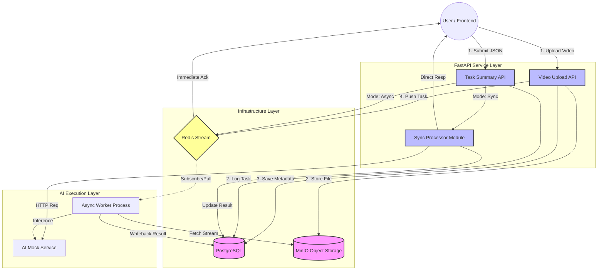

# Backend

## System Workflow
The system employs a Producer-Consumer pattern to decouple heavy AI inference from the API response cycle.


## Project Structure
```bash
backend/
edu-ai-backend/
├── api
│   ├── __init__.py
│   └── v1
│       ├── api.py
│       └── endpoints
│           ├── health.py
│           ├── __init__.py
│           └── tasks.py
├── conda_env.yml
├── config.py
├── core
│   ├── checks.py
│   ├── exceptions.py
│   ├── models.py
│   └── redis_client.py
├── crud
│   └── task_crud.py
├── database.py
├── ext_components
│   ├── conf.ini
│   ├── readme.md
│   └── set_submodule.py
├── main.py
├── mock_services
│   └── dummy_ai_provider.py
├── processor.py
├── pytest.ini
├── README.md
├── schemas
│   └── task.py
├── services
│   ├── storage_service.py
│   └── task_service.py
├── tests
│   ├── postman
│   │   └── collection.json
│   ├── pytest
│   │   ├── conftest.py
│   │   ├── test_consume.py
│   │   └── test_submit.py
│   ├── readme.md
│   └── requirements.txt
└── worker_run.py
```
## Prerequisites
### Hardware & OS
OS: Windows 11 / Linux

Python: 3.12.x

### Infrastructure
#### Redis
```powershell
# Task queuing (v5.0+)
https://github.com/tporadowski/redis/releases
```
#### PostgreSQL
```powershell
# Metadata storage (v16+)
https://www.postgresql.org/download/windows/ 
# passwd: edu-ai port: 5432
```
#### MinIO
MinIO: Large file object storage
Reference MinIO Doc education-ai-suite/content-search/content_search_minio/README.md

## Environment Setup
### Install Conda Environment (Miniforge)
```powershell
https://conda-forge.org/miniforge/
```
### Configure if need
```powershell
# configure .condarc
channels:
  - https://mirrors.tuna.tsinghua.edu.cn/anaconda/cloud/conda-forge/
  - https://mirrors.ustc.edu.cn/anaconda/cloud/conda-forge/
  - conda-forge
mirrored_channels:
  conda-forge:
    - https://conda.anaconda.org/conda-forge
    - https://prefix.dev/conda-forge
ssl_verify: false
proxy_servers:
  http: http://proxy-dmz.intel.com:911
  https: http://proxy-dmz.intel.com:912
```
### Setup env
```powershell
conda env create -f conda_env.yml
# if conda env not exist
conda env update -n edu-ai -f conda_env.yml
```
### backup env if need
conda env export --no-build > conda_env.yml

## Prepare 3rdpart modules
```powershell
# 1. enter into ext_components directory
cd ext_components
# 2. configure the conf.ini to the right submodule's path
# 3. create (remove) softlink
conda activate edu-ai
python .\set_submodule.py -create -f .\conf.ini
python .\set_submodule.py -remove -f .\conf.ini
```
The directory will be like:
```bash
tree -L 3 ext_components/
ext_components/
├── readme.md
... ...
├── content_search_minio -> /xx/x/edge-ai-suites/education-ai-suite/content-search/content_search_minio
└── file_ingest_and_retrieve -> /xx/x/edge-ai-suites/education-ai-suite/content-search/file_ingest_and_retrieve
```
## Launch the backend
```powershell
conda activate edu-ai
# Terminal A
& python .\main.py
# Terminal B
& python .\worker_run.py
# Terminal C
& python .\mock_services\dummy_ai_provider.py
```

## API Usage & Testing
Using curl or postman
### Health check
```powershell
curl --location 'http://127.0.0.1:8000/api/v1/system/health'
```
response example
```json
{
    "status": "healthy",
    "timestamp": 1773293770.3809352,
    "services": {
        "postgres": "online",
        "redis": "online",
        "minio": "online"
    }
}
```
### Get task info
#### request example
```powershell
curl --location 'http://127.0.0.1:8000/api/v1/tasks/task/371109e5-d374-4064-ba72-8f61b999d824' \
--header 'Content-Type: application/json'
```
#### response example
```json
{
    "status": "COMPLETED",
    "result": {
        "summary": "This is a mock result from the local Dummy service for None.",
        "confidence": 0.98,
        "provider": "Mock-Windows-Service"
    },
    "id": "371109e5-d374-4064-ba72-8f61b999d824",
    "payload": {
        "source": "minio",
        "video_key": "runs/run_3b90b38a/raw/video/default/dog_sign.mp4",
        "bucket": "content-search",
        "filename": "dog_sign.mp4",
        "run_id": "run_3b90b38a"
    },
    "task_type": "video_summary",
    "user_id": "admin",
    "created_at": "2026-03-12T13:04:30.115899"
}
```
### Synchronous Summary (Immediate Result)
#### request example
```powershell
curl --location 'http://127.0.0.1:8000/api/v1/tasks/video-summary' \
--header 'Content-Type: application/json' \
--data '{
    "video_url": "C:/videos/video-examples-14-11-2025/dog_sign.mp4",
    "sync": true
}'
```
##### response example
```json
{
    "task_id": "db517846-1aab-4436-9288-be504085ae17",
    "status": "COMPLETED",
    "mode": "synchronous",
    "result": {
        "summary": "This is a mock result from the local Dummy service for C:/videos/video-examples-14-11-2025/dog_sign.mp4.",
        "confidence": 0.98,
        "provider": "Mock-Windows-Service"
    }
}
```
### Asynchronous Summary (Webhook Notification)
Method: POST

Endpoint: http://127.0.0.1:8000/api/tasks/video-summary

Body (JSON):
```json
{
    "video_url": "C:/videos/test.mp4",
    "sync": false,
    "callback_url": "[https://webhook.site/your-unique-id](https://webhook.site/your-unique-id)"
}
```
webhook.site
https://webhook.site/ unique URL: e.g. https://webhook.site/28865adb-376c-4a0a-ac59-5204a60f9fe3

### Video Upload (MinIO Integration)
Method: POST
Endpoint: http://127.0.0.1:8000/api/tasks/video-upload
Body: form-data | key: video_file | type: File

#### request example
```powershell
curl --location 'http://127.0.0.1:8000/api/v1/tasks/video-upload' \
--form 'video_file=@"/C:/videos/video-examples-14-11-2025/dog_sign.mp4"'
```
#### response example
```json
{
    "task_id": "0c2e046f-a1d2-4bff-a97e-6d0f8c01ca58",
    "status": "QUEUED",
    "object_key": "runs/run_28f3baf4/raw/video/default/dog_sign.mp4"
}
```
## Automated Tests
```powershell
pip install -r .\tests\requirements.txt
pytest .\tests\pytest -v
```

## Debug tools
pgadmin 4
tiny RDM
postman
