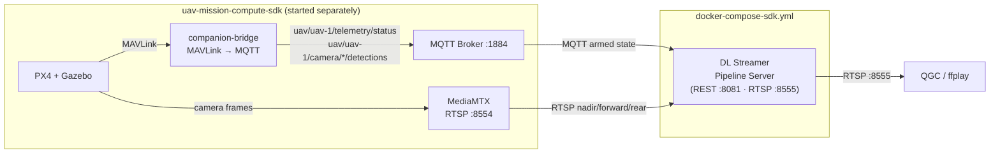
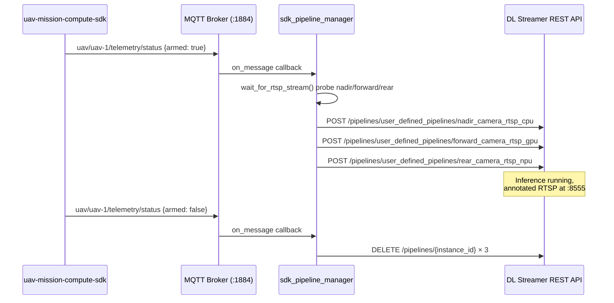

<!--
SPDX-FileCopyrightText: (C) 2026 Intel Corporation
SPDX-License-Identifier: Apache-2.0
-->


# Get Started (UAV Mission Compute SDK Mode)

This guide provides a step-by-step walkthrough for testing the UAV Vision Analytics application to configure the UAV Mission Compute SDK mode and run the demo with a simulated UAV camera feed/Realsense cameras.

## How It Works

A minimal single-container stack. Telemetry is received via MQTT from the `uav-mission-compute-sdk` project, which must be started first. The DLSPS container reads armed/disarmed state from `uav/{id}/telemetry/status` and subscribes to three RTSP camera streams (nadir, forward, rear).



**Telemetry / pipeline lifecycle flow:**



**Services:**

| Service | Image | Ports | Role |
|---|---|---|---|
| `dlstreamer-pipeline-server` | `intel/dlstreamer-pipeline-server` | `8081`, `8555` | AI inference, RTSP output |

---

## Steps to Test the Application

### Prerequisites

- Docker and Docker Compose v2
- Intel platform with at least 16 GB RAM (Panther Lake recommended)
- Network access to pull Docker images (configure proxy if behind a corporate firewall)
- The following system packages:

```bash
sudo apt install -y python3.12-venv ffmpeg
```

> `python3.12-venv` is required by `make model` to create a Python virtual environment.  
> `ffmpeg` provides `ffplay` for viewing the RTSP output stream and `ffmpeg` for recording.

### 1. Configure environment

```bash
make init
```

`make init` creates `.env` from the template and **auto-detects your Intel GPU** device paths (`GPU_DEVICE`, `GPU_RENDER_DEVICE`). It skips silently if `.env` already exists.

Then set your host IP address in `.env`:

```bash
nano .env   # set HOST_IP=<your-machine-IP>
```

### 2. Prepare the model

Download and export the YOLOv8n-VisDrone model to OpenVINO FP16 IR:

```bash
make model
```

> See [export_model.md](../how-to-guides/export_model.md) for full manual instructions and troubleshooting.

### 3. UAV Mission Compute SDK mode (depends on uav-mission-compute-sdk)

Start the SDK project first, then start this application:

```bash
# In uav-mission-compute-sdk directory — starts PX4, MQTT, RTSP server
make up-sim-camera

# In this directory
make sdk-up
```

### 4. Start inference pipelines

Three options are available depending on your use case:

#### Option A — Managed RTSP output (recommended)

Runs `pipeline_manager.py` inside the DLSPS container. It monitors the drone's ARMED/DISARMED state and automatically starts and stops inference pipelines. Annotated frames are served as RTSP on port `8555`.

```bash
make start-rtsp
```

**uav-mission-compute-sdk mode** — output streams (available after drone arms):
```
rtsp://<HOST_IP>:8555/nadir      (nadir camera, CPU)
rtsp://<HOST_IP>:8555/forward    (forward camera, GPU)
rtsp://<HOST_IP>:8555/rear       (rear camera, NPU)
```

**File-source pipelines** (started via REST API or benchmark script) — output path is set in the POST request body (e.g. `uav-mavlink-cpu` for the `uav_object_detection_cpu` pipeline).

#### Option B — Manual REST API

Start a single pipeline directly without the pipeline manager. Useful for testing individual pipelines or custom configurations.

```bash
# Start CPU pipeline (pymavlink mode)
INSTANCE_ID=$(curl -s -X POST \
  http://localhost:8081/pipelines/user_defined_pipelines/uav_object_detection_cpu \
  -H "Content-Type: application/json" \
  -d '{
    "destination": {
      "metadata": {
        "type": "file",
        "path": "/tmp/results.jsonl",
        "format": "json-lines"
      },
      "frame": {
        "type": "rtsp",
        "path": "uav-mavlink-cpu"
      }
    },
    "parameters": {
      "detection-properties": {
        "model": "/home/pipeline-server/resources/models/yolov8n-visdrone/best_openvino_model/best.xml",
        "device": "CPU"
      }
    }
  }' | tr -d '"')
echo "Instance ID: $INSTANCE_ID"
```

For GPU or NPU, change the pipeline name and `device` value.

Stop a pipeline:
```bash
curl -X DELETE http://localhost:8081/pipelines/${INSTANCE_ID}
```

### 5. View the output stream

```bash
# View annotated RTSP output (install ffmpeg first if not present)
ffplay rtsp://<HOST_IP>:8555/nadir               # uav-mission-compute-sdk mode, nadir camera
```

The annotated stream includes bounding boxes for detected objects (person, car, bus, truck, van, bicycle, tricycle, awning-tricycle, motor, others) and a live telemetry overlay (GPS, altitude, speed, heading).

---

## Pipelines

### uav-mission-compute-sdk mode (`config-sdk.json`)

| Pipeline | Device | Source (inside Docker) | Output RTSP (host) |
|---|---|---|---|
| `nadir_camera_rtsp_cpu` | CPU | `rtsp://host.docker.internal:8554/uav-1/nadir` | `rtsp://<HOST_IP>:8555/nadir` |
| `forward_camera_rtsp_gpu` | GPU | `rtsp://host.docker.internal:8554/uav-1/forward` | `rtsp://<HOST_IP>:8555/forward` |
| `rear_camera_rtsp_npu` | NPU | `rtsp://host.docker.internal:8554/uav-1/rear` | `rtsp://<HOST_IP>:8555/rear` |

> `uav-1` in the source URL is the value of the `UAV_ID` environment variable (default: `uav-1`).
> Set a different value in `.env` if your SDK project uses a different vehicle ID.

All pipelines are `auto_start: false` — started explicitly via the pipeline managers (`make start-rtsp` / `make start-udpsink`) or the REST API directly.

REST endpoint: `POST http://localhost:8081/pipelines/user_defined_pipelines/{name}`

---

## Telemetry Overlay Fields

Each output frame carries these overlaid fields in the upper-left corner:

| Field | Source MAVLink message | Description |
|---|---|---|
| `Protocol` | — | `pymavlink` or `MQTT` |
| `Frame` | — | Running frame counter |
| `ALT` | `GLOBAL_POSITION_INT.relative_alt` | Relative altitude (m) |
| `SPD` | `VFR_HUD.groundspeed` | Ground speed (m/s) |
| `HDG` | `GLOBAL_POSITION_INT.hdg` | Heading (degrees) |
| `LAT` | `GPS_RAW_INT.lat` | Latitude |
| `LON` | `GPS_RAW_INT.lon` | Longitude |
| `SATS` | `GPS_RAW_INT.satellites_visible` | GPS satellites visible |

---

## Port Reference

| Port | Protocol | Service | Mode |
|---|---|---|---|
| `8081` | HTTP | DL Streamer REST API | All modes |
| `8555` | RTSP | Annotated video output | All modes |

---

## Documentation

| Document | Description |
|---|---|
| [index.md](../index.md) | Architecture overview and component block diagrams |
| [index.md](../index.md) | Full deployment, configuration, architecture, and design guide |
| [export_model.md](../how-to-guides/export_model.md) | Model download and OpenVINO export instructions |
| [sdk-guide.md](../how-to-guides/sdk-guide.md) | End-to-end uav-mission-compute-sdk mode walkthrough |
| [realsense-guide.md](../how-to-guides/realsense-guide.md) | Intel RealSense camera setup and pipelines |
| [benchmark.md](../how-to-guides/benchmark.md) | Performance benchmarking guide (`calc_stream_density.sh`) |
| [makefile.md](../how-to-guides/makefile.md) | Makefile target reference |
| [troubleshooting.md](../how-to-guides/troubleshooting.md) | Known issues and resolutions |

---

## Notices and Disclaimers

**Notice for GStreamer:**
GStreamer is an open source framework licensed under LGPL. See https://gstreamer.freedesktop.org/documentation/frequently-asked-questions/licensing.html. You are solely responsible for determining if your use of GStreamer requires any additional licenses. Intel is not responsible for obtaining any such licenses, nor liable for any licensing fees due, in connection with your use of GStreamer.

**Notice for FFmpeg:**
FFmpeg is an open source project licensed under LGPL and GPL. See https://www.ffmpeg.org/legal.html. You are solely responsible for determining if your use of FFmpeg requires any additional licenses. Intel is not responsible for obtaining any such licenses, nor liable for any licensing fees due, in connection with your use of FFmpeg.
