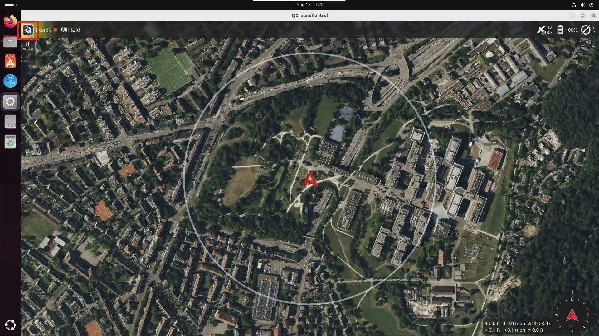

# QGroundControl

## Installation

Follow the instructions in the QGroundControl documentation to install QGroundControl on your host machine where you are running the application.

[Download and Install QGroundControl (Ubuntu)](https://docs.qgroundcontrol.com/Stable_V5.1/en/qgc-user-guide/getting_started/download_and_install.html#ubuntu)

## Enabling video stream in QGroundControl
Steps to enable QGroundControl to connect to the UAV Vision Analytics application video stream.

### UDP Sink

The following video shows how to configure QGroundControl to receive the UDP sink stream from the UAV Vision Analytics application. In QGroundControl, `Click on Left top Q icon` → `Settings` → `Video` → `Source` → `select "UDP h.264 Video Stream"` in the dropdown. Then in UDP URL enter `0.0.0.0:<port-number>`, where `<port-number>` is the port number for the desired pipeline (e.g., `5600` for CPU, `5601` for GPU, or `5602` for NPU).

> **Note:** Make sure `make start-udpsink` is running in the DLSPS container before attempting to connect QGroundControl to the UDP sink stream.

### RTSP Stream

The steps are similar to the UDP sink, but instead of selecting "UDP" in the "Source" dropdown, select "RTSP Video Stream".

In QGroundControl, `Click on Left top Q icon` → `Settings` → `Video` → `Source` → `select "RTSP Video Stream"` in the dropdown. Then in RTSP URL enter the URL for the desired pipeline (e.g., `rtsp://<HOST_IP>:8555/uav-mavlink-cpu`).

> **Note:** Make sure `make start-rtsp` is running in the DLSPS container before attempting to connect QGroundControl to the RTSP stream.

## Troubleshooting

- [QGroundControl — "Network Not Available" warnings](./troubleshooting.md#qgroundcontrol--network-not-available-warnings)

