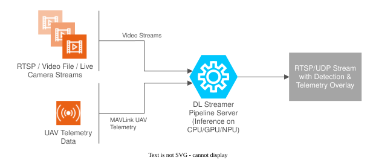

# UAV Vision Analytics Application

AI-powered UAV object detection with live telemetry overlay, built on Intel DL Streamer Pipeline Server.

This application processes video from a UAV-mounted camera (or simulated video file), runs YOLOv8n-VisDrone inference to detect objects across ten object classes, and overlays correlated MAVLink telemetry (GPS, altitude, speed, heading) directly on the video stream. The annotated output is served as an RTSP/UDP stream, consumable by any capable client such as QGroundControl (QGC) or VLC or ffplay.

# Overview

UAV Vision Analytics integrates AI-based object detection with UAV flight controller telemetry on a companion compute platform. Inference results and telemetry are correlated in near real-time and rendered as an on-screen overlay, producing an annotated RTSP stream. The application supports two deployment modes depending on whether an external SDK is available.

| Component                                          | Role                                                                                                    |
| -------------------------------------------------- | ------------------------------------------------------------------------------------------------------- |
| RTSP / Video File / Live Camera Streams            | Input video source — UAV camera feed, a recorded video file, or a simulated RTSP stream                 |
| MAVLink UAV Telemetry                              | Telemetry input — GPS, altitude, speed, and heading received from the flight controller over UDP         |
| DL Streamer Pipeline Server (CPU / GPU / NPU)      | Core inference engine — runs YOLOv8n-VisDrone object detection and renders the telemetry overlay on each frame |
| RTSP/UDP Stream with Detection & Telemetry Overlay | Annotated output stream — processed video with bounding boxes and telemetry overlay, served over RTSP or UDP |

## Standalone Mode (pymavlink)

Self-contained mode using PX4 SITL simulation and pymavlink for MAVLink communication. No external dependencies required.

[Get Started — Standalone Mode](./get-started/get-started-standalone.md)

## UAV Mission Compute SDK Mode

Integration mode that connects to a running instance of the UAV Mission Compute SDK, enabling full mission control and multi-camera pipeline management.

[Get Started — UAV Mission Compute SDK Mode](./get-started/get-started-uavsdk.md)

# Documentation

- [Get Started — Standalone Mode](./get-started/get-started-standalone.md)
- [Get Started — UAV Mission Compute SDK Mode](./get-started/get-started-uavsdk.md)
- [Release Notes](./release-notes.md)

# How-to Guides

- [Benchmark](./how-to-guides/benchmark.md) — Measure stream density and hardware utilization using `calc_stream_density.sh`
- [Export YOLOv8n-VisDrone to OpenVINO](./how-to-guides/export_model.md) — Download the model checkpoint and export to OpenVINO FP16 IR format
- [Makefile Reference](./how-to-guides/makefile.md) — Shorthand targets for model setup, stack management, and pipeline control
- [UAV Mission Compute SDK Flow](./how-to-guides/uavsdk-guide.md) — End-to-end walkthrough: start the SDK, launch the pipeline manager, run a mission, and capture streams
- [Intel RealSense](./how-to-guides/realsense-guide.md) — Connect and stream from an Intel RealSense depth camera as the video source
- [Troubleshooting](./how-to-guides/troubleshooting.md) — Common issues and fixes for deployment, inference, and streaming problems

