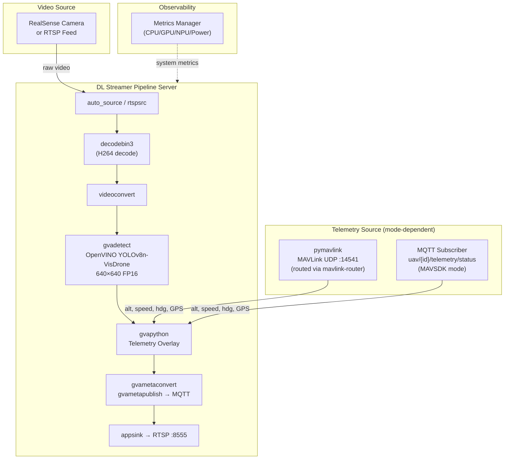
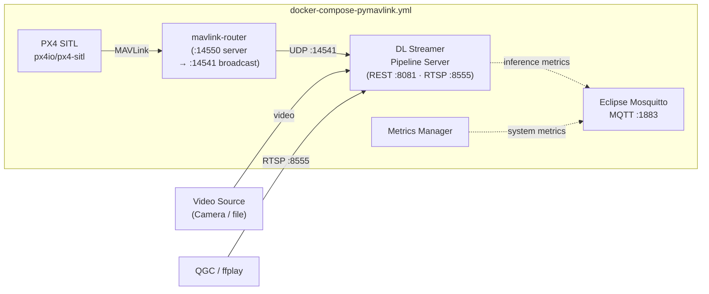
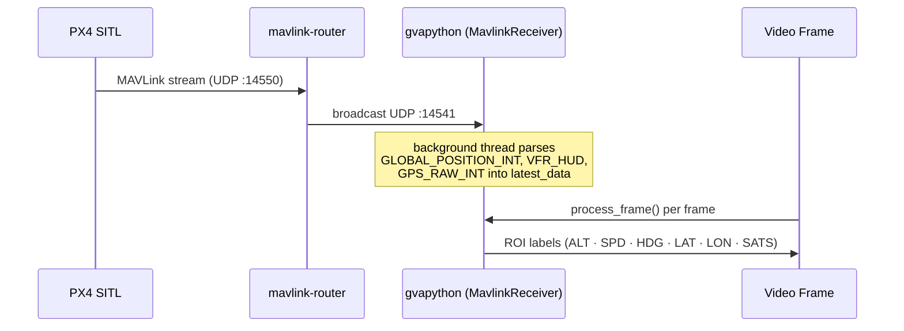
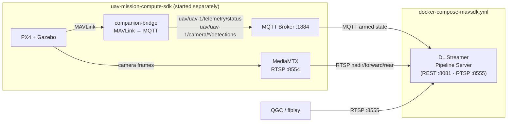
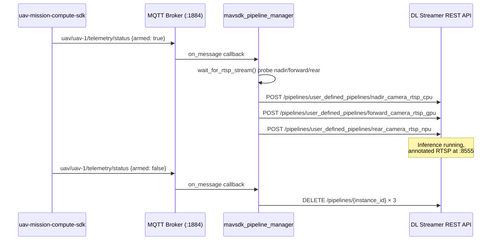
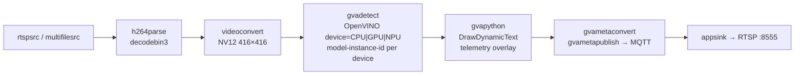

<!--
SPDX-FileCopyrightText: (C) 2026 Intel Corporation
SPDX-License-Identifier: Apache-2.0
-->

# UAV Vision Analytics — Overview

This application demonstrates AI-based object detection integrated with drone flight controller telemetry on a companion compute platform. Telemetry data (GPS, altitude, speed, heading) is correlated with AI inference results and rendered as an on-screen overlay in near real-time, producing a watermarked RTSP video stream consumable by ground control software such as QGroundControl (QGC).

---

## System Architecture

---

## Deployment Modes

The application supports two deployment modes that differ in how telemetry is sourced.

### Mode 1 — Standalone / pymavlink (`docker-compose-pymavlink.yml`)

A self-contained stack. PX4 SITL, MAVLink router, MQTT broker, and Metrics Manager are all started together. Telemetry flows from PX4 SITL through `mavlink-router` to the DL Streamer container, where `pymavlink` reads it directly over UDP.

**Telemetry flow:**

**Services:**

| Service | Image | Ports | Role |
|---|---|---|---|
| `dlstreamer-pipeline-server` | `intel/dlstreamer-pipeline-server` + pymavlink | `8081`, `8555` | AI inference, RTSP output |
| `broker` | `eclipse-mosquitto:2.0.22` | `1883` | MQTT broker |
| `px4` | `px4io/px4-sitl` | — | Flight controller simulator |
| `mavlink-router` | custom build | — | MAVLink UDP routing (:14550 → :14541) |
| `metrics-manager` | `intel/metrics-manager` | — | CPU/GPU/NPU/power metrics |

---

### Mode 2 — MAVSDK / external SDK (`docker-compose-mavsdk.yml`)

A minimal single-container stack. Telemetry is received via MQTT from the `uav-mission-compute-sdk` project, which must be started first. The DLSPS container reads armed/disarmed state from `uav/{id}/telemetry/status` and subscribes to three RTSP camera streams (nadir, forward, rear).

**Telemetry / pipeline lifecycle flow:**

**Services:**

| Service | Image | Ports | Role |
|---|---|---|---|
| `dlstreamer-pipeline-server` | `intel/dlstreamer-pipeline-server` | `8081`, `8555` | AI inference, RTSP output |

---

## GStreamer Pipeline

All pipelines follow the same element chain (device and source vary per pipeline):

### pymavlink pipelines (`config-pymavlink.json`)

| Pipeline | Device | Source |
|---|---|---|
| `drone_object_detection_cpu` | CPU | `multifilesrc` (loop file) |
| `drone_object_detection_gpu` | GPU | `multifilesrc` (loop file) |
| `drone_object_detection_npu` | NPU | `multifilesrc` (loop file) |
| `drone_realsense_cpu` | CPU | RealSense (`v4l2src`) |
| `drone_realsense_gpu` | GPU | RealSense (`v4l2src`) |
| `drone_realsense_npu` | NPU | RealSense (`v4l2src`) |
| `drone_udpsink_cpu` | CPU | `multifilesrc` → UDP sink |
| `drone_udpsink_gpu` | GPU | `multifilesrc` → UDP sink |
| `drone_udpsink_npu` | NPU | `multifilesrc` → UDP sink |

### MAVSDK pipelines (`config-mavsdk.json`)

| Pipeline | Device | Source RTSP |
|---|---|---|
| `nadir_camera_rtsp_cpu` | CPU | `rtsp://host.docker.internal:8554/uav-1/nadir` |
| `forward_camera_rtsp_gpu` | GPU | `rtsp://host.docker.internal:8554/uav-1/forward` |
| `rear_camera_rtsp_npu` | NPU | `rtsp://host.docker.internal:8554/uav-1/rear` |

---

## AI Model

| Property | Value |
|---|---|
| Model | YOLOv8n-VisDrone |
| Source | [mshamrai/yolov8n-visdrone](https://huggingface.co/mshamrai/yolov8n-visdrone) |
| Precision | FP16 (OpenVINO IR) |
| Input resolution | 640 × 640 |
| Detection classes | pedestrian, people, bicycle, car, van, truck, tricycle, awning-tricycle, bus, motor |
| Ultralytics version | 8.4.67 (pinned — see `resources/requirements.txt`) |

See [export_model.md](export_model.md) for download and export instructions.

---

## Port Reference

| Port | Protocol | Service | Mode |
|---|---|---|---|
| `8081` | HTTP | DL Streamer REST API | Both |
| `8555` | RTSP | Annotated video output | Both |
| `1883` | TCP | Mosquitto MQTT broker | pymavlink only |
| `14541` | UDP | MAVLink broadcast (mavlink-router) | pymavlink only |

---

## Related Documentation

| Document | Description |
|---|---|
| [README.md](README.md) | Quick-start guide |
| [user-guide.md](user-guide.md) | Deployment, configuration, architecture, and design |
| [export_model.md](export_model.md) | Downloading and exporting the YOLOv8n-VisDrone model |
| [mavsdk-guide.md](mavsdk-guide.md) | End-to-end MAVSDK mode walkthrough |
| [realsense-guide.md](realsense-guide.md) | Intel RealSense camera setup and pipelines |
| [benchmark.md](benchmark.md) | Performance benchmarking guide |
| [makefile.md](makefile.md) | Makefile target reference |
| [troubleshooting.md](troubleshooting.md) | Known issues and resolutions |
