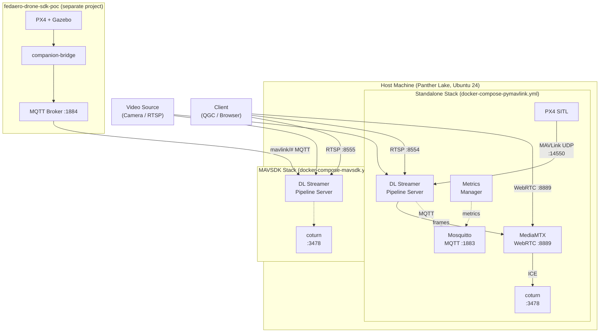
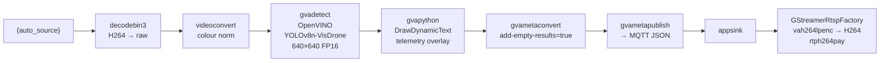

<!--
SPDX-FileCopyrightText: (C) 2026 Intel Corporation
SPDX-License-Identifier: Apache-2.0
-->

# User Guide — UAV Vision Analytics Application

This guide covers deployment, configuration, architecture, and design of the UAV Vision Analytics Application.

---

## Table of Contents

1. [Architecture](#architecture)
2. [Design](#design)
3. [Prerequisites](#prerequisites)
4. [Deployment — Standalone (pymavlink)](#deployment--standalone-pymavlink)
5. [Deployment — MAVSDK mode](#deployment--mavsdk-mode)
6. [Pipeline Configuration](#pipeline-configuration)
7. [Environment Variables Reference](#environment-variables-reference)
8. [REST API Reference](#rest-api-reference)
9. [Verifying the Output Stream](#verifying-the-output-stream)
10. [Stopping the Application](#stopping-the-application)
11. [Troubleshooting](#troubleshooting)

---

## Architecture

### Component interaction



### GStreamer inference pipeline



---

## Design

### Telemetry integration

The application supports two distinct telemetry integration strategies, selected at deploy time by choosing the appropriate compose file:

**pymavlink (standalone)**
- A background `MavlinkReceiver` thread connects to `udp:0.0.0.0:14550` and subscribes to MAVLink messages directly.
- Thread-safe access via a `threading.Lock` protecting the shared `latest_data` dict.
- Runs entirely within the DL Streamer container; no external dependencies.

**MAVSDK / MQTT**
- A background `MqttReceiver` thread connects to the MQTT broker and subscribes to three topics: `mavlink/GLOBAL_POSITION_INT`, `mavlink/VFR_HUD`, `mavlink/GPS_RAW_INT`.
- The broker and telemetry publisher are provided by the `fedaero-drone-sdk-poc` companion bridge.
- Decoupled: the vision stack does not need a direct serial/UDP connection to the flight controller.

### Overlay rendering

`gvapython` invokes `DrawDynamicText.process_frame()` on each decoded frame. The method reads the latest telemetry snapshot and calls `frame.add_region()` for each text line, positioning them as 1×1 pixel ROIs with text labels in the upper-left corner. The DL Streamer `gvawatermark` element downstream (in the RTSP factory) renders these regions as visible text on the encoded stream.

### Hardware inference

The `gvadetect` element delegates inference to OpenVINO. The `device=` flag in the pipeline JSON (`CPU`, `GPU`, or `NPU`) is the only change needed to switch hardware targets:

| Device | `gvadetect` flag | OpenVINO plugin | Notes |
|---|---|---|---|
| CPU | `device=CPU` | `CPU` | Works on any x86 host |
| Intel GPU | `device=GPU` | `GPU` | Requires i915 driver group access |
| Intel NPU | `device=NPU` | `NPU` | Requires `ZE_ENABLE_ALT_DRIVERS=libze_intel_npu.so` |

The compose files set `ZE_ENABLE_ALT_DRIVERS=libze_intel_npu.so` in the DL Streamer environment to enable the NPU driver.

### RTSP and WebRTC output

The built-in `GStreamerRtspFactory` (from the DL Streamer base image) converts the raw frames from `appsink` back to H264 using `vah264lpenc` (VA-API hardware encoder) and packages them in `rtph264pay`. GPU VA-API buffers (`VAMemory`, `VASurface`, `DMABuf`) are handled transparently by inspecting the GStreamer caps string.

WebRTC output is provided by MediaMTX (pymavlink mode) acting as a WebRTC signalling server. The DL Streamer container pushes the stream to MediaMTX via the `WEBRTC_SIGNALING_SERVER` environment variable, and the coturn TURN server handles ICE traversal.

---

## Prerequisites

- **Host OS:** Ubuntu 24 (Blueprint OS validated)
- **Hardware:** Intel Panther Lake platform, minimum 16 GB RAM
- **Software:** Docker Engine, Docker Compose v2
- **Model:** YOLOv8n-VisDrone exported to OpenVINO FP16 (see [export_model.md](export_model.md))
- **GPU/NPU access:** device group IDs (`44`, `109`, `110`, `990`–`996`) must exist on the host

---

## Deployment — Standalone (pymavlink)

### Step 1: Clone and configure

```bash
git clone <repo-url>
cd apps/uav-vision-analytics
cp .env.example .env
```

Edit `.env`:

```env
HOST_IP=192.168.1.100              # your host IP
DLSTREAMER_PIPELINE_SERVER_IMAGE=intel/dlstreamer-pipeline-server:2026.2.0-20260728-weekly-ubuntu24
MTX_WEBRTCICESERVERS2_0_USERNAME=myusername
MTX_WEBRTCICESERVERS2_0_PASSWORD=mypassword
```

### Step 2: Prepare the model

```bash
cd resources/models
python3 -m venv venv && source venv/bin/activate
pip install -r requirements.txt
hf download mshamrai/yolov8n-visdrone best.pt --local-dir ./yolov8n-visdrone
yolo export model=./yolov8n-visdrone/best.pt format=openvino dynamic=True imgsz=640 quantize=16
# Output: resources/models/yolov8n-visdrone/best_openvino_model/best.xml + best.bin
cd ../../
```

### Step 3: Start the stack

```bash
docker compose -f docker-compose-pymavlink.yml up -d
```

Check that all containers are running:

```bash
docker compose -f docker-compose-pymavlink.yml ps
```

Expected services: `broker`, `px4`, `dlstreamer-pipeline-server`, `mediamtx-server`, `coturn`, `metrics-manager`.

### Step 4: Start a pipeline

```bash
# CPU pipeline
curl -X POST http://localhost:8080/pipelines/drone_object_detection_cpu \
  -H "Content-Type: application/json" \
  -d '{
    "source": {
      "uri": "file:///home/pipeline-server/resources/videos/visdrone.avi",
      "type": "uri"
    },
    "destination": {
      "type": "rtsp",
      "path": "/drone-cpu"
    },
    "parameters": {
      "detection-properties": {
        "model": "/home/pipeline-server/resources/models/yolov8n-visdrone/best_openvino_model/best.xml",
        "model-proc": ""
      }
    }
  }'
```

Replace `uri` with `rtsp://<camera-ip>:<port>/<path>` when using a live camera or RTSP source.

---

## Deployment — MAVSDK mode

### Step 1: Start fedaero-drone-sdk-poc

```bash
cd fedaero-drone-sdk-poc
make up
# Wait ~60-90 s for PX4 SITL to become healthy
docker compose ps px4
```

### Step 2: Configure and start this application

```bash
cd apps/uav-vision-analytics
cp .env.example .env
# Set HOST_IP
nano .env

docker compose -f docker-compose-mavsdk.yml up -d
```

### Step 3: Start a pipeline

MAVSDK mode uses port `8081` for the REST API:

```bash
curl -X POST http://localhost:8081/pipelines/drone_object_detection_cpu \
  -H "Content-Type: application/json" \
  -d '{
    "source": {
      "uri": "rtsp://<host-ip>:8554/uav-1/nadir",
      "type": "uri"
    },
    "destination": {
      "type": "rtsp",
      "path": "/drone-nadir-cpu"
    },
    "parameters": {
      "detection-properties": {
        "model": "/home/pipeline-server/resources/models/yolov8n-visdrone/best_openvino_model/best.xml"
      }
    }
  }'
```

---

## Pipeline Configuration

Pipeline definitions live in `configs/config-pymavlink.json` and `configs/config-mavsdk.json`. Each entry specifies:

| Field | Description |
|---|---|
| `name` | Pipeline identifier used in REST API paths |
| `source` | Always `"gstreamer"` |
| `queue_maxsize` | Internal frame queue depth (default 50) |
| `pipeline` | GStreamer launch string with `{auto_source}` placeholder |
| `parameters` | JSON Schema for runtime parameters passed to the REST API |
| `auto_start` | `false` — all pipelines require explicit start via REST API |

The `{auto_source}` placeholder is resolved by DL Streamer from the `source.uri` in the REST request.

### Switching inference device

To change the inference device without modifying the config file, override `detection-properties.device` in the REST request body, or simply choose the appropriate pipeline name (`cpu` / `gpu` / `npu`).

---

## Environment Variables Reference

| Variable | Default | Description |
|---|---|---|
| `HOST_IP` | *(required)* | Host machine IP address, used by WebRTC ICE and mediamtx |
| `DLSTREAMER_PIPELINE_SERVER_IMAGE` | `intel/dlstreamer-pipeline-server:2026.2.0-...` | Docker image for DL Streamer |
| `MTX_WEBRTCICESERVERS2_0_USERNAME` | `myusername` | coturn / TURN server username |
| `MTX_WEBRTCICESERVERS2_0_PASSWORD` | `mypassword` | coturn / TURN server password |
| `http_proxy` / `https_proxy` / `no_proxy` | *(optional)* | Proxy settings forwarded into containers |
| `ZE_ENABLE_ALT_DRIVERS` | `libze_intel_npu.so` | Enables Intel NPU plugin in OpenVINO (set inside compose) |

---

## REST API Reference

The DL Streamer REST API is available at `http://localhost:8080` (pymavlink) or `http://localhost:8081` (mavsdk).

| Method | Path | Description |
|---|---|---|
| `GET` | `/pipelines` | List all registered pipelines |
| `POST` | `/pipelines/{name}` | Start a pipeline instance |
| `GET` | `/pipelines/{name}/{instance_id}` | Get status of a running instance |
| `DELETE` | `/pipelines/{name}/{instance_id}` | Stop a running instance |
| `GET` | `/models` | List loaded models |

**Example — list pipelines:**

```bash
curl http://localhost:8080/pipelines
```

**Example — stop an instance:**

```bash
curl -X DELETE http://localhost:8080/pipelines/drone_object_detection_cpu/1
```

---

## Verifying the Output Stream

### RTSP

```bash
# Install ffplay if needed: sudo apt install ffmpeg
ffplay rtsp://localhost:8554/drone-cpu
```

Or in QGroundControl: **Application Settings → Video** → set the RTSP URL.

### Record a clip

```bash
ffmpeg -rtsp_transport tcp -i "rtsp://localhost:8554/drone-cpu" \
  -c copy -map 0 output.mkv
```

---

## Stopping the Application

```bash
# Standalone mode
docker compose -f docker-compose-pymavlink.yml down

# MAVSDK mode
docker compose -f docker-compose-mavsdk.yml down
```

To remove the cached pipeline volume:

```bash
docker volume rm uav-vision-analytics_dlstreamer-pipeline-server-pipeline-root
```

---

## Troubleshooting

### DL Streamer container keeps restarting

- Check logs: `docker logs dlstreamer-pipeline-server`
- Verify the model files exist at `resources/models/yolov8n-visdrone/best_openvino_model/best.xml`
- Confirm `HOST_IP` is set correctly in `.env`

### No telemetry overlay on stream (all zeros)

**pymavlink mode:** Confirm PX4 SITL is running and sending MAVLink on UDP port `14550`:
```bash
docker logs px4 | grep MAVLink
```

**MAVSDK mode:** Confirm the MQTT broker is reachable and publishing telemetry topics:
```bash
mosquitto_sub -h localhost -p 1884 -t "mavlink/#" -v
```

### WebRTC stream not loading in browser

- Verify `HOST_IP` matches the host's reachable IP (not `127.0.0.1`)
- Confirm coturn is running: `docker logs coturn`
- Check that UDP port `3478` is open in the host firewall

### NPU inference fails

- Confirm `ZE_ENABLE_ALT_DRIVERS=libze_intel_npu.so` is set (it is by default in the compose files)
- Check that the NPU device node is available: `ls /dev/accel*`
- Verify driver version: `dmesg | grep -i npu`

### GPU pipeline falls back to CPU

- Confirm device group IDs are present: `getent group | grep -E '^(video|render)'`
- The compose files add groups `44`, `109`, `110` for video/render access
