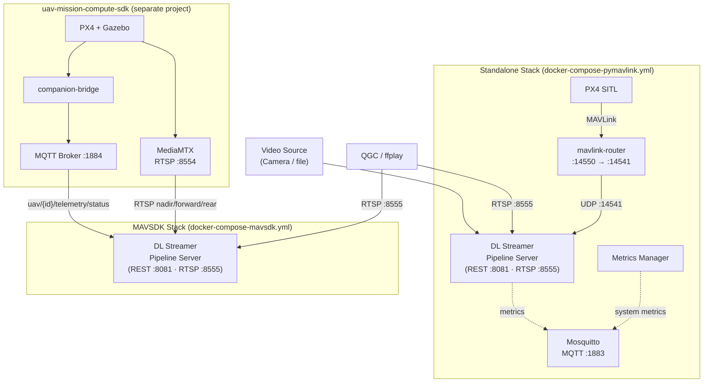
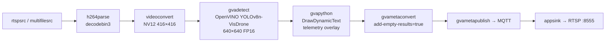

<!--
SPDX-FileCopyrightText: (C) 2026 Intel Corporation
SPDX-License-Identifier: Apache-2.0
-->

# User Guide — UAV Vision Analytics Application

This guide covers deployment, configuration, architecture, and design of the UAV Vision Analytics Application.

---

## Table of Contents

1. [Architecture](#architecture)
2. [Design](#design)
3. [Prerequisites](#prerequisites)
4. [Deployment — Standalone (pymavlink)](#deployment--standalone-pymavlink)
5. [Deployment — MAVSDK mode](#deployment--mavsdk-mode)
6. [Pipeline Configuration](#pipeline-configuration)
7. [Environment Variables Reference](#environment-variables-reference)
8. [REST API Reference](#rest-api-reference)
9. [Verifying the Output Stream](#verifying-the-output-stream)
10. [Stopping the Application](#stopping-the-application)
11. [Troubleshooting](#troubleshooting)

---

## Architecture

### Component interaction



### GStreamer inference pipeline



---

## Design

### Telemetry integration

The application supports two telemetry strategies, selected by the compose file used:

**pymavlink (standalone)**
- `mavlink-router` runs as a sidecar, receiving MAVLink from PX4 on UDP `:14550` and broadcasting it to `:14541`.
- A background `MavlinkReceiver` thread inside the DL Streamer container connects to `udpin:0.0.0.0:14541` and reads `GLOBAL_POSITION_INT`, `VFR_HUD`, and `GPS_RAW_INT` messages.
- Thread-safe access via a `threading.Lock` protecting the shared `latest_data` dict.

**MAVSDK / MQTT**
- `mavsdk_pipeline_manager.py` subscribes to `uav/{id}/telemetry/status` on the SDK project's MQTT broker (`:1884`).
- On ARMED: probes each RTSP source with `ffprobe`, then POSTs the three camera pipelines to the REST API.
- On DISARMED: DELETEs all running pipeline instances.
- The DL Streamer `gvapython` overlay (`telemetry-overlay-mavsdk.py`) also reads telemetry via MQTT.

### Overlay rendering

`gvapython` invokes `DrawDynamicText.process_frame()` on each decoded frame. The method reads the latest telemetry snapshot and calls `frame.add_region()` for each text line, positioning them as 1×1 pixel ROIs in the upper-left corner. The DL Streamer `gvawatermark` element renders these as visible text on the encoded RTSP stream.

### Hardware inference

| Device | `gvadetect` flag | Notes |
|---|---|---|
| CPU | `device=CPU` | Works on any x86 host |
| Intel GPU | `device=GPU` | Requires i915 / render group access |
| Intel NPU | `device=NPU` | Requires `ZE_ENABLE_ALT_DRIVERS=libze_intel_npu.so` |

### RTSP output

Both compose files expose RTSP on port `8555`. The DL Streamer built-in RTSP server encodes frames from `appsink` to H264 using `vah264lpenc` (VA-API hardware encoder). WebRTC is not used in the current deployment.

---

## Prerequisites

- **Host OS:** Ubuntu 24 (Blueprint OS validated)
- **Hardware:** Intel Panther Lake platform, minimum 16 GB RAM
- **Software:** Docker Engine, Docker Compose v2
- **Model:** YOLOv8n-VisDrone exported to OpenVINO FP16 (see [export_model.md](export_model.md))
- **GPU/NPU access:** device group IDs (`44`, `109`, `110`, `990`–`996`) must exist on the host

---

## Deployment — Standalone (pymavlink)

### Step 1: Clone and configure

```bash
git clone <repo-url>
cd apps/uav-vision-analytics
cp .env.example .env
```

Edit `.env`:

```env
HOST_IP=192.168.1.100              # your host IP
DLSTREAMER_PIPELINE_SERVER_IMAGE=intel/dlstreamer-pipeline-server:2026.2.0-20260728-weekly-ubuntu24
```

### Step 2: Prepare the model

```bash
make model
```

This creates a virtualenv, installs dependencies, downloads the checkpoint, and exports to OpenVINO FP16. See [export_model.md](export_model.md) for manual steps.

### Step 3: Start the stack

```bash
make pymav-up
```

Check that all containers are running:

```bash
docker compose -f docker-compose-pymavlink.yml ps
```

Expected services: `broker`, `mavlink-router`, `px4`, `dlstreamer-pipeline-server`, `metrics-manager`.

### Step 4: Start pipelines

Use `make start-rtsp` to launch the `mavlink_pipeline_manager.py` inside the container, which monitors the UAV's armed state via MAVLink and starts/stops pipelines automatically:

```bash
make start-rtsp
```

Or start a pipeline manually via the REST API. The response body is the `instance_id`
(an integer) needed for status checks and deletion:

```bash
INSTANCE_ID=$(curl -s -X POST \
  http://localhost:8081/pipelines/user_defined_pipelines/uav_object_detection_cpu \
  -H "Content-Type: application/json" \
  -d '{
    "destination": {
      "metadata": {
        "type": "file",
        "path": "/tmp/results.jsonl",
        "format": "json-lines"
      },
      "frame": {
        "type": "rtsp",
        "path": "uav-cpu"
      }
    },
    "parameters": {
      "detection-properties": {
        "model": "/home/pipeline-server/resources/models/yolov8n-visdrone/best_openvino_model/best.xml",
        "device": "CPU"
      }
    }
  }' | tr -d '"')
echo "Started instance: $INSTANCE_ID"
```

The annotated RTSP stream is available at `rtsp://<host-ip>:8555/uav-cpu`.

To stop it later:

```bash
curl -X DELETE http://localhost:8081/pipelines/${INSTANCE_ID}
```

---

## Deployment — MAVSDK mode

### Step 1: Start uav-mission-compute-sdk

```bash
cd uav-mission-compute-sdk
make up
# Wait ~60-90 s for PX4 SITL to become healthy
docker compose ps px4
```

### Step 2: Configure and start this application

```bash
cd apps/uav-vision-analytics
cp .env.example .env
# Set HOST_IP and UAV_ID (default: uav-1)
nano .env

make mavsdk-up
```

### Step 3: Start the pipeline manager

The `mavsdk_pipeline_manager.py` (mounted into the container as `pipeline_manager.py`) subscribes to MQTT armed state and automatically starts/stops the three camera pipelines:

```bash
make start-rtsp
```

Pipelines started automatically on ARMED:
- `nadir_camera_rtsp_cpu` — nadir camera, CPU
- `forward_camera_rtsp_gpu` — forward camera, GPU
- `rear_camera_rtsp_npu` — rear camera, NPU

Annotated streams available at `rtsp://<host-ip>:8555/nadir`, `/forward`, `/rear`.

---

## Pipeline Configuration

Pipeline definitions live in `configs/config-pymavlink.json` and `configs/config-mavsdk.json`. Each entry specifies:

| Field | Description |
|---|---|
| `name` | Pipeline identifier used in REST API paths |
| `source` | Always `"gstreamer"` |
| `queue_maxsize` | Internal frame queue depth (default 50) |
| `pipeline` | Full GStreamer launch string (hardcoded sources) |
| `parameters` | JSON Schema for runtime overrides via REST API |
| `auto_start` | `false` — all pipelines require explicit start |

### Switching inference device

Choose the pipeline name matching the desired device (`cpu` / `gpu` / `npu`). Device is encoded in the pipeline name and GStreamer string.

---

## Environment Variables Reference

| Variable | Default | Description |
|---|---|---|
| `HOST_IP` | *(required)* | Host machine IP address |
| `DLSTREAMER_PIPELINE_SERVER_IMAGE` | `intel/dlstreamer-pipeline-server:2026.2.0-...` | Docker image for DL Streamer |
| `UAV_ID` | `uav-1` | UAV identifier for MQTT topic subscription (MAVSDK mode) |
| `http_proxy` / `https_proxy` / `no_proxy` | *(optional)* | Proxy settings forwarded into containers |
| `ZE_ENABLE_ALT_DRIVERS` | `libze_intel_npu.so` | Enables Intel NPU plugin in OpenVINO (set inside compose) |

---

## REST API Reference

The DL Streamer Pipeline Server REST API is available at `http://localhost:8081` (both modes).

Pipelines defined with `"source": "gstreamer"` in `config.json` are registered under the
`/pipelines/user_defined_pipelines/` namespace. A POST returns the integer `instance_id`
for the running instance; use that ID for status queries and deletion.

| Method | Path | Description |
|---|---|---|
| `GET` | `/pipelines` | List all registered pipeline definitions |
| `POST` | `/pipelines/user_defined_pipelines/{name}` | Start a pipeline instance; returns `instance_id` |
| `GET` | `/pipelines/{instance_id}/status` | Get FPS, state, and elapsed time for a running instance |
| `DELETE` | `/pipelines/{instance_id}` | Stop and remove a running instance |
| `GET` | `/models` | List loaded models |

**Example — list registered pipelines:**

```bash
curl http://localhost:8081/pipelines
```

**Example — start a pipeline and capture its instance ID:**

```bash
INSTANCE_ID=$(curl -s -X POST \
  http://localhost:8081/pipelines/user_defined_pipelines/uav_object_detection_cpu \
  -H "Content-Type: application/json" \
  -d '{
    "destination": {
      "metadata": {"type": "file", "path": "/tmp/results.jsonl", "format": "json-lines"},
      "frame": {"type": "rtsp", "path": "uav-cpu"}
    },
    "parameters": {
      "detection-properties": {
        "model": "/home/pipeline-server/resources/models/yolov8n-visdrone/best_openvino_model/best.xml",
        "device": "CPU"
      }
    }
  }' | tr -d '"')
echo "Instance ID: $INSTANCE_ID"
```

**Example — check pipeline status:**

```bash
curl http://localhost:8081/pipelines/${INSTANCE_ID}/status | python3 -m json.tool
```

**Example — stop a running instance:**

```bash
curl -X DELETE http://localhost:8081/pipelines/${INSTANCE_ID}
```

> **Note:** The `instance_id` is the integer returned by the POST response body (e.g. `1`).
> The pipeline name is not part of the DELETE or status URL.

---

## Verifying the Output Stream

### RTSP

```bash
# Install ffplay if needed: sudo apt install ffmpeg
ffplay rtsp://localhost:8555/uav-cpu
```

Or in QGroundControl: **Application Settings → Video** → set the RTSP URL.

### Record a clip

```bash
ffmpeg -rtsp_transport tcp -i "rtsp://localhost:8555/uav-cpu" \
  -c copy -map 0 output.mkv
```

---

## Stopping the Application

```bash
# Standalone mode
make pymav-down

# MAVSDK mode
make mavsdk-down
```

Both targets pass `-v` to also remove named Docker volumes (pipeline cache).

---

## Troubleshooting

See [troubleshooting.md](troubleshooting.md) for a complete list of known issues and resolutions, including:

- DL Streamer container keeps restarting
- No telemetry overlay on stream (all zeros)
- Pipelines not starting in MAVSDK mode
- NPU inference fails / GPU pipeline falls back to CPU
- QGroundControl network warnings
- PX4 SITL image issues
- UDP sink pipeline not working
