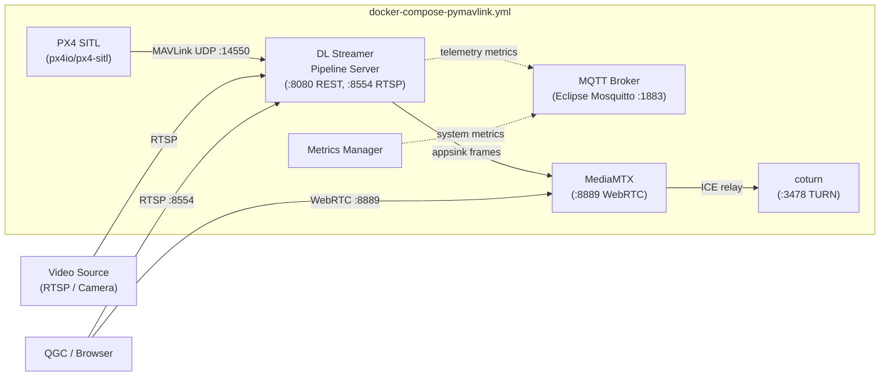
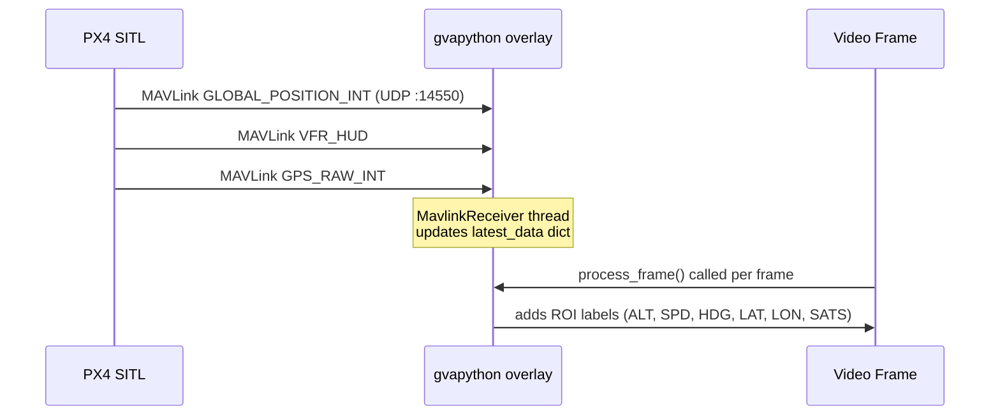
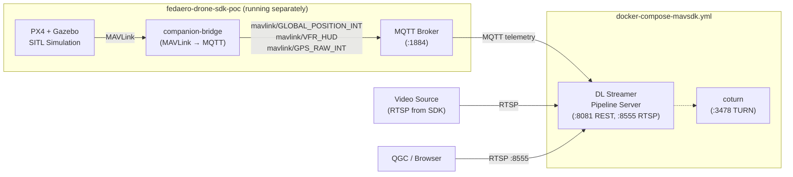
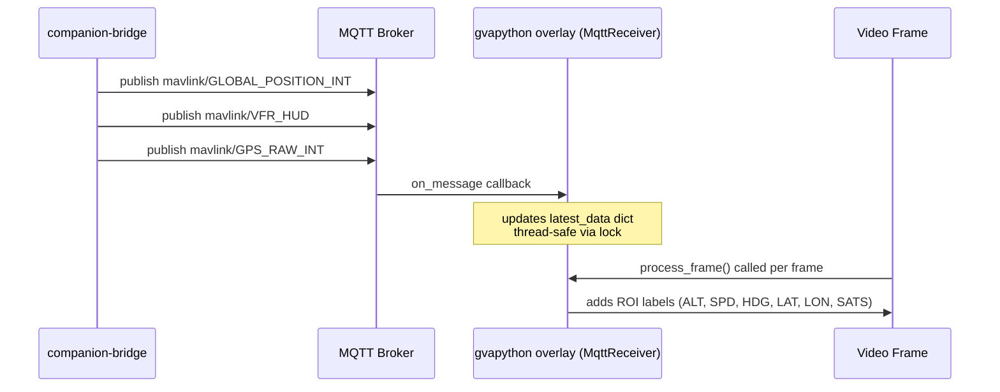

<!--
SPDX-FileCopyrightText: (C) 2026 Intel Corporation
SPDX-License-Identifier: Apache-2.0
-->

# Drone Vision Telemetry — Overview

This application demonstrates AI-based object detection integrated with drone flight controller telemetry on a companion compute platform. Telemetry data (GPS, altitude, speed, heading) is correlated with AI inference results and rendered as an on-screen overlay in near real-time, producing a watermarked RTSP/WebRTC video stream consumable by ground control software such as QGroundControl (QGC).

---

## Deployment Modes

The application supports two deployment modes that differ in how telemetry is sourced and which supporting services are included.

### Mode 1 — Standalone with pymavlink (`docker-compose-pymavlink.yml`)

A fully self-contained stack. All services—including the PX4 SITL simulator, MQTT broker, and media relay—are started together. The `gvapython` telemetry overlay subscribes directly to the PX4 SITL via MAVLink UDP on port `14550`.

**Telemetry flow (pymavlink):**

---

### Mode 2 — MAVSDK / External Stack (`docker-compose-mavsdk.yml`)

A minimal stack that integrates with the `fedaero-drone-sdk-poc` project, which must be running first. Telemetry is received via MQTT topics published by the companion bridge in the SDK project. This mode maps DL Streamer to different host ports (`8081`, `8555`) to avoid conflicts.

**Telemetry flow (MAVSDK / MQTT):**

---

## AI Model

| Property | Value |
|---|---|
| Model | YOLOv8n-VisDrone |
| Source | [mshamrai/yolov8n-visdrone](https://huggingface.co/mshamrai/yolov8n-visdrone) |
| Precision | FP16 (OpenVINO IR) |
| Input resolution | 640 × 640 |
| Detection classes | pedestrian, people, bicycle, car, van, truck, tricycle, awning-tricycle, bus, motor |
| Framework | Ultralytics YOLOv8 / OpenVINO |

See [export_model.md](export_model.md) for instructions on downloading and converting the model.

---

## Related Documentation

| Document | Description |
|---|---|
| [README.md](README.md) | Quick-start guide |
| [user-guide.md](user-guide.md) | Deployment, configuration, architecture, and design |
| [export_model.md](export_model.md) | Downloading and exporting the YOLOv8n-VisDrone model |
