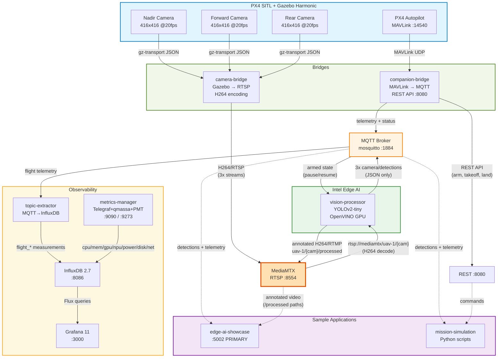
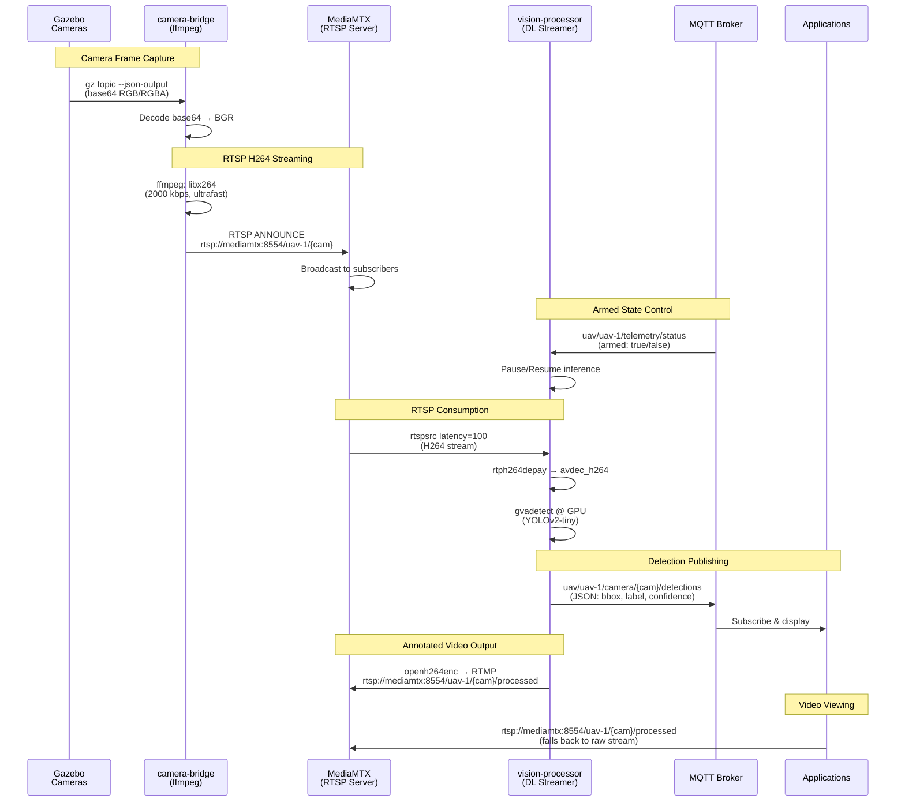

<!--
SPDX-FileCopyrightText: (C) 2026 Intel Corporation
SPDX-License-Identifier: Apache-2.0
-->

# Architecture

## System Overview



## Data Flow (RTSP Architecture)



## Data Flow Summary

1. **Telemetry**: PX4 Autopilot → companion-bridge (MAVLink→MQTT) → MQTT → Applications
2. **Camera Streams (RTSP)**: 
   - Gazebo (3 cameras) → camera-bridge (gz-transport → ffmpeg H264 → RTSP) → MediaMTX → vision-processor (RTSP decode)
   - Only detections published to MQTT (not raw frames)
3. **AI Processing**: vision-processor (YOLOv2-tiny on GPU, RTSP input) → detections JSON → MQTT; annotated video (with bboxes) → MediaMTX `/uav-1/{cam}/processed`
4. **Commands**: Applications/missions → REST API :8080 → companion-bridge → PX4 Autopilot (MAVLink)
5. **Observability**: MQTT telemetry → topic-extractor → InfluxDB; host platform metrics → metrics-manager (Telegraf) → InfluxDB; InfluxDB → Grafana dashboards. metrics-manager also exposes a Prometheus endpoint at `:9273` (not scraped by this stack — available for external Prometheus integration)

## System Components

### PX4 + Gazebo (`px4-gazebo`)
- Flight controller simulation + 3 cameras (nadir, forward 45°, rear 45°)
- 416x416 RGB @20fps per camera
- MAVLink on port 14540, REST API on port 8080

### Companion Bridge
- MAVLink → MQTT telemetry (position, attitude, battery, velocity, status)
- REST API for commands (arm, takeoff, land, goto)
- Publishes armed state for camera control
- Shares PX4 network namespace

### Camera Bridge
- **Input**: Gazebo cameras via gz-transport (base64-encoded JSON)
- **Processing**: Decode → OpenCV BGR → raw frames piped to ffmpeg
- **Encoding**: ffmpeg libx264 (2000 kbps, ultrafast, zerolatency)
- **Output**: RTSP push to MediaMTX via RTSP ANNOUNCE (TCP)
- **Behavior**: ffmpeg subprocess lifecycle tied to armed state — kill on disarm, spawn on arm
- Shares PX4 IPC namespace for gz-transport

**ffmpeg pipeline** (per camera):
```
rawvideo pipe → libx264 → RTSP push to rtsp://mediamtx:8554/uav-1/{cam}
```

### MediaMTX (RTSP Server)
- **Port**: 8554 (RTSP), 8888 (HLS), 8889 (WebRTC), 9997 (API), 9998 (Metrics)
- **Paths**: 
  - `rtsp://mediamtx:8554/uav-1/nadir` (raw, from camera-bridge)
  - `rtsp://mediamtx:8554/uav-1/forward` (raw, from camera-bridge)
  - `rtsp://mediamtx:8554/uav-1/rear` (raw, from camera-bridge)
  - `rtsp://mediamtx:8554/uav-1/nadir/processed` (annotated, from vision-processor)
  - `rtsp://mediamtx:8554/uav-1/forward/processed` (annotated, from vision-processor)
  - `rtsp://mediamtx:8554/uav-1/rear/processed` (annotated, from vision-processor)
- **Purpose**: Multicast H264 streams to multiple consumers without re-encoding
- **Features**: Supports RTSP, HLS, WebRTC for different client types

### Vision Processor (RTSP Mode)
- **Input**: RTSP H264 streams from MediaMTX via rtspsrc
- **Decoding**: Hardware-accelerated H264 decode (avdec_h264)
- **Inference**: YOLOv2-tiny on Intel GPU (OpenVINO)
- **Output**: Detection JSON to MQTT + annotated H264 stream to MediaMTX at `uav-1/{cam}/processed` (via RTMP/openh264enc)
- **Behavior**: Pipeline lifecycle tied to armed state — teardown on disarm, rebuild on re-arm. Auto-reconnects on RTSP errors.

**GStreamer Pipeline** (per camera):
```
rtspsrc → rtph264depay → h264parse → avdec_h264 → videoconvert →
videoscale → gvadetect → gvawatermark → tee
  ├─ queue → videoconvert → appsink (detection JSON → MQTT)
  └─ queue → videoconvert → openh264enc → h264parse → flvmux → rtmp2sink (annotated → MediaMTX)
```

### MQTT Broker (mosquitto)
- Port 1884 (host) → 1883 (container)
- **Topics**: Telemetry, armed state, detections (NO camera frames)

## MQTT Topics
All topics use the pattern `uav/{id}/...` (default `id` = `uav-1`) on broker `localhost:1884`.

### Published by companion-bridge
- `uav/{id}/telemetry/position` - lat, lng, altitude
- `uav/{id}/telemetry/attitude` - roll, pitch, yaw
- `uav/{id}/telemetry/battery` - voltage, remaining %
- `uav/{id}/telemetry/velocity` - vx, vy, vz
- `uav/{id}/telemetry/gps` - GPS fix type, satellite count
- `uav/{id}/telemetry/status` - **armed, mode** (used by camera bridge & vision processor)
- `uav/{id}/telemetry/#` - Wildcard, subscribes to all telemetry subtopics at once
- `uav/{id}/command` - Legacy command channel (arm/disarm/etc. via MQTT)

### Published by camera-bridge / vision-processor
- `uav/{id}/camera/{cam}/frame` - Raw camera frame (JPEG bytes, legacy MQTT mode)
- `uav/{id}/camera/{cam}/detections` - JSON: `{timestamp, camera_id, frame_id, objects: [{detection: {bounding_box, label, confidence}}]}`
- `uav/{id}/camera/{cam}/processed` - Annotated frame with bounding boxes
- `uav/{id}/camera/+/detections` - Wildcard, all cameras' detections
- `uav/{id}/camera/+/frame` - Wildcard, all cameras' raw frames

### Published by scenescape-adapter
- `scenescape/data/camera/{ss_camera_id}` - 3D fused scene format

### Listen example
```bash
mosquitto_sub -h localhost -p 1884 -t "uav/uav-1/telemetry/#" -v
```


## RTSP Streams (MediaMTX)

| Stream Path | Description | Resolution | FPS | Codec |
|-------------|-------------|------------|-----|-------|
| `/uav-1/nadir` | Downward-facing camera | 416x416 | 20 | H264 |
| `/uav-1/forward` | Forward 45° camera | 416x416 | 20 | H264 |
| `/uav-1/rear` | Rear 45° camera | 416x416 | 20 | H264 |
| `/uav-1/nadir/processed` | Annotated nadir (with bboxes) | 416x416 | ~10 | H264 (openh264) |
| `/uav-1/forward/processed` | Annotated forward (with bboxes) | 416x416 | ~10 | H264 (openh264) |
| `/uav-1/rear/processed` | Annotated rear (with bboxes) | 416x416 | ~10 | H264 (openh264) |

**Access**: `rtsp://localhost:8554/uav-1/{camera}`  
**View**: `ffplay rtsp://localhost:8554/uav-1/nadir`  
**Capture**: `ffmpeg -i rtsp://localhost:8554/uav-1/nadir -frames:v 1 frame.jpg`

## Design Rationale

### Why RTSP Instead of MQTT for Camera Streams?

**Before (MQTT):**
- Frame-by-frame JPEG publishing (~50-150KB per frame)
- High MQTT broker load (3 cameras × 20 FPS = 60 messages/sec)
- Each consumer decodes JPEG independently
- Limited scalability for multiple consumers

**After (RTSP):**
- ✅ Industry-standard video streaming protocol
- ✅ Single H264 encode, multicast to N consumers
- ✅ Lower network overhead (H264 compression + TCP streaming)
- ✅ Better buffering and latency handling
- ✅ Matches real-world UAV deployments
- ✅ Applications can view streams directly (ffplay, VLC, browsers)
- ✅ Decoupled: vision processor restarts don't affect camera bridge

### Other Design Decisions

**3 Cameras**: 360° coverage (nadir=ground, forward=path, rear=perimeter)

**416x416**: Matches YOLOv2-tiny input (no resize), reduces bandwidth

**Shared Network Namespace**: Bridges need PX4's localhost for MAVLink + gz-transport multicast

**Separate Vision Container**: GPU isolation, independent scaling

**Armed State Control**: Cameras/inference only active when armed (saves CPU/GPU/bandwidth)

**Topic Extractor** (`infra/topic-extractor`)
- Subscribes `uav/{id}/telemetry/#` MQTT wildcard
- Writes 6 InfluxDB measurements: `flight_position`, `flight_attitude`, `flight_velocity`, `flight_battery`, `flight_gps`, `flight_status`

**Metrics Manager** (`infra/metrics-manager`, image: `intel/metrics-manager:2026.1.0`)
- Reused from [`edge-ai-libraries/microservices/metrics-manager`](https://github.com/open-edge-platform/edge-ai-libraries/tree/main/microservices/metrics-manager) — published image, no code changes
- Custom `telegraf.conf` mounted at runtime adds: `[[outputs.influxdb_v2]]`, RAPL power script, `inputs.disk/diskio/net`
- Telegraf-based host platform metrics collected every 1 s
- **CPU**: `usage_user/system/idle` via `inputs.cpu`; average frequency via `read_cpu_freq.sh`; package temperature via `inputs.temp`
- **Memory**: `used_percent`, `available_percent` via `inputs.mem`
- **Power**: Intel RAPL package Watts via custom `read_rapl_power.py` execd script
- **GPU**: all 5 Intel GPU engines (`rcs`, `ccs`, `vcs`, `bcs`, `vecs`) + frequency via qmassa/`inputs.execd`
- **NPU**: `power`, `frequency`, `temperature`, `bandwidth`, `memory_mb`, `utilization` via Intel PMT sysfs/`inputs.execd`
- **Disk/Network**: I/O rates via `inputs.diskio` and `inputs.net`
- Dual output: `[[outputs.influxdb_v2]]` → InfluxDB bucket `telemetry`; `[[outputs.prometheus_client]]` → Prometheus `:9273`
- FastAPI REST at `:9090`: `/health`, `/api/v1/metrics`, `/metrics/stream` (SSE)
- Requires `--device /dev/dri` (GPU) and `--privileged` (NPU PMT sysfs)

**MQTT for Detections**: Structured JSON data better suited for pub/sub than video

## Environment Variables

### Multicam Bridge
- `USE_RTSP=true` - Enable RTSP mode (default: false for backward compat)
- `RTSP_HOST=mediamtx` - MediaMTX hostname
- `RTSP_PORT=8554` - RTSP port
- `RTSP_BITRATE=2000` - H264 bitrate in kbps
- `MAX_FPS=20` - Frame rate limit
- `MQTT_BROKER_HOST` - For armed state tracking

### Vision Processor
- `USE_RTSP=true` - Enable RTSP mode
- `RTSP_HOST=mediamtx` - MediaMTX hostname
- `RTSP_PORT=8554` - RTSP port
- `RTSP_LATENCY=100` - Latency in milliseconds
- `INFERENCE_DEVICE=GPU` - OpenVINO device
- `CONF_THRESH=0.4` - Detection confidence threshold
- `MQTT_BROKER_HOST` - For telemetry + detection publishing

## Performance

| Component | CPU | GPU | Memory | Bandwidth | Latency |
|-----------|-----|-----|--------|-----------|---------|
| px4-gazebo | 150-250% | 40% | 3.8 GB | - | - |
| **camera-bridge (RTSP)** | **~25%** | **-** | **80 MB** | **~300 KB/s** | **~30ms** |
| **MediaMTX** | **~5%** | **-** | **50 MB** | **-** | **<10ms** |
| **vision-processor (RTSP)** | **40-70%** | **40%** | **750 MB** | **-** | **~40ms** |
| companion-bridge | ~5% | - | 40 MB | ~5 KB/s | <50ms |
| topic-extractor | ~2% | - | 50 MB | ~10 KB/s | <100ms |
| metrics-manager | ~2% | - | 80 MB | - | 1s interval |

**Bandwidth Comparison:**
- MQTT mode: ~800-1000 KB/s (3 cameras × JPEG frames)
- **RTSP mode: ~300-400 KB/s** (3 cameras × H264 streams) - **60% reduction**

**End-to-End Latency**: Gazebo → Detection: ~80-100ms (RTSP decode + inference + detection)

## Legacy MQTT Mode

The system supports rollback to MQTT frame-by-frame mode:

```yaml
# In docker-compose.yml, set:
environment:
  - USE_RTSP=false
```

Then restart:
```bash
docker compose -f docker-compose.yml restart camera-bridge vision-processor
```

**MQTT mode topics** (legacy):
- `uav/{id}/camera/{cam}/frame` - Raw JPEG frames
- `uav/{id}/camera/{cam}/processed` - Annotated JPEG frames (ONLY in legacy MQTT mode; in RTSP mode annotated video is at MediaMTX /processed paths)

## Troubleshooting

### Check MediaMTX Health
```bash
# Verify RTSP server is running
docker logs mediamtx | grep "started with listener"

# Check active streams (requires API auth disabled)
docker logs mediamtx | grep "uav-1"
```

### Check RTSP Streams
```bash
# Test stream availability
ffprobe rtsp://localhost:8554/uav-1/nadir

# View live stream
ffplay rtsp://localhost:8554/uav-1/nadir

# Capture single frame
ffmpeg -i rtsp://localhost:8554/uav-1/nadir -frames:v 1 frame.jpg
```

### Check GStreamer Pipelines
```bash
# Camera bridge logs (should show "GStreamer RTSP pipeline started")
docker logs camera-bridge | grep -i "rtsp\|gstreamer"

# Vision processor logs (should show "RTSP DL Streamer pipeline started")
docker logs vision-processor-multicam | grep -i "rtsp\|mode"

# Check for GStreamer errors
docker logs camera-bridge | grep -i error
docker logs vision-processor-multicam | grep -i error
```

### Common Issues

| Symptom | Cause | Fix |
|---------|-------|-----|
| No RTSP streams in MediaMTX | UAV not armed | Arm UAV: `curl -X POST http://localhost:8080/action/arm` |
| Vision processor not processing | RTSP connection failed | Check MediaMTX is healthy, verify RTSP_HOST env var |
| High CPU on bridge | x264enc speed-preset too slow | Use `speed-preset=ultrafast` (already set) |
| Detections delayed | RTSP latency too high | Decrease `RTSP_LATENCY` (default 100ms) |
| Want MQTT mode | RTSP not needed | Set `USE_RTSP=false`, restart services |

## See Also

- [CLAUDE.md](../CLAUDE.md) - Quick reference guide
- [PORTS.md](./PORTS.md) - Port mappings
