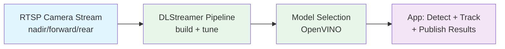

<!--
SPDX-FileCopyrightText: (C) 2026 Intel Corporation
SPDX-License-Identifier: Apache-2.0
-->

# Computer Vision Application Development

Build a custom computer vision application on top of the UAV's live camera streams — not just run a canned detector, but have the agent design and wire up a full DLStreamer pipeline for your use case.

## Workflow



## Prompt

```
"Build a computer vision application that detects and tracks vehicles in the
uav-1/nadir RTSP stream, draws bounding boxes with track IDs, and publishes
counts to MQTT every 5 seconds"
```

Other prompts to try:

```
"Create a person-detection app for the forward camera that raises an alert
when more than 3 people are in frame"
```

```
"Design a DLStreamer pipeline comparing YOLO11n vs YOLO11m accuracy/FPS on
the rear camera stream and recommend which to deploy"
```

## Steps

**1. Discover available samples/models** → `dlstreamer_list_samples`, `dlstreamer_download_models`

**2. Build the pipeline** → `dlstreamer_build_pipeline`
- Source: `rtsp://localhost:8554/uav-1/nadir`
- Elements: decode → detect → track → overlay → publish
- Model: OpenVINO IR (e.g. YOLO11n for speed, YOLO11m for accuracy)

**3. Run and validate** → `dlstreamer_run_sample`
- Verify FPS on Intel GPU
- Confirm detections/track IDs are stable across frames

**4. Wire application output**
- Publish detection/count events to `uav/{id}/camera/{cam}/detections` (MQTT)
- Optionally push the annotated stream back to MediaMTX at `uav-1/{cam}/processed`

## Real-World Value

✅ Goes beyond a fixed demo — the agent designs the pipeline for your exact use case (tracking, counting, alerting)
✅ Reuses the SDK's existing RTSP/MQTT plumbing, so the new app plugs straight into the dashboard
✅ Lets you compare models/settings before committing to one for deployment
