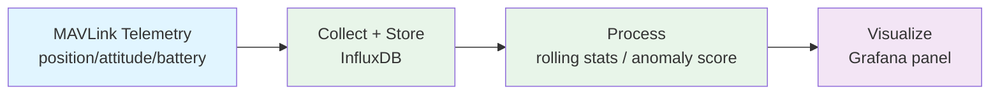

<!--
SPDX-FileCopyrightText: (C) 2026 Intel Corporation
SPDX-License-Identifier: Apache-2.0
-->

# Time Series Processing Application Development

Build a custom time series application on top of the UAV's telemetry stream — not just query current values, but have the agent design an ingestion → processing → visualization pipeline for your own metrics.

## Workflow



## Prompt

```
"Build a time series processing app that ingests attitude and velocity
telemetry, computes a 10-second rolling vibration score, stores it in
InfluxDB, and adds a Grafana panel to visualize it"
```

Other prompts to try:

```
"Create a time series pipeline that flags battery voltage sag events across
flights and summarizes trend over the last 20 flights"
```

```
"Process the last hour of GPS telemetry into 1-second buckets and compute
min/max/avg altitude per bucket for a new Grafana panel"
```

## Steps

**1. Collect the raw time series** → `mavlink_collect_flight_data` / `mavlink_monitor_flight`
- Fields: position, attitude, velocity, battery (as needed)
- Sample rate: match `RATE_*_HZ` settings in `.env`

**2. Process the series**
- Resample/bucket (e.g. 1s windows), compute rolling stats (mean/std/rate-of-change)
- Optionally run `anomalib_train` / `anomalib_predict` for anomaly-scored series

**3. Store results** → InfluxDB (via `topic-extractor`'s MQTT → InfluxDB path, or a new measurement)

**4. Visualize** → add/extend a Grafana panel querying the new InfluxDB measurement

## Real-World Value

✅ Turns raw MAVLink streams into decision-ready metrics (trend, thresholds, alerts)
✅ Reuses the SDK's existing InfluxDB/Grafana observability stack — no new infra needed
✅ Works for any telemetry field, not just the built-in flight/battery dashboards
