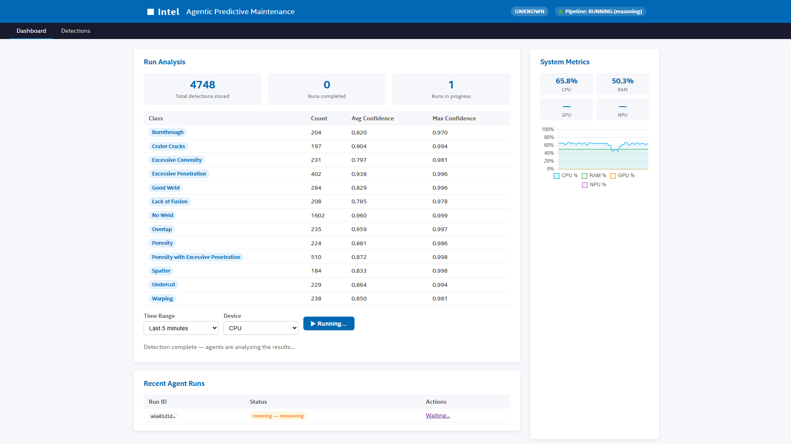
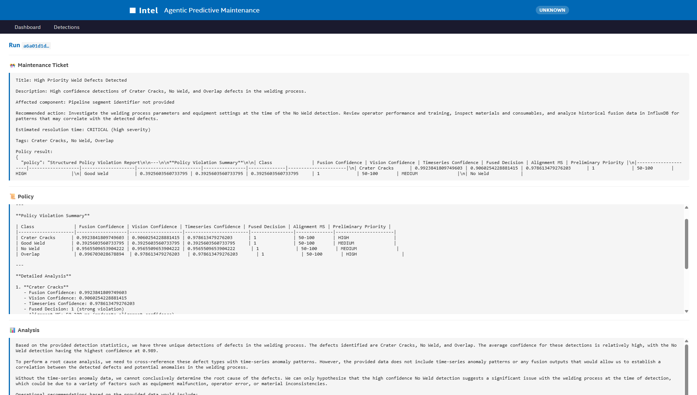

# Deploy the Agentic Workflow

This guide explains how to deploy the multimodal sample app with the agentic workflow enabled. The agentic stack adds a meta-agent powered by an LLM (via OVMS) that reacts to fusion results and produces structured policy decisions, root-cause analysis, evidence audit trails, and maintenance tickets.

## Architecture Overview

```
Vision (DL Streamer)  ──┐
                         ├─► Fusion Analytics ──► MQTT (apm/batch-complete)
Time-Series Analytics ──┘                              │
                                                       ▼
                                               apm-agent (LangGraph)
                                                       │
                                          ┌────────────┼────────────┐
                                        Policy     Analysis      Evidence
                                                       │
                                               Maintenance Ticket
                                                       │
                                               apm-ui (Dashboard)
```

## System Requirements

| Component | Minimum Requirement |
|-----------|---------------------|
| Operating System | Ubuntu 24.04 LTS or later |
| Hardware | Intel® Core™ Ultra Platform (PTL) or newer |


## Prerequisites

1. Ensure `.env` is configured with valid values for:

   - `HOST_IP`
   - `INFLUXDB_USERNAME`, `INFLUXDB_PASSWORD`
   - `VISUALIZER_GRAFANA_USER`, `VISUALIZER_GRAFANA_PASSWORD`
   - `MTX_WEBRTCICESERVERS2_0_USERNAME`, `MTX_WEBRTCICESERVERS2_0_PASSWORD`
   - `S3_STORAGE_USERNAME`, `S3_STORAGE_PASSWORD`

## Deploy the Agentic Workflow

Run the full agentic stack (downloads the LLM model first, then starts all containers):

> The model download can take 20–50 minutes depending on network speed and hardware.
> It polls the model-download service every 5 seconds for up to 50 minutes.


```bash
cd edge-ai-suites/manufacturing-ai-suite/industrial-edge-insights-multimodal
make up_agentic
```

For a fresh build before deployment:

```bash
cd edge-ai-suites/manufacturing-ai-suite/industrial-edge-insights-multimodal
make build
make up_agentic
```

## Configure the Agent

### Use-Case Config

The agent behaviour is controlled by `configs/agentic/agents.yaml`:

| Field | Description |
|-------|-------------|
| `analysis.min_confidence` | Minimum fusion_confidence to include a record in analysis |
| `analysis.max_detections_per_run` | Cap on records fetched per run |
| `policy.defect_classes` | Canonical class vocabulary for policy decisions |
| `policy.alert_threshold` | Confidence threshold to trigger a policy violation |
| `policy.critical_classes` | Classes that escalate to CRITICAL priority |
| `policy.fusion_mode` | `AND` (both modalities agree) or `OR` (either agrees) |
| `evidence.evidence_fields` | Fields extracted from `fusion_result` for each evidence row |
| `evidence.min_fusion_confidence` | Minimum confidence to include a row in evidence |
| `evidence.max_records_per_evidence` | Maximum rows per evidence bundle |
| `ticketing.priority_rules` | Maps defect class to ticket priority |
| `ticketing.auto_create` | Whether to submit tickets to the configured backend |
| `ticketing.backend` | `jira`, `servicenow`, or `none` |

### Prompts

Agent reasoning prompts are in `configs/agentic/prompts/weld-quality-monitoring.txt`. Each section (`[SYSTEM]`, `[POLICY]`, `[ANALYSIS]`, `[EVIDENCE]`, `[TICKETING]`) controls what the LLM is instructed to produce for that agent stage.

### Fallback Policy

`configs/agentic/policy_fallback.json` defines per-class thresholds and actions used when `LLM_MODE=fallback`. Available actions:

| Action | Description |
|--------|-------------|
| `HALT_LINE` | Stop the production line immediately |
| `REDUCE_HEAT_INPUT` | Reduce welding current/power |
| `SCHEDULE_INSPECTION` | Flag for next-shift inspection |
| `ADJUST_PARAMETERS` | Adjust process parameters |
| `CHECK_FIXTURING` | Check part fixturing and alignment |
| `MONITOR` | Continue monitoring without action |
| `CONTINUE` | No action required |

## Verify the Deployment

1. Check overall stack health:

   ```bash
   cd edge-ai-suites/manufacturing-ai-suite/industrial-edge-insights-multimodal
   make status
   ```

2. Confirm the agentic containers are running:

   ```bash
   docker ps --filter "name=apm-"
   ```

   Expected containers:
   - `apm-agent` — LangGraph meta-agent
   - `apm-llm` — OVMS LLM server
   - `apm-ui` — web dashboard
   - `apm-metrics` — Prometheus metrics collector (if enabled)

3. Inspect agent logs:

   ```bash
   docker logs -f apm-agent
   ```

4. Inspect OVMS model server logs:

   ```bash
   docker logs -f apm-llm
   ```

## Access the Agent Dashboard

The agent UI is served at: `https://localhost:3000/agentic-ui/`

Steps:

1. Open the URL in a browser (Chrome recommended).
    
    

2. Select the **Time Range** and **Device** from the dropdowns.
3. Click **Run Agentic Analysis** to trigger a new run.

4. The dashboard polls for status automatically. Once complete, click **View Results** to see:
   - Policy violations and priorities
   - Root-cause analysis
   - Evidence audit trail with per-record fusion fields
   - Structured maintenance ticket (JSON)
   
   

## Stop the Stack

```bash
cd edge-ai-suites/manufacturing-ai-suite/industrial-edge-insights-multimodal
make down
```
