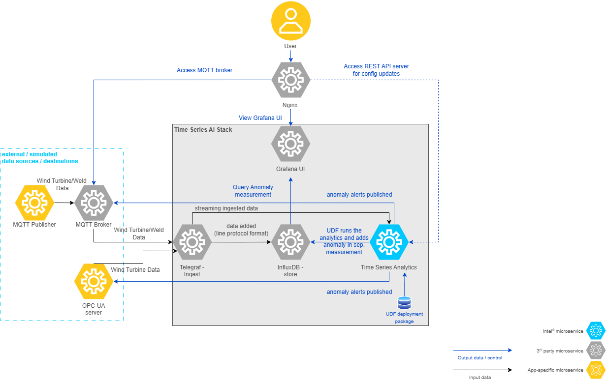

# Wind Turbine Anomaly Detection

<!--hide_directive

  <a class="icon_github" href="https://github.com/open-edge-platform/edge-ai-suites/tree/main/manufacturing-ai-suite/industrial-edge-insights-time-series/apps/wind-turbine-anomaly-detection">
     GitHub
  </a>
  

hide_directive-->

This sample app demonstrates a time series use case by detecting anomalous power generation
patterns in wind turbines, relative to wind speed. By identifying deviations, it helps
optimize maintenance schedules and prevent potential turbine failures, enhancing
operational efficiency.

In this article, you can learn about the architecture of the sample and its data flow.

If you want to start working with it, instead, check out the
[Get Started Guide](../get-started.md) or [How-to Guides](../how-to-guides.md)
for Time-series applications.

## How It Works

As seen in the following architecture diagram, the sample app at a high-level comprises data
simulators (which can act as data destinations, if configured) - in the real world these would
be the physical devices. The stack comprises Telegraf, InfluxDB 3 Core, the Time Series Analytics
API, and Grafana.

### Data flow explanation

Below is an explanation of how this architecture translates to data flow in the wind turbine
anomaly detection use case, in which the data is ingested using the OPC-UA server/MQTT publisher
simulators and anomaly alerts are published to an OPC-UA server/MQTT broker.

#### **Data Sources**

The demonstration uses synthetic wind turbine data generated by this project.
The file `wind-turbine-anomaly-detection.csv` is a curated subset of the generated dataset
used by this sample for ingestion and anomaly detection workflows.

This data is ingested into **Telegraf** through the **OPC-UA** protocol using the **OPC-UA** data simulator OR **MQTT** protocol using the MQTT publisher data simulator.

#### **Data Ingestion**

**Telegraf** through its input plugins (**OPC-UA** OR **MQTT**) gathers the data and writes it to the Core `datain` database.

#### **Data Storage**

**InfluxDB 3 Core** stores the incoming data and invokes its configured Processing Engine plugin.

#### **Data Processing**

The **Time Series Analytics Microservice** accepts configuration and UDF package uploads.
InfluxDB 3 Core runs the User Defined Function (UDF) deployment package
(plugin and model) from the sample app. The UDF deployment package for the Wind
Turbine Anomaly Detection sample app is available in [this folder](https://github.com/open-edge-platform/edge-ai-suites/tree/main/manufacturing-ai-suite/industrial-edge-insights-time-series/apps/wind-turbine-anomaly-detection/time-series-analytics-config).

Directory details are as below:

##### **`config.json`**

The `udfs` section defines the Core Processing Engine plugin, model, and device settings.

| Key    | Description                                          | Example Value          |
| ------ | ---------------------------------------------------- | ---------------------- |
| `udfs` | Configuration for the User-Defined Functions (UDFs). | See below for details. |

**UDFs Configuration**:

The `udfs` section specifies the details of the UDFs used in the task.

| Key      | Description                                                                                  | Example Value                        |
| -------- | -------------------------------------------------------------------------------------------- | ------------------------------------ |
| `name`   | The name of the UDF script.                                                                  | `"windturbine_anomaly_detector"`     |
| `models` | The name of the model file used by the UDF.                                                  | `"windturbine_anomaly_detector.pkl"` |
| `device` | Specifies the hardware `CPU` or `GPU` for executing the UDF model inference. Default is `CPU` | `CPU`                                |

> [!NOTE]
> The maximum allowed size for `config.json` is 5 KB.

---

**Alerts Configuration**:

The `alerts` section defines the settings for alert mechanisms, using the MQTT protocol by
default.
For publishing OPC-UA alerts in Docker, refer to [Docker OPC-UA Alerts](../how-to-guides/configure-alerts.md#docker---publish-opc-ua-alerts).
For OPC-UA Alerts in Helm, refer to [Helm OPC-UA Alerts](../how-to-guides/configure-alerts.md#helm---publish-opc-ua-alerts)

> [!NOTE]
> Enable only one type of alerts: either MQTT or OPC-UA.

**MQTT Configuration**:

The `mqtt` section specifies the MQTT broker details for sending alerts.

| Key                | Description                                    | Example Value      |
| ------------------ | ---------------------------------------------- | ------------------ |
| `mqtt_broker_host` | The hostname or IP address of the MQTT broker. | `"ia-mqtt-broker"` |
| `mqtt_broker_port` | The port number of the MQTT broker.            | `1883`             |
| `name`             | The name of the MQTT broker configuration.     | `"my_mqtt_broker"` |

##### **`udfs/influx3_windturbine/`**

Contains the Python script to process the incoming data.
Uses Random Forest Regressor machine learning algorithm accelerated with
[Intel® Extension for Scikit-learn\*](https://www.intel.com/content/www/us/en/developer/tools/oneapi/scikit-learn.html)
to run on CPU/GPU to detect the anomalous power generation data points relative to wind speed.

The Core plugin processes input through `process_writes` in stream mode or
`process_scheduled_call` in batch mode. It writes predictions, anomaly status,
and timing fields to `wind-turbine-anomaly-data`; alert destinations come from
the app configuration.

##### **`models/`**

The `windturbine_anomaly_detector.pkl` is a model built using the Random Forest Regressor
algorithm from the Scikit-learn library.
For more details on how it is built refer to the [README](https://github.com/open-edge-platform/edge-ai-suites/blob/main/manufacturing-ai-suite/industrial-edge-insights-time-series/apps/wind-turbine-anomaly-detection/training/README.md).

<!--hide_directive
:::{toctree}
:hidden:

how-to-enable-system-metrics
how-to-select-model

:::
hide_directive-->
