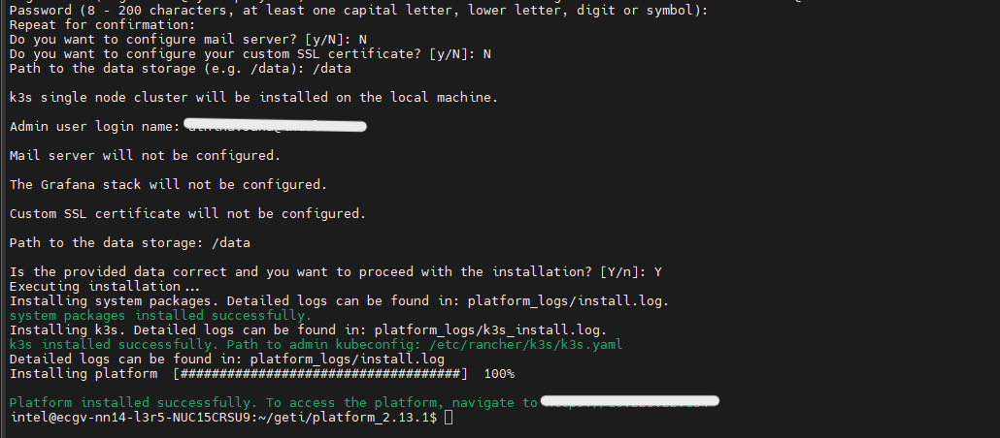
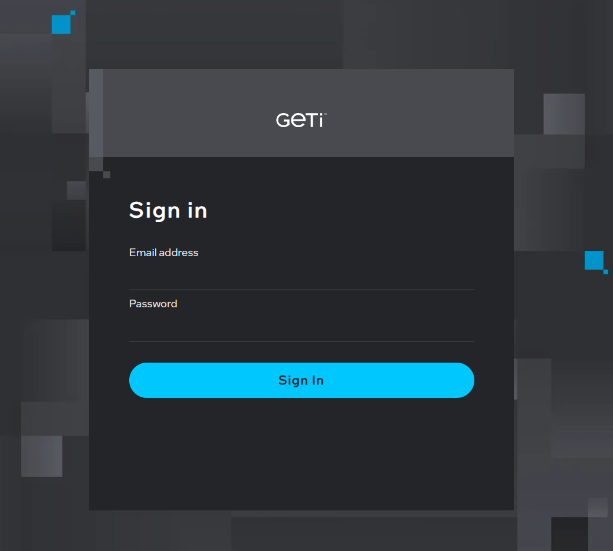
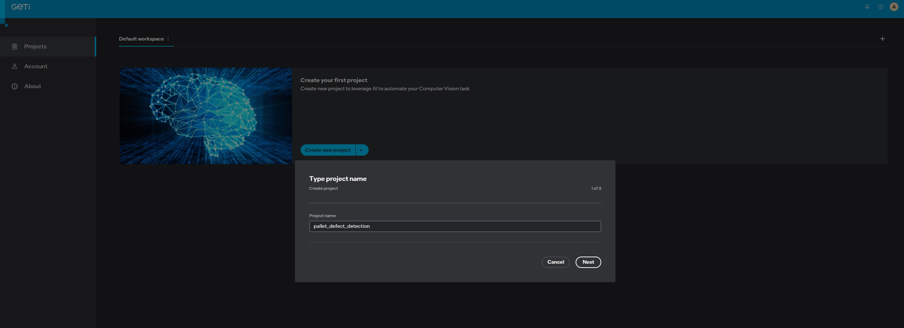
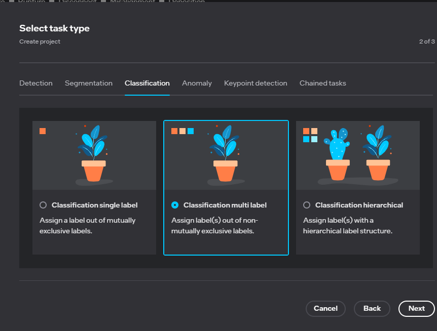
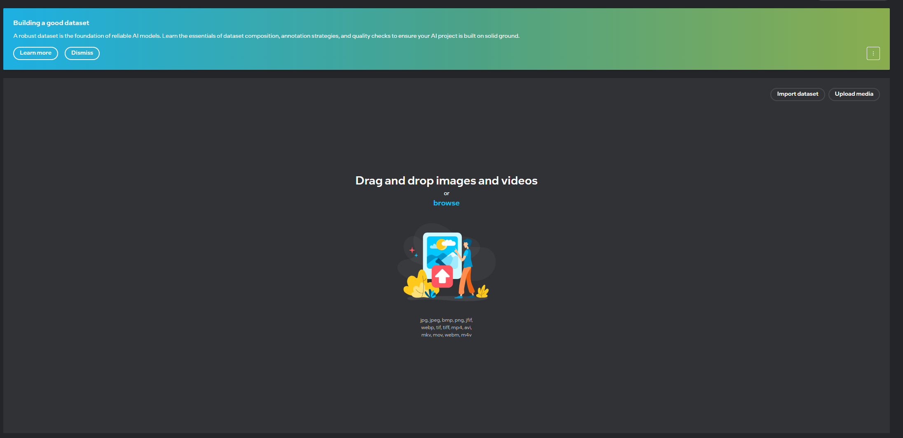
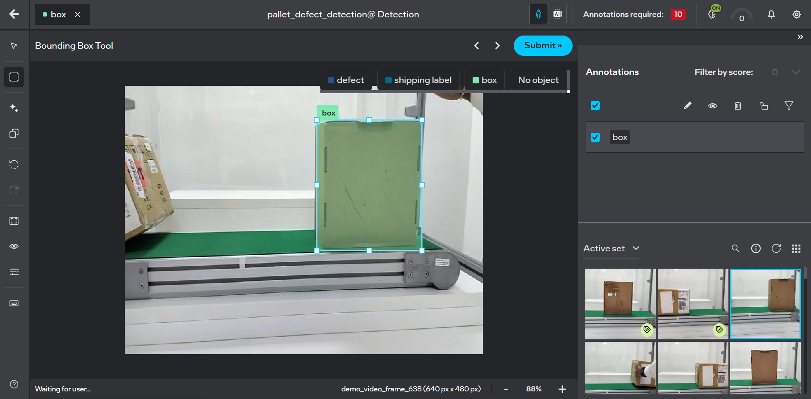
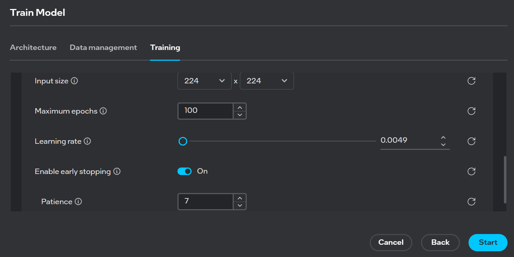
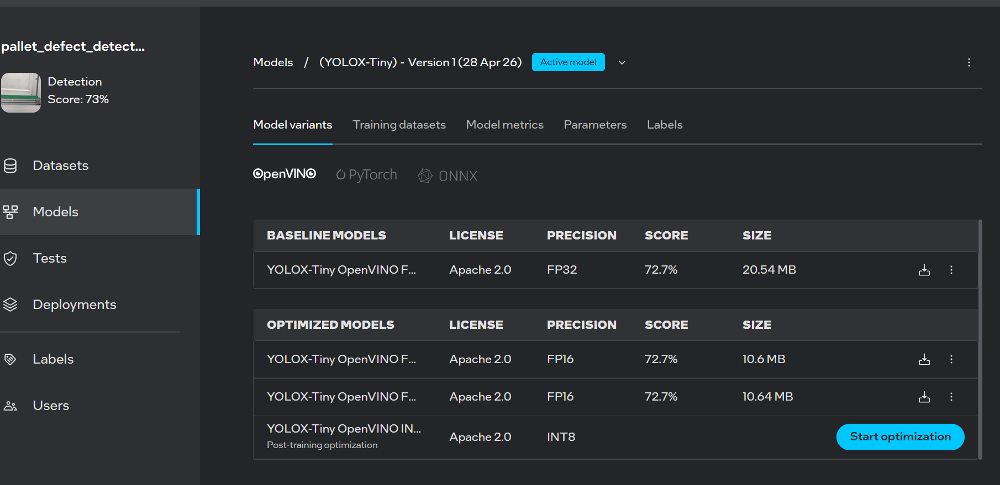
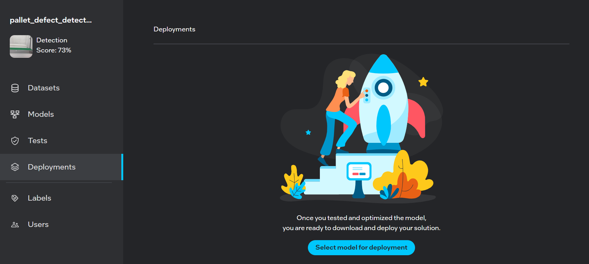

# Generating Model from Geti™

This guide walks you through using Intel® Geti™ to create an anomaly classification project for PCB Anomaly Detection, train a model on your PCB Anomaly Detection data, and deploy it in the pipeline.

## Prerequisites

- [Minimum Requirements for Geti™ Installation](https://docs.geti.intel.com/docs/user-guide/getting-started/installation/using-geti-installer#minimum-requirements).
- Internet connection for downloading Geti™ and datasets
- Images of normal and anomalous PCB boards for training

## Installation Steps

For detailed Geti™ platform installation instructions, refer to the [Geti™ Installer Documentation](https://docs.geti.intel.com/docs/user-guide/getting-started/installation/using-geti-installer).

> **Note:** The standard Geti™ platform installation includes the following steps:
> 1. Download the Geti™ platform installer
> 2. Extract the installer archive
> 3. Prepare the system by creating necessary directories
> 4. Run the platform installer with appropriate system privileges
>
> Please follow the official installation guide for the most up-to-date and accurate installation procedures.
>
> Upon successful completion, you will see the installation success confirmation as shown below:
>
> 

## Setting Up Your Project

### Step 4: Sign In to Geti™

Open `https://<host_ip>` in your browser, where `<host_ip>` is the IP address of the system where you installed Geti™. Sign in with the credentials set during installation.



### Step 5: Access Geti™ Dashboard

After successful authentication, you will see the Geti™ dashboard.


### Step 6: Create a New Project

Click on **Create New Project** to start a new PCB Anomaly Detection project.



*Note: Image is for illustration purposes only.*

For detailed information refer to: [Geti™ - Project Creation](https://docs.geti.intel.com/docs/user-guide/geti-fundamentals/project-management/#project-creation)

### Step 7: Select Classification Task

Select **Classification** as your task type.



### Step 8: Create Labels

Define the labels for your classification task (e.g., "anomolous", "non anomolous"):


*Note: Image is for illustration purposes only.*

For detailed information refer to: [Geti™ - Label Management](https://docs.geti.intel.com/docs/user-guide/geti-fundamentals/labels/labels-management)

## Data Annotation and Training

For comprehensive tutorials on data annotation and training workflows, refer to the [Geti™ Tutorials Documentation](https://docs.geti.intel.com/docs/user-guide/getting-started/use-geti/tutorials).

### Step 9: Upload Training Images

Upload your training dataset — include both normal PCB images and anomalous PCB images (with various defect types).



### Step 10: Annotate Images

For Anomaly classification:
- Assign the **Anomolous** label to defect-free PCB images.
- Assign the **Non Anomolous** label to images containing defects.

After annotating a minimum number of images, Geti™ will automatically start training.



*Note: Image is for illustration purposes only.*

> **Note:** By default, Geti™ selects an appropriate anomaly detection model (e.g., **PadIM** or **STFPM**). For more control over your model training, explore the [Advanced Guide](#advanced-guide) section to configure custom training parameters and apply model optimization.

### Step 11: Monitor Training Progress

Monitor the model training progress in real time from the Geti™ dashboard.


*Note: Image is for illustration purposes only.*

### Step 12: Improve Model Accuracy (Optional)

Repeat the annotation process with additional images to improve accuracy. More annotated data leads to better anomaly detection performance.

---

## Advanced Guide

### Model Backbone Change

Change the model architecture to suit your deployment requirements. Refer to [Geti™ - Supported Models Documentation](https://docs.geti.intel.com/docs/user-guide/getting-started/use-geti/supported-models) for the full list of supported architectures.

1. Click on **Models** from the left sidebar
2. Select **Train Model**
3. Click on **Advanced Settings**
4. Select your desired model architecture from the available options
5. Click **Start** to begin training with the selected architecture

For detailed information refer to: [Geti™ - Model Training and Optimization](https://docs.geti.intel.com/docs/user-guide/geti-fundamentals/model-training-and-optimization/)


### Train Parameters

Configure training parameters to optimize model performance:

- Learning rate
- Batch size
- Number of epochs
- Augmentation options

For detailed parameter descriptions, refer to [Training Parameters Documentation](https://docs.geti.intel.com/docs/user-guide/model-training/training-parameters).



### Model Optimization

After training completes, optimize your model for edge deployment using quantization:

- **FP16**: Higher precision, good accuracy, requires more computational resources
- **INT8**: Optimized for edge deployment — significantly reduces model size and inference latency

Click **Start Optimization** to generate the optimized model.



*Note: Image is for illustration purposes only.*

#### Download Model

Click the download icon next to the FP16 or INT8 model. A zip folder containing `model.bin` and `model.xml` will be downloaded. Replace the existing model files in your deployment resources:

```
resources/models/pcb-anomaly-detection/deployment/Anomaly classification/model/model.bin  <- Replace with downloaded version
resources/models/pcb-anomaly-detection/deployment/Anomaly classification/model/model.xml  <- Replace with downloaded version
```

For detailed information, refer to: [Geti™ - Model Download](https://docs.geti.intel.com/docs/user-guide/geti-fundamentals/deployments/)

Alternatively, download the entire deployment folder and replace the existing deployment folder in your resources:



*Note: Image is for illustration purposes only.*

Navigate to **Deployments** and click **Select model for deployment**:


In the "Select model for deployment" dialog:

1. Choose your desired **Architecture**
2. Select your **Optimization** level (FP16 or INT8)
3. Click **Download**

Replace the existing deployment folder inside your resources with the downloaded package.

---

## Next Steps

- Deploy the model to edge devices
- Monitor model performance in production
- Continuously improve accuracy by adding more annotated PCB images
- Retrain as needed when new defect types are introduced

## Troubleshooting

For installation issues, refer to the [Geti™ Installation Guide](https://docs.geti.intel.com/docs/user-guide/getting-started/installation/using-geti-installer).
