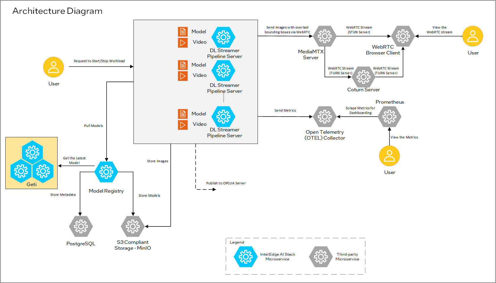

# Pallet Defect Detection

Automated quality control with AI-driven vision systems.

## Overview

This Sample Application enables real-time pallet condition monitoring by running inference workflows across multiple AI models. It connects multiple video streams from warehouse cameras to AI-powered pipelines, all operating efficiently on a single industrial PC. This solution enhances logistics efficiency and inventory management by detecting defects before they impact operations.

## How It Works

This sample application consists of the following microservices: DL Streamer Pipeline Server, Model Registry Microservice(MRaaS), MediaMTX server, Coturn server, Open Telemetry Collector, Prometheus, Postgres and Minio.

You start the pallet defect detection pipeline with a REST request using Client URL (cURL). The REST request will return a pipeline instance ID. DL Streamer Pipeline Server then sends the images with overlaid bounding boxes through webrtc protocol to webrtc browser client. This is done via the MediaMTX server used for signaling. Coturn server is used to facilitate NAT traversal and ensure that the webrtc stream is accessible on a non-native browser client and helps in cases where firewall is enabled. DL Streamer Pipeline Server also sends the images to S3 compliant storage. The Open Telemetry Data exported by DL Streamer Pipeline Server to Open Telemetry Collector is scraped by Prometheus and can be seen on Prometheus UI. Any desired AI model from the Model Registry Microservice (which can interact with Postgres, Minio and Geti Server for getting the model) can be pulled into DL Streamer Pipeline Server and used for inference in the sample application.

Figure 1: Architecture diagram

This sample application is built with the following Intel Edge AI Stack Microservices:

-   <a href="https://docs.edgeplatform.intel.com/dlstreamer-pipeline-server/3.0.0/user-guide/Overview.html">**DL Streamer Pipeline Server**</a> is an interoperable containerized microservice based on Python for video ingestion and deep learning inferencing functions.
-   <a href="https://docs.edgeplatform.intel.com/model-registry-as-a-service/1.0.2/user-guide/Overview.html">**Model Registry Microservice**</a> provides a centralized repository that facilitates the management of AI models

It also consists of the below Third-party microservices:

- [MediaMTX Server](https://hub.docker.com/r/bluenviron/mediamtx)
- [Coturn Server](https://hub.docker.com/r/coturn/coturn)
- [Open telemetry Collector](https://hub.docker.com/r/otel/opentelemetry-collector-contrib)
- [Prometheus](https://hub.docker.com/r/prom/prometheus)
- [Postgres](https://hub.docker.com/_/postgres)
- [Minio](https://hub.docker.com/r/minio/minio)

## Features

This sample application offers the following features:

- High-speed data exchange with low-latency compute.
- AI-assisted defect detection in real-time as pallets are received at the warehouse.
- On-premise data processing for data privacy and efficient use of bandwidth.
- Interconnected warehouses deliver analytics for quick and informed tracking and decision making.

## Deployment with Edge Manageability Framework

- This reference implementation is ready for deployment with the Edge Manageability Framework. Follow the instructions using the [Deployment with Edge Manageability Framework](../user-guide/how-to-deploy-with-edge-manageability-framework.md)
