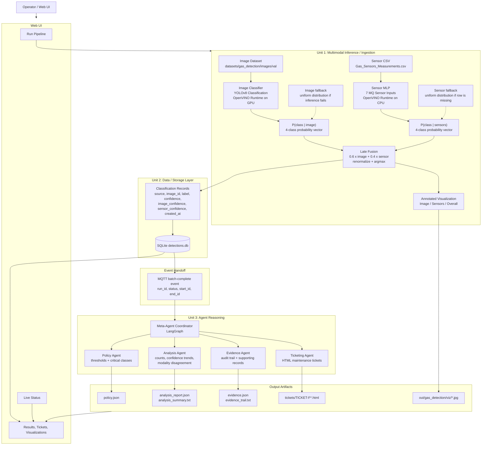
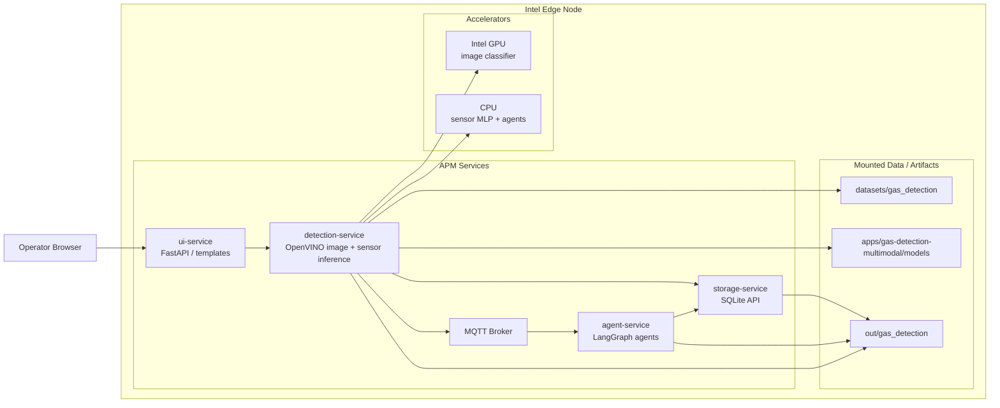

<!--
SPDX-FileCopyrightText: (C) 2026 Intel Corporation
SPDX-License-Identifier: Apache-2.0
-->

# Multimodal Predictive Maintenance Pipeline: Implementation Plan

This document captures the proposed architecture for extending APM to a **multimodal** pipeline that
fuses image-based defect classification with sensor-based (time-series) classification, based on
[intel/predictive-maintenance-pipeline: multimodal_predictive_maintenance_pipeline.md](https://github.com/intel/predictive-maintenance-pipeline/blob/main/docs/multimodal_predictive_maintenance_pipeline.md).

## Goals

- Unit 1 (Detection/Ingestion): run two independent inference paths — an image classifier and a
  sensor-data classifier — over the same logical "event," then fuse their class probabilities into
  a single classification decision.
- Unit 2 (Storage): persist per-record classification results (source, label, confidence, and the
  per-modality confidences) so fused decisions remain auditable/explainable.
- Unit 3 (Agent Reasoning): reuse the existing LangGraph multi-agent flow (Policy, Analysis,
  Evidence, Ticketing) unchanged, driven off the same MQTT batch-complete handoff pattern already
  used by APM today.

## Logical Pipeline

## Deployment View

## Implementation Status

Reused as much as possible from the upstream reference implementation
([intel/predictive-maintenance-pipeline](https://github.com/intel/predictive-maintenance-pipeline),
`src/inference/handlers/sensor_flat.py` and `openvino_classify.py`), ported
into standalone modules under `services/detection-service/src/utility/` so
they plug into our microservice architecture instead of the upstream
monolithic `pace/` CLI structure:

- **`fusion.py`** — generic n-way late-fusion utility (weighted average +
  renormalize + argmax), ported from `SensorFlatHandler.fuse()`. Unit-tested
  in `tests/test_fusion.py` (mirrors upstream's `test_nway_fusion.py`, plus
  extra coverage for missing-sample and unweighted-branch edge cases).
- **`sensor_classifier.py`** — `SensorMLPClassifier`: loads a flat-feature
  CSV, z-score normalizes against dataset stats, runs an OpenVINO MLP model,
  with per-sample fallback to a uniform distribution when a row is missing.
  Ported from `SensorFlatHandler.load()`/`infer()`. Unit-tested in
  `tests/test_sensor_classifier.py` (OpenVINO calls mocked so tests run
  without a real model file).
- **`image_classifier.py`** — `ImageClassifier`: direct OpenVINO inference
  over a folder of images (bypasses DL Streamer). Ported from
  `OpenVINOClassifyHandler`.
- Added `numpy`, `opencv-python-headless`, and `openvino` to
  `detection-service/requirements.txt` (previously detection-service only
  called out to the DL Streamer container over REST and had no ML runtime
  of its own).

**Dataset and models (now available):**

- **Dataset**: the public gas-detection dataset (Mendeley) was downloaded and
  prepped successfully using `scripts/download_and_prep_data.py --use-case
  gas-detection`. Result: `datasets/gas_detection/images/train/{Mixture,
  NoGas,Perfume,Smoke}/` (90 images each, 360 total), `images/val/` (40
  images), and `sensor_data/Gas_Sensors_Measurements.csv` (6400 rows). The
  dataset directory is gitignored (data, not code) — regenerate it locally
  with the script above.
- **Sensor MLP**: trained per upstream's `training_recipe.md` recipe (flat
  z-score-normalized features → small MLP), exported to ONNX then converted
  to OpenVINO IR. **96.6% validation accuracy** during training.
  Model: `apps/gas-detection-multimodal/models/sensor_mlp/sensor_mlp.xml`/`.bin`.
- **Image classifier**: trained via `yolo classify train` (YOLOv8s-cls,
  imgsz=640, 50 epochs, CPU), exported directly to OpenVINO IR via
  Ultralytics' `model.export(format='openvino')`. **98.6% validation
  accuracy** during training.
  Model: `apps/gas-detection-multimodal/models/image/best.xml`/`.bin` (`.bin`
  tracked via Git LFS, ~20 MB).
- **Joint validation**: ran `ImageClassifier` + `SensorMLPClassifier` +
  `fusion.late_fusion()` together over the 40 held-out validation images
  (weights: image 0.6 / sensor 0.4, per upstream's reference config). Fusion
  outperforms either branch alone:

  | Branch | Accuracy (40 samples) |
  |---|---|
  | Image-only | 92.5% (37/40) |
  | Sensor-only | 95.0% (38/40) |
  | **Fused** | **97.5% (39/40)** |

- **OpenVINO API note**: OpenVINO 2026.3 removed the `openvino.runtime`
  submodule alias used by older code/docs; modules now use
  `import openvino as ov; ov.Core()` directly. `requirements.txt` pinned to
  `openvino==2026.3.0` to match.

**Wired and deployed:**

- **Storage schema**: additive, nullable columns (`source`, `image_confidence`,
  `sensor_confidence`, `sensor_raw_json`) added to storage-service via an
  in-place `ALTER TABLE` migration — existing databases and plain video
  defect detections are unaffected.
- **`multimodal_runner.py`**: config-driven orchestrator tying
  `ImageClassifier` + `SensorMLPClassifier` + `fusion.late_fusion()` together
  for a static image/sensor dataset, persisting each fused result to
  storage-service.
- **`POST /detection/run-multimodal`**: new detection-service endpoint,
  sharing the same single-run-lock and "batch-complete" MQTT handoff
  contract as the existing video path — the agent-service reacts identically
  regardless of which path produced a batch.
- **`apps/gas-detection-multimodal/`**: full use-case directory (configs,
  prompts, trained models, `.env` file) — deployable via
  `source setup.sh --use-case gas-detection-multimodal`.
- **End-to-end validation**: brought up the full stack (nginx, storage,
  detection, agent, ui, mqtt, dlstreamer, model-download, metrics — all
  healthy) via Docker Compose, triggered a real classification run through
  the deployed API, confirmed all 40 samples were classified, fused, and
  persisted with real `image_confidence`/`sensor_confidence`/`sensor_raw_json`
  values, and confirmed the agent-service correctly reacted to the
  "batch-complete" event.

**Not yet done (deferred):**

- **UI**: no changes made to `ui-service` to surface per-modality confidences
  or trigger `/detection/run-multimodal` from the dashboard yet — trigger via
  `curl` in the meantime (see `apps/gas-detection-multimodal/README.md`).

## Notes / Open Questions for Implementation

- **Fusion weights** (0.6 image / 0.4 sensor) are a starting point from the reference doc; should be
  configurable (e.g., via `configs/policy_fallback.json` or a new fusion config) rather than
  hard-coded.
- **Storage schema** needs new columns (`image_confidence`, `sensor_confidence`, `source`) in
  addition to the existing detection fields — this is additive to `storage-service`'s current
  schema, not a breaking change.
- **Detection service** needs a second inference path (sensor MLP on CPU) alongside the existing
  image/video path, plus fallback handling per modality when a record/frame is missing.
- Existing **agent reasoning layer is reused as-is** — no changes anticipated there beyond ensuring
  the Analysis Agent can surface modality disagreement if useful.
- This is a **new use case**, not a modification of the existing single-modality reference
  pipelines — implementation should follow the same "new use case directory" convention as other
  APM use cases.
