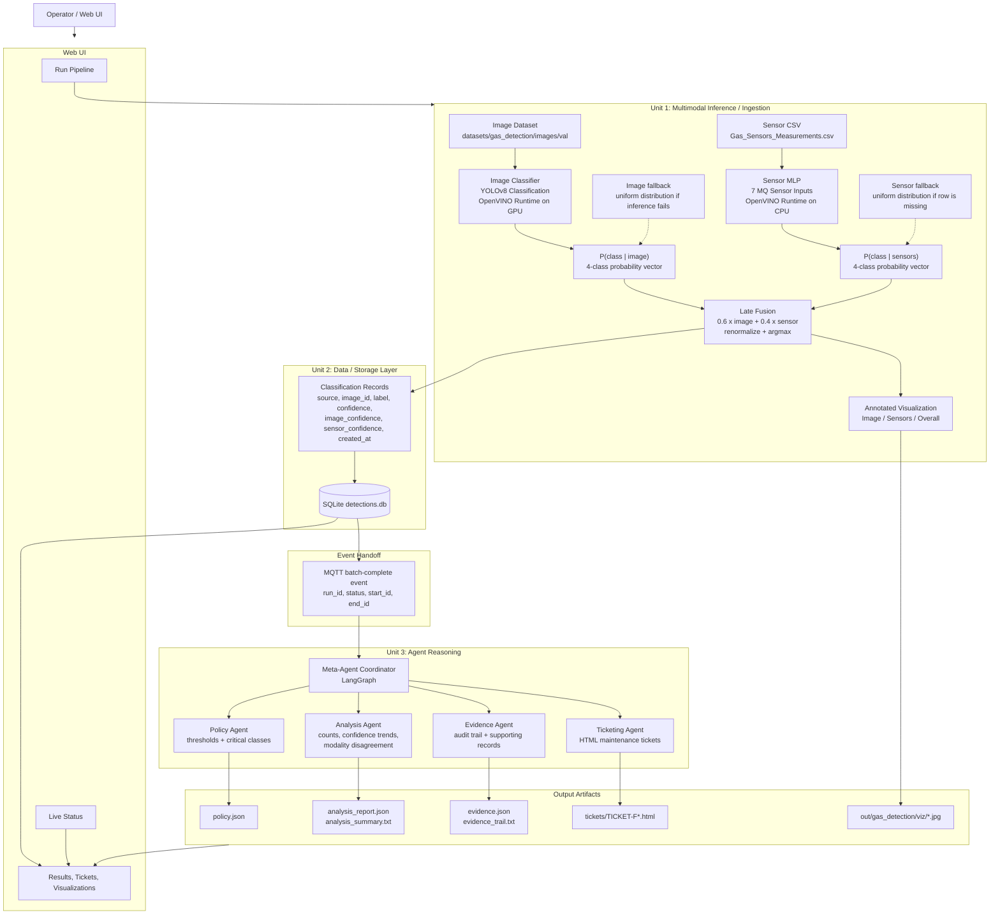
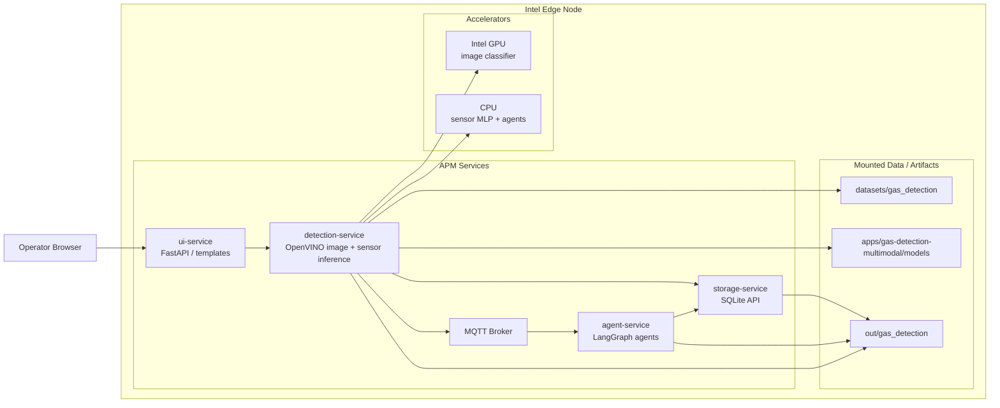

<!--
SPDX-FileCopyrightText: (C) 2026 Intel Corporation
SPDX-License-Identifier: Apache-2.0
-->

# Multimodal Predictive Maintenance Pipeline: Implementation Plan

This document captures the proposed architecture for extending APM to a **multimodal** pipeline that
fuses image-based defect classification with sensor-based (time-series) classification, based on
[intel/predictive-maintenance-pipeline: multimodal_predictive_maintenance_pipeline.md](https://github.com/intel/predictive-maintenance-pipeline/blob/main/docs/multimodal_predictive_maintenance_pipeline.md).

## Goals

- Unit 1 (Detection/Ingestion): run two independent inference paths — an image classifier and a
  sensor-data classifier — over the same logical "event," then fuse their class probabilities into
  a single classification decision.
- Unit 2 (Storage): persist per-record classification results (source, label, confidence, and the
  per-modality confidences) so fused decisions remain auditable/explainable.
- Unit 3 (Agent Reasoning): reuse the existing LangGraph multi-agent flow (Policy, Analysis,
  Evidence, Ticketing) unchanged, driven off the same MQTT batch-complete handoff pattern already
  used by APM today.

## Logical Pipeline



## Deployment View



## Implementation Status

Reused as much as possible from the upstream reference implementation
([intel/predictive-maintenance-pipeline](https://github.com/intel/predictive-maintenance-pipeline),
`src/inference/handlers/sensor_flat.py` and `openvino_classify.py`), ported
into standalone modules under `services/detection-service/src/utility/` so
they plug into our microservice architecture instead of the upstream
monolithic `pace/` CLI structure:

- **`fusion.py`** — generic n-way late-fusion utility (weighted average +
  renormalize + argmax), ported from `SensorFlatHandler.fuse()`. Unit-tested
  in `tests/test_fusion.py` (mirrors upstream's `test_nway_fusion.py`, plus
  extra coverage for missing-sample and unweighted-branch edge cases).
- **`sensor_classifier.py`** — `SensorMLPClassifier`: loads a flat-feature
  CSV, z-score normalizes against dataset stats, runs an OpenVINO MLP model,
  with per-sample fallback to a uniform distribution when a row is missing.
  Ported from `SensorFlatHandler.load()`/`infer()`. Unit-tested in
  `tests/test_sensor_classifier.py` (OpenVINO calls mocked so tests run
  without a real model file).
- **`image_classifier.py`** — `ImageClassifier`: direct OpenVINO inference
  over a folder of images (bypasses DL Streamer). Ported from
  `OpenVINOClassifyHandler`.
- Added `numpy`, `opencv-python-headless`, and `openvino` to
  `detection-service/requirements.txt` (previously detection-service only
  called out to the DL Streamer container over REST and had no ML runtime
  of its own).

**Dataset and models (now available):**

- **Dataset**: the public gas-detection dataset (Mendeley) was downloaded and
  prepped successfully using `scripts/download_and_prep_data.py --use-case
  gas-detection`. Result: `datasets/gas_detection/images/train/{Mixture,
  NoGas,Perfume,Smoke}/` (90 images each, 360 total), `images/val/` (40
  images), and `sensor_data/Gas_Sensors_Measurements.csv` (6400 rows). The
  dataset directory is gitignored (data, not code) — regenerate it locally
  with the script above.
- **Sensor MLP**: trained per upstream's `training_recipe.md` recipe (flat
  z-score-normalized features → small MLP), exported to ONNX then converted
  to OpenVINO IR. **96.6% validation accuracy** during training.
  Model: `apps/gas-detection-multimodal/models/sensor_mlp/sensor_mlp.xml`/`.bin`.
- **Image classifier**: trained via `yolo classify train` (YOLOv8s-cls,
  imgsz=640, 50 epochs, CPU), exported directly to OpenVINO IR via
  Ultralytics' `model.export(format='openvino')`. **98.6% validation
  accuracy** during training.
  Model: `apps/gas-detection-multimodal/models/image/best.xml`/`.bin` (`.bin`
  tracked via Git LFS, ~20 MB).
- **Joint validation**: ran `ImageClassifier` + `SensorMLPClassifier` +
  `fusion.late_fusion()` together over the 40 held-out validation images
  (weights: image 0.6 / sensor 0.4, per upstream's reference config). Fusion
  outperforms either branch alone:

  | Branch | Accuracy (40 samples) |
  |---|---|
  | Image-only | 92.5% (37/40) |
  | Sensor-only | 95.0% (38/40) |
  | **Fused** | **97.5% (39/40)** |

- **OpenVINO API note**: OpenVINO 2026.3 removed the `openvino.runtime`
  submodule alias used by older code/docs; modules now use
  `import openvino as ov; ov.Core()` directly. `requirements.txt` pinned to
  `openvino==2026.3.0` to match.

**Wired and deployed:**

- **Storage schema**: additive, nullable columns (`source`, `image_confidence`,
  `sensor_confidence`, `sensor_raw_json`) added to storage-service via an
  in-place `ALTER TABLE` migration — existing databases and plain video
  defect detections are unaffected.
- **`multimodal_runner.py`**: config-driven orchestrator tying
  `ImageClassifier` + `SensorMLPClassifier` + `fusion.late_fusion()` together
  for a static image/sensor dataset, persisting each fused result to
  storage-service.
- **`POST /detection/run-multimodal`**: new detection-service endpoint,
  sharing the same single-run-lock and "batch-complete" MQTT handoff
  contract as the existing video path — the agent-service reacts identically
  regardless of which path produced a batch.
- **`apps/gas-detection-multimodal/`**: full use-case directory (configs,
  prompts, trained models, `.env` file) — deployable via
  `source setup.sh --use-case gas-detection-multimodal`.
- **End-to-end validation**: brought up the full stack (nginx, storage,
  detection, agent, ui, mqtt, dlstreamer, model-download, metrics — all
  healthy) via Docker Compose, triggered a real classification run through
  the deployed API, confirmed all 40 samples were classified, fused, and
  persisted with real `image_confidence`/`sensor_confidence`/`sensor_raw_json`
  values, and confirmed the agent-service correctly reacted to the
  "batch-complete" event.

**Not yet done (deferred):**

- **UI**: no changes made to `ui-service` to surface per-modality confidences
  or trigger `/detection/run-multimodal` from the dashboard yet — trigger via
  `curl` in the meantime (see `apps/gas-detection-multimodal/README.md`).

## Notes / Open Questions for Implementation

- **Fusion weights** (0.6 image / 0.4 sensor) are a starting point from the reference doc; should be
  configurable (e.g., via `configs/policy_fallback.json` or a new fusion config) rather than
  hard-coded.
- **Storage schema** needs new columns (`image_confidence`, `sensor_confidence`, `source`) in
  addition to the existing detection fields — this is additive to `storage-service`'s current
  schema, not a breaking change.
- **Detection service** needs a second inference path (sensor MLP on CPU) alongside the existing
  image/video path, plus fallback handling per modality when a record/frame is missing.
- Existing **agent reasoning layer is reused as-is** — no changes anticipated there beyond ensuring
  the Analysis Agent can surface modality disagreement if useful.
- This is a **new use case**, not a modification of the existing single-modality reference
  pipelines — implementation should follow the same "new use case directory" convention as other
  APM use cases.

## Future Architecture Options (for the next iteration)

The current implementation intentionally favors fast validation with a static, pre-collected
dataset (paired image + sensor samples, batch-triggered via `POST /detection/run-multimodal`).
It reused the plain-OpenVINO reference implementation from
`intel/predictive-maintenance-pipeline` as-is. Two follow-up architectures are documented here
for whoever picks up the next iteration — see also the tracked todo
`multimodal-dlstreamer-migration`.

### Option A — Pragmatic: align with existing single-modality use cases (reuse-first)

Keep the ported reference code (`fusion.py`, `sensor_classifier.py`, `image_classifier.py`) but
change how they're invoked so the use case matches the platform's normal live/continuous
pattern instead of a static batch job:

```
Video/Camera Source ─▶ dlstreamer-pipeline-server (GVA image classification,
                        same pattern as pipeline-defect-detection, model =
                        apps/gas-detection-multimodal/models/image/best.xml)
                                │  (GVA metadata + frame timestamp)
Sensor stream ─▶ sensor-ingest subscriber (wraps existing sensor_classifier.py,
                  publishes {timestamp, sensor_class, sensor_confidence} to MQTT)
                                │  (sensor prediction + timestamp)
                                ▼
                fusion step, added as an MQTT-driven background task inside
                detection-service (not a new microservice) — correlates the two
                streams by nearest timestamp and calls the existing, reusable
                fusion.late_fusion() per matched pair
                                ▼
                storage-service (existing schema: source / image_confidence /
                sensor_confidence / sensor_raw_json — no changes needed)
                                ▼
                agent-service (existing MQTT batch-complete contract, existing
                agents.yaml / policy_fallback.json — no changes needed)
```

**What's reused as-is:** `fusion.late_fusion()` (already modality-agnostic — takes two
confidence dicts, needs no changes), `sensor_classifier.py`, storage schema, agent/policy config.
**What's genuinely new:** DL Streamer pipeline config for the image model (replacing the current
empty `pipeline-server-config.json` placeholder), a timestamp-correlation window (replacing the
current static 1:1 index pairing), and a live/replayed sensor data source (no live sensor
hardware exists today). Trigger model shifts from on-demand batch POST to continuous/event-driven,
consistent with every other APM use case.

### Option B — Ideal target-state (reuse set aside): a general multimodal fusion platform

If not constrained to the current reference code, the recommended production-grade design is:

```
Camera/Video (RTSP/USB)          Sensor Hardware (MQTT/OPC-UA/Modbus)
        │                                   │
        ▼                                   ▼
dlstreamer-pipeline-server           sensor-service (ingest, normalize,
(GVA image model, HW-accel)          timestamp, publish to message bus)
        │  metadata + ts                     │ readings + ts
        └──────────────┬────────────────────┘
                        ▼
        Message Bus (MQTT/Kafka): topics image.inference, sensor.inference
                        ▼
        fusion-engine (stateless, horizontally scalable):
          - windowed stream join by timestamp (tumbling/sliding window,
            not static index pairing)
          - pluggable fusion strategy (late / early-feature-level / hybrid /
            learned meta-classifier) behind a common interface, not a single
            hardcoded function
          - confidence calibration + fusion-policy versioning (track which
            weights/thresholds produced a given verdict, for later tuning)
          - graceful degradation: if one modality is missing/delayed, still
            emit a valid, lower-confidence, explicitly-flagged result rather
            than failing the batch
                        ▼
        storage-service: separate, linkable records for raw per-modality
        results and the fused result (not just extra nullable columns bolted
        onto one row) — enables auditing which modality drove a decision
                        ▼
        agent/reasoning-service: modality-agnostic — only ever consumes the
        fused output + metadata, unaware of how many modalities contributed
```

**Core principles:** decouple modalities completely via a message bus (no direct service-to-service
calls between image and sensor inference); treat fusion as a pluggable strategy, not a hardcoded
function; use proper timestamp-windowed stream joins instead of index-based pairing; separate raw
per-modality storage from the fused result for auditability; support graceful degradation when a
modality is unavailable; keep reasoning fully downstream and modality-agnostic.

**Trade-off:** Option A is a smaller, incremental change reusing the current codebase and matching
existing deployment conventions. Option B is a larger rebuild (new fusion-engine component, message
bus topics, schema redesign) better suited if/when this pipeline needs to scale to multiple
cameras/sensor types or support pluggable fusion strategies in production.

### Vision-only compatibility: how existing single-modality use cases are unaffected

Both options above are designed so that **fusion is opt-in per use case, not a universal
requirement** — a vision-only use case (e.g. `pipeline-defect-detection`) requires zero changes
and never executes any sensor/fusion code path:

- **Option A**: the sensor-ingest subscriber is an optional component, gated the same way the
  existing GPU/NPU/LLM compose overlays are — a use case's `.env_<use-case>` simply omits/disables
  it (e.g. `ENABLE_SENSOR_FUSION=false`), so its compose file never starts that service. The
  MQTT-driven fusion task inside `detection-service` checks whether any `sensor.inference`
  messages exist for the correlation window; if none arrive (no sensor source configured, or a
  disabled flag), it short-circuits and passes the image-only classification straight to storage
  with `source="image_only"`, leaving `sensor_confidence`/`sensor_raw_json` `NULL` — fields the
  existing schema already supports as nullable. DL Streamer → storage is otherwise identical to
  the current `pipeline-defect-detection` flow.
- **Option B**: the fusion-engine subscribes to whatever topics a use case's config registers, not
  a hardcoded two-source join — if only `image.inference` exists, there's nothing to correlate
  against. For a vision-only use case the configured fusion strategy is simply `"passthrough"`
  (`modalities_used: ["image"]`, `fused_confidence == image_confidence`) — the same fallback code
  path used when a sensor briefly goes offline mid-run, just applied permanently. `agent-service`
  is unaffected either way since it only ever reads the fused record + `modalities_used` metadata,
  never how many modalities produced it.

In short: single-modality use cases simply never register a sensor source or a real fusion
strategy, reusing the identical degradation path designed for "sensor temporarily unavailable" —
no separate vision-only code path is needed.
