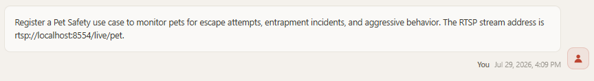
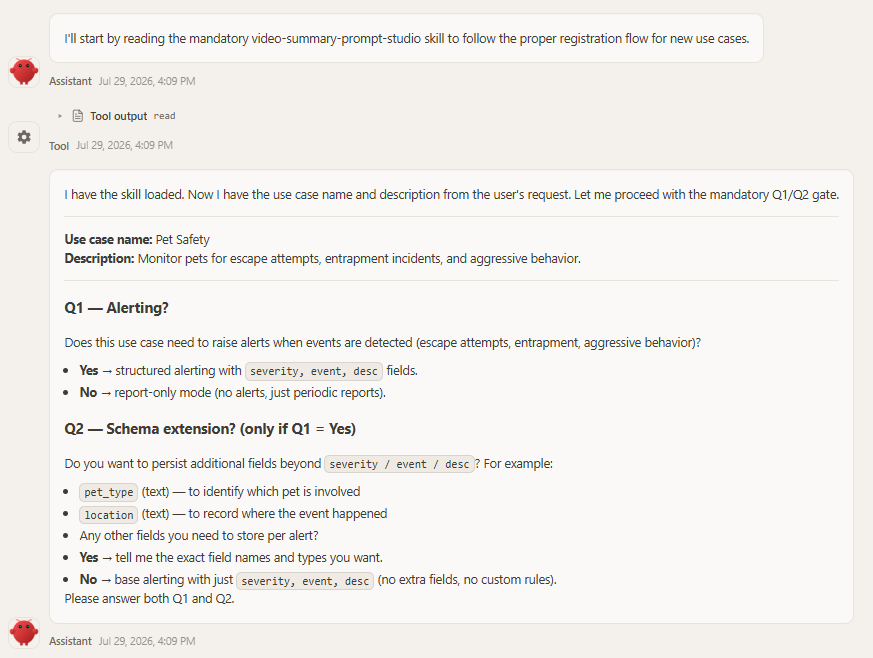
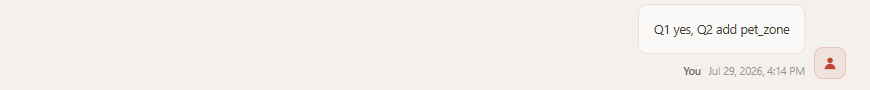
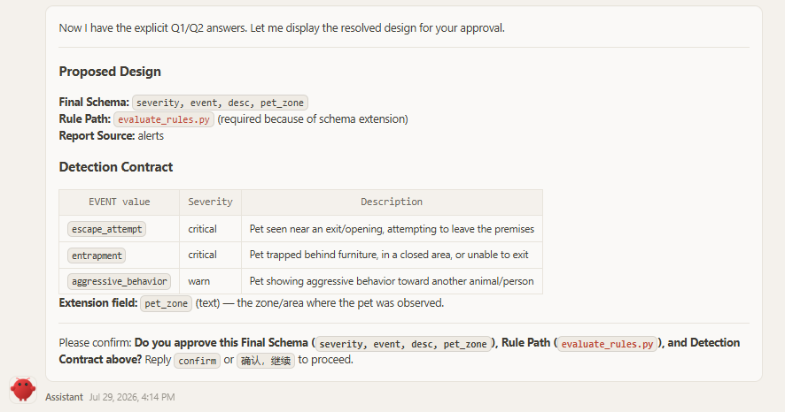
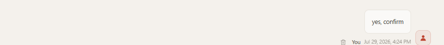
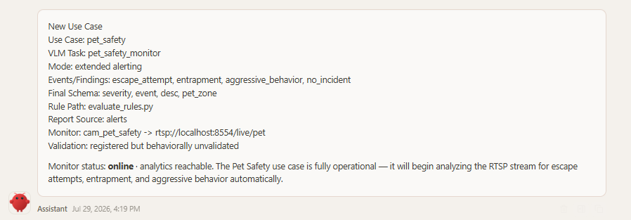
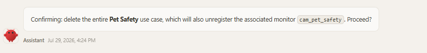
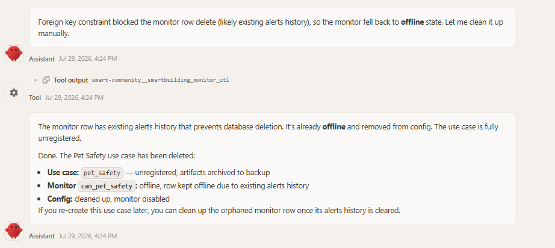

# Register a New Use Case

A *use case* tells the platform what to watch for in a video stream — for example, whether a pet is trying to escape its area, or whether workers on a construction site are wearing safety helmets. This guide shows how to create one **by conversation**: you describe what you need in a chat with a connected agent (for example, OpenClaw), and the [`video-summary-prompt-studio`](../../../skills/video-summary-prompt-studio/SKILL.md) skill turns your description into a registered, running use case — no code, no restart.

By the end of this guide you will know how to:

- register a new use case through a conversation, step by step with screenshots;
- verify the detection results stored in the database;
- write a use-case description that produces accurate detection;
- delete a use case, again by conversation.

**Prerequisites:** an agent host is connected (see [Connect an agent host (zero-code)](../get-started.md#step-3---connect-an-agent-host)) and the skills are imported (OpenClaw [Step 3](../get-started.md#openclaw)).

> **Tip — use a capable cloud model for registration.** Registering a use case is the most model-demanding flow on the platform: the agent must infer events and schema, draft a four-section VLM prompt, and pass the server-side consistency gate. We recommend switching the agent to a strong cloud model for this conversation — e.g. in OpenClaw, pick a MiniMax model from the model selector — rather than a small local model. This only affects the **authoring** step; once the use case is registered, day-to-day detection runs on the on-device VLM/LLM stack (for example a local Qwen model), independent of which model the agent used to register it.

## How it works

Registering a use case is a short conversation with the agent:

1. **Describe the use case in chat.** Give the agent a name (lowercase snake_case) and a short natural-language description of what to watch for — optionally the RTSP stream to bind it to, e.g. *"Create a use case `pet_safety`: monitor the pet camera for escape, trapped, or aggressive behavior. Stream: `rtsp://localhost:8554/live/pet`."*

2. **Answer the gating questions.** The skill first checks that one primary event per clip can represent the request, then asks Q1/Q2 (skipping anything your description already answers). It may ask one compact boundary question when visual evidence, event priority, or uncertainty remains ambiguous:
   - **Q1 — Alerting?** *No* → a report-only use case (no alert schema, no rules). *Yes* → alerting via the built-in rule evaluator on the base schema `severity, event, desc` (alerts fire on `severity = warn | critical`).
   - **Q2 — Extend the schema?** *(only if Q1 = yes)* *No* → **default rule path**: the schema stays `severity, event, desc`, no custom code. *Yes* → **custom rule path**: the extra fields you name (e.g. `pet_zone`, `risk_area`) are added on top of the base schema, and a per-use-case `evaluate_rules.py` is generated to decide alerts from them.

3. **Confirm the mode, final schema, and rule path.** Before anything is written, the agent echoes the applicable decision for your approval — *report-only* (no schema, no rules), *base alerting* (`severity, event, desc` with the default rule evaluator), or *extended alerting* (base schema plus your extension fields, with a generated `evaluate_rules.py`).

4. **The agent registers it.** It drafts the four-section VLM prompt (plus `evaluate_rules.py` for every extended schema or custom alert policy), then calls `smartbuilding_use_case_register` in two steps — `action=generate_task` (POSTs the video-summary task to `multilevel-video-understanding` and writes `use-cases/<name>/prompt.md`), followed by `action=register` with `persist=true` (applies the schema, updates `use_case_dict`, and writes `config.yaml`). A built-in consistency gate validates prompt ↔ schema ↔ rules and rejects mismatches before side effects.

5. **Bind a camera (optional).** If you supplied a stream URL, the agent registers the monitor (`smartbuilding_monitor_ctl register_source`) as part of the flow; otherwise add one later through the connected agent.

When registration finishes, the agent reports the new use case's configuration followed by a grouped system inventory — each registered use case (from `smartbuilding_use_case_register action=list`, which reads the server's live in-memory `use_case_dict`: task, schema fields, rule path, and report source) with its bound monitors nested underneath (from `smartbuilding_monitor_ctl action=list`), so a use case with no camera yet shows up explicitly instead of disappearing from a monitors-only list. The use case is live immediately — alerts start flowing to any client subscribed to `smartbuilding://monitor/<monitor_id>/alerts`.

> **Tip:** Things to *detect* (escape, trapped, aggressive behavior, …) are event **values**, not schema fields — describe what to watch for, and only name extra schema fields in Q2 when you truly need them persisted and queryable.

## Walkthrough: register a use case with OpenClaw

This section walks through a complete registration conversation in OpenClaw, using a **pet-safety detection** use case as the example. It takes the extended-schema path so you can see how `evaluate_rules.py` is produced.

### Step 0 — Start a new session with a strong model

Open the OpenClaw chat interface and click **+ New session** to start a clean conversation for the registration. Before typing, switch the model selector to a capable cloud model (e.g. MiniMax) — registration quality depends heavily on the model's ability to infer events, draft the prompt, and pass the consistency gate. You can switch back to a smaller/local model for everyday chats afterwards; detection itself runs on the on-device stack either way.

### Step 1 — Describe the use case

Tell OpenClaw the use-case name, what to detect, and what an alert should mean. Be as concrete as you can — this description is what the VLM prompt is compiled from (see [Write a good use-case description](#write-a-good-use-case-description)):

> *Register a Pet Safety use case to monitor pets for escape attempts, entrapment incidents, and aggressive behavior. The RTSP stream address is `rtsp://localhost:8554/live/pet`.*



### Step 2 — Answer Q1/Q2

OpenClaw does not draft anything yet. It first reads the `video-summary-prompt-studio` skill, then asks the two gating questions:

- **Q1 — Alerting?** Does this use case need to raise alerts when events are detected (escape attempts, entrapment, aggressive behavior)? *Yes* → structured alerting with `severity, event, desc` fields; *No* → report-only mode (no alerts, just periodic reports).
- **Q2 — Schema extension?** *(only if Q1 = Yes)* Persist additional fields beyond `severity / event / desc`? OpenClaw suggests examples such as `pet_type` (which pet is involved) or `location` (where the event happened). *No* → base alerting with just `severity, event, desc` — no extra fields, no custom rules.

Reply explicitly, naming any extension fields you need persisted and queryable — here we add a `pet_zone` field so every alert carries which zone of the room the event happened in:

> *Q1 yes, Q2 add pet_zone*





### Step 3 — Confirm the proposed design

OpenClaw resolves the detection contract from your description and shows the proposed design for approval:

- **Final Schema:** `severity, event, desc, pet_zone`
- **Rule Path:** `evaluate_rules.py` (required because of the schema extension)
- **Report Source:** `alerts`
- **Detection Contract** — event values with severity defaults:

  | EVENT value | Severity | Description |
  |---|---|---|
  | `escape_attempt` | critical | Pet seen near an exit/opening, attempting to leave the premises |
  | `entrapment` | critical | Pet trapped behind furniture, in a closed area, or unable to exit |
  | `aggressive_behavior` | warn | Pet showing aggressive behavior toward another animal/person |

  Extension field: `pet_zone` (text) — the zone/area where the pet was observed.

Nothing is written until you approve it:

> *confirm*





### Step 4 — Registration and artifacts

After approval, OpenClaw drafts the four-section VLM prompt and — because the schema is extended — generates `evaluate_rules.py` from the final schema. It then registers the use case in two server-side steps (`generate_task` → `register` with `persist=true`) and binds the stream as monitor `cam_pet_safety`.

Both artifacts are archived under the data directory — `$SMARTBUILDING_DATA_DIR/use-cases/<use_case>/` (default `~/.mcp-smartbuilding`):

```text
~/.mcp-smartbuilding/
└── use-cases/
    └── pet_safety/
        ├── prompt.md           # four-section VLM prompt (GLOBAL / MACRO / LOCAL / T_MINUS_1)
        └── evaluate_rules.py   # custom alert rule — extended schema only
```

- `prompt.md` — the compiled detection contract that the VLM task runs against every clip.
- `evaluate_rules.py` — invoked by the rule engine for every analyzed clip. It receives the parsed fields as JSON and returns an alert outcome (or `null` for no alert). For this example it reads `severity`, `event`, `desc`, and the `pet_zone` extension, and fires on `severity = warn | critical`, attaching the zone to the alert description.

On the **default rule path** (Q2=no) only `prompt.md` is archived — alerts are decided by the built-in evaluator on `severity = warn | critical`. A **report-only** use case (Q1=no) archives `prompt.md` and has no schema and no rule at all.

The final chat report lists the use case, VLM task (`pet_safety_monitor`), mode (extended alerting), event values (`escape_attempt`, `entrapment`, `aggressive_behavior`, `no_incident`), final schema, rule path, and the bound monitor `cam_pet_safety → rtsp://localhost:8554/live/pet` — **online, analytics reachable**.

Note the **validation status**: *registered but behaviorally unvalidated* — registration only confirms structural alignment of prompt ↔ schema ↔ rules. When you have representative footage, compare the persisted `event / severity / desc / pet_zone` values against ground truth and re-register with `overwrite=true` to refine. From this point the use case is live: pet-safety events start producing alerts on `smartbuilding://monitor/cam_pet_safety/alerts`.




## View detection results in the database

Once the use case is live, all detection result data is stored in the server's SQLite database (`smartbuilding.db`, at the `db.path` configured in `config.yaml`). The tables, in the order they appear in the database:

| Table | What it holds |
|---|---|
| `monitors` | Registered video sources — monitor ID, name, RTSP `source_url`, bound `use_case`, and `status` (`online` / `offline`). |
| `events` | Raw detection events reported by the video-stream analytics (VSA) pipeline — these are what trigger video-summary tasks. |
| `sqlite_sequence` | Internal SQLite bookkeeping for `AUTOINCREMENT` primary keys — no user data, safe to ignore. |
| `recordings` | Recorded video clips associated with events/alerts — file paths, time ranges, duration, and file size, so you can review the footage behind any detection. |
| `video_summary_tasks` | Per-clip video-summary results — the VLM's `summary_text`, the parsed fields (`event`, `severity`, `desc`, plus any extension fields like `pet_zone`), task status, and token/latency stats. |
| `alerts` | Alerts fired by the rule engine (here, by `evaluate_rules.py`) — severity, event, description, and the clip path. |
| `reports` | Generated periodic reports per monitor (e.g. daily summaries) — `report_text`, event/motion counts, report type, status, and generation stats. |
| `plans` | Per-monitor analysis plans (`plan_json`) — named plan definitions that drive scheduled report/summary generation, with an `active` flag. |

You don't need to open the database by hand — just ask OpenClaw in the same chat. For example:

> *check monitors in smartbuilding.db*


Here the `cam_pet_safety` row is still present but **offline** — the use case has been unregistered, and the row persists only because existing alerts history blocks the delete (see [Delete a use case by conversation](#delete-a-use-case-by-conversation)).

> *check video-summary-tasks in smartbuilding.db*


Here OpenClaw summarizes the detection results: 31 completed tasks in ~5 minutes, 30 classified as `escape_attempt` (critical) — a cat repeatedly trying to climb the balcony railing — all in the same `pet_zone`. This is exactly the place to verify detection quality after registration: if the persisted `event` / `severity` / `pet_zone` values don't match what the camera actually saw, refine the description and re-register with `overwrite=true`.

## Write a good use-case description

Your description in Step 1 is the single biggest factor in detection quality. The agent compiles it directly into the VLM prompt — anything left vague is left to the VLM's guesswork, and the result is missed detections or noisy alerts.

Cover these points when you describe a use case:

- **What to detect** — the concrete events (e.g. *worker without a safety helmet*), not a broad category (*safety issues*).
- **Alert semantics** — when an alert should fire and what severity means (e.g. *warn for a violation; critical if the worker is operating machinery*).
- **Visual evidence** — what must be visible to count (e.g. *helmet clearly worn on the head; carried in hand or replaced by a cap counts as a violation*).
- **Look-alikes to exclude** — common confusables (e.g. *caps, hoods, people outside the fence, posters or mannequins*).
- **Scene context** — camera viewpoint and area of interest (e.g. *entrance camera looking down at the site gate*).

### Example: construction-site helmet detection

Compare two descriptions of the same use case:

| Vague | Detailed |
|---|---|
| *Create a use case `helmet_detection`: watch the construction site for safety problems.* | *Create a use case `helmet_detection`: monitor the construction-site camera. Alert when a worker inside the fenced site area is not wearing a safety helmet. A helmet counts only when clearly worn on the head — carrying it in hand, or wearing just a cap or hood, is a violation. Ignore people outside the fence.* |

With the vague description the agent cannot tell what counts as an event, what evidence is required, or what to exclude — the generated prompt is generic, and the VLM misses bareheaded workers while flagging harmless scenes. The detailed description pins down the event, the evidence rule, and the exclusions, so the compiled prompt detects precisely what you meant.

<!-- TODO(screenshots): add side-by-side detection results —
     - openclaw-uc-desc-vague-result.png: registration/detection outcome from the vague description (generic prompt, missed or false alerts)
     - openclaw-uc-desc-detailed-result.png: outcome from the detailed description (correct helmet-violation alerts) -->

If the first registered version behaves poorly in practice, you do not need to delete it — refine the description and ask OpenClaw to update the use case in place (the skill re-registers it with `overwrite=true`).

## Delete a use case by conversation

Deleting is also a conversation — ask OpenClaw to remove the use case by name:

> *delete pet safety usecase*

Because this is destructive, OpenClaw double-checks before doing anything:

> *Confirming: delete the entire **Pet Safety** use case, which will also unregister the associated monitor `cam_pet_safety`. Proceed?*



Reply `yes, confirm` and OpenClaw calls `smartbuilding_use_case_register` with `action=unregister`, `persist=true`:

> *yes, confirm*


The unregister cascade then runs:

- **Removed:** the `use_case_dict.pet_safety` entry from `config.yaml`, the VLM task `pet_safety_monitor`, and the monitor's config entry (`monitors.yaml`).
- **Archived:** the `prompt.md` / `evaluate_rules.py` artifacts are moved from `~/.mcp-smartbuilding/use-cases/pet_safety/` to `use-cases/.backup/`, so you can recover them later.
- **Preserved:** historical alert rows in the `alerts` table and recorded clip/event rows linked to `pet_safety` are kept as audit history and are not part of the unregister cascade.



Check the monitor outcome in the response's `cascaded_monitors`:

- `db_row="deleted"` — the monitor was fully unregistered.
- `db_row="kept_offline"` — the row delete failed (for example, a FOREIGN KEY constraint because alert history still references the monitor, as in the screenshot above), so the server fell back to stopping it: the monitor's `status` is flipped to `offline`, it is removed from config, and its row stays in the `monitors` table disabled. If you re-create the use case later, you can clean up the orphaned monitor row once its alerts history is cleared.

---

For the full authoring rules the agent follows (prompt anchors, schema invariants, retry behavior), see the [`video-summary-prompt-studio` skill](../../../skills/video-summary-prompt-studio/SKILL.md) and the [`use_case_register` tool reference](./mcp_tools_list.md#8-smartbuilding_use_case_register).
