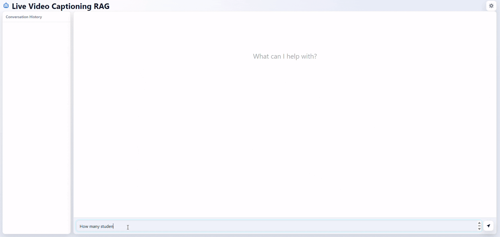

# Live Video Captioning RAG

A Retrieval-Augmented Generation sample that creates caption-text embeddings and stores them in a vector database with video frames and metadata. It works with the [Live Video Captioning](../../live-video-captioning/) sample to process RTSP streams and generate live captions using a Vision-Language Model. The application uses an OpenVINO™ LLM to power chatbots that answer questions based on the generated captions.

## Get Started

To see the system requirements and other installation guides, refer the following:

- [System Requirements](./docs/user-guide/get-started/system-requirements.md): Check the hardware and software requirements for deploying the application.
- [Get Started](./docs/user-guide/get-started.md): Follow the step-by-step instructions to set up the application.

## How it Works

This Retrieval-Augmented Generation sample integrates caption ingestion, vector search, and OpenVINO™ LLM-based response generation. It works with the Live Video Captioning application to process frame-level captions and metadata from RTSP streams, building a knowledge base for answering user questions through vector-based retrieval.

Fore more information, refer to [How-it-works](./docs/user-guide/how-it-works.md) guide.

## Learn More

- [Overview](./docs/user-guide/index.md)
- [System Requirements](./docs/user-guide/get-started/system-requirements.md)
- [Get Started](./docs/user-guide/get-started.md)
- [API Reference](./docs/user-guide/api-reference.md)
- [How to Build Source](./docs/user-guide/get-started/build-from-source.md)
- [Known Issues](./docs/user-guide/known-issues.md)
- [Release Notes](./docs/user-guide/release-notes.md)