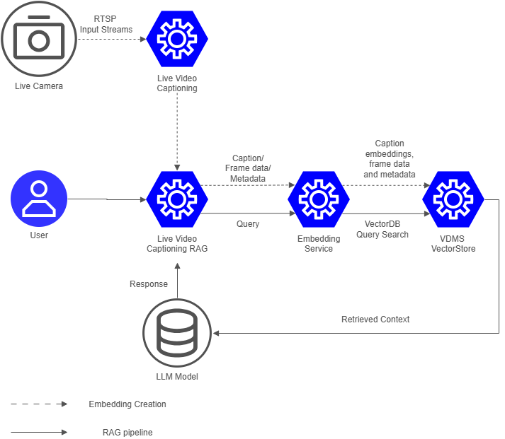

# How it Works

The Live Video Captioning RAG sample combines caption ingestion, vector search, and LLM-based response generation into a Retrieval-Augmented Generation workflow. It is designed to work together with the Live Video Captioning application, which produces frame-level captions and metadata from an RTSP stream. Those captions become the knowledge base that this application uses to answer user questions.



## Data Flow Diagram

```
Live Video - → Live Video Captioning
                         |
                         ▼
User Query → Live Video Captioning RAG → Embedding Service → Vector Store -> Retrieve → Response
```

## System Components

### 1. Collection of Live Video Captioning application

[Live Video Captioning](../../../live-video-captioning/docs/user-guide/how-it-works.md) is the upstream producer in the full deployment flow. It analyzes the video stream, generates captions for frames, and sends frame data plus metadata to the RAG application so the RAG system can build searchable context.

These collection includes:
- **dlstreamer-pipeline-server**: Intel DLStreamer Pipeline Server processing RTSP sources with GStreamer pipelines and `gvagenai` for VLM inference
- **mediamtx**: WebRTC/WHIP signaling server for video streaming
- **coturn**: TURN server for NAT traversal in WebRTC connections
- **video-caption-service**: Python FastAPI backend serving REST APIs, SSE metadata streams, and WebSocket metrics
- **collector**: Intel VIP-PET system metrics collector (CPU, GPU, memory, power)

### 2. Live Video Captioning RAG application

It consists of browser-based frontend and FastAPI backend served by the same FastAPI application. It provides:
- a chat interface for user questions
- streaming response rendering
- inline display of retrieved frame images and caption previews
- model information display

The backend in this component exposes the main APIs used by the UI and upstream pipelines:
- `POST /api/embeddings` to ingest caption-derived context
- `POST /api/chat` to answer questions with streaming output utilizing configured LLM runs through the OpenVINO backend.
- `GET /api/model` to report the active LLM model
- `GET /api/health` to report service health

### 3. Embedding service

When new caption data arrives, the Live Video Captioning RAG backend sends the caption text to an embedding endpoint. The returned vector represents the semantic meaning of the caption text and is used for similarity search.

### 4. VDMS vector store

The application stores embeddings in a VDMS-backed vector database together with normalized metadata.
This allows the application to retrieve both relevant text context and associated visual references during question answering.


## Deployment Note

This sample application is most effective when deployed together with the Live Video Captioning application. If it is run standalone, the chat interface can still work, but the retrieved context will be limited until embeddings are added through the ingestion API or a demo workflow.

## Learn More

- [System Requirements](./get-started/system-requirements.md)
- [Get Started](./get-started.md)
- [API Reference](./api-reference.md)
- [Known Issues](./known-issues.md)
- [Release Notes](./release-notes.md)