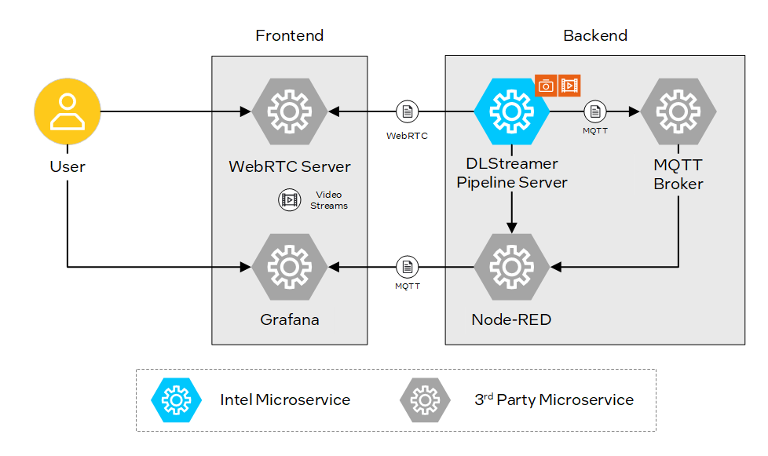
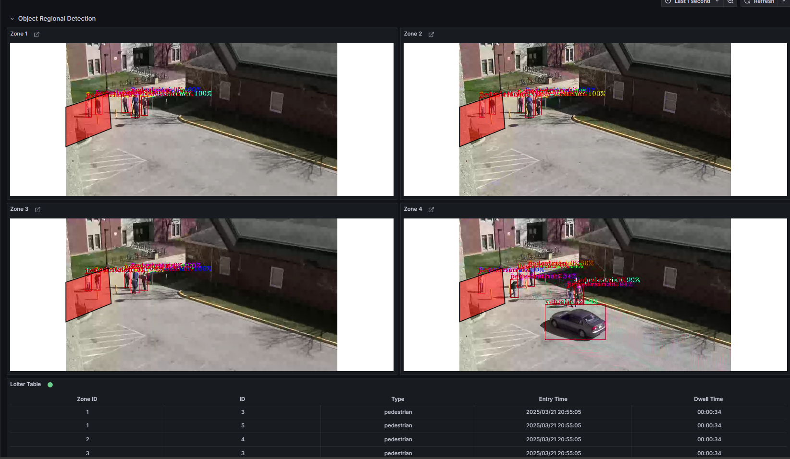

# Get Started

Loitering Detection leverages advanced AI algorithms to monitor and analyze real-time video feeds, identifying individuals lingering in designated areas. It provides a modular architecture that integrates seamlessly with various input sources and leverages AI models to deliver accurate and actionable insights.

By following this guide, you will learn how to:
- **Set up the sample application**: Use Docker Compose to quickly deploy the application in your environment.
- **Run a predefined pipeline**: Execute a pipeline to see loitering detection in action.

## Prerequisites
- Verify that your system meets the [minimum requirements](./system-requirements.md).
- Install Docker: [Installation Guide](https://docs.docker.com/get-docker/).

## Set up and First Use

1. **Download the Application**:
    - Download the Docker Compose file and configuration:
      ```bash
      git clone https://github.com/open-edge-platform/edge-ai-suites.git
      cd edge-ai-suites/metro-ai-suite/loitering-detection/
      ```

2. **Configure the Application and Download Assets**
   - Configure application to use the primary IP address.
   - Download the 'pedestrian-and-vehicle-detector-adas' AI model from OpenVINO Model Zoo.
   - Download input video files.
     ```bash
     ./install.sh
     ```
## Run the Application

1. **Start the Application**:
    - Download container images with Application microservices and run with Docker Compose:
      ```bash
      docker compose up -d
       ```
      <details>
      <summary>
      Check Status of Microservices
      </summary>
      
      - The application starts the following microservices, see also [How it Works](./Overview.md#how-it-works).

      
    
      - To check if all microservices are in Running state:
        ```bash
        docker ps
        ```
      </details>

2. **Run Predefined Loitering Detection Pipelines**:
    - Start video streams to run Loitering Detection pipelines:
        ```bash
        ./sample_start.sh
        ```
      <details>
      <summary>
      Check Status and Stop pipelines
      </summary>
      
      - To check the status:
        ```bash
        ./sample_status.sh
        ```
      
      - To stop the pipelines without waiting for video streams to finish replay:
        ```bash
        ./sample_stop.sh
        ```
      </details>

3. **View the Application Output**:
    - Open a browser and go to `http://localhost:3000` to access the Grafana dashboard.
        - Change the localhost to your host IP if you are accessing it remotely.
    - Log in with the following credentials:
        - **Username:** `admin`
        - **Password:** `admin`
    - Check under the Dashboards section for the default dashboard named "Video Analytics Dashboard".

    - **Expected Results**: The dashboard displays detected people and cars.
    - 

4. **Stop the Application**:
    - To stop the application microservices, use the following command:
      ```bash
      docker compose down -v
      ```

## Next Steps
- [How to Customize the Application](how-to-customize-application.md)

## Troubleshooting

1. **Containers Not Starting**:
   - Check the Docker logs for errors:
     ```bash
     docker compose logs
     ```

2. **No Video Streaming on Grafana Dashboard**
    - Go to the Grafana "Video Analytics Dashboard".
    - Click on the Edit option (located on the right side) under the WebRTC Stream panel. 
    - Update the URL from `http://localhost:8083` to `http://host-ip:8083`.

3. **Failed Grafana Deployment** 
    - If unable to deploy grafana container successfully due to fail to GET "https://grafana.com/api/plugins/yesoreyeram-infinity-datasource/versions": context deadline exceeded, please ensure the proxy is configured in the ~/.docker/config.json as shown below:

      ```bash
              "proxies": {
                      "default": {
                              "httpProxy": "<Enter http proxy>",
                              "httpsProxy": "<Enter https proxy>",
                              "noProxy": "<Enter no proxy>"
                      }
              }
      ```

    - After editing the file, remember to reload and restart docker before deploying the microservice again.

      ```bash
      systemctl daemon-reload
      systemctl restart docker
      ```

## Supporting Resources
- [Docker Compose Documentation](https://docs.docker.com/compose/)
- [DL Streamer Pipeline Server](https://docs.edgeplatform.intel.com/dlstreamer-pipeline-server/3.0.0/user-guide/Overview.html)
