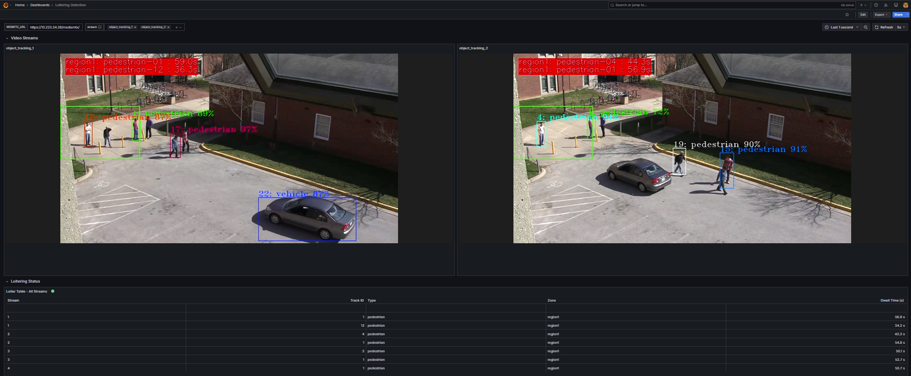

# Get Started

Loitering Detection leverages advanced AI algorithms to monitor and analyze real-time video
feeds, identifying individuals lingering in designated areas. It provides a modular
architecture that integrates seamlessly with various input sources and leverages AI models to
deliver accurate and actionable insights.

By following this guide, you will learn how to:

- **Set up the sample application**: Use Docker Compose to quickly deploy the application in your environment.
- **Run a predefined pipeline**: Execute a pipeline to see loitering detection in action.
- **Access the application's features and user interfaces**: Explore the Grafana dashboard, Node-RED interface, and DL Streamer Pipeline Server to monitor, analyze and customize workflows.

## Prerequisites

- Verify that your system meets the [minimum requirements](./get-started/system-requirements.md).
- Install Docker: [Installation Guide](https://docs.docker.com/get-docker/).
  Enable running docker without "sudo": [Post Install](https://docs.docker.com/engine/install/linux-postinstall/)
- Install Git: [Installing Git](https://git-scm.com/book/en/v2/Getting-Started-Installing-Git)

## Set up and first use

1. **Clone the Suite**:

   > [!NOTE]
   > The Loitering Detection Console UI described in this guide is not yet merged into
   > `open-edge-platform/edge-ai-suites`. Until it is, clone the fork/branch it currently lives
   > on instead of `main`:
   >
   > ```bash
   > git clone --filter=blob:none --sparse --branch gg/ld-ui https://github.com/guptagunjan/edge-ai-suites.git
   > cd edge-ai-suites
   > git sparse-checkout set metro-ai-suite
   > cd metro-ai-suite/metro-vision-ai-app-recipe/
   > ```
   >
   > Once merged, use the upstream clone below as normal.

   Go to the target directory of your choice and clone the suite.
   If you want to clone a specific release branch, replace `main` with the desired tag.
   To learn more on partial cloning, check the [Repository Cloning guide](https://docs.openedgeplatform.intel.com/dev/OEP-articles/contribution-guide.html#repository-cloning-partial-cloning).

   ```bash
   git clone --filter=blob:none --sparse --branch main https://github.com/open-edge-platform/edge-ai-suites.git
   cd edge-ai-suites
   git sparse-checkout set metro-ai-suite
   cd metro-ai-suite/metro-vision-ai-app-recipe/
   ```

2. **Setup Application and Download Assets**:
   - Use the installation script to configure the application and download required models:

     ```bash
     ./install.sh loitering-detection
     ```

   > [!NOTE]
   > For environments requiring a specific host IP address (for example, when deploying across different network interfaces), you can explicitly
   > specify the IP address: `./install.sh loitering-detection <HOST_IP>` (Replace `<HOST_IP>` with
   > your target IP address.)

## Run the application

> [!NOTE]
> **Steps 1 and 2 below are required** to get the application running. **Step 3 is optional** -
> it only verifies the pipelines are producing output via Grafana; skip it if you plan to use the
> [Loitering Detection Console UI](#loitering-detection-console-ui) instead, and go straight to
> [Access the Application and Components](#access-the-application-and-components).

1. **Start the Application** (required):
   - Download container images with Application microservices and run with Docker Compose:

     ```bash
     docker compose up -d
     ```

     <details>
     <summary>
     Check Status of Microservices
     </summary>
     - The application starts the following microservices.
     - To check if all microservices are in Running state:
       ```bash
       docker ps
       ```

     **Expected Services:**
     - Grafana Dashboard
     - DL Streamer Pipeline Server
     - MQTT Broker
     - Loitering Detection Console (operator UI)
     - Scenescape services (for Smart Intersection only)

     </details>

2. **Run Predefined Pipelines** (required):
   - Start video streams to run video inference pipelines:

     ```bash
     ./sample_start.sh
     ```

     > [!NOTE]
     > This starts 4 fixed sample-video pipelines directly via the DL Streamer Pipeline Server
     > API. If you only intend to use the [Console UI](#loitering-detection-console-ui) - which
     > starts and stops its own streams on demand - you can skip this step entirely and go
     > straight to the Console UI's URL below.

   - To check the status of the pipelines:

     ```bash
     ./sample_status.sh
     ```

     <details>
     <summary>
     Stop pipelines
     </summary>
     - To stop the pipelines without waiting for video streams to finish replay:

       > [!NOTE]
       > This will stop all the pipelines and the streams. **DO NOT** run this
       > if you want to see loitering detection

       ```bash
       ./sample_stop.sh
       ```
       </details>

3. **View the Application Output** (optional - Grafana verification):
   - Open a browser and go to `https://localhost/grafana` to access the Grafana dashboard.
     - Change the localhost to your host IP if you are accessing it remotely.
   - Log in with the following credentials:
     - **Username**: `admin`
     - **Password**: `admin`
   - Check under the Dashboards section for the application-specific preloaded dashboard.
   - **Expected Results**: The dashboard displays real-time video streams with AI overlays and detection metrics.
   - **This step can be skipped**: it only confirms step 2's pipelines are producing output: the
     [Loitering Detection Console UI](#loitering-detection-console-ui) does not depend on it.

## **Access the Application and Components**

Every interface below is independent - open whichever one suits your workflow, you do not need
to use all of them.

### **Nginx Dashboard**

- **URL**: `https://localhost`

### **Grafana UI**

- **URL**: `https://localhost/grafana`
- **Log in with credentials**:
  - **Username**: `admin`
  - **Password**: `admin` (You will be prompted to change it on first login.)
- In Grafana UI, the dashboard displays detected people and cars
  

  > [!NOTE]
  > The default pipeline uses `gvatrack tracking-type=zero-term`, which uses
  > image data to re-associate a track and keeps the same id across brief
  > occlusions better than imageless tracking. The id can still change if a
  > track leaves the frame and a similar-looking object enters later.

### **Loitering Detection Console UI**

- **URL**: `https://localhost/console/`
- Start/stop streams, discover models, draw a zone and view live per-stream loitering analytics.
- See [Getting started - Loitering Detection Console UI](./getting-started-ui.md) for full usage details.

### **DL Streamer Pipeline Server**

- **REST API**: `https://localhost/api/pipelines/status`
- **WebRTC**: `https://localhost/mediamtx/object_tracking_1/`

## **Stop the Application**

- To stop the application microservices, use the following command:

  ```bash
  docker compose down
  ```

## Other Deployment Options

Choose one of the following methods to deploy the Loitering Detection Sample Application:

- [Deploy Using Helm](./get-started/deploy-with-helm.md): Use Helm to deploy the
  application to a Kubernetes cluster for scalable and production-ready deployments.

## Next Steps

- [Customize the Application](./how-to-guides/customize-application.md)

## Troubleshooting

1. **Changing the Host IP Address**
   - If you need to use a specific Host IP address instead of the one automatically detected during installation, you can explicitly provide it using the following command. Replace `<HOST_IP>` with your desired IP address:

     ```bash
     ./install.sh <HOST_IP>
     ```

2. **Containers Not Starting**:
   - Check the Docker logs for errors:

     ```bash
     docker compose logs
     ```

3. **No Video Streaming on Grafana Dashboard**
   - Go to the Grafana "Video Analytics Dashboard".
   - Click on the Edit option (located on the right side) under the WebRTC Stream panel.
   - Update the URL from `http://localhost:8083` to `http://host-ip:8083`.

4. **Failed Grafana Deployment**
   - If unable to deploy the Grafana container successfully due to fail to GET "<https://grafana.com/api/plugins/yesoreyeram-infinity-datasource/versions>": context deadline exceeded, please ensure the proxy is configured in the `~/.docker/config.json` as shown below:

     ```bash
             "proxies": {
                     "default": {
                             "httpProxy": "<Enter http proxy>",
                             "httpsProxy": "<Enter https proxy>",
                             "noProxy": "<Enter no proxy>"
                     }
             }
     ```

   - After editing the file, remember to reload and restart docker before deploying the microservice again.

     ```bash
     systemctl daemon-reload
     systemctl restart docker
     ```

## Supporting Resources

- [Docker Compose Documentation](https://docs.docker.com/compose/)
- [DL Streamer Pipeline Server](https://docs.openedgeplatform.intel.com/dev/edge-ai-libraries/dlstreamer-pipeline-server/index.html)

<!--hide_directive
:::{toctree}
:hidden:

get-started/system-requirements.md
get-started/deploy-with-helm.md

:::
hide_directive-->
