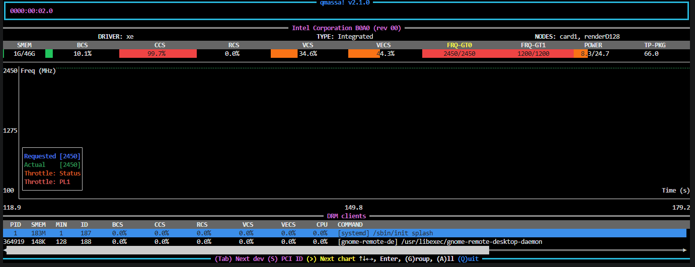
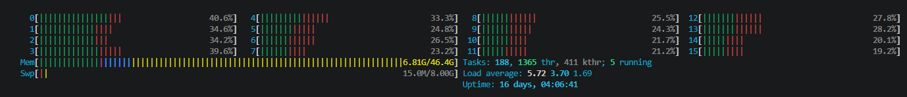
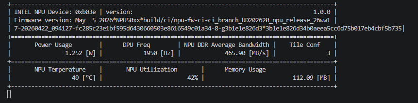
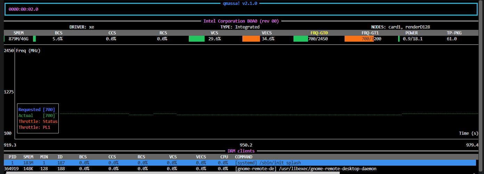
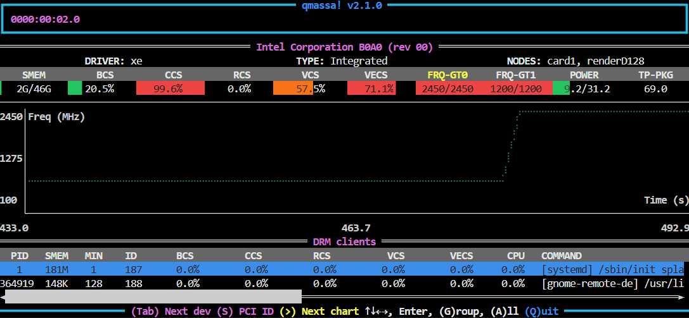
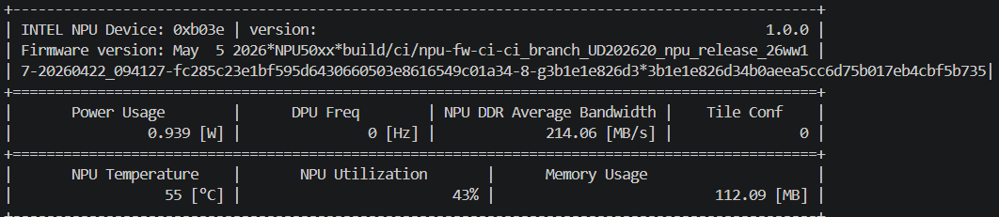

# Demonstrating NPU Value: GPU and NPU Stream Density Benchmark

This document describes a structured benchmark workflow to demonstrate the value of Neural
Processing Unit (NPU) offloading in the Loitering Detection application. The workflow has three
parts:

1. [Establish the best GPU-only stream density baseline](#part-1-gpu-baseline---peak-stream-density)
2. [Establish the best NPU-only stream density baseline](#part-2-npu-baseline---peak-stream-density)
3. [Establish the best combined stream density with GPU and NPU pipelines running together](#part-3-combined-baseline---gpu-and-npu-simultaneously-gpunpu)

---

## Benchmark Reference

All three parts use [Benchmark Performance](./benchmark.md)
as the common source for environment preparation, script execution, and Key Performance
Indicator (KPI) interpretation. Refer to that guide before running any part of this experiment.

- CPU telemetry in this document is captured using the `htop` utility.
- GPU telemetry tool used in this document: [qmassa](https://github.com/ulissesf/qmassa/tree/main/qmassa)
- NPU telemetry tool used in this document: [npu-monitor-tool](https://github.com/open-edge-platform/edge-ai-libraries/tree/main/tools/npu-monitor-tool)

---

## Part 1: GPU Baseline - Peak Stream Density

Before evaluating NPU offloading, establish the strongest GPU-only baseline and record the
highest sustainable stream density.

### Recommended GPU Pipeline Settings

Use the `object_tracking_gpu` pipeline as defined in
[loitering-detection/benchmark_app_payload.json](https://github.com/open-edge-platform/edge-ai-suites/blob/main/metro-ai-suite/metro-vision-ai-app-recipe/loitering-detection/benchmark_app_payload.json).
The pipeline uses the original configuration; note that metro pipelines are latency-focused by
default.

### Run the GPU Stream Density Benchmark

```bash
# Navigate to the metro-vision-ai-app-recipe directory
cd edge-ai-suites/metro-ai-suite/metro-vision-ai-app-recipe/

# Run GPU-only stream density benchmark: stream count is found automatically, target >= 28.5 FPS
./calc_stream_density.sh -p object_tracking_gpu -t 28.5
```

### Example Results (GPU Only)

- **Achieved Stream density (GPU only)**: `Stream Density(GPU) = 11` streams at >= 28.5 frames per second
- **Throughput min** at achieved stream density: `29.8922`
- **Throughput average** at achieved stream density: `29.9371`
- **Throughput median** at achieved stream density: `29.9122`
- **Throughput cumulative** at achieved stream density: `329.308`

For detailed metric definitions and KPI interpretation, refer to
[Benchmark Performance](./benchmark.md).

### Hardware Behavior Notes (GPU Only)

- **Observation at achieved stream density**: At 11 streams, the benchmark remained stable
  above target FPS while GPU engines showed sustained high activity in the inference and
  media path.
- **Observed GPU telemetry from [qmassa](https://github.com/ulissesf/qmassa/tree/main/qmassa)
  at achieved stream density**: `CCS: 99.7%`, `VCS: 34.6%`, `VECS: 44.3%` (see Fig. 1).
- **Metric relevance for the GPU pipeline**:
  - `CCS` reflects compute engine pressure and is most directly tied to inference-stage
    execution.
  - `VCS` reflects media codec engine activity and maps to video decode stages feeding the
    pipeline.
  - `VECS` reflects video enhancement/blit activity, typically associated with frame handling
    and preprocessing path operations.
- **CPU observation from `htop`**: CPU usage was distributed across cores. This is expected
  because the CPU handles host-side **data-feeder** work such as reading video streams,
  preparing frames, and passing data to GPU/NPU pipelines, while GPU/NPU devices perform most
  of the decode and inference compute (see Fig. 2).

### Part 1 Section Summary

- **Standalone GPU ceiling**: `Stream Density(GPU)(11)` at target FPS.
- **Hardware takeaway**: GPU engines carry primary inference/media load (see Fig. 1), while
  CPU is mainly utilized for host-side data-feeding tasks (see Fig. 2).

**Supporting screenshots (cropped to include only benchmark-relevant telemetry)**:


_Fig. 1: GPU telemetry (qmassa) at 11 streams_



_Fig. 2: CPU telemetry (htop) during GPU baseline run_

---

## Part 2: NPU Baseline - Peak Stream Density

This section follows the same structure as Part 1, but for the NPU pipeline.

### Recommended NPU Pipeline Settings

Use the `object_tracking_npu` pipeline as defined in
[loitering-detection/benchmark_app_payload.json](https://github.com/open-edge-platform/edge-ai-suites/blob/main/metro-ai-suite/metro-vision-ai-app-recipe/loitering-detection/benchmark_app_payload.json).
The pipeline uses the original configuration; note that metro pipelines are latency-focused by
default.

### Run the NPU Stream Density Benchmark

```bash
# Navigate to the metro-vision-ai-app-recipe directory
cd edge-ai-suites/metro-ai-suite/metro-vision-ai-app-recipe/

# Run NPU-only stream density benchmark: stream count is found automatically, target >= 28.5 FPS
./calc_stream_density.sh -p object_tracking_npu -t 28.5
```

### Example Results (NPU Only)

- **Achieved Stream density (NPU only)**: `Stream Density(NPU) = 5` streams at >= 28.5 FPS
- **Throughput min** at achieved stream density: `28.5518`
- **Throughput average** at achieved stream density: `28.6221`
- **Throughput median** at achieved stream density: `28.6302`
- **Throughput cumulative** at achieved stream density: `143.111`

For detailed metric definitions and KPI interpretation, refer to
[Benchmark Performance](./benchmark.md).

### Hardware Behavior Notes (NPU Only)

- **Observation at achieved stream density**: At 5 streams, the NPU run remained stable above
  target FPS while the accelerator showed sustained activity.
- **Observed NPU telemetry from** [npu-monitor-tool](https://github.com/open-edge-platform/edge-ai-libraries/tree/main/tools/npu-monitor-tool)
  **at achieved stream density**: `NPU Utilization: 42%` (see Fig. 3).
- **Observed GPU telemetry from** [qmassa](https://github.com/ulissesf/qmassa/tree/main/qmassa)
  **during the NPU run**: `VCS: 29.6%`, `VECS: 34.6%` (see Fig. 4).
- **Metric relevance for the NPU pipeline**:
  - `NPU Utilization` reflects how heavily the NPU execution path is loaded during
    **inference**.
  - `VCS: 29.6%` and `VECS: 34.6%` are the GPU-side **decode** and **frame-handling**
    signals visible during the same run.

### Part 2 Section Summary

- **Standalone NPU ceiling**: `Stream Density(NPU)(5)` at target FPS.
- **Hardware takeaway**: NPU carries inference load (see Fig. 3), and GPU decode/frame-handling
  activity (`VCS`/`VECS`) remains part of the end-to-end path (see Fig. 4).

**Supporting screenshots (cropped to include only benchmark-relevant telemetry)**:



_Fig. 3: NPU telemetry (npu-monitor-tool) at 5 streams_



_Fig. 4: GPU telemetry (qmassa) during NPU baseline run_

---

## Part 3: Combined Baseline - GPU and NPU Simultaneously (GPU!NPU)

This section evaluates the best performance when **GPU and NPU pipelines run simultaneously**.

- For the combined run, use a small **backoff** from each standalone stream limit (for example,
  reduce the GPU stream count by 1 and the NPU stream count by 2, then tune for your platform).
  This gives the GPU extra room to handle the NPU pipeline's decode and frame-handling work
  (`VCS`/`VECS`) instead of running at full limit all the time. In short, backoff helps GPU and
  NPU run together more smoothly, keeps GPU power behavior in a safe range, and helps achieve
  higher overall stream density.

- Backoff application for this run: `Stream Density(GPU) = 11 - 1 = 10` and
  `Stream Density(NPU) = 5 - 2 = 3`, so the combined test uses 10 GPU streams and 3 NPU
  streams.

> **Note:** In this document, `GPU!NPU` is shorthand for the combined run (GPU and NPU
> together), not logical negation.

### Run the Combined Stream Density Benchmark

Run the combined workflow with 10 GPU streams and 3 NPU streams, using **nstreams** mode from
[Benchmark Performance](./benchmark.md):

```bash
# Navigate to the metro-vision-ai-app-recipe directory
cd edge-ai-suites/metro-ai-suite/metro-vision-ai-app-recipe/

# Run GPU and NPU pipelines simultaneously with fixed stream counts: 10 GPU streams and 3 NPU streams, target >= 28.5 FPS
./calc_stream_density.sh -p object_tracking_gpu object_tracking_npu -nstreams 10 3 -t 28.5
```

### Example Results (GPU!NPU)

| Symbol                  |   Value | Notes                                              |
| ----------------------- | ------: | -------------------------------------------------- |
| Stream Density(GPU)     |      11 | GPU-only peak stream density                       |
| Stream Density(NPU)     |       5 | NPU-only peak stream density                       |
| Stream Density(GPU!NPU) |      13 | Combined run with 10 GPU streams and 3 NPU streams |
| Throughput median       | 29.1743 | Combined run KPI                                   |
| Throughput average      | 29.1352 | Combined run KPI                                   |
| Throughput cumulative   | 378.757 | Combined run KPI                                   |
| Throughput min          | 28.7297 | Combined run KPI                                   |

For detailed metric definitions and KPI interpretation, refer to
[Benchmark Performance](./benchmark.md).

### Part 3 Section Summary

- **Combined stream density**: `Stream Density(GPU!NPU)(13)`
- **GPU stream share**: `10`
- **NPU stream share**: `3`
- **Final comparison**: `Stream Density(GPU!NPU)(13) > Stream Density(GPU)(11) > Stream Density(NPU)(5)`

**Figure reference**: Combined GPU telemetry is shown in Fig. 5 and combined NPU telemetry is
shown in Fig. 6.

**Supporting screenshots (cropped to include only benchmark-relevant telemetry)**:



_Fig. 5: Combined run, GPU telemetry (qmassa) at 10 GPU streams_



_Fig. 6: Combined NPU telemetry (npu-monitor-tool) at 3 NPU streams_

---

## Conclusion

- [Part 1 Section Summary](#part-1-section-summary) establishes the standalone GPU baseline at
  `Stream Density(GPU)(11)`.
- [Part 2 Section Summary](#part-2-section-summary) establishes the standalone NPU baseline at
  `Stream Density(NPU)(5)` and confirms continued GPU decode/frame-handling involvement
  (`VCS`/`VECS`).
- [Part 3 Section Summary](#part-3-section-summary) shows the combined result
  `Stream Density(GPU!NPU)(13)` with 10 GPU streams and 3 NPU streams.

Overall, **NPU offloading provides clear system-level value addition** for Loitering Detection.
Applying a tuned backoff (for example, 1 GPU stream and 2 NPU streams on this platform) creates
GPU headroom for NPU-related media work, and enables higher total stream density than either
standalone path while maintaining stable throughput.

> **Note:** The values in this document are example reference results. Actual stream density
> and throughput can vary by platform setup, software stack, and runtime conditions. Re-run the
> benchmark in your target environment to validate expected behavior.
