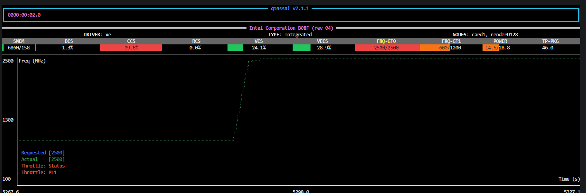
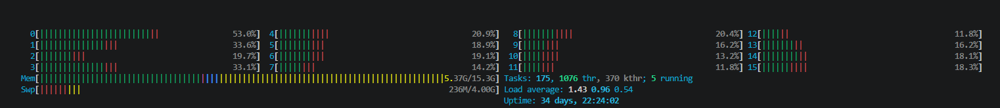
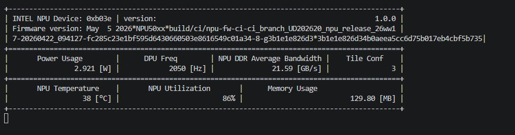
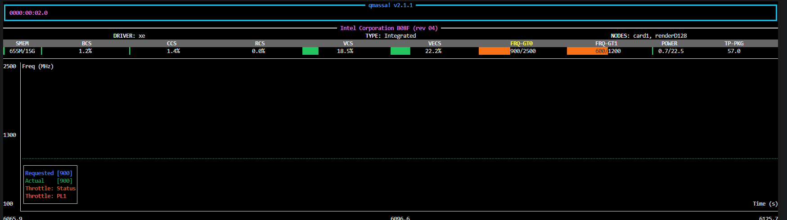

# Demonstrating NPU Value: GPU and NPU Stream Density Benchmark

This document describes a structured benchmark workflow to demonstrate the value of NPU
offloading in the [Smart Parking](https://github.com/open-edge-platform/edge-ai-suites/tree/main/metro-ai-suite/metro-vision-ai-app-recipe/smart-parking) application. The process is organized into three parts:

[Part 1](#part-1-gpu-baseline---peak-stream-density-sd): Establish the best GPU-only stream density baseline.

[Part 2](#part-2-npu-baseline---peak-stream-density-sd): Establish the best NPU-only stream density baseline.

[Part 3](#part-3-combined-baseline---gpu-and-npu-simultaneously-gpu--npu): Establish the best combined stream density with GPU and NPU pipelines running together.

---

## Benchmarking Reference

All three parts use [Benchmark Performance](https://github.com/open-edge-platform/edge-ai-suites/blob/main/metro-ai-suite/metro-vision-ai-app-recipe/smart-parking/docs/user-guide/how-to-guides/benchmark.md) as the common source for environment preparation, script execution, and KPI interpretation. Refer to that guide before running any part of this experiment.

---

## Part 1: GPU Baseline - Peak Stream Density (SD)

Before evaluating NPU offloading, first establish the strongest GPU-only baseline and record
the highest sustainable stream density.

### Recommended GPU Pipeline Settings

Use the `yolov11s_gpu` pipeline as defined in
[smart-parking/benchmark_app_payload.json](https://github.com/open-edge-platform/edge-ai-suites/blob/main/metro-ai-suite/metro-vision-ai-app-recipe/smart-parking/benchmark_app_payload.json).
The pipeline uses the original configuration; note that metro pipelines are latency-focused by default.


<!-- | Parameter | Value | Purpose |
|---|---|---|
| `device` | `GPU` | Runs inference on GPU via OpenVINO |
| `batch-size` | `8` | Improves frame processing parallelism |
| `nireq` | `2` | Keeps multiple inference requests in flight |
| `ie-config` | `GPU_THROUGHPUT_STREAMS=2` | Enables parallel GPU execution streams |
| `pre-process-backend` | `va-surface-sharing` | Reduces copy overhead between decode and inference |
| `inference-interval` | `3` | Balances compute demand and detection cadence | -->

### Run the GPU Stream Density Benchmark

```bash
# Navigate to the metro-vision-ai-app-recipe directory
cd edge-ai-suites/metro-ai-suite/metro-vision-ai-app-recipe/

# Run GPU-only stream density benchmark: test 1–16 streams, target >= 28.5 FPS
./benchmark_start.sh -p yolov11s_gpu -l 1 -u 16 -t 28.5
```

### Recorded Results (GPU Only)

- **Achieved stream density (GPU only)**: `SD(GPU) = 9` streams at >= 28.5 FPS
- **Throughput min** at achieved stream density: `29.9427`
- **Throughput average** at achieved stream density: `29.9868`
- **Throughput median** at achieved stream density: `29.9977`
- **Throughput cumulative** at achieved stream density: `269.882`

### Hardware Behavior Notes (GPU Only)

- **Observation at achieved stream density**: At 9 streams, the benchmark remained stable above target FPS while GPU engines showed sustained high activity in the inference and media path.
- **Observed GPU telemetry from qmassa at achieved stream density**: `CCS: 99.6%`, `VCS: 24.1%`, `VECS: 28.9%`.
- **Metric relevance for the GPU pipeline**:
	- `CCS` reflects compute engine pressure and is most directly tied to inference-stage execution.
	- `VCS` reflects media codec engine activity and maps to video decode stages feeding the pipeline.
	- `VECS` reflects video enhancement/blit activity, typically associated with frame handling and preprocessing path operations.
- **CPU observation from htop during the same run**: CPU load was distributed across cores with available headroom while the GPU path carried the primary inference workload.
- **Supporting screenshots (cropped to include only benchmark-relevant telemetry)**:



 *GPU telemetry (qmassa) at 9 streams*



 *CPU telemetry (htop) during GPU baseline run*

---

## Part 2: NPU Baseline - Peak Stream Density (SD)

This section follows the same structure as Part 1, but for the NPU pipeline.

### Recommended NPU Pipeline Settings

Use the `yolov11s_npu` pipeline as defined in
[smart-parking/benchmark_app_payload.json](https://github.com/open-edge-platform/edge-ai-suites/blob/main/metro-ai-suite/metro-vision-ai-app-recipe/smart-parking/benchmark_app_payload.json).
The pipeline uses the original configuration; note that metro pipelines are latency-focused by default.

### Run the NPU Stream Density Benchmark

```bash
# Navigate to the metro-vision-ai-app-recipe directory
cd edge-ai-suites/metro-ai-suite/metro-vision-ai-app-recipe/

# Run NPU-only stream density benchmark: test 1–16 streams, target >= 28.5 FPS
./benchmark_start.sh -p yolov11s_npu -l 1 -u 16 -t 28.5
```

### Recorded Results (NPU Only)

- **Achieved stream density (NPU only)**: `SD(NPU) = 7` streams at >= 28.5 FPS
- **Throughput min** at achieved stream density: `29.5329`
- **Throughput average** at achieved stream density: `29.6269`
- **Throughput median** at achieved stream density: `29.6374`
- **Throughput cumulative** at achieved stream density: `207.388`

### Hardware Behavior Notes (NPU Only)

- **Observation at achieved stream density**: At 7 streams, the NPU run remained stable above target FPS while the accelerator showed sustained activity.
- **Observed NPU telemetry from the monitor at achieved stream density**: `NPU Utilization: 86%`.
- **Observed GPU telemetry from qmassa during the NPU run**: `VCS: 18.5%`, `VECS: 22.2%`.
- **Metric relevance for the NPU pipeline**:
	- `NPU Utilization` reflects how heavily the NPU execution path is loaded during **inference**.
	- `VCS: 18.5%` and `VECS: 22.2%` are the GPU-side **decode** and **frame-handling** signals visible during the same run.
- **Supporting screenshots (cropped to include only benchmark-relevant telemetry)**:

	

*NPU telemetry monitor at 7 streams*



*GPU telemetry (qmassa) during NPU baseline run*

---

## Part 3: Combined Baseline - GPU and NPU Simultaneously (GPU ! NPU)

This section evaluates the best performance when **GPU and NPU pipelines run simultaneously**.

- For the combined run, reserve 2 streams of headroom from each standalone ceiling (referred to as **backoff**) so both pipelines can run in parallel without forcing either path to its isolated limit. Applying this backoff keeps system power within the same range observed in the standalone runs.

### Run the Combined Stream Density Benchmark

Run the combined workflow with 7 GPU streams and 5 NPU streams:

```bash
# Navigate to the metro-vision-ai-app-recipe directory
cd edge-ai-suites/metro-ai-suite/metro-vision-ai-app-recipe/

# Run GPU and NPU pipelines simultaneously with fixed stream counts: 7 GPU streams and 5 NPU streams, target >= 28.5 FPS
./benchmark_start.sh -p yolov11s_gpu yolov11s_npu -nstreams 7 5 -t 28.5
```

### Record Results (GPU ! NPU)

| Symbol | Value | Notes |
|---|---:|---|
| SD(GPU) | 9 | GPU-only peak stream density |
| SD(NPU) | 7 | NPU-only peak stream density |
| SD(GPU!NPU) | 12 | Combined run with 7 GPU streams and 5 NPU streams |
| Throughput median | 29.8523 | Combined run KPI |
| Throughput average | 29.9193 | Combined run KPI |
| Throughput cumulative | 359.031 | Combined run KPI |
| Throughput min | 29.8098 | Combined run KPI |

- **Achieved combined stream density**: `SD(GPU!NPU)(12)`
- **GPU stream share**: `7`
- **NPU stream share**: `5`
- **Final comparison**: `SD(GPU!NPU)(12) > SD(GPU)(9) > SD(NPU)(7)`

### Comparison Summary

- [**Part 1**](#part-1-gpu-baseline---peak-stream-density-sd) shows the GPU-only ceiling at `SD(GPU)(9)`.
- [**Part 2**](#part-2-npu-baseline---peak-stream-density-sd) shows the NPU-only ceiling at `SD(NPU)(7)` and confirms that the NPU pipeline still depends on GPU-side decode activity through `VCS` and `VECS`.
- To increase overall stream count, the combined run applies a **backoff of 2** to both pipelines, which corresponds to `9-2=7` GPU streams and `7-2=5` NPU streams.
- The result is `SD(GPU!NPU)(12)`, which is **higher than either standalone limit**.

### Supporting Screenshots

_focus.png>)

*Combined run, GPU telemetry (qmassa) at 7 GPU streams*

.v3.png>)

*Combined NPU telemetry at 5 NPU streams*

---

> **Note:** The results in this document were recorded on a specific hardware configuration. Actual stream density values may vary depending on the platform, driver version, and system load. Use the results here as a reference baseline and re-run the benchmarks on your target system to obtain platform-specific numbers.
