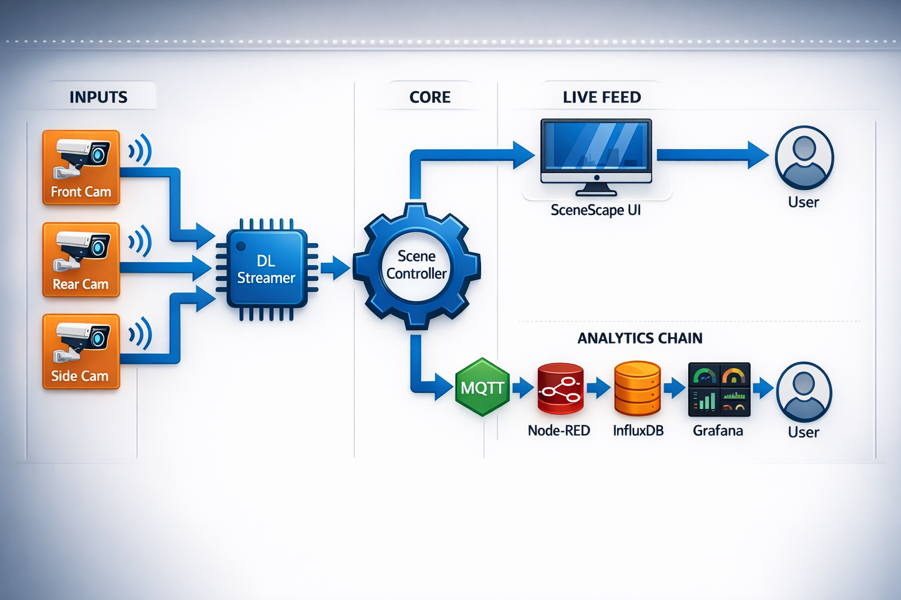

# Smart Tolling Application

The **Metro Smart Tolling Application** is a high-precision Edge AI solution designed to revolutionize automated tolling. By fusing multi-camera inputs (Front, Rear, and Side profiles), the system delivers accurate vehicle detection and classification, license plate detection, color classification, axle counting and tariffing.

Enabling such use cases across multiple viewpoints helps in understanding the object interaction with the real world in 3-D space. All the components used run on a single system enabling low latency, simplified deployment and cost efficiency.

## Key Features

**Multi vision**: Scene-based analytics allow insights beyond single sensor views.

- **Vehicle axle detection**: Vehicle class is determined based on axle and wheel count. Intended for toll classification, as well as revenue calculation and protection.
- **Lift axle detection**: The type of axle is determined based on camera feed. Ensures accurate tariffing, as lift axles may affect toll classification even when raised.
- **License plate detection**: The application identifies vehicles uniquely by their license plates, which are read from both front and rear views. The image evidence is included in every transaction for simplified auditing.

**Visualization & analytics**: Provides real-time and historical insights for toll operators.

**Modularity**: Architecture based on modular microservices enables composability and reconfiguration.

**High-throughput processing**: [Optimized video pipelines](./docs/user-guide/how-it-works/optimization.md#zero-copy-video-pipeline) for Intel edge devices.

## Get Started

To see the system requirements and other installations, see the following guides:

- [Get Started](./docs/user-guide/get-started.md): Follow step-by-step instructions to set up the application.
- [System Requirements](./docs/user-guide/get-started/system-requirements.md): Check the hardware and software requirements for deploying the application.

## How It Works
This section provides a high-level view of how the application integrates with a typical system architecture.

The system uses the **Metro Edge Architecture** based on three key layers:

- **Perception**: Deep Learning Streamer (DL Streamer) [processes 3/4 camera feeds](./docs/user-guide/how-it-works/perception-layer.md).
- **Control**: Scenescape Controller [aggregates metadata](./docs/user-guide/how-it-works/analytics-pipeline.md).
- **Analytics**: Node-RED [transforms events into traffic insights](./docs/user-guide/how-it-works/analytics-pipeline.md#node-red-transformation) (Traffic Volume, Flow Efficiency, Tariffing).

For more details, see [Overview](./docs/user-guide/index.md).

## Learn More

- [System Requirements](./docs/user-guide/get-started/system-requirements.md)
- [Get Started](./docs/user-guide/get-started.md)
- [How It Works](./docs/user-guide/how-it-works.md)
- [Support and Troubleshooting](./docs/user-guide/troubleshooting.md): Find solutions to common issues and troubleshooting steps.

## License

The application is licensed under the [LIMITED EDGE SOFTWARE DISTRIBUTION LICENSE AGREEMENT](./LICENSE.txt).
