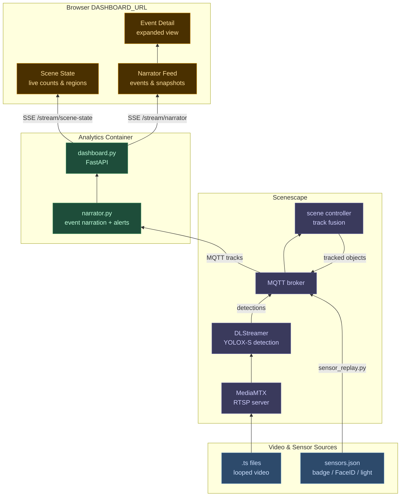

# Smart Building Digital Twin Blueprint

Intel Scenescape deployment for smart building monitoring — person, door, and luggage detection across multiple synchronized cameras, with an AI analytics dashboard that narrates scene activity in real time.

## Overview

- 7-camera scene with looping RTSP video streams
- YOLOX-S detection model in FP16 (GPU) and INT8 (CPU) variants
- Badge and FaceID sensor replay synchronized to video loops via raw camera metadata
- Ambient light sensor driven by loop dark/live transitions
- Analytics dashboard at the configured `DASHBOARD_URL` with live scene narration

## Architecture



**narrator.py** subscribes to MQTT track data and produces a rolling 10-minute text window of scene events. It detects the following alert and warning types:

| Alert | Description |
|---|---|
| No credentials at Checkpoint | Person enters inbound zone without badge or face ID |
| Badge switch | An inbound `Checkpoint` or `Entry` crossing shows a badge associated with a different face than the badge learned earlier in the loop |
| Possible badge switch | An outbound `Checkpoint` or `Entry` crossing shows a badge associated with a different face than the badge learned earlier in the loop |
| Possible fall | Person in horizontal posture outside a furniture region |
| Luggage abandoned | Owner walks ≥ 4 m away from their luggage while still moving — fires immediately, captures snapshots of both person and bag |
| Unattended luggage | Luggage has had no companion for more than 30 seconds — covers cases where the owner has left the scene entirely |
| Luggage stolen | A single bag's companion changes to a different person; the dashboard captures both handoff-time and alert-time images for evidence |
| Luggage switch | Two bags coordinately swap companions (bag A: person 1 → person 2, bag B: person 2 → person 1) |

**dashboard.py** (FastAPI) exposes two SSE endpoints — `/stream/narrator` for rolling scene events and `/stream/scene-state` for live object counts, door states, and region occupancy — and serves the web UI.

## Prerequisites

- Docker and Docker Compose
- Python 3, OpenSSL, jq
- Intel GPU recommended (CPU fallback supported)
- For Panther Lake `xe` GPU telemetry, install `xpu-smi` on the host before running `./setup.sh`
- Host install example on Ubuntu 24.04 when the Intel graphics repo or PPA is already configured: `sudo apt install xpu-smi`
- If the GPU name still appears as a raw PCI ID after host package install, refresh the host PCI ID database with `sudo update-pciids`
- Git LFS — must be installed **before** cloning (video files are stored in LFS):
  ```bash
  # Ubuntu/Debian
  sudo apt install git-lfs
  git lfs install
  ```

## Scenescape Images

Scenescape images are pulled automatically from Docker Hub by `./setup.sh` — no manual build step required. The images used are:

| Image | Tag |
|---|---|
| `intel/scenescape-manager` | `2026.2.0-rc1` |
| `intel/scenescape-controller` | `2026.2.0-rc1` |
| `intel/scenescape-autocalibration` | `2026.2.0-rc1` |
| `intel/scenescape-analytics` | `2026.2.0-rc1` |
| `intel/dlstreamer-pipeline-server` | `2026.2.0-ubuntu24-rc1` |

The DLStreamer GST plugin scripts (`gstplugins/`) are fetched automatically by `setup.sh` via a sparse shallow clone of the Scenescape repository — only that subdirectory is downloaded, no full clone or image build is needed.

## Setup

Clone the repo (Git LFS required for video and model files), then run:

```bash
./setup.sh
```

The script prompts for an admin password (`SUPASS`) and a database password (`DATABASE_PASSWORD`), generates TLS certificates, starts all services, waits for the API, imports the included Showcase scene automatically, and then performs a best-effort telemetry check.

This branch does not require Ollama and does not download a Qwen model during setup.

If `xpu-smi` is already installed on the host, `./setup.sh` also grants the needed host access for `xpu-smi`, starts the host GPU telemetry bridge, and verifies that the analytics service can read telemetry. If you install `xpu-smi` after the initial deployment, rerun `./setup.sh`.

The analytics service also defers `SideDoorEntry` baseline learning until after the first completed replay loop, so a mid-loop startup does not poison the door-state baseline.

After setup:
- Scenescape web UI: `SCENESCAPE_UI_URL` from `.env` (accept the self-signed certificate)
- Analytics dashboard: `DASHBOARD_URL` from `.env`

## Project Structure

```
config/          Model files and pipeline/tracker configuration
datasets/        Looping video files per scene (Git LFS)
scenes/          Scene zip bundles and sensor event data
scripts/
  narrator.py        Converts MQTT tracks to rolling scene narrative + alerts
  dashboard.py       FastAPI server — SSE streams and web UI
  sensor_replay.py   Replays sensor events (badge, FaceID, ambient light) in sync with video loops
  export-config.sh   Exports object class definitions and scene configs from the live API
  restore-assets.sh  Restores object class definitions to a fresh Scenescape instance
  static/
    index.html       3-column analytics dashboard (scene state | narrator feed | event detail)
config/
  object-classes.json   Backed-up object class definitions (person, luggage, door)
  scenes/               Scene configuration snapshots exported from the API
docker-compose.yml
setup.sh
```

## Analytics Dashboard

Open the analytics dashboard URL from `.env` in a browser. The dashboard has three columns:

- **Scene State** (left) — live counts of people, bags, and doors; region occupancy updated each tick. State persists across page reloads via `localStorage`.
- **System Telemetry** (left, below Region Occupancy) — CPU SKU plus current CPU, GPU, memory, and storage usage sampled with each dashboard snapshot.
- **Scene Narrator** (center) — rolling 10-minute feed of scene events and camera snapshots, updated every 10 seconds (configurable via `SNAPSHOT_INTERVAL` in `.env`). Security alerts are highlighted in red. Feed persists across page reloads via `localStorage`.
- **Event Detail** (right) — expanded view of the selected narrator entry.

For `luggage stolen` events, the detail view shows `handoff ...` images before `alert ...` images so the evidence appears in chronological order.

## Telemetry

- The analytics container samples CPU, memory, storage, and CPU SKU directly.
- For Panther Lake `xe` GPU telemetry, `./setup.sh` expects host `xpu-smi` to already be installed. It then configures host access, starts the bridge, and keeps writing fresh GPU utilization snapshots to `generated/telemetry/xpu-smi.json`.
- `./setup.sh` is intended to be run interactively when host permissions must be adjusted for `xpu-smi`. In non-interactive mode, the script warns instead of prompting for `sudo`.
- `./cleanup.sh` stops the host telemetry bridge as part of teardown.
- The analytics container reads the bridge JSON from `generated/telemetry/xpu-smi.json` and also has direct fallbacks for CPU, memory, storage, and Intel GPU probes.
- After setup, you can inspect the current host GPU telemetry bridge output in `generated/telemetry/xpu-smi.json`.

## Configuration

Key variables in `.env`:

| Variable | Default | Description |
|---|---|---|
| `PUBLIC_HOSTNAME` | detected from `hostname` | Hostname used to build the default web/API URLs and TLS certificate SANs |
| `API_BASE_URL` | `https://localhost/api/v1` | Host-local Scenescape API base URL used by setup and helper scripts; override this when running the helper scripts from another machine |
| `SCENESCAPE_UI_URL` | `https://$PUBLIC_HOSTNAME` | Scenescape web UI URL printed by setup |
| `DASHBOARD_URL` | `http://$PUBLIC_HOSTNAME:$DASHBOARD_PORT` | Browser URL for the analytics dashboard |
| `SNAPSHOT_INTERVAL` | `10` | Seconds between narrator snapshots |
| `DASHBOARD_PORT` | `7000` | Host port for the analytics dashboard |
| `SCENESCAPE_IMAGE_TAG` | `2026.2.0-rc1` | Scenescape image tag pulled from Docker Hub |

## Adding a New Scene

1. Add `scenes/{SceneName}.zip` and `datasets/{scene-name}/cam-*.ts`
2. Optionally add `scenes/{SceneName}-sensors.json` for sensor replay
3. Run `./setup.sh`

## Exporting Configuration

After making changes in the Scenescape UI (editing object classes, adjusting camera transforms, updating regions), run the export script to capture the new state:

```bash
PASSWORD=<admin-password> ./scripts/export-config.sh
```

This writes:
- `config/object-classes.json` — current object class definitions (person, luggage, door, etc.)
- `config/scenes/{Name}.json` — full scene configuration (cameras, intrinsics, transforms, regions)

Commit the updated files to keep the repo in sync with the live instance.

## Copilot Workspace Files

This repo now includes shared Copilot customization files to help with cross-system tuning and deployment debugging:

- `.github/copilot-instructions.md` — always-on project guidance for preserving the Scenescape networking model, localhost setup behavior, and tuning workflow
- `.github/skills/tune-other-systems/SKILL.md` — on-demand skill for investigating why another machine behaves differently from the reference system
- `.github/skills/tune-other-systems/assets/system-delta-template.md` — checklist for capturing machine, environment, service, and scene differences before making changes

Use the tuning skill before changing analytics logic on another system. In most cases, the important first comparisons are `.env`, GPU/CPU mode, service health, `config/resolved-uuids.json`, and exported scene/object-class configuration.

## Useful Commands

```bash
docker compose up -d                    # start all services
docker compose down                     # stop all services
docker compose ps                       # check service status
docker compose logs -f analytics        # stream analytics logs
docker compose logs -f scene-narrator   # stream dashboard/narrator logs
./cleanup.sh                            # stop services and remove all generated files and volumes
```
