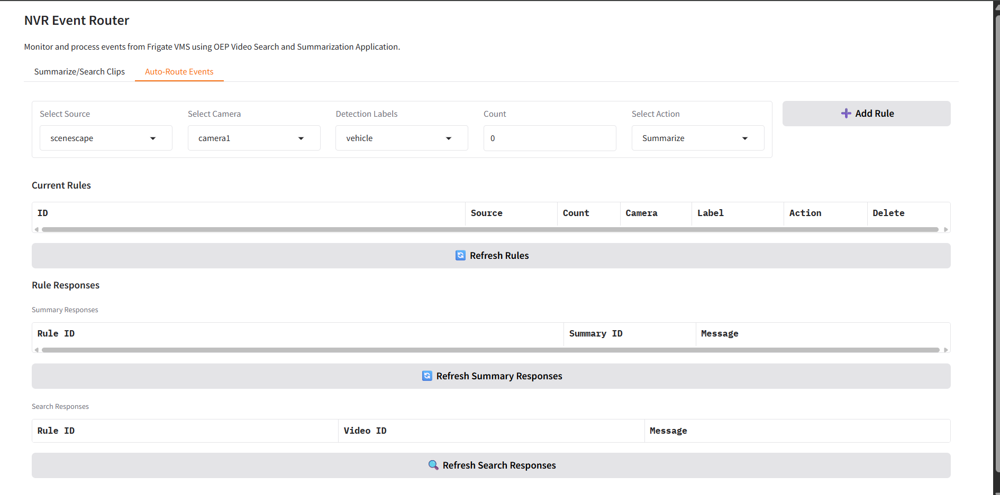
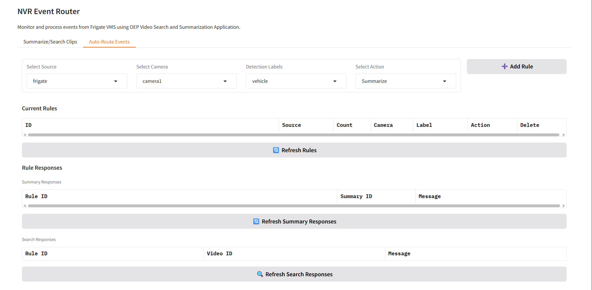

# Integrate Intel® SceneScape with Smart NVR

This guide covers the integration of Intel® SceneScape with Smart NVR for enhanced traffic monitoring using live data from the Smart Intersection application.

## Overview

Smart NVR integrates with Intel® SceneScape to enable:

- Real-time object counting and tracking (vehicles, pedestrians)
- Traffic flow analysis
- Automated event routing based on count thresholds
- Enhanced surveillance for smart intersection management

## Prerequisites

- Docker and Docker Compose installed
- The `edge-ai-suites` repository cloned with the `metro-vision-ai-app-recipe` directory adjacent to `smart-nvr`

## Deployment Modes

Smart NVR with SceneScape supports two deployment modes:

| Mode | Description | Command |
|------|-------------|---------|
| **Single-Node** | All services (SI + NVR) on one machine | `source setup.sh start` |
| **Distributed Node** | SI on System 1, NVR on System 2 | `source setup.sh start-si` / `source setup.sh start-nvr` |

## Single-Node Deployment

All services run on a single machine. The setup script handles everything automatically — downloading demo videos, starting the RTSP streamer, launching Smart Intersection, and starting the NVR stack.

### Set Environment Variables

```bash
export NVR_SCENESCAPE=true
export NVR_GENAI=false
export MQTT_USER=<mqtt-username>
export MQTT_PASSWORD=<mqtt-password>
export VSS_SUMMARY_IP=<vss_ip>
export VSS_SUMMARY_PORT=<vss_port>
export VSS_SEARCH_IP=<vss_ip>
export VSS_SEARCH_PORT=<vss_port>
```

### Start

```bash
source setup.sh start
```

The script automatically:

1. Validates required environment variables
2. Configures DL Streamer and Frigate for SceneScape mode
3. Downloads demo videos and starts the MediaMTX RTSP streamer
4. Starts the Smart Intersection stack (runs `install.sh` if first time)
5. Starts the NVR stack and connects it to the SceneScape network

### Verify

```bash
docker logs nvr-event-router -f
# Look for: "SceneScape MQTT client started"
```

The UI is available at `http://<host_ip>:7860`.

## Distributed Node Deployment

For distributed setups where Smart Intersection runs on a separate machine from the NVR.

### System 1 (SI Node)

```bash
export NVR_SCENESCAPE=true
source setup.sh start-si
```

This starts the RTSP streamer and Smart Intersection stack. On success, it prints the System 1 IP address needed for System 2 configuration.

### System 2 (NVR Node)

```bash
export NVR_SCENESCAPE=true
export NVR_GENAI=false
export SCENESCAPE_MQTT_BROKER=<system1_ip>
export RTSP_STREAM_HOST=<system1_ip>
export MQTT_USER=<mqtt-username>
export MQTT_PASSWORD=<mqtt-password>
export VSS_SUMMARY_IP=<vss_ip>
export VSS_SUMMARY_PORT=<vss_port>
export VSS_SEARCH_IP=<vss_ip>
export VSS_SEARCH_PORT=<vss_port>
source setup.sh start-nvr
```

The NVR connects to System 1's MQTT broker (port 1883) for SceneScape events and RTSP server (port 8554) for video streams.

## Stop Services

```bash
# Single-node: stop everything
source setup.sh stop

# Distributed node
source setup.sh stop-si   # System 1
source setup.sh stop-nvr  # System 2

# Restart
source setup.sh restart
```

### RTSP Streamer Only

To start only the MediaMTX RTSP streamer: `source setup.sh start-streamer`. 
Stop with: `source setup.sh stop-streamer`.

## Verify Integration

```bash
docker logs nvr-event-router -f
# Look for: "SceneScape MQTT client started"
```

## User Interface

### With Intel® SceneScape Enabled and SceneScape Source Selected



When Intel® SceneScape is enabled (`NVR_SCENESCAPE=true`) and **"scenescape"** source is selected:

- Source dropdown shows both **"frigate"** and **"scenescape"** options
- **Count** field becomes visible and editable
- Users can set minimum count threshold for rule triggering (e.g., 5, 10, 15)
- Rules table includes "Count" column for tracking thresholds
- Count validation ensures non-negative integers only

### With Intel® SceneScape Enabled but Frigate Source Selected



When Intel® SceneScape is enabled but Frigate source is selected:

- Currently Frigate object detection is disabled in this mode
- Source dropdown still shows both **"frigate"** and **"scenescape"** options
- **Count** field is automatically hidden (not applicable for Frigate)
- Standard Frigate rule configuration with detection labels
- Rules table shows "Count" column but displays "-" for Frigate rules
- Full Frigate functionality remains available

## Auto-Route Events Configuration

### Creating Rules

**Steps (both sources):**

1. Navigate to **Auto-Route Events** tab
2. **Select Source:** "scenescape" or "frigate"
3. **Set Count:** (SceneScape only) Define minimum threshold (e.g., 5)
4. **Select Camera:** Choose target camera
5. **Choose Detection Label:** Select object type
6. **Select Action:** "Summarize" or "Add to Search"
7. **Click Add Rule**

**Key Differences:**

- **SceneScape:** Count field visible when selected
- **Frigate:** Count field hidden

### Rule Behavior Examples

**SceneScape Rule Example:**

```text
Source: scenescape
Camera: camera1
Count: 5
Label: vehicle
Action: Summarize
```

*Triggers video summarization when 5+ vehicles detected in camera1*

**Frigate Rule Example:**

```text
Source: frigate
Camera: livingroom
Label: person
Action: Add to Search
```

*Adds person detection events to search index for livingroom camera*

## Troubleshooting

**SceneScape features not visible in UI:**

```bash
# Ensure NVR_SCENESCAPE is set
echo $NVR_SCENESCAPE  # Should show 'true'
export NVR_SCENESCAPE=true
source setup.sh restart
# Refresh browser (Ctrl+F5)
```

**No SceneScape events received:**

```bash
# Check MQTT connection to SceneScape broker
docker logs nvr-event-router | grep -i scenescape

# Verify Smart Intersection is running
docker ps | grep metro-vision-ai-app-recipe
```

**Debug commands:**

```bash
# Monitor MQTT messages
docker logs nvr-event-router -f | grep "scenescape"

# Check all running containers
docker ps --format "table {{.Names}}\t{{.Status}}"

# Check system resource usage
docker stats --no-stream --format "table {{.Name}}\t{{.CPUPerc}}\t{{.MemUsage}}"
```

## Support

For issues:

1. **Environment Variables**: Verify all required exports are set (`env | grep -E "NVR_|SCENESCAPE|MQTT|VSS"`)
2. **MQTT Connection**: Check logs for "SceneScape MQTT client started" message
3. **Smart Intersection**: Confirm SI containers are running (`docker ps | grep metro`)
4. **Distributed Node Connectivity**: Verify System 2 can reach System 1 on ports 1883 (MQTT) and 8554 (RTSP)
5. **High Resource Usage**: Run `docker stats --no-stream` to identify heavy containers

For general Smart NVR issues, see the [Troubleshooting Guide](./troubleshooting.md).
