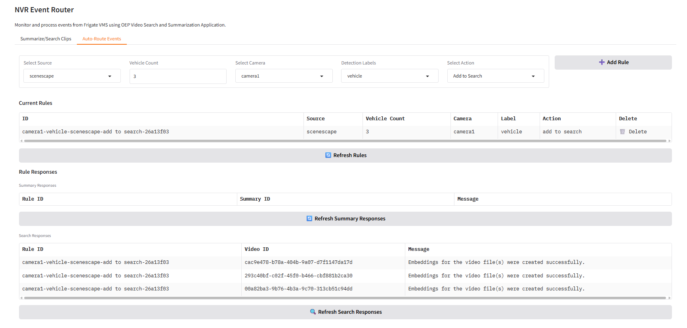
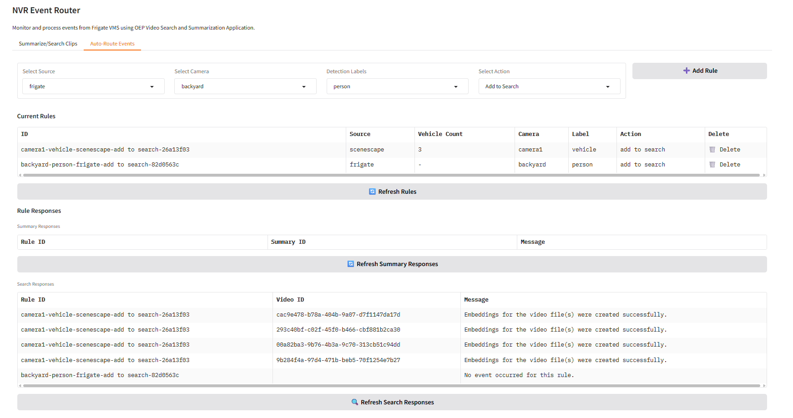
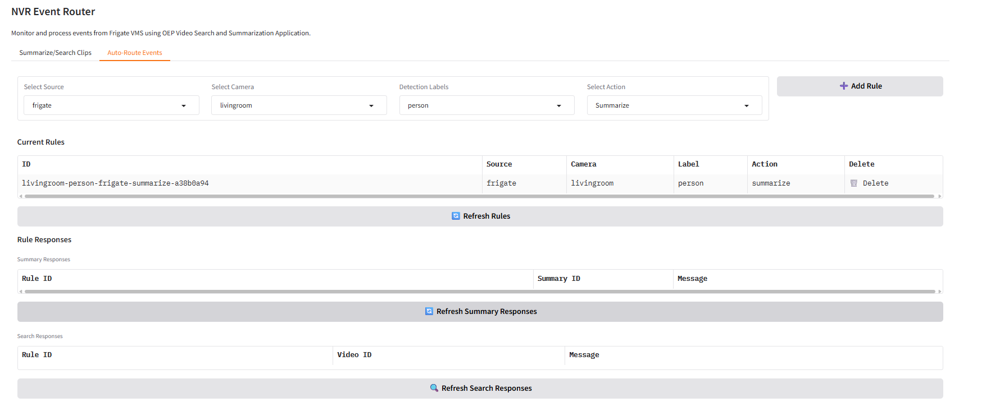

# Scenescape Integration Guide

This guide covers the integration of Intel Scenescape with Smart NVR for enhanced traffic monitoring using live data from smart intersection application.

## Overview

Smart NVR system integrates with Intel Scenescape to enable:
- Real-time vehicle counting and tracking
- Traffic flow analysis
- Automated event routing based on vehicle thresholds
- Enhanced surveillance for smart intersection management

## Prerequisites

- **Smart Intersection Application**: Must be running in `../metro-vision-ai-app-recipe/smart-intersection/` following the [Smart Intersection User Guide](../../../metro-vision-ai-app-recipe/smart-intersection/docs/user-guide/get-started.md)
- Access to Intel Scenescape traffic analytics platform

## Installation and Setup

```bash
# Get MQTT credentials from Smart Intersection
cat ../metro-vision-ai-app-recipe/smart-intersection/src/secrets/browser.auth
# Expected: {"user": "<user>", "password": "<password>"}
```

```bash
# Enable Scenescape Integration
export NVR_SCENESCAPE=true

# MQTT Configuration (from browser.auth JSON)
export SCENESCAPE_MQTT_USER="<user>"
export SCENESCAPE_MQTT_PASSWORD="<password>"
```

### Step 3: Start Smart NVR

```bash
# Start the application 
./setup.sh start

# Or restart with new configuration
./setup.sh restart
```

**Note:** The setup script automatically copies Scenescape certificates from Smart Intersection if available. If certificates are missing, setup will fail with an error message.

### Step 4: Verify Integration

Check logs to confirm Scenescape connection:

```bash
docker logs nvr-event-router -f
# Look for: "Scenescape MQTT client started"
```

## User Interface Changes

### With Scenescape Enabled and Scenescape Source Selected



When Scenescape is enabled (`NVR_SCENESCAPE=true`) and scenescape source is selected:
- Source dropdown shows both **"frigate"** and **"scenescape"** options
- **Vehicle Count** field becomes visible and editable
- Users can set minimum vehicle threshold for rule triggering (e.g., 5, 10, 15)
- Rules table includes "Vehicle Count" column for tracking thresholds
- Vehicle count validation ensures non-negative integers only

### With Scenescape Enabled but Frigate Source Selected



When Scenescape is enabled but frigate source is selected:
- Source dropdown still shows both **"frigate"** and **"scenescape"** options  
- **Vehicle Count** field is automatically hidden (not applicable for frigate)
- Standard frigate rule configuration with detection labels
- Rules table shows "Vehicle Count" column but displays "-" for frigate rules
- Full frigate functionality remains available

### With Scenescape Completely Disabled (`NVR_SCENESCAPE=false`)



When Scenescape is disabled in environment variables:
- Source dropdown shows **only** "frigate" option
- Vehicle Count field is never visible
- Rules table **excludes** the "Vehicle Count" column entirely  
- Pure frigate-only functionality and interface
- Scenescape MQTT client will not start

## Auto-Route Events Configuration

### Creating Rules

**Steps (both sources):**
1. Navigate to **Auto-Route Events** tab
2. **Select Source:** "scenescape" or "frigate"
3. **Set Vehicle Count:** (Scenescape only) Define minimum threshold (e.g., 5)
4. **Select Camera:** Choose target camera 
5. **Choose Detection Label:** Select object type
6. **Select Action:** "Summarize" or "Add to Search"
7. **Click Add Rule**

**Key Differences:**
- **Scenescape:** Vehicle Count field visible when selected
- **Frigate:** Vehicle Count field hidden

### Rule Behavior Examples

**Scenescape Rule Example:**
```
Source: scenescape
Camera: camera1
Vehicle Count: 5
Label: vehicle
Action: Summarize
```
*Triggers video summarization when 5+ vehicles detected in backyard camera*

**Frigate Rule Example:**
```
Source: frigate
Camera: livingroom
Label: person
Action: Add to Search  
```
*Adds person detection events to search index for livingroom camera*

## Troubleshooting

### Common Issues

**Scenescape features not visible:**
```bash
# Check and set environment variable
echo $NVR_SCENESCAPE  # Should show 'true'
export NVR_SCENESCAPE=true
./setup.sh restart
# Refresh browser (Ctrl+F5)
```

**No scenescape events received:**
```bash
# Check MQTT connection
docker logs nvr-event-router | grep -i scenescape
```

### Debug Commands

```bash
# Check environment variables
env | grep NVR_SCENESCAPE
env | grep SCENESCAPE

# Monitor MQTT messages
docker logs nvr-event-router -f | grep "scenescape"

# Check UI logs
docker logs nvr-event-router-ui -f

# Verify Scenescape MQTT connection
docker logs nvr-event-router | grep "Scenescape MQTT client"
```

## Support

For Scenescape integration issues:
1. **Certificate Error**: Ensure Smart Intersection application is running and has generated certificates
2. **Environment Variables**: Verify `NVR_SCENESCAPE=true` and MQTT credentials are set  
3. **MQTT Connection**: Check logs for "Scenescape MQTT client started" message
4. **Smart Intersection**: Confirm Smart Intersection application is accessible at expected path
5. Review logs using debug commands above and contact support with relevant excerpts

For general Smart NVR issues, see the [main documentation](get-started.md).

---

*Last updated: October 2025*
