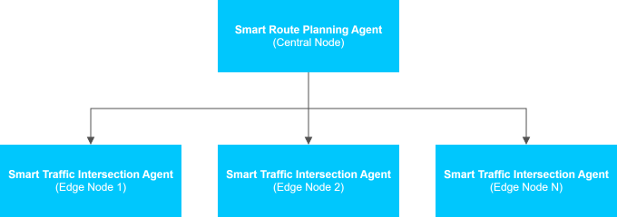

# Get Started

## Prerequisites

- **System requirements**: Verify that your system meets the [minimum requirements](./get-started/system-requirements.md).

- **Docker platform**: Install Docker platform. For installation instructions, see [Get Docker](https://docs.docker.com/get-docker/).

- You are familiar with Docker commands and using the terminal. If you are new to Docker
platform, see [Docker Documentation](https://docs.docker.com/) for an introduction.

## Quick Start with Setup Script

Intel recommends using the unified setup script `setup.sh` that configures, builds, deploys,
and manages the Smart Route Planning Agent.

1. Clone the suite:

   Go to the target directory of your choice and clone the suite.
   If you want to clone a specific release branch, replace `main` with the desired tag.
   To learn more on partial cloning, check the [Repository Cloning guide](https://docs.openedgeplatform.intel.com/dev/OEP-articles/contribution-guide.html#repository-cloning-partial-cloning).

   ```bash
   git clone --filter=blob:none --sparse --branch main https://github.com/open-edge-platform/edge-ai-suites.git
   cd edge-ai-suites
   git sparse-checkout set metro-ai-suite
   cd metro-ai-suite/smart-route-planning-agent
   ```

2. Run the complete setup:

   The setup script provides several options. For a complete setup (recommended for first-time
   users):

   ```bash
   source setup.sh --setup
   ```

   > **Note**: By default the agent uses rule based route planning. To enable AI reasoning
   > based route planning, export `REASONING_MODEL_NAME` **before** running the command
   > above. See [AI Reasoning for Route Planning](#enable-ai-reasoning-for-route-planning).

## Enable AI reasoning for Route Planning

Export the variable, then deploy as usual:

```bash
export REASONING_MODEL_NAME=<model_name>    # Recommended model: OpenVINO/Qwen2.5-1.5B-Instruct-int4-ov
source setup.sh --setup
```

To go back to rule based planning, unset the variable and redeploy:

```bash
unset REASONING_MODEL_NAME
source setup.sh --restart
```

> **Note**: The first deployment in AI reasoning mode, downloads and converts the model, which can take several minutes
> depending on your network. The model is cached in a Docker volume, so later restarts are
> fast. Set `HF_TOKEN` as well if the model repository is gated.

### Alternative setup options

   For a more granular control, use the following commands.

   ```bash
   # Build service images only (without starting containers)
   source setup.sh --build

   # Start services only (no builds)
   source setup.sh --run

   # Stop services
   source setup.sh --stop

   # Restart services
   source setup.sh --restart

   # Clean up containers, volumes, images, networks, and all related resources
   source setup.sh --clean
   ```


### Supported models

The following models were measured on a general purpose x86 CPU:

| Model | Precision | Suitability |
| --- | --- | --- | --- |
| `OpenVINO/Qwen2.5-1.5B-Instruct-int4-ov` | INT4 | **Recommended and verified.** Comfortably within budget, and it supports schema constrained output. |
| `OpenVINO/Qwen2.5-1.5B-Instruct-int8-ov` | INT8 | It supports schema constrained output. Requires comparatively more storage and inference time. |


On slower hardware prefer a smaller INT4 model.

> **Note**: Before adopting a model that is not listed above (which is strictly not recommended), deploy it and confirm that the
> map updates without the fallback notice. If the OVMS container restarts repeatedly, the model
> is most likely not compatible and another model needs to be chosen.

### Fallback behaviour

The agent automatically falls back to rule based planning for that update, whenever:

- the model server is unreachable, still loading, or times out,
- the model could not make a decision
- the model hullucinates (For example, names a route that does not exist or has no live traffic data.)

## Manual Setup for Advanced Users

For advanced users who need more control over the configuration, you can set up the stack
manually using Docker Compose tool.

### Manual Environment Configuration

If you prefer to configure environment variables manually instead of using the setup script,
see the [Environment Variables Guide](./get-started/environment-variables.md) for details.

### Manual Docker Compose Tool Deployment

See [Build from Source](./get-started/build-from-source.md) for instructions on building and
running with the Docker Compose tool.

### Helm Deployment

See [Deploy with Helm](./get-started/deploy-with-helm.md) for a simple Kubernetes deployment flow.

## Multi-Node Deployment

The Smart Route Planning Agent works in a multi-node setup with one central Route Planning
Agent and multiple Smart Traffic Intersection Agent edge nodes.

### Architecture Overview



### Multi-Node Deployment Prerequisites

1. Deploy the [Smart Traffic Intersection Agent](https://docs.openedgeplatform.intel.com/dev/edge-ai-suites/smart-traffic-intersection-agent/get-started.html#quick-start-with-setup-script) on each edge node.
2. Ensure network connectivity between the central node and edge nodes.
3. Note the IP address and port of each Smart Traffic Intersection Agent.

### Configure Edge Node Endpoints

Edit `src/data/config.json` to add the IP addresses and ports of the edge nodes where Smart Traffic Intersection Agents are running.

#### Example Configuration

```json
{
    "api_endpoint": "/api/v1/traffic/current/ws?images=false",
    "api_hosts": [
        {
            "host": "ws://<node-1-ip>:<port>"
        },
        {
            "host": "ws://<node-2-ip>:<port>"
        },
        {
            "host": "ws://<node-3-ip>:<port>"
        }
    ]
}
```

> **NOTE :** We can add `api_hosts` for even just one instance, however minimum three instances of Smart Traffic Intersection Agent is recommended for proper route planning in the application.

### Deploy the Route Planning Agent

After configuring the edge node endpoints, deploy the Smart Route Planning Agent on the
central node:

```bash
source setup.sh --setup
```

The Route Planning Agent will query all configured Smart Traffic Intersection Agents to gather
live traffic data for route optimization.

<!--hide_directive
:::{toctree}
:hidden:

get-started/system-requirements
get-started/build-from-source
get-started/environment-variables
get-started/deploy-with-helm

:::
hide_directive-->
