# GMSL Sensor Guide

GMSL (Gigabit Multimedia Serial Link) is a high-speed serial interface designed for transmitting uncompressed video, audio, and control data over long distances. It is commonly used in automotive applications for connecting cameras and other multimedia devices to the central processing unit.

GMSL supports data rates of up to 6 Gbps, allowing for high-resolution video transmission with low latency. It uses a differential signaling method to ensure signal integrity and reduce electromagnetic interference (EMI). GMSL also includes features such as error correction and power management to enhance reliability and efficiency.

In the context of robotics and autonomous mobile robots, GMSL sensors are often used for vision-based applications, such as object detection, lane keeping, and obstacle avoidance. These sensors can provide high-quality video feeds that are essential for the perception systems of autonomous vehicles.

When integrating GMSL sensors into a robotics system, it is important to consider factors such as compatibility with the processing unit, power requirements, and the physical layout of the system. Proper configuration and calibration of GMSL sensors are also crucial to ensure optimal performance and accurate data capture.

Intel® GMSL cameras use the Image Processor Unit (IPU) to process the video data captured by the camera. The IPU is responsible for tasks such as image enhancement, noise reduction, and color correction, which are essential for improving the quality of the video feed before it is used for further processing in the autonomous mobile robot's perception system.

It is crucial to understand the SerDes I2C connectivity specific to each ODM/OEM motherboard, Add-in-Card (AIC), and GMSL2 camera module. Illustrated below are the details a user needs to learn about I2C communication between a BDF (Bit-Definition File) Linux I2C adapter and GMSL2 I2C devices for Intel® Core™ Ultra Series 1 and 2 (Arrow Lake-U/H) and 12th/13th/14th Gen Intel® Core™ platforms to detect and configure GMSL capability. See [SerDes I2C mapping](#how-to-detect-in-i2c-bus-to-gmsl2-deserializer-and-serializer-acpi-devices-mapping) for more details.

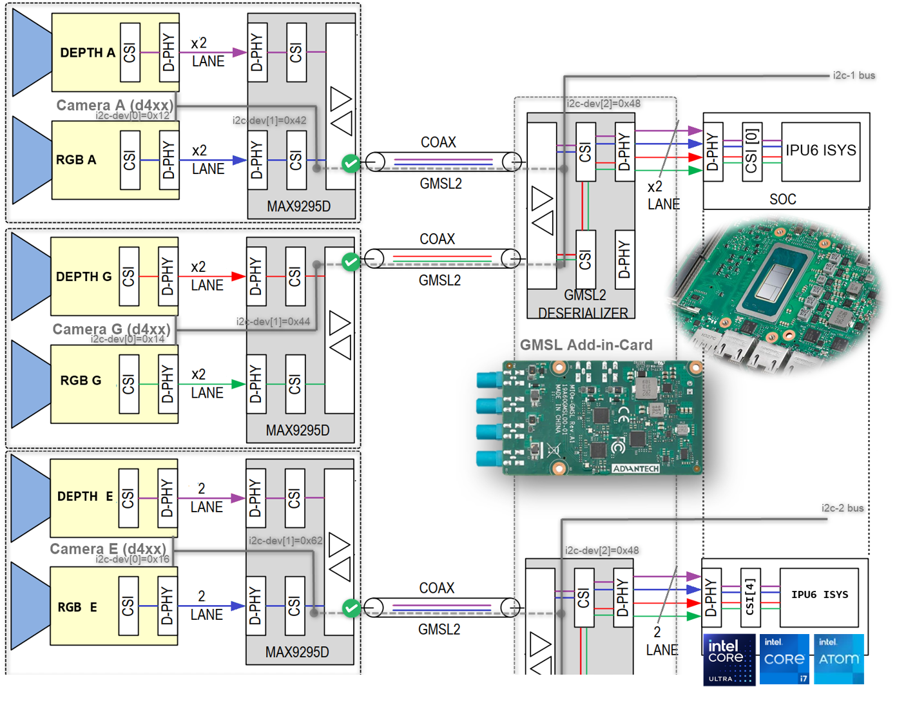

## Brief GMSL Add-in-Card Design Overview

A GMSL product design based on Intel® Core™ Ultra Series 1 and 2 (Arrow Lake-U/H) or 12th/13th/14th Gen Intel® Core™ products can be illustrated as follows:

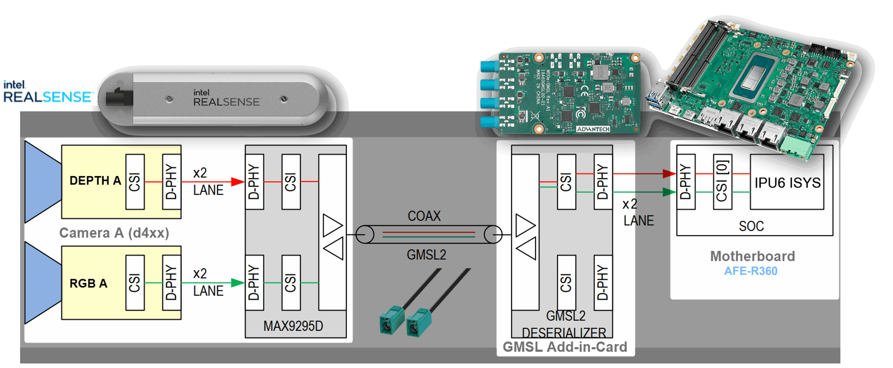

- The **GMSL2 camera modules**, designed by third-party GMSL2 camera vendors, combine a camera sensor and GMSL2 serializer, for example `MAX9295`.
- The **Add-in-Card (AIC)**, designed by either ODM/OEMs or third-party GMSL2 camera vendors, provides multiple GMSL2 _deserializers_, for example `MAX9296A`.
- The **Intel®-based motherboard**, designed by ODM/OEMs, provides the Mobile Industry Processor Interface (MIPI) Camera Serial Interface (CSI) exposed by Intel® Core™ Ultra Series 1 and 2 (Arrow Lake-U/H) and 12th/13th/14th Gen Intel® Core™ products.

There are two design approaches for GMSL Add-in-Card (AIC):

- **Standalone-mode** `SerDes`: A single GMSL serializer, for example `MAX9295`, and camera sensor devices per deserializer, for example `MAX9296A`. One example is the [Axiomtek ROBOX500 4x GMSL camera interfaces](https://www.axiomtek.com/ROBOX500/) Add-in-Card (AIC).

  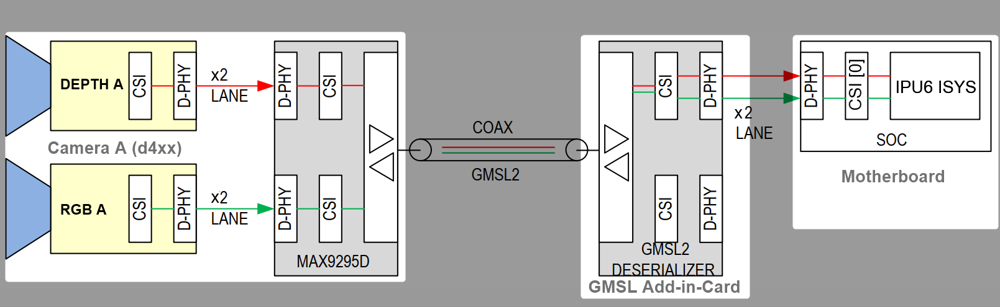

- **Aggregated-link** `SerDes`: Dual GMSL serializers, for example `MAX9295`, and camera sensor devices per deserializer, for example `MAX9296A`. Examples include the [Axiomtek ROBOX500 8x GMSL camera interfaces](https://www.axiomtek.com/ROBOX500/), the [Advantech GMSL Input Module Card](https://www.advantech.com/en-eu/products/8d5aadd0-1ef5-4704-a9a1-504718fb3b41/mioe-gmsl/mod_fc1fc070-30f8-40c1-881f-56c967e26924) for [AFE-R360 series](https://www.advantech.com/en-eu/products/8d5aadd0-1ef5-4704-a9a1-504718fb3b41/afe-r360/mod_1e4a1980-9a31-46e6-87b6-affbd7a2cb44) or [ASR-A502 series](https://www.advantech.com/en-eu/products/8d5aadd0-1ef5-4704-a9a1-504718fb3b41/asr-a502/mod_ccca0f36-a50b-40c7-87b7-10fb96448605), and the [SEAVO Embedded Computer HB03](https://www.seavo.com/en/products/products-info_itemid_693.html) Add-in-Cards (AIC).

  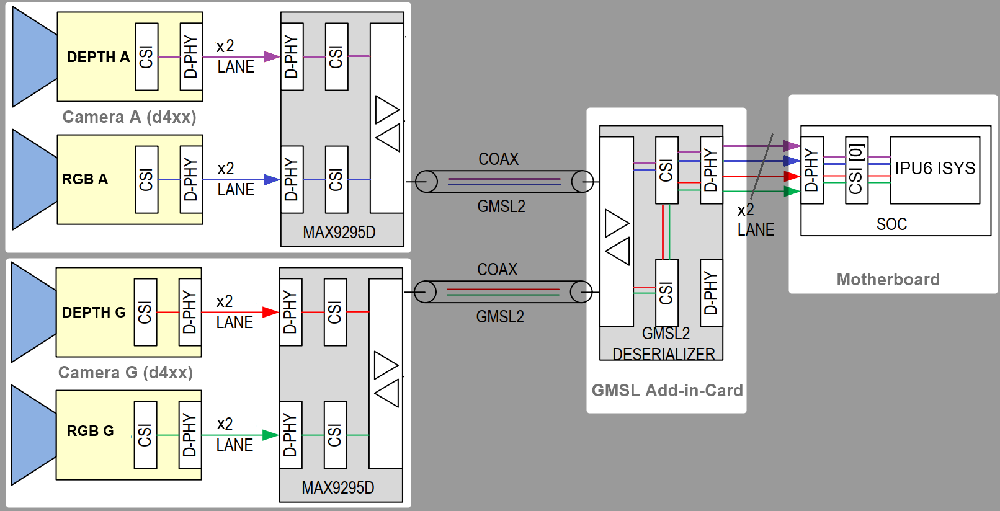

It is crucial to understand the `SerDes` I2C connectivity specific to each ODM/OEM motherboard, Add-in-Card (AIC), and GMSL2 camera module. Illustrated below are all details a user needs to learn about I2C communication between a BDF (Bit-Definition File) Linux I2C adapter and GMSL2 I2C devices for Intel® Core™ Ultra Series 1 and 2 (Arrow Lake-U/H) and 12th/13th/14th Gen Intel® Core™ platforms to detect and configure GMSL capability. See [SerDes I2C mapping](#how-to-detect-in-i2c-bus-to-gmsl2-deserializer-and-serializer-acpi-devices-mapping) for further details.


More details are available in the [Mobile Industry Processor Interface (MIPI) Camera Serial Interface (CSI) Gigabit Multimedia Serial Link (GMSL) Add-in Card (AIC) Schematic](https://cdrdv2.intel.com/v1/dl/getContent/814789?explicitVersion=true).

### How To Detect in I2C Bus to GMSL2 _Deserializer_ and _Serializer_ ACPI Devices Mapping

The best way to detect I2C bus to GMSL2 _Deserializer_ and _Serializer_ ACPI devices mapping is by using the `i2cdetect` command-line tool from the `i2c-tools` package on Linux.

```bash
i2cdetect -y <i2c_bus_number>
```

Here, `<i2c_bus_number>` is the I2C bus number assigned to GMSL2 _Deserializer_ and _Serializer_ ACPI devices.

Below is an example output from `i2cdetect` for GMSL2 _Deserializer_ and _Serializer_ ACPI devices mapping:

```console
i2cdetect -r -y 0 0x20 0x6f
       0  1  2  3  4  5  6  7  8  9  a  b  c  d  e  f
  00:
  10:             -- -- -- -- -- -- 1a -- -- -- -- --
  20: -- -- -- -- -- -- -- 27 -- -- -- -- -- -- -- --
  30: -- -- -- -- -- -- -- -- -- -- -- -- -- -- -- --
  40: 40 -- -- -- -- -- -- -- -- -- -- -- -- -- -- --
  50: -- -- -- -- 54 -- -- -- -- -- -- -- 5c -- -- --
  60: -- -- -- -- -- -- -- -- -- -- -- -- -- -- -- --
  70:
```

```console
i2cdetect -r -y 1 0x20 0x6f
      0  1  2  3  4  5  6  7  8  9  a  b  c  d  e  f
  00:
  10:             -- -- -- -- -- -- -- -- -- -- -- --
  20: -- -- -- -- -- -- -- -- -- -- -- -- -- -- -- --
  30: -- -- -- -- -- -- -- -- -- -- -- -- -- -- -- --
  40: -- -- -- -- -- -- -- -- -- -- -- -- -- -- -- --
  50: -- -- -- -- -- -- -- -- -- -- -- -- -- -- -- --
  60: -- -- -- -- -- -- -- -- -- -- -- -- -- -- -- --
  70:
```

As you can see, the sample devices are on I2C bus `0` at addresses `0x1a`, `0x27`, `0x40`, and `0x54`, corresponding to the GMSL2 _Deserializer_ and _Serializer_ ACPI devices configured on the system.

### GMSL2 Driver

Prerequisites for the GMSL driver can be found in the ECI APT repository.

Follow the [Set up ECI APT Repository](https://eci.intel.com/docs/3.3/getstarted/download_eci.html#setupecirepo) guide first.

Once the ECI APT repository is set up, install the GMSL driver with:

```bash
sudo apt-get update
sudo apt-get install intel-mipi-gmsl-dkms
```

Select the `max929x` or `max967xx` deserializer to compile the required Linux V4L2 I2C sensor driver.

Reboot the system and enter BIOS/UEFI settings. Navigate to the ACPI configuration section and verify that the GMSL SerDes device is listed and enabled. If it is not present, update the system firmware or consult the hardware vendor.

Go into UEFI Advanced settings.

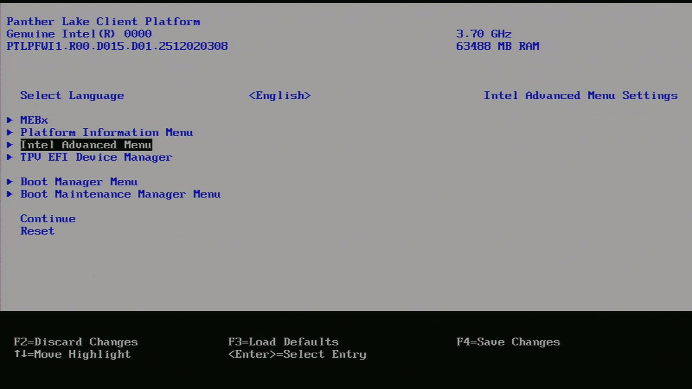

Navigate to System Agent (SA).

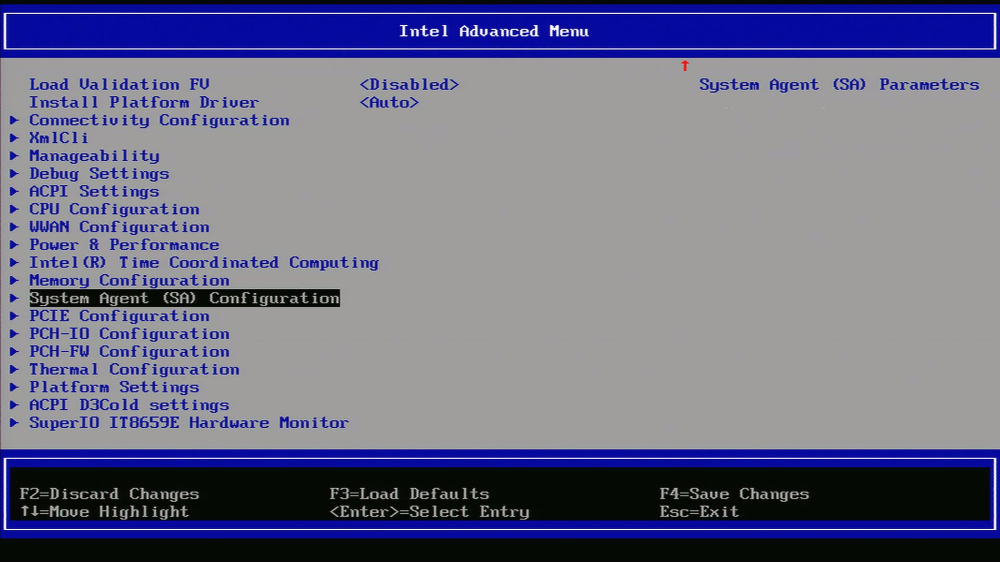

Navigate to MIPI Configuration.

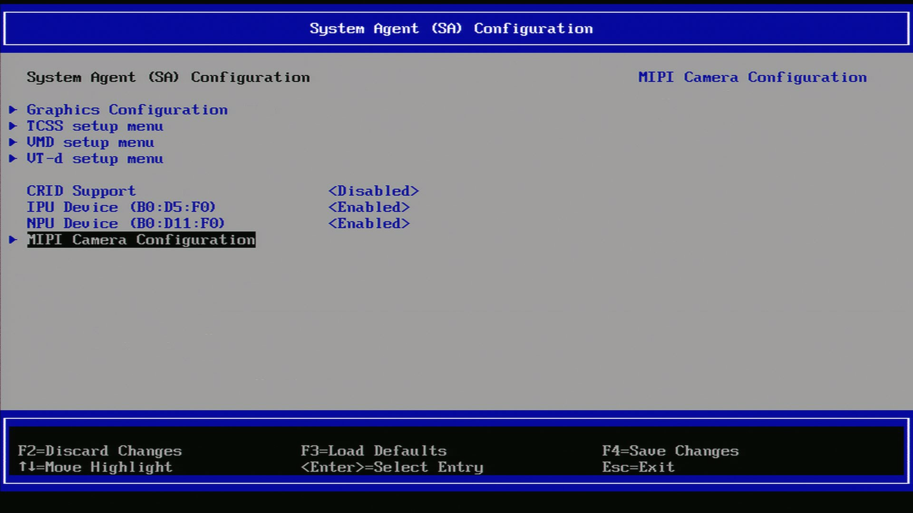

Ensure GMSL SerDes is enabled.

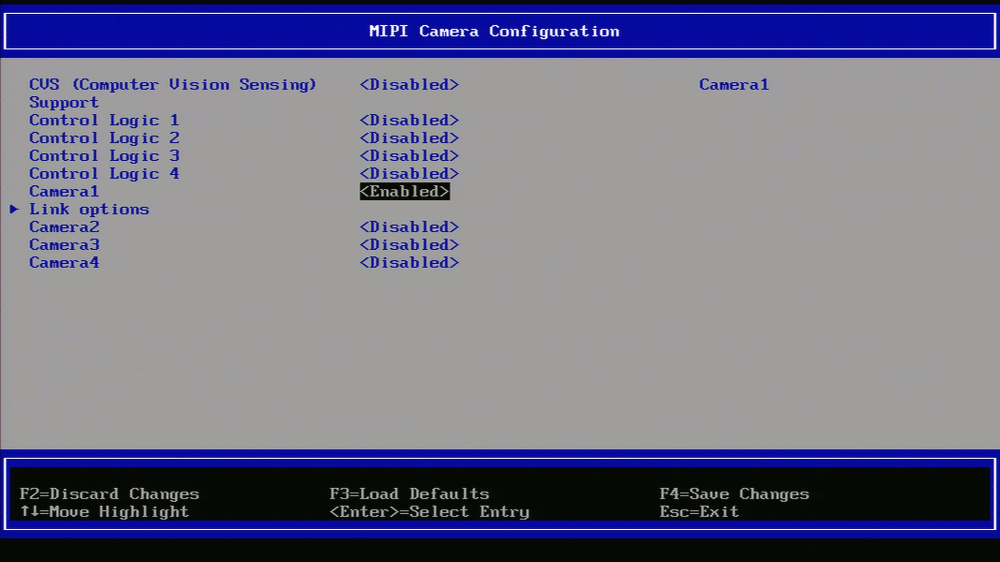

After enabling the GMSL SerDes device in UEFI, click `link options` to adjust the settings for the GMSL SerDes link.

Boot the system into the OS.

## Configure Intel® GMSL `SerDes` ACPI Devices

To enable multiple GMSL cameras, for the same or different vendors, define the MIPI camera ACPI device in UEFI/BIOS settings.

1. Review Intel®-enabled GMSL2 camera modules with their corresponding ACPI device custom HIDs:

   | ACPI custom HID | Camera module label | Sensor type         | GMSL2 serializer | Max resolution | Vendor URL                                                                             |
   | --------------- | ------------------- | ------------------- | ---------------- | -------------- | -------------------------------------------------------------------------------------- |
   | `INTC10CD`      | `d4xx`              | OV9782 + D450 Depth | MAX9295          | 2x (1280x720)  | [Intel® RealSense Depth Camera D457](https://realsenseai.com/products/d457-gmsl-fakra) |
   | `D3000004`      | `D3CMCXXX-115-084`  | ISX031              | MAX9295          | 1920x1536      | [D3 Embedded](https://www.d3embedded.com/)                                             |
   | `D3000005`      | `D3CMCXXX-106-084`  | IMX390              | MAX9295          | 1920x1080      | sensor Linux drivers package available upon `sales@d3embedded.com` camera purchase     |
   | `D3000006`      | `D3CMCXXX-089-084`  | AR0234              | MAX9295          | 1280x960       |                                                                                        |
   | `OTOC1031`      | `otocam`            | ISX031              | MAX9295          | 1920x1536      | [oToBrite](https://www.otobrite.com/)                                                  |
   | `OTOC1021`      | `otocam`            | ISX021              | MAX9295          | 1920x1280      | sensor Linux drivers package available upon `sales@otobrite.com` camera purchase       |

2. Review the [Brief GMSL Add-in-Card Design Overview](#brief-gmsl-add-in-card-design-overview), if not already done.

Refer to each tab below to understand the distinct ACPI camera device configuration tables for ODM hardware.

<!--hide_directive
::::{tab-set} hide_directive-->
<!--hide_directive :::{tab-item} hide_directive--> **Advantech AFE-R360 & ASR-A502 series**

The [Advantech GMSL Input Module Card](https://www.advantech.com/en-eu/products/8d5aadd0-1ef5-4704-a9a1-504718fb3b41/mioe-gmsl/mod_fc1fc070-30f8-40c1-881f-56c967e26924) for [AFE-R360 series](https://www.advantech.com/en-eu/products/8d5aadd0-1ef5-4704-a9a1-504718fb3b41/afe-r360/mod_1e4a1980-9a31-46e6-87b6-affbd7a2cb44) and [ASR-A502 series](https://www.advantech.com/en-eu/products/8d5aadd0-1ef5-4704-a9a1-504718fb3b41/asr-a502/mod_ccca0f36-a50b-40c7-87b7-10fb96448605) may provide up to 6x GMSL camera interfaces (FAKRA universal type).

<!--hide_directive
::::{tab-set} hide_directive-->
<!--hide_directive :::{tab-item} hide_directive--> **RealSense D457**

Below is an ACPI device configuration example for the GMSL2 Intel® RealSense Depth Camera D457:

_**Aggregated-link** `SerDes` CSI-2 port 0 and 4 and I2C settings for GMSL Add-in-Card (AIC)_

| UEFI Custom Sensor  | Camera 1   | Camera 2   | Camera 3   | Camera 4   |
| ------------------- | ---------- | ---------- | ---------- | ---------- |
| GMSL Camera suffix  | a          | g          | e          | k          |
| Custom HID          | `INTC10CD` | `INTC10CD` | `INTC10CD` | `INTC10CD` |
| PPR Value           | 2          | 2          | 2          | 2          |
| PPR Unit            | 1          | 1          | 1          | 1          |
| Camera module label | `d4xx`     | `d4xx`     | `d4xx`     | `d4xx`     |
| MIPI Port (Index)   | 0          | 0          | 4          | 4          |
| LaneUsed            | x2         | x2         | x2         | x2         |
| Number of I2C       | 3          | 3          | 3          | 3          |
| I2C Channel         | I2C1       | I2C1       | I2C2       | I2C2       |
| Device0 I2C Address | 12         | 14         | 12         | 14         |
| Device1 I2C Address | 42         | 44         | 42         | 44         |
| Device2 I2C Address | 48         | 48         | 48         | 48         |

<!--hide_directive :::
:::{tab-item}hide_directive--> **D3CMCXXX-115-084**

Below is an ACPI device configuration example for the [D3 Embedded Discovery](https://www.d3embedded.com/product/isx031-smart-camera-narrow-fov-gmsl2-unsealed/) GMSL2 camera module:

_**Aggregated-link** `SerDes` CSI-2 port 0 and 4 and I2C settings for GMSL Add-in-Card (AIC)_

| UEFI Custom Sensor  | Camera 1           | Camera 2           |
| ------------------- | ------------------ | ------------------ |
| GMSL Camera suffix  | a                  | e                  |
| Custom HID          | `D3000004`         | `D3000004`         |
| PPR Value           | 2                  | 2                  |
| PPR Unit            | 2                  | 2                  |
| Camera module label | `D3CMCXXX-115-084` | `D3CMCXXX-115-084` |
| MIPI Port (Index)   | 0                  | 4                  |
| LaneUsed            | x2                 | x2                 |
| Number of I2C       | 3                  | 3                  |
| I2C Channel         | I2C1               | I2C2               |
| Device0 I2C Address | 48                 | 48                 |
| Device1 I2C Address | 42                 | 44                 |
| Device2 I2C Address | 10                 | 12                 |

> **Note:** on Advantech AFE-R360 series the four D3CMCXXX ACPI configurations achieved by `PPR Unit=2` also require setting `Device0` for the GMSL2 **aggregated-link** deserializer I2C address, for example `MAX9296A`, and `Device2` for the sensor I2C address, for example `ISX031`.

<!--hide_directive ::: hide_directive-->
<!--hide_directive :::{tab-item} hide_directive--> **D3CMCXXX-106-084**

Below is an ACPI device configuration example for the [D3 Embedded Discovery PRO](https://www.d3embedded.com/product/imx390-medium-fov-gmsl2-sealed/) GMSL2 camera module:

_**Aggregated-link** `SerDes` CSI-2 port 0 and 4 and I2C settings for GMSL Add-in-Card (AIC)_

| UEFI Custom Sensor  | Camera 1           | Camera 2           |
| ------------------- | ------------------ | ------------------ |
| GMSL Camera suffix  | a                  | e                  |
| Custom HID          | `D3000005`         | `D3000005`         |
| PPR Value           | 2                  | 2                  |
| PPR Unit            | 2                  | 2                  |
| Camera module label | `D3CMCXXX-106-084` | `D3CMCXXX-106-084` |
| MIPI Port (Index)   | 0                  | 4                  |
| LaneUsed            | x2                 | x2                 |
| Number of I2C       | 3                  | 3                  |
| I2C Channel         | I2C1               | I2C2               |
| Device0 I2C Address | 48                 | 48                 |
| Device1 I2C Address | 42                 | 44                 |
| Device2 I2C Address | 10                 | 12                 |

> **Note:** on Advantech AFE-R360 series the four D3CMCXXX ACPI configurations achieved by `PPR Unit=2` also require setting `Device0` for the GMSL2 **aggregated-link** deserializer I2C address, for example `MAX9296A`, and `Device2` for the sensor I2C address, for example `ISX031`.

<!--hide_directive ::: hide_directive-->
<!--hide_directive :::{tab-item} hide_directive--> **oToCAM222**

Below is an ACPI device configuration example for [oToBrite oToCAM222](https://www.otobrite.com/product/automotive-camera/isx021_gmsl2_otocam222-s195m) GMSL2 camera modules:

_**Aggregated-link** `SerDes` CSI-2 port 0 and 4 and I2C settings for GMSL Add-in-Card (AIC)_

| UEFI Custom Sensor  | Camera 1   | Camera 2   | Camera 3   | Camera 4   |
| ------------------- | ---------- | ---------- | ---------- | ---------- |
| GMSL Camera suffix  | a          | g          | e          | k          |
| Custom HID          | `OTOC1021` | `OTOC1021` | `OTOC1021` | `OTOC1021` |
| PPR Value           | 2          | 2          | 2          | 2          |
| PPR Unit            | 1          | 1          | 1          | 1          |
| Camera module label | `otocam`   | `otocam`   | `otocam`   | `otocam`   |
| MIPI Port (Index)   | 0          | 0          | 4          | 4          |
| LaneUsed            | x2         | x2         | x2         | x2         |
| Number of I2C       | 3          | 3          | 3          | 3          |
| I2C Channel         | I2C1       | I2C1       | I2C2       | I2C2       |
| Device0 I2C Address | 10         | 11         | 10         | 11         |
| Device1 I2C Address | 18         | 19         | 18         | 19         |
| Device2 I2C Address | 48         | 48         | 48         | 48         |

<!--hide_directive ::: hide_directive-->
<!--hide_directive :::{tab-item} hide_directive--> **oToCAM223**

Below is an ACPI device configuration example for [oToBrite oToCAM223](https://www.otobrite.com/product/automotive-camera/isx031_gmsl2_otocam223-s195m) GMSL2 camera modules:

_**Aggregated-link** `SerDes` CSI-2 port 0 and 4 and I2C settings for GMSL Add-in-Card (AIC)_

| UEFI Custom Sensor  | Camera 1   | Camera 2   | Camera 3   | Camera 4   |
| ------------------- | ---------- | ---------- | ---------- | ---------- |
| GMSL Camera suffix  | a          | g          | e          | k          |
| Custom HID          | `OTOC1031` | `OTOC1031` | `OTOC1031` | `OTOC1031` |
| PPR Value           | 2          | 2          | 2          | 2          |
| PPR Unit            | 1          | 1          | 1          | 1          |
| Camera module label | `otocam`   | `otocam`   | `otocam`   | `otocam`   |
| MIPI Port (Index)   | 0          | 0          | 4          | 4          |
| LaneUsed            | x2         | x2         | x2         | x2         |
| Number of I2C       | 3          | 3          | 3          | 3          |
| I2C Channel         | I2C1       | I2C1       | I2C2       | I2C2       |
| Device0 I2C Address | 10         | 11         | 10         | 11         |
| Device1 I2C Address | 18         | 19         | 18         | 19         |
| Device2 I2C Address | 48         | 48         | 48         | 48         |

<!--hide_directive ::: hide_directive-->
<!--hide_directive :::: hide_directive-->

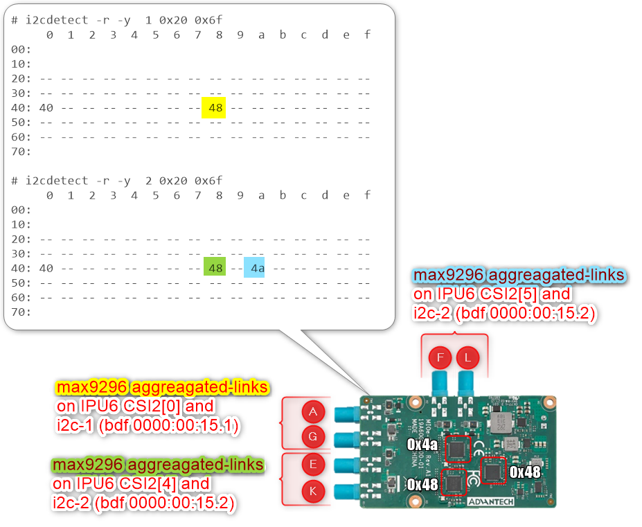

Another example below illustrates how to configure ACPI devices for 6x Intel® RealSense Depth Camera D457 GMSL2 modules:

_**Aggregated-link** `SerDes` CSI-2 port 0, 4 and 5 and I2C settings for GMSL Add-in-Card (AIC)_

| UEFI Custom Sensor  | Camera 1   | Camera 2   | Camera 3   | Camera 4   | Camera 5 or N/A | Camera 6 or N/A |
| ------------------- | ---------- | ---------- | ---------- | ---------- | --------------- | --------------- |
| GMSL Camera suffix  | a          | g          | e          | f          | _k_             | _l_             |
| Custom HID          | `INTC10CD` | `INTC10CD` | `INTC10CD` | `INTC10CD` | `INTC10CD`      | `INTC10CD`      |
| PPR Value           | 2          | 2          | 2          | 2          | 2               | 2               |
| PPR Unit            | 1          | 1          | 1          | 1          | 1               | 1               |
| Camera module label | `d4xx`     | `d4xx`     | `d4xx`     | `d4xx`     | `d4xx`          | `d4xx`          |
| MIPI Port (Index)   | 0          | 0          | 4          | 5          | 4               | 5               |
| LaneUsed            | x2         | x2         | x2         | x2         | x2              | x2              |
| Number of I2C       | 3          | 3          | 3          | 3          | 3               | 3               |
| I2C Channel         | I2C1       | I2C1       | I2C2       | I2C2       | _I2C2_          | _I2C2_          |
| Device0 I2C Address | 12         | 14         | 16         | 18         | _12_            | _14_            |
| Device1 I2C Address | 42         | 44         | 62         | 42         | _64_            | _44_            |
| Device2 I2C Address | 48         | 48         | 48         | 4a         | _48_            | _4a_            |

> **Attention:** For the time being, each GMSL2 **aggregated-link** deserializer, for example `MAX9296A`, on the same I2C channel must set an identical _Custom HID_ and _Camera module label_ tuple matching the GMSL2 serializer and camera sensor device type.
>
> For the [Advantech GMSL Input Module Card](https://www.advantech.com/en-eu/products/8d5aadd0-1ef5-4704-a9a1-504718fb3b41/mioe-gmsl/mod_fc1fc070-30f8-40c1-881f-56c967e26924) for [AFE-R360 series](https://www.advantech.com/en-eu/products/8d5aadd0-1ef5-4704-a9a1-504718fb3b41/afe-r360/mod_1e4a1980-9a31-46e6-87b6-affbd7a2cb44), the I2C1-channel **aggregated-link** deserializer at I2C device `0x48` can set the _Custom HID_, for example `INTC10CD`, and _Camera module label_, for example `d4xx`, tuple for both GMSL camera suffixes `a` and `g`, while the other **aggregated-link** deserializer at I2C device `0x4a` can use a different _Custom HID_, for example `INTC1031`, and _Camera module label_, for example `isx031`, tuple on GMSL camera suffixes `e` and `k`.

<!--hide_directive ::: hide_directive-->
<!--hide_directive :::{tab-item} hide_directive--> **SEAVO HB03**

The [SEAVO Embedded Computer HB03](https://www.seavo.com/en/products/products-info_itemid_693.html) UEFI BIOS `Version: S1132C1133A11` allows an admin user to configure up to 4x GMSL2 camera interfaces (FAKRA universal type).

<!--hide_directive
::::{tab-set} hide_directive-->
<!--hide_directive :::{tab-item} hide_directive--> **RealSense D457**

Below is an ACPI device configuration example for the GMSL2 Intel® RealSense Depth Camera D457:

_**Aggregated-link** `SerDes` CSI-2 port 0 and 4 and I2C settings for GMSL Add-in-Card (AIC)_

| UEFI Custom Sensor  | Camera 1   | Camera 2   | Camera 3   | Camera 4   |
| ------------------- | ---------- | ---------- | ---------- | ---------- |
| GMSL Camera suffix  | a          | g          | e          | k          |
| Custom HID          | `INTC10CD` | `INTC10CD` | `INTC10CD` | `INTC10CD` |
| PPR Value           | 2          | 2          | 2          | 2          |
| PPR Unit            | 1          | 1          | 1          | 1          |
| Camera module label | `d4xx`     | `d4xx`     | `d4xx`     | `d4xx`     |
| MIPI Port (Index)   | 0          | 0          | 4          | 4          |
| LaneUsed            | x4         | x4         | x4         | x4         |
| Number of I2C       | 3          | 3          | 3          | 3          |
| I2C Channel         | I2C1       | I2C1       | I2C0       | I2C0       |
| Device0 I2C Address | 12         | 14         | 12         | 14         |
| Device1 I2C Address | 42         | 44         | 42         | 44         |
| Device2 I2C Address | 48         | 48         | 48         | 48         |

<!--hide_directive ::: hide_directive-->
<!--hide_directive :::{tab-item} hide_directive--> **D3CMCXXX-115-084**

Below is an ACPI device configuration example for the [D3 Embedded Discovery](https://www.d3embedded.com/product/isx031-smart-camera-narrow-fov-gmsl2-unsealed/) GMSL2 camera module:

_**Aggregated-link** `SerDes` CSI-2 port 0 and 4 and I2C settings for GMSL Add-in-Card (AIC)_

| UEFI Custom Sensor  | Camera 1           | Camera 2           |
| ------------------- | ------------------ | ------------------ |
| GMSL Camera suffix  | a                  | e                  |
| Custom HID          | `D3000004`         | `D3000004`         |
| PPR Value           | 2                  | 2                  |
| PPR Unit            | 2                  | 2                  |
| Camera module label | `D3CMCXXX-115-084` | `D3CMCXXX-115-084` |
| MIPI Port (Index)   | 0                  | 4                  |
| LaneUsed            | x4                 | x4                 |
| Number of I2C       | 3                  | 3                  |
| I2C Channel         | I2C1               | I2C0               |
| Device0 I2C Address | 48                 | 48                 |
| Device1 I2C Address | 42                 | 44                 |
| Device2 I2C Address | 10                 | 12                 |

> **Note:** On SEAVO HB03, the four D3CMCXXX ACPI configurations achieved by `PPR Unit=2` also require setting `Device0` for the GMSL2 **aggregated-link** deserializer I2C address, for example `MAX9296A`, and `Device2` for the sensor I2C address, for example `ISX031`.

<!--hide_directive ::: hide_directive-->
<!--hide_directive :::{tab-item} hide_directive--> **D3CMCXXX-106-084**

Below is an ACPI device configuration example for the [D3 Embedded Discovery PRO](https://www.d3embedded.com/product/imx390-medium-fov-gmsl2-sealed/) GMSL2 camera module:

_**Aggregated-link** `SerDes` CSI-2 port 0 and 4 and I2C settings for GMSL Add-in-Card (AIC)_

| UEFI Custom Sensor  | Camera 1           | Camera 2           |
| ------------------- | ------------------ | ------------------ |
| GMSL Camera suffix  | a                  | e                  |
| Custom HID          | `D3000005`         | `D3000005`         |
| PPR Value           | 2                  | 2                  |
| PPR Unit            | 2                  | 2                  |
| Camera module label | `D3CMCXXX-106-084` | `D3CMCXXX-106-084` |
| MIPI Port (Index)   | 0                  | 4                  |
| LaneUsed            | x4                 | x4                 |
| Number of I2C       | 3                  | 3                  |
| I2C Channel         | I2C1               | I2C0               |
| Device0 I2C Address | 48                 | 48                 |
| Device1 I2C Address | 42                 | 44                 |
| Device2 I2C Address | 10                 | 12                 |

> **Note:** On SEAVO HB03, the four D3CMCXXX ACPI configurations achieved by `PPR Unit=2` also require setting `Device0` for the GMSL2 **aggregated-link** deserializer I2C address, for example `MAX9296A`, and `Device2` for the sensor I2C address, for example `ISX031`.

<!--hide_directive ::: hide_directive-->
<!--hide_directive :::{tab-item} hide_directive--> **oToCAM222**

Below is an ACPI device configuration example for [oToBrite oToCAM222](https://www.otobrite.com/product/automotive-camera/isx021_gmsl2_otocam222-s195m) GMSL2 camera modules:

_**Aggregated-link** `SerDes` CSI-2 port 0 and 4 and I2C settings for GMSL Add-in-Card (AIC)_

| UEFI Custom Sensor  | Camera 1   | Camera 2   | Camera 3   | Camera 4   |
| ------------------- | ---------- | ---------- | ---------- | ---------- |
| GMSL Camera suffix  | a          | g          | e          | k          |
| Custom HID          | `OTOC1021` | `OTOC1021` | `OTOC1021` | `OTOC1021` |
| PPR Value           | 2          | 2          | 2          | 2          |
| PPR Unit            | 1          | 1          | 1          | 1          |
| Camera module label | `otocam`   | `otocam`   | `otocam`   | `otocam`   |
| MIPI Port (Index)   | 0          | 0          | 4          | 4          |
| LaneUsed            | x4         | x4         | x4         | x4         |
| Number of I2C       | 3          | 3          | 3          | 3          |
| I2C Channel         | I2C1       | I2C1       | I2C0       | I2C0       |
| Device0 I2C Address | 10         | 11         | 10         | 11         |
| Device1 I2C Address | 18         | 19         | 18         | 19         |
| Device2 I2C Address | 48         | 48         | 48         | 48         |

<!--hide_directive ::: hide_directive-->
<!--hide_directive :::{tab-item} hide_directive--> **oToCAM223**

Below is an ACPI device configuration example for [oToBrite oToCAM223](https://www.otobrite.com/product/automotive-camera/isx031_gmsl2_otocam223-s195m) GMSL2 camera modules:

_**Aggregated-link** `SerDes` CSI-2 port 0 and 4 and I2C settings for GMSL Add-in-Card (AIC)_

| UEFI Custom Sensor  | Camera 1   | Camera 2   | Camera 3   | Camera 4   |
| ------------------- | ---------- | ---------- | ---------- | ---------- |
| GMSL Camera suffix  | a          | g          | e          | k          |
| Custom HID          | `OTOC1031` | `OTOC1031` | `OTOC1031` | `OTOC1031` |
| PPR Value           | 2          | 2          | 2          | 2          |
| PPR Unit            | 1          | 1          | 1          | 1          |
| Camera module label | `otocam`   | `otocam`   | `otocam`   | `otocam`   |
| MIPI Port (Index)   | 0          | 0          | 4          | 4          |
| LaneUsed            | x4         | x4         | x4         | x4         |
| Number of I2C       | 3          | 3          | 3          | 3          |
| I2C Channel         | I2C1       | I2C1       | I2C0       | I2C0       |
| Device0 I2C Address | 10         | 11         | 10         | 11         |
| Device1 I2C Address | 18         | 19         | 18         | 19         |
| Device2 I2C Address | 48         | 48         | 48         | 48         |

<!--hide_directive ::: hide_directive-->
<!--hide_directive :::: hide_directive-->

> **Note:** GMSL2 _aggregated-link_ `SerDes` CSI-2 ports 0 and 4 are purposely set to `LaneUsed = x4` to improve Intel® IPU6 DPHY signal-integrity issues on the [SEAVO Embedded Computer HB03](https://www.seavo.com/en/products/products-info_itemid_693.html).

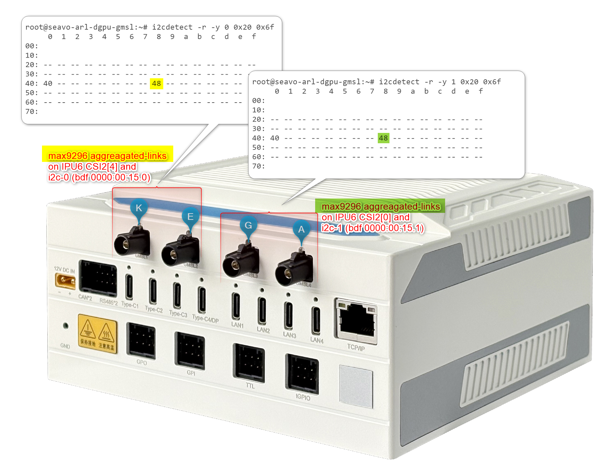

> **Attention:** For the time being, each GMSL2 **aggregated-link** deserializer, for example `MAX9296A`, on the same I2C channel must set an identical _Custom HID_ and _Camera module label_ tuple matching the GMSL2 serializer and camera sensor device type.
>
> For the [SEAVO Embedded Computer HB03](https://www.seavo.com/en/products/products-info_itemid_693.html) Add-in-Card (AIC), the I2C1-channel **aggregated-link** deserializer at I2C device `0x48` can set the _Custom HID_, for example `INTC10CD`, and _Camera module label_, for example `d4xx`, tuple for both GMSL camera suffixes `a` and `g`, while the other **aggregated-link** deserializer at I2C device `0x4a` can use a different _Custom HID_, for example `INTC1031`, and _Camera module label_, for example `isx031`, tuple on GMSL camera suffixes `e` and `k`.

<!--hide_directive ::: hide_directive-->
<!--hide_directive :::{tab-item} hide_directive--> **Axiomtek ROBOX500**

The [Axiomtek ROBOX500](https://www.axiomtek.com/ROBOX500/) may provide either 4x GMSL or 8x GMSL camera interfaces (FAKRA universal type).

<!--hide_directive
::::{tab-set} hide_directive-->
<!--hide_directive :::{tab-item} hide_directive--> **RealSense D457**

Below is an ACPI device configuration example for 4x Intel® RealSense Depth Camera D457 GMSL2 modules:

_Standalone-link `SerDes` CSI-2 port 0, 1, 2 and 3 and I2C settings for GMSL Add-in-Card (AIC)_

| UEFI Custom Sensor  | Camera 1   | Camera 2   | Camera 3   | Camera 4   |
| ------------------- | ---------- | ---------- | ---------- | ---------- |
| Camera suffix       | a          | b          | c          | d          |
| Custom HID          | `INTC10CD` | `INTC10CD` | `INTC10CD` | `INTC10CD` |
| PPR Value           | 2          | 2          | 2          | 2          |
| PPR Unit            | 1          | 1          | 1          | 1          |
| Camera module label | `d4xx`     | `d4xx`     | `d4xx`     | `d4xx`     |
| MIPI Port (Index)   | 0          | 1          | 2          | 3          |
| LaneUsed            | x2         | x2         | x2         | x2         |
| Number of I2C       | 3          | 3          | 3          | 3          |
| I2C Channel         | I2C5       | I2C5       | I2C5       | I2C5       |
| Device0 I2C Address | 12         | 14         | 16         | 18         |
| Device1 I2C Address | 42         | 44         | 62         | 64         |
| Device2 I2C Address | 48         | 4a         | 68         | 6c         |

<!--hide_directive ::: hide_directive-->
<!--hide_directive :::{tab-item} hide_directive--> **D3CMCXXX-115-084**

Below is an ACPI device configuration example for four GMSL2 camera modules from [D3 Embedded Discovery](https://www.d3embedded.com/product/isx031-smart-camera-narrow-fov-gmsl2-unsealed/):

_**Aggregated-link** `SerDes` CSI-2 port 0 and 4 and I2C settings for GMSL Add-in-Card (AIC)_

| UEFI Custom Sensor  | Camera 1           | Camera 2           | Camera 3           | Camera 4           |
| ------------------- | ------------------ | ------------------ | ------------------ | ------------------ |
| Camera suffix       | a                  | b                  | c                  | d                  |
| Custom HID          | `D3000004`         | `D3000004`         | `D3000004`         | `D3000004`         |
| PPR Value           | 2                  | 2                  | 2                  | 2                  |
| PPR Unit            | 1                  | 1                  | 1                  | 1                  |
| Camera module label | `D3CMCXXX-115-084` | `D3CMCXXX-115-084` | `D3CMCXXX-115-084` | `D3CMCXXX-115-084` |
| MIPI Port (Index)   | 0                  | 1                  | 2                  | 3                  |
| LaneUsed            | x2                 | x2                 | x2                 | x2                 |
| Number of I2C       | 3                  | 3                  | 3                  | 3                  |
| I2C Channel         | I2C5               | I2C5               | I2C5               | I2C5               |
| Device0 I2C Address | 48                 | 4a                 | 68                 | 6c                 |
| Device1 I2C Address | 42                 | 44                 | 62                 | 64                 |
| Device2 I2C Address | 12                 | 14                 | 16                 | 18                 |

> **Note:** On Axiomtek ROBOX500, the 4x D3CMCXXX camera ACPI configuration achieved by `PPR Unit=1` requires setting `Device0` for the GMSL2 **aggregated-link** deserializer I2C address, for example `MAX9296A`, and `Device2` for the sensor I2C address, for example `ISX031`.

<!--hide_directive ::: hide_directive-->
<!--hide_directive :::{tab-item} hide_directive--> **D3CMCXXX-106-084**

Below is an ACPI device configuration example for four GMSL2 camera modules from [D3 Embedded Discovery PRO](https://www.d3embedded.com/product/imx390-medium-fov-gmsl2-sealed/):

_**Aggregated-link** `SerDes` CSI-2 port 0 and 4 and I2C settings for GMSL Add-in-Card (AIC)_

| UEFI Custom Sensor  | Camera 1           | Camera 2           | Camera 3           | Camera 4           |
| ------------------- | ------------------ | ------------------ | ------------------ | ------------------ |
| Camera suffix       | a                  | b                  | c                  | d                  |
| Custom HID          | `D3000005`         | `D3000005`         | `D3000005`         | `D3000005`         |
| PPR Value           | 2                  | 2                  | 2                  | 2                  |
| PPR Unit            | 1                  | 1                  | 1                  | 1                  |
| Camera module label | `D3CMCXXX-106-084` | `D3CMCXXX-106-084` | `D3CMCXXX-106-084` | `D3CMCXXX-106-084` |
| MIPI Port (Index)   | 0                  | 1                  | 2                  | 3                  |
| LaneUsed            | x2                 | x2                 | x2                 | x2                 |
| Number of I2C       | 3                  | 3                  | 3                  | 3                  |
| I2C Channel         | I2C5               | I2C5               | I2C5               | I2C5               |
| Device0 I2C Address | 48                 | 4a                 | 68                 | 6c                 |
| Device1 I2C Address | 42                 | 44                 | 62                 | 64                 |
| Device2 I2C Address | 12                 | 14                 | 16                 | 18                 |

> **Note:** The D3CMCXXX ACPI configuration with `PPR Unit=2` requires setting `Device0` for the GMSL2 **aggregated-link** deserializer I2C address, for example `MAX9296A`, and `Device2` for the sensor I2C address, for example `ISX031`.

<!--hide_directive ::: hide_directive-->
<!--hide_directive :::{tab-item} hide_directive--> **oToCAM222**

Below is an ACPI device configuration example for [oToBrite oToCAM222](https://www.otobrite.com/product/automotive-camera/isx021_gmsl2_otocam222-s195m) GMSL2 camera modules:

_**Aggregated-link** `SerDes` CSI-2 port 0 and 4 and I2C settings for GMSL Add-in-Card (AIC)_

| UEFI Custom Sensor  | Camera 1   | Camera 2   | Camera 3   | Camera 4   |
| ------------------- | ---------- | ---------- | ---------- | ---------- |
| GMSL Camera suffix  | a          | b          | c          | d          |
| Custom HID          | `OTOC1021` | `OTOC1021` | `OTOC1021` | `OTOC1021` |
| PPR Value           | 2          | 2          | 2          | 2          |
| PPR Unit            | 1          | 1          | 1          | 1          |
| Camera module label | `otocam`   | `otocam`   | `otocam`   | `otocam`   |
| MIPI Port (Index)   | 0          | 1          | 2          | 3          |
| LaneUsed            | x2         | x2         | x2         | x2         |
| Number of I2C       | 3          | 3          | 3          | 3          |
| I2C Channel         | I2C5       | I2C5       | I2C5       | I2C5       |
| Device0 I2C Address | 10         | 11         | 10         | 11         |
| Device1 I2C Address | 18         | 19         | 18         | 19         |
| Device2 I2C Address | 48         | 4a         | 68         | 6c         |

<!--hide_directive ::: hide_directive-->
<!--hide_directive :::{tab-item} hide_directive--> **oToCAM223**

Below is an ACPI device configuration example for [oToBrite oToCAM223](https://www.otobrite.com/product/automotive-camera/isx031_gmsl2_otocam223-s195m) GMSL2 camera modules:

_**Aggregated-link** `SerDes` CSI-2 port 0 and 4 and I2C settings for GMSL Add-in-Card (AIC)_

| UEFI Custom Sensor  | Camera 1   | Camera 2   | Camera 3   | Camera 4   |
| ------------------- | ---------- | ---------- | ---------- | ---------- |
| GMSL Camera suffix  | a          | b          | c          | d          |
| Custom HID          | `OTOC1031` | `OTOC1031` | `OTOC1031` | `OTOC1031` |
| PPR Value           | 2          | 2          | 2          | 2          |
| PPR Unit            | 1          | 1          | 1          | 1          |
| Camera module label | `otocam`   | `otocam`   | `otocam`   | `otocam`   |
| MIPI Port (Index)   | 0          | 1          | 2          | 3          |
| LaneUsed            | x2         | x2         | x2         | x2         |
| Number of I2C       | 3          | 3          | 3          | 3          |
| I2C Channel         | I2C5       | I2C5       | I2C5       | I2C5       |
| Device0 I2C Address | 10         | 11         | 10         | 11         |
| Device1 I2C Address | 18         | 19         | 18         | 19         |
| Device2 I2C Address | 48         | 4a         | 68         | 6c         |

<!--hide_directive ::: hide_directive-->
<!--hide_directive :::: hide_directive-->

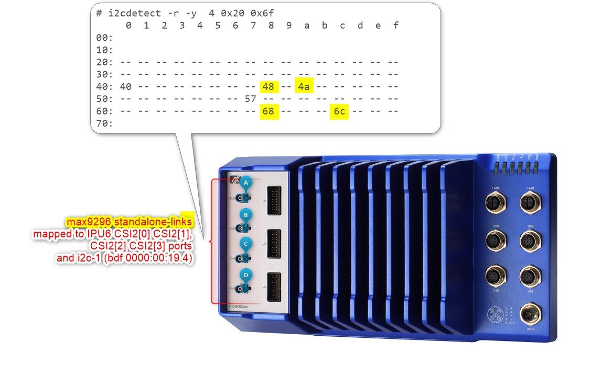

Another example below illustrates how to configure ACPI devices for 8x Intel® RealSense Depth Camera D457 GMSL2 modules:

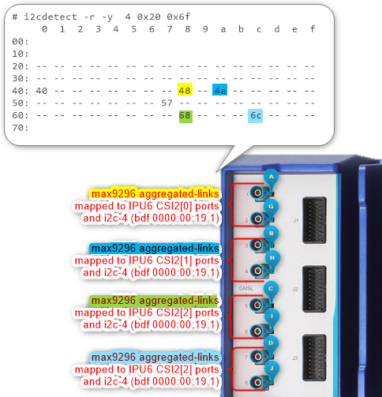

_**Aggregated-link** `SerDes` CSI-2 port 0, 1, 2 and 3 and I2C settings for GMSL Add-in-Card (AIC)_

| UEFI Custom Sensor     | Camera 1   | Camera 2   | Camera 3   | Camera 4   | N/A        | N/A        | N/A        | N/A        |
| ---------------------- | ---------- | ---------- | ---------- | ---------- | ---------- | ---------- | ---------- | ---------- |
| Camera suffix (letter) | a          | b          | c          | d          | _g_        | _h_        | _i_        | _j_        |
| Custom HID             | `INTC10CD` | `INTC10CD` | `INTC10CD` | `INTC10CD` | `INTC10CD` | `INTC10CD` | `INTC10CD` | `INTC10CD` |
| PPR Value              | 2          | 2          | 2          | 2          | 2          | 2          | 2          | 2          |
| PPR Unit               | 1          | 1          | 1          | 1          | 1          | 1          | 1          | 1          |
| Camera module label    | `d4xx`     | `d4xx`     | `d4xx`     | `d4xx`     | `d4xx`     | `d4xx`     | `d4xx`     | `d4xx`     |
| MIPI Port (Index)      | 0          | 1          | 2          | 3          | 0          | 1          | 2          | 3          |
| LaneUsed               | x2         | x2         | x2         | x2         | x2         | x2         | x2         | x2         |
| Number of I2C          | 3          | 3          | 3          | 3          | 3          | 3          | 3          | 3          |
| I2C Channel            | I2C5       | I2C5       | I2C5       | I2C5       | _I2C5_     | _I2C5_     | _I2C5_     | _I2C5_     |
| Device0 I2C Address    | 12         | 14         | 16         | 18         | _13_       | _15_       | _17_       | _19_       |
| Device1 I2C Address    | 42         | 44         | 62         | 64         | _43_       | _45_       | _63_       | _65_       |
| Device2 I2C Address    | 48         | 4a         | 68         | 6c         | _48_       | _4a_       | _68_       | _6c_       |

<!--hide_directive ::: hide_directive-->
<!--hide_directive :::: hide_directive-->
