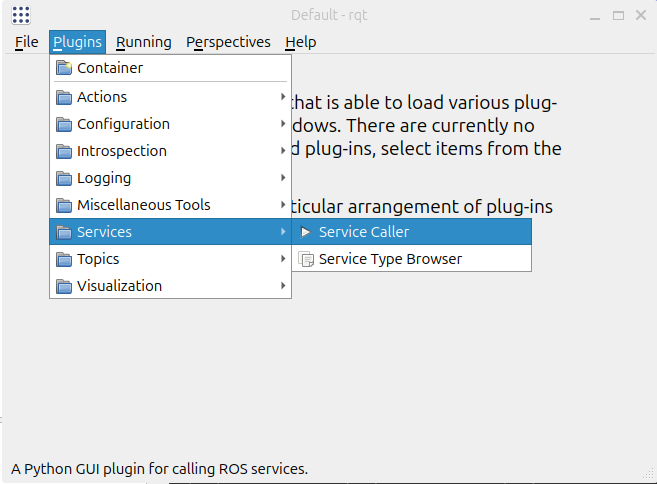
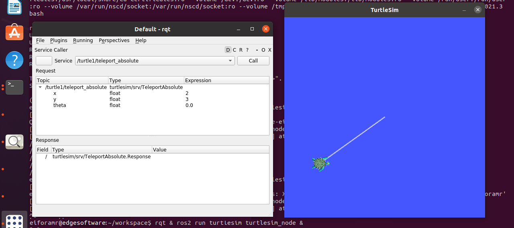

# Turtlesim ROS 2 Sample Application

This tutorial describes how to:

- Launch ROS nodes and graphic application for turtlesim.

- List ROS topics.

- Launch rqt graphic application so that the turtle can be controlled.

- Launch rviz graphic application to view ROS topics.

## Prerequisites

Complete the [get started guide](../../../gsg_robot/index.md) before continuing.

## Run the Turtlesim ROS 2 Sample application

1. To download and install the Turtlesim ROS 2 sample application run the command below:

   <!--hide_directive::::{tab-set}hide_directive-->
   <!--hide_directive:::{tab-item}hide_directive--> **Jazzy**
   <!--hide_directive:sync: jazzyhide_directive-->

   ```bash
   sudo apt-get install ros-jazzy-turtlesim-tutorial-demo
   ```

   <!--hide_directive:::hide_directive-->
   <!--hide_directive:::{tab-item}hide_directive--> **Humble**
   <!--hide_directive:sync: humblehide_directive-->

   ```bash
   sudo apt-get install ros-humble-turtlesim-tutorial-demo
   ```

   <!--hide_directive:::hide_directive-->
   <!--hide_directive::::hide_directive-->

2. Set up your ROS 2 environment

   <!--hide_directive::::{tab-set}hide_directive-->
   <!--hide_directive:::{tab-item}hide_directive--> **Jazzy**
   <!--hide_directive:sync: jazzyhide_directive-->

   ```bash
   source /opt/ros/jazzy/setup.bash
   ```

   <!--hide_directive:::hide_directive-->
   <!--hide_directive:::{tab-item}hide_directive--> **Humble**
   <!--hide_directive:sync: humblehide_directive-->

   ```bash
   source /opt/ros/humble/setup.bash
   ```

   <!--hide_directive:::hide_directive-->
   <!--hide_directive::::hide_directive-->

3. Run the Turtlesim ROS 2 sample application:

   ```bash
   ros2 launch turtlesim_tutorial turtlesim_tutorial.launch.py
   ```

4. In the rqt application, navigate to **Plugins** > **Services** > **Service Caller**.

   

   To move 'turtle1',
   choose `/turtle1/teleport_absolute` from the 'Service' dropdown list.
   Ensure to update the x and y values from their original settings.
   Press the 'Call' button to execute the teleportation.
   To close the Service Caller window, click the 'X' button.

   Expected Output: The Turtle has been relocated to the coordinates entered in the rqt application.

   

5. In the rviz application, navigate to **Add** > **By topic**. Check the option
   'Show Unvisualizable Topics' to view hidden topics.

   You will now be able to view the hidden topics from 'turtlesim'.
   To close the window, click the 'Cancel' button.

6. To close this tutorial, do the following:

   Type ``Ctrl-c`` in the terminal where you executed the command for the tutorial.

## Extra Exercises (Optional)

While the tutorial is still running (before step 6 above), open a **new** terminal and try
the following exercises to learn how to drive the turtle, draw shapes, and inspect the
topics and services published by `turtlesim`. Each exercise begins by clearing the canvas
and re-centering `turtle1` at the spawn point `(5.544445, 5.544445)` so you start from a
known state.

### Set up the new terminal

Each new terminal needs the ROS 2 environment to be sourced before any `ros2` command will
work:

```bash
source /opt/ros/jazzy/setup.bash
export ROS_DOMAIN_ID=42
```

### Reset helper

The following two commands clear all drawn lines and move `turtle1` back to the center of
the canvas. Run them at the start of any exercise (or whenever you want a clean slate):

```bash
ros2 service call /clear std_srvs/srv/Empty
ros2 service call /turtle1/teleport_absolute \
  turtlesim/srv/TeleportAbsolute "{x: 5.544445, y: 5.544445, theta: 0}"
```

### 1. Draw a square with `/turtle1/teleport_absolute`

The pen is down by default, so each teleport draws a straight line from the current pose
to the target. Five points (corner → corner → … → starting corner) close the square:

```bash
ros2 service call /clear std_srvs/srv/Empty
ros2 service call /turtle1/teleport_absolute \
  turtlesim/srv/TeleportAbsolute "{x: 5.544445, y: 5.544445, theta: 0}"

for xy in "2 2 0" "9 2 0" "9 9 0" "2 9 0" "2 2 0"; do
  read x y th <<<"$xy"
  ros2 service call /turtle1/teleport_absolute \
    turtlesim/srv/TeleportAbsolute "{x: $x, y: $y, theta: $th}"
  sleep 0.3
done
```

### 2. Draw a colored square (cycle pen color per side)

The `off` field of `turtlesim/srv/SetPen` must be quoted in YAML 1.1 because `off` is
parsed as the boolean `false` otherwise. Inside a Bash double-quoted string, escape the
inner quotes as shown below:

```bash
ros2 service call /clear std_srvs/srv/Empty

colors=("255 80 80" "80 255 80" "80 160 255" "255 200 60")
points=("2 2 0" "9 2 0" "9 9 0" "2 9 0" "2 2 0")

ros2 service call /turtle1/teleport_absolute \
  turtlesim/srv/TeleportAbsolute "{x: 2, y: 2, theta: 0}"

for i in 0 1 2 3; do
  read r g b <<<"${colors[$i]}"
  ros2 service call /turtle1/set_pen \
    turtlesim/srv/SetPen "{r: $r, g: $g, b: $b, width: 4, \"off\": 0}"
  read x y th <<<"${points[$((i+1))]}"
  ros2 service call /turtle1/teleport_absolute \
    turtlesim/srv/TeleportAbsolute "{x: $x, y: $y, theta: $th}"
  sleep 0.3
done

ros2 service call /turtle1/teleport_absolute \
  turtlesim/srv/TeleportAbsolute "{x: 5.544445, y: 5.544445, theta: 0}"
```

Tip: setting `"off": 1` lifts the pen — useful for jumping to a new position without
drawing.

### 3. Drive with `/turtle1/cmd_vel`

Continuously publish a `geometry_msgs/Twist` to control the turtle. Press ``Ctrl-c`` to
stop each command.

Drive in a circle (linear forward + angular turn):

```bash
ros2 service call /clear std_srvs/srv/Empty
ros2 service call /turtle1/teleport_absolute \
  turtlesim/srv/TeleportAbsolute "{x: 5.544445, y: 5.544445, theta: 0}"
ros2 topic pub /turtle1/cmd_vel geometry_msgs/msg/Twist \
  "{linear: {x: 2.0}, angular: {z: 1.8}}"
```

Spin in place:

```bash
ros2 service call /clear std_srvs/srv/Empty
ros2 service call /turtle1/teleport_absolute \
  turtlesim/srv/TeleportAbsolute "{x: 5.544445, y: 5.544445, theta: 0}"
ros2 topic pub /turtle1/cmd_vel geometry_msgs/msg/Twist \
  "{linear: {x: 0.0}, angular: {z: 3.0}}"
```

### 4. Drive with the keyboard

Run from a real terminal window (it needs raw key input):

```bash
ros2 service call /clear std_srvs/srv/Empty
ros2 service call /turtle1/teleport_absolute \
  turtlesim/srv/TeleportAbsolute "{x: 5.544445, y: 5.544445, theta: 0}"
ros2 run turtlesim turtle_teleop_key
```

### 5. Watch `/turtle1/pose` stream live

Live pose values (x, y, theta, linear/angular velocity):

```bash
ros2 topic echo /turtle1/pose
```

Just the publish rate:

```bash
ros2 topic hz /turtle1/pose
```

### 6. Read the color sensor under the turtle

Drive the turtle over its own trail (for example after running exercise 1 or 2) and watch
the RGB values change:

```bash
ros2 topic echo /turtle1/color_sensor
```

### 7. View `/tf` in rviz

Inside the rviz window:

1. Set **Fixed Frame** (under "Global Options") to `world`.
2. Click **Add** > **By topic**, select `/tf` > **TF**, click **OK**.
3. Publish a `cmd_vel` from exercise 3 in another terminal — the turtle's frame moves in rviz.

### 8. Click in rviz, see topics fire

In rviz, use the toolbar buttons **2D Goal Pose**, **2D Pose Estimate**, and **Publish
Point** while echoing the matching topic in another terminal:

```bash
ros2 topic echo /goal_pose       # 2D Goal Pose toolbar button
ros2 topic echo /initialpose     # 2D Pose Estimate toolbar button
ros2 topic echo /clicked_point   # Publish Point toolbar button
```

### 9. Spawn a second turtle and drive both

```bash
ros2 service call /clear std_srvs/srv/Empty
ros2 service call /turtle1/teleport_absolute \
  turtlesim/srv/TeleportAbsolute "{x: 5.544445, y: 5.544445, theta: 0}"

ros2 service call /spawn turtlesim/srv/Spawn \
  "{x: 3.0, y: 3.0, theta: 0, name: 'turtle2'}"

ros2 topic pub /turtle2/cmd_vel geometry_msgs/msg/Twist \
  "{linear: {x: 1.5}, angular: {z: -1.0}}"
```

### 10. Discoverability cheats

```bash
ros2 topic list -t          # topics + their types
ros2 service list -t        # services + their types
ros2 interface show turtlesim/srv/TeleportAbsolute
ros2 interface show geometry_msgs/msg/Twist
ros2 node info /turtlesim   # everything turtlesim publishes/subscribes/serves
```

When you are done with the exercises, follow step 6 above to close the tutorial.
