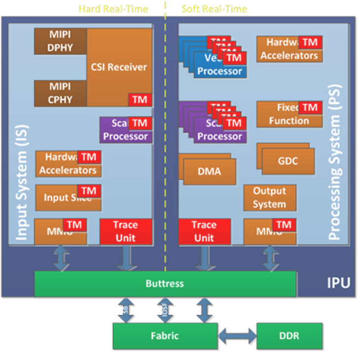

.. _enableGmsl:

Camera GMSL setup
##############################################################

The Gigabit Multimedia Serial Link™ (GMSL) technology for cameras modules offers lower power consumption, reduced ESD/EMI noise, lower latency, and longer cable length compared to USB, while providing higher bandwidth compared to Ethernet.

Third-party MIPI Camera vendors, including  `D3 Embedded® <https://www.d3embedded.com/>`_ and `oToBrite® <https://www.otobrite.com/>`_ , offers a rich products line of GMSL2 Camera modules for every solution need. The `RealSense™ Depth Camera D457 product <https://realsenseai.com/products/d457-gmsl-fakra/>`_  adds GMSL serializer and FAKRA connector to their camera modules product line.

GMSL uses very popular `SerDes` technique across telecom, industrial, and cable interconnect applications to meet the growing demand of high data rates, long distance support, and better performance.
This serial link technology also performs reliably in the harsh industrial and outside environments to deliver data fast with low latency, providing data transmission over a single coaxial cable or differential pair cables (STP, SPP, etc.) to minimize the number of Input/Output pins and interconnects.

A GMSL product design based |Intel| Core™ Ultra Series 1 and 2 (Arrow Lake-U/H) or 12th/13th/14th Gen |Intel| Core™ products can be illustrated as followed :

   .. figure:: images/gmsl/GMSL-overview.png
      :align: center

   - The **GMSL2 Camera modules**, designed by 3rd Party GMSL2 Camera vendors, combine one or more Camera Sensors and a GMSL2 *Serializer* (ex. MAX9295)
   - The **Add-in-Card (AIC)**, designed by either ODM/OEMs or 3rd Party GMSL2 Camera vendors, provide multiple GMSL2 *Derializer* (ex. MAX9296A)
   - The **|Intel|-based Motherboad**, designed by ODM/OEMs, provide Mobile Industry Processor Interface (MIPI) Camera Serial Interface (CSI) interface exposed by |Intel| Core™ Ultra Series 1 and 2 (Arrow Lake-U/H) and 12th/13th/14th Gen |Intel| Core™ products.

The following sections will provide guiding step to interconnect GMSL2 Camera modules to 12th/13th/14th Gen |Intel| Core™, such as GMSL2 enabled `Axiomtek ROBOX500 <https://www.axiomtek.com/ROBOX500/>`_ , and |Intel| Core™ Ultra Series 1 and 2 (Arrow Lake-U/H) based GMSL enabled products, such as `SEAVO® Embedded Computer HB03 <https://www.seavo.com/en/products/products-info_itemid_693.html>`_ , `Advantech® AFE-R360 series <https://www.advantech.com/en-eu/products/8d5aadd0-1ef5-4704-a9a1-504718fb3b41/afe-r360/mod_1e4a1980-9a31-46e6-87b6-affbd7a2cb44>`_ and `ASR-A502 series <https://www.advantech.com/en-eu/products/8d5aadd0-1ef5-4704-a9a1-504718fb3b41/asr-a502/mod_ccca0f36-a50b-40c7-87b7-10fb96448605>`_ with `Advantech® GMSL Input Module Card <https://www.advantech.com/en-eu/products/8d5aadd0-1ef5-4704-a9a1-504718fb3b41/mioe-gmsl/mod_fc1fc070-30f8-40c1-881f-56c967e26924>`_ .

.. _gmsl-overview:

Brief GMSL Add-in-Card design overview
***********************************************

There are two design approaches for GMSL Add-in-Card (AIC) :

 - **Standalone-mode** `SerDes` - Single GMSL Serializer (ex. MAX9295) and Camera Sensor devices per Deserializer (e.g. MAX9296A). Such as `Axiomtek ROBOX500 4x GMSL camera interfaces <https://www.axiomtek.com/ROBOX500/>`_ Add-in-Card (AIC).

   .. figure:: images/gmsl/GMSL-standalone-D457_-csi-port0.png
      :align: center

 - **Aggregated-link** `SerDes` - Dual GMSL Serializer (ex. MAX9295) and Camera Sensor devices per Deserialize (e.g. MAX9296A). Such as `Axiomtek ROBOX500 8x GMSL camera interfaces <https://www.axiomtek.com/ROBOX500/>`_ or `Advantech GMSL Input Module Card <https://www.advantech.com/en-eu/products/8d5aadd0-1ef5-4704-a9a1-504718fb3b41/mioe-gmsl/mod_fc1fc070-30f8-40c1-881f-56c967e26924>`_ , for `AFE-R360 series <https://www.advantech.com/en-eu/products/8d5aadd0-1ef5-4704-a9a1-504718fb3b41/afe-r360/mod_1e4a1980-9a31-46e6-87b6-affbd7a2cb44>`_ or `ASR-A502 series <https://www.advantech.com/en-eu/products/8d5aadd0-1ef5-4704-a9a1-504718fb3b41/asr-a502/mod_ccca0f36-a50b-40c7-87b7-10fb96448605>`_, and `SEAVO Embedded Computer HB03 <https://www.seavo.com/en/products/products-info_itemid_693.html>`_ Add-in-Cards (AIC).

   .. figure:: images/gmsl/GMSL-aggregated-D457_csi-port0.png
      :align: center

 It is crucial to understand the `SerDes` i2c connectivity specific to each ODM/OEM motherboards, Add-in-Cards (AIC) and GMSL2 Camera modules. Illustrated below are all details a user need to learn about I2C communication between a BDF (Bit-Definition File) Linux i2c adapter and GMSL2 i2c devices for the |Intel| Core™ Ultra Series 1 and 2 (Arrow Lake-U/H) and 12th/13th/14th Gen |Intel| Core™ to detect and configure GMSL capability. (see :ref:`SerDes i2c mapping <gmsl-i2c-detect>` for further details)

     .. figure:: images/gmsl/GMSL-overview2.png
      :align: center

More details about `Mobile Industry Processor Interface (MIPI) Camera Serial Interface (CSI) Gigabit Multimedia Serial Link (GMSL) Add-in Card (AIC) Schematic <https://cdrdv2.intel.com/v1/dl/getContent/814789?explicitVersion=true>`_ 

.. _gmsl-acpidev:

Configure |Intel| GMSL `SerDes` ACPI devices
***********************************************

To enable multiple GMSL Cameras for same or different vendors, user need define MIPI Cameras ACPI device from UEFI/BIOS settings. 

#. Review |Intel| enabled GMSL2 camera module with its corresponding ACPI devices custom HID:

   +--------------+----------------------+-----------------------+------------+------------------+----------------------------------------------------------------------------------------------------------------------------------------+
   | ACPI         | ACPI                 |  Sensor Type          | GMSL2      | Max Resolution   | Vendor URL                                                                                                                             |
   | custom HID   | Camera module label  |                       | Serializer |                  |                                                                                                                                        |
   +==============+======================+=======================+============+==================+========================================================================================================================================+
   | ``INTC10CD`` | ``d4xx``             | OV9782 + D450 Depth   | MAX9295    | 2x (1280x720)    | `RealSense™ Depth Camera D457 <https://realsenseai.com/wp-content/uploads/2025/08/RealSense-D457-Datasheet-Aug_2025.pdf>`_             |
   +--------------+----------------------+-----------------------+------------+------------------+----------------------------------------------------------------------------------------------------------------------------------------+
   | ``D3000004`` | ``D3CMCXXX-115-084`` | ISX031                | MAX9295    | 1920x1536        | `D3 Embedded® <https://www.d3embedded.com/>`_                                                                                          |
   +--------------+----------------------+-----------------------+------------+------------------+ sensor Linux drivers package available upon sales@d3embedded.com camera purchase                                                       |
   | ``D3000005`` | ``D3CMCXXX-106-084`` | IMX390                | MAX9295    | 1920x1080        |                                                                                                                                        |
   +--------------+----------------------+-----------------------+------------+------------------+                                                                                                                                        |
   | ``D3000006`` | ``D3CMCXXX-089-084`` | AR0234                | MAX9295    | 1280x960         |                                                                                                                                        |
   +--------------+----------------------+-----------------------+------------+------------------+----------------------------------------------------------------------------------------------------------------------------------------+
   | ``OTOC1031`` | ``otocam``           | ISX031                | MAX9295    | 1920x1536        | `oToBrite® <https://www.otobrite.com/>`_                                                                                               |
   +--------------+----------------------+-----------------------+------------+------------------+ sensor Linux drivers package available upon sales@otobrite.com camera purchase                                                         |
   | ``OTOC1021`` | ``otocam``           | ISX021                | MAX9295    | 1920x1280        |                                                                                                                                        |
   +--------------+----------------------+-----------------------+------------+------------------+----------------------------------------------------------------------------------------------------------------------------------------+

#. Review the :ref:`gmsl-overview`, if not already done.

   Please refer to each tabs below to understand ODM hardware distinct ACPI Camera device configuration table : 

   .. tabs::

      .. group-tab:: Advantech® AFE-R360 & ASR-A502 series

         The `Advantech GMSL Input Module Card <https://www.advantech.com/en-eu/products/8d5aadd0-1ef5-4704-a9a1-504718fb3b41/mioe-gmsl/mod_fc1fc070-30f8-40c1-881f-56c967e26924>`_ for `AFE-R360 series <https://www.advantech.com/en-eu/products/8d5aadd0-1ef5-4704-a9a1-504718fb3b41/afe-r360/mod_1e4a1980-9a31-46e6-87b6-affbd7a2cb44>`_ and `ASR-A502 series <https://www.advantech.com/en-eu/products/8d5aadd0-1ef5-4704-a9a1-504718fb3b41/asr-a502/mod_ccca0f36-a50b-40c7-87b7-10fb96448605>`_ may provide up to 6x GMSL camera interface (FAKRA universal type).

         .. tabs::

            .. group-tab:: RealSense™ D457

               Below an ACPI devices configure example for GMSL2 RealSense™ Depth Camera D457 :

               .. list-table:: *Aggregated-link* `SerDes` CSI-2 port 0 and 4 and I2C settings for GMSL Add-in-Card (AIC)
                  :widths: 25 15 15 15 15 
                  :header-rows: 1

                  *  - UEFI Custom Sensor
                     - Camera 1
                     - Camera 2
                     - Camera 3
                     - Camera 4
                  *  - GMSL Camera suffix
                     - a
                     - g
                     - e
                     - k
                  *  - Custom HID
                     - ``INTC10CD``
                     - ``INTC10CD``
                     - ``INTC10CD``
                     - ``INTC10CD``
                  *  - PPR Value
                     - 2
                     - 2
                     - 2
                     - 2
                  *  - PPR Unit
                     - 1
                     - 1
                     - 1
                     - 1
                  *  - Camera module label
                     - ``d4xx``
                     - ``d4xx``
                     - ``d4xx``
                     - ``d4xx``
                  *  - MIPI Port (Index)
                     - 0
                     - 0
                     - 4
                     - 4
                  *  - LaneUsed
                     - x2
                     - x2
                     - x2
                     - x2
                  *  - Number of I2C
                     - 3
                     - 3
                     - 3
                     - 3
                  *  - I2C Channel
                     - I2C1
                     - I2C1
                     - I2C2
                     - I2C2
                  *  - Device0 I2C Address
                     - 12
                     - 14
                     - 12
                     - 14
                  *  - Device1 I2C Address
                     - 42
                     - 44
                     - 42
                     - 44
                  *  - Device2 I2C Address
                     - 48
                     - 48
                     - 48
                     - 48

            .. group-tab:: D3CMCXXX-115-084

               Below an ACPI devices configure example for `D3 Embedded Discovery <https://www.d3embedded.com/product/isx031-smart-camera-narrow-fov-gmsl2-unsealed/>`_ GMSL2 Camera module :

               .. list-table:: *Aggregated-link* `SerDes` CSI-2 port 0 and 4 and I2C settings for GMSL Add-in-Card (AIC)
                  :widths: 25 15 15
                  :header-rows: 1

                  *  - UEFI Custom Sensor
                     - Camera 1
                     - Camera 2
                  *  - GMSL Camera suffix
                     - a
                     - e
                  *  - Custom HID
                     - ``D3000004``
                     - ``D3000004``
                  *  - PPR Value
                     - 2
                     - 2
                  *  - PPR Unit
                     - 2
                     - 2
                  *  - Camera module label
                     - ``D3CMCXXX-115-084``
                     - ``D3CMCXXX-115-084``
                  *  - MIPI Port (Index)
                     - 0
                     - 4
                  *  - LaneUsed
                     - x2
                     - x2
                  *  - Number of I2C
                     - 3
                     - 3
                  *  - I2C Channel
                     - I2C1
                     - I2C2
                  *  - Device0 I2C Address
                     - 48
                     - 48
                  *  - Device1 I2C Address
                     - 42
                     - 44
                  *  - Device2 I2C Address
                     - 10
                     - 12

               .. attention::
                  
                  please note, on Advantech® AFE-R360 series the four D3CMCXXX ACPI configuration achieved by ``PPR Unit=2`` also requires setting ``Device0`` for GMSL2 **Aggregated-link** Deserializer I2C address (e.g. MAX9296A) and ``Device2`` for Sensors I2C address (e.g. ISX031). 

            .. group-tab:: D3CMCXXX-106-084

               Below an ACPI devices configure example for `D3 Embedded Discovery PRO <https://www.d3embedded.com/product/imx390-medium-fov-gmsl2-sealed/>`_ GMSL2 Camera module :

               .. list-table:: *Aggregated-link* `SerDes` CSI-2 port 0 and 4 and I2C settings for GMSL Add-in-Card (AIC)
                  :widths: 25 15 15
                  :header-rows: 1

                  *  - UEFI Custom Sensor
                     - Camera 1
                     - Camera 2
                  *  - GMSL Camera suffix
                     - a
                     - e
                  *  - Custom HID
                     - ``D3000005``
                     - ``D3000005``
                  *  - PPR Value
                     - 2
                     - 2
                  *  - PPR Unit
                     - 2
                     - 2
                  *  - Camera module label
                     - ``D3CMCXXX-106-084``
                     - ``D3CMCXXX-106-084``
                  *  - MIPI Port (Index)
                     - 0
                     - 4
                  *  - LaneUsed
                     - x2
                     - x2
                  *  - Number of I2C
                     - 3
                     - 3
                  *  - I2C Channel
                     - I2C1
                     - I2C2
                  *  - Device0 I2C Address
                     - 48
                     - 48
                  *  - Device1 I2C Address
                     - 42
                     - 44
                  *  - Device2 I2C Address
                     - 10
                     - 12

               .. attention::
                  
                  please note, on Advantech® AFE-R360 series the four D3CMCXXX ACPI configuration achieved by ``PPR Unit=2`` also requires setting ``Device0`` for GMSL2 **Aggregated-link** Deserializer I2C address (e.g. MAX9296A) and ``Device2`` for Sensors I2C address (e.g. ISX031). 

            .. group-tab:: oToCAM222

               Below an ACPI devices configure example for `oToBrite® oToCAM222 <https://www.otobrite.com/product/automotive-camera/isx021_gmsl2_otocam222-s195m>`_ GMSL2 camera modules :

               .. list-table:: *Aggregated-link* `SerDes` CSI-2 port 0 and 4 and I2C settings for GMSL Add-in-Card (AIC)
                  :widths: 25 15 15 15 15 
                  :header-rows: 1

                  *  - UEFI Custom Sensor
                     - Camera 1
                     - Camera 2
                     - Camera 3
                     - Camera 4
                  *  - GMSL Camera suffix
                     - a
                     - g
                     - e
                     - k
                  *  - Custom HID
                     - ``OTOC1021``
                     - ``OTOC1021``
                     - ``OTOC1021``
                     - ``OTOC1021``
                  *  - PPR Value
                     - 2
                     - 2
                     - 2
                     - 2
                  *  - PPR Unit
                     - 1
                     - 1
                     - 1
                     - 1
                  *  - Camera module label
                     - ``otocam``
                     - ``otocam``
                     - ``otocam``
                     - ``otocam``
                  *  - MIPI Port (Index)
                     - 0
                     - 0
                     - 4
                     - 4
                  *  - LaneUsed
                     - x2
                     - x2
                     - x2
                     - x2
                  *  - Number of I2C
                     - 3
                     - 3
                     - 3
                     - 3
                  *  - I2C Channel
                     - I2C1
                     - I2C1
                     - I2C2
                     - I2C2
                  *  - Device0 I2C Address
                     - 10
                     - 11
                     - 10
                     - 11
                  *  - Device1 I2C Address
                     - 18
                     - 19
                     - 18
                     - 19
                  *  - Device2 I2C Address
                     - 48
                     - 48
                     - 48
                     - 48

            .. group-tab:: oToCAM223

               Below an ACPI devices configure example for `oToBrite® oToCAM223 <https://www.otobrite.com/product/automotive-camera/isx031_gmsl2_otocam223-s195m>`_ GMSL2 camera modules :

               .. list-table:: *Aggregated-link* `SerDes` CSI-2 port 0 and 4 and I2C settings for GMSL Add-in-Card (AIC)
                  :widths: 25 15 15 15 15 
                  :header-rows: 1

                  *  - UEFI Custom Sensor
                     - Camera 1
                     - Camera 2
                     - Camera 3
                     - Camera 4
                  *  - GMSL Camera suffix
                     - a
                     - g
                     - e
                     - k
                  *  - Custom HID
                     - ``OTOC1031``
                     - ``OTOC1031``
                     - ``OTOC1031``
                     - ``OTOC1031``
                  *  - PPR Value
                     - 2
                     - 2
                     - 2
                     - 2
                  *  - PPR Unit
                     - 1
                     - 1
                     - 1
                     - 1
                  *  - Camera module label
                     - ``otocam``
                     - ``otocam``
                     - ``otocam``
                     - ``otocam``
                  *  - MIPI Port (Index)
                     - 0
                     - 0
                     - 4
                     - 4
                  *  - LaneUsed
                     - x2
                     - x2
                     - x2
                     - x2
                  *  - Number of I2C
                     - 3
                     - 3
                     - 3
                     - 3
                  *  - I2C Channel
                     - I2C1
                     - I2C1
                     - I2C2
                     - I2C2
                  *  - Device0 I2C Address
                     - 10
                     - 11
                     - 10
                     - 11
                  *  - Device1 I2C Address
                     - 18
                     - 19
                     - 18
                     - 19
                  *  - Device2 I2C Address
                     - 48
                     - 48
                     - 48
                     - 48

         .. figure:: images/gmsl/gmsl-adv-mioe.png
               :align: left
               :figwidth: 110%

         Another example below illustrates how to configure ACPI devices 6x RealSense™ Depth Camera D457 GMSL2 module : 

         .. list-table:: *Aggregated-link* `SerDes` CSI-2 port 0, 4 and 5 and I2C settings for GMSL Add-in-Card (AIC)
            :widths: 25 15 15 15 15 15 15 
            :header-rows: 1

            *  - UEFI Custom Sensor
               - Camera 1
               - Camera 2
               - Camera 3
               - Camera 4
               - *Camera 5* or N/A :sup:`1`
               - *Camera 6* or N/A :sup:`1`
            *  - GMSL Camera suffix
               - a
               - g
               - e
               - f
               - *k*
               - *l*
            *  - Custom HID
               - ``INTC10CD``
               - ``INTC10CD``
               - ``INTC10CD``
               - ``INTC10CD``
               - ``INTC10CD``
               - ``INTC10CD``
            *  - PPR Value
               - 2
               - 2
               - 2
               - 2
               - 2
               - 2
            *  - PPR Unit
               - 1
               - 1
               - 1
               - 1
               - 1
               - 1
            *  - Camera module label
               - ``d4xx``
               - ``d4xx``
               - ``d4xx``
               - ``d4xx``
               - ``d4xx``
               - ``d4xx``
            *  - MIPI Port (Index)
               - 0
               - 0
               - 4
               - 5
               - 4
               - 5
            *  - LaneUsed
               - x2
               - x2
               - x2
               - x2
               - x2
               - x2
            *  - Number of I2C
               - 3
               - 3
               - 3
               - 3
               - 3
               - 3
            *  - I2C Channel
               - I2C1
               - I2C1
               - I2C2
               - I2C2
               - *I2C2*
               - *I2C2*
            *  - Device0 I2C Address
               - 12
               - 14
               - 16
               - 18
               - *12*
               - *14*
            *  - Device1 I2C Address
               - 42
               - 44
               - 62
               - 42
               - *64*
               - *44*
            *  - Device2 I2C Address
               - 48
               - 48
               - 48
               - 4a
               - *48*
               - *4a*

         .. attention::
            
            For the time being each GMSL2 **Aggregated-link** Deserializer (e.g. MAX9296A) on the same I2C Channel shall set identical *Custom HID* and *Camera module label* tuple matching with GMSL2 Serializer and Camera Sensor devices type.

            The `Advantech GMSL Input Module Card <https://www.advantech.com/en-eu/products/8d5aadd0-1ef5-4704-a9a1-504718fb3b41/mioe-gmsl/mod_fc1fc070-30f8-40c1-881f-56c967e26924>`_ for `AFE-R360 series <https://www.advantech.com/en-eu/products/8d5aadd0-1ef5-4704-a9a1-504718fb3b41/afe-r360/mod_1e4a1980-9a31-46e6-87b6-affbd7a2cb44>`_ I2C1 Channel (ex. ``INTC10CD``) **Aggregated-link** Deserializer (e.g. MAX9296A) i2c device `0x48` shall set *Custom HID* (ex. ``INTC10CD``) and *Camera module label* (ex ``d4xx``) tuple for both *GMSL Camera suffix* `a` and `g`, where the other  **Aggregated-link** Deserializer (e.g. MAX9296A) i2c device `0x4a` could have a different *Custom HID* (ex ``INTC1031``) and *Camera module* label (ex ``isx031``) tuple on both GMSL Camera suffix `e` and `k`.

      .. group-tab:: SEAVO® HB03

         The `SEAVO® Embedded Computer HB03 <https://www.seavo.com/en/products/products-info_itemid_693.html>`_ UEFI BIOS ``Version: S1132C1133A11`` allow admin user to configure up to 4x GMSL2 camera interface (FAKRA universal type).

         .. tabs::

            .. group-tab:: RealSense™ D457

               Below an ACPI devices configure example for GMSL2 RealSense™ Depth Camera D457 :

               .. list-table:: *Aggregated-link* `SerDes` CSI-2 port 0 and 4 and I2C settings for GMSL Add-in-Card (AIC)
                  :widths: 25 15 15 15 15 
                  :header-rows: 1

                  *  - UEFI Custom Sensor
                     - Camera 1
                     - Camera 2
                     - Camera 3
                     - Camera 4
                  *  - GMSL Camera suffix
                     - a
                     - g
                     - e
                     - k
                  *  - Custom HID
                     - ``INTC10CD``
                     - ``INTC10CD``
                     - ``INTC10CD``
                     - ``INTC10CD``
                  *  - PPR Value
                     - 2
                     - 2
                     - 2
                     - 2
                  *  - PPR Unit
                     - 1
                     - 1
                     - 1
                     - 1
                  *  - Camera module label
                     - ``d4xx``
                     - ``d4xx``
                     - ``d4xx``
                     - ``d4xx``
                  *  - MIPI Port (Index)
                     - 0
                     - 0
                     - 4
                     - 4
                  *  - LaneUsed
                     - x4
                     - x4
                     - x4
                     - x4
                  *  - Number of I2C
                     - 3
                     - 3
                     - 3
                     - 3
                  *  - I2C Channel
                     - I2C1
                     - I2C1
                     - I2C0
                     - I2C0
                  *  - Device0 I2C Address
                     - 12
                     - 14
                     - 12
                     - 14
                  *  - Device1 I2C Address
                     - 42
                     - 44
                     - 42
                     - 44
                  *  - Device2 I2C Address
                     - 48
                     - 48
                     - 48
                     - 48

            .. group-tab:: D3CMCXXX-115-084

               Below an ACPI devices configure example for `D3 Embedded Discovery <https://www.d3embedded.com/product/isx031-smart-camera-narrow-fov-gmsl2-unsealed/>`_ GMSL2 Camera module :

               .. list-table:: *Aggregated-link* `SerDes` CSI-2 port 0 and 4 and I2C settings for GMSL Add-in-Card (AIC)
                  :widths: 25 15 15
                  :header-rows: 1

                  *  - UEFI Custom Sensor
                     - Camera 1
                     - Camera 2
                  *  - GMSL Camera suffix
                     - a
                     - e
                  *  - Custom HID
                     - ``D3000004``
                     - ``D3000004``
                  *  - PPR Value
                     - 2
                     - 2
                  *  - PPR Unit
                     - 2
                     - 2
                  *  - Camera module label
                     - ``D3CMCXXX-115-084``
                     - ``D3CMCXXX-115-084``
                  *  - MIPI Port (Index)
                     - 0
                     - 4
                  *  - LaneUsed
                     - x4
                     - x4
                  *  - Number of I2C
                     - 3
                     - 3
                  *  - I2C Channel
                     - I2C1
                     - I2C0
                  *  - Device0 I2C Address
                     - 48
                     - 48
                  *  - Device1 I2C Address
                     - 42
                     - 44
                  *  - Device2 I2C Address
                     - 10
                     - 12

               .. attention::
                  
                  please note, on Seavo® HB03 the four D3CMCXXX ACPI configuration achieved by ``PPR Unit=2`` also requires setting ``Device0`` for GMSL2 **Aggregated-link** Deserializer I2C address (e.g. MAX9296A) and ``Device2`` for Sensors I2C address (e.g. ISX031). 

            .. group-tab:: D3CMCXXX-106-084

               Below an ACPI devices configure example for `D3 Embedded Discovery PRO <https://www.d3embedded.com/product/imx390-medium-fov-gmsl2-sealed/>`_ GMSL2 Camera module :

               .. list-table:: *Aggregated-link* `SerDes` CSI-2 port 0 and 4 and I2C settings for GMSL Add-in-Card (AIC)
                  :widths: 25 15 15
                  :header-rows: 1

                  *  - UEFI Custom Sensor
                     - Camera 1
                     - Camera 2
                  *  - GMSL Camera suffix
                     - a
                     - e
                  *  - Custom HID
                     - ``D3000005``
                     - ``D3000005``
                  *  - PPR Value
                     - 2
                     - 2
                  *  - PPR Unit
                     - 2
                     - 2
                  *  - Camera module label
                     - ``D3CMCXXX-106-084``
                     - ``D3CMCXXX-106-084``
                  *  - MIPI Port (Index)
                     - 0
                     - 4
                  *  - LaneUsed
                     - x4
                     - x4
                  *  - Number of I2C
                     - 3
                     - 3
                  *  - I2C Channel
                     - I2C1
                     - I2C0
                  *  - Device0 I2C Address
                     - 48
                     - 48
                  *  - Device1 I2C Address
                     - 42
                     - 44
                  *  - Device2 I2C Address
                     - 10
                     - 12

               .. attention::
                  
                  please note, on Seavo® HB03 four D3CMCXXX ACPI configuration achieved by ``PPR Unit=2`` also requires setting ``Device0`` for GMSL2 **Aggregated-link** Deserializer I2C address (e.g. MAX9296A) and ``Device2`` for Sensors I2C address (e.g. ISX031). 

            .. group-tab:: oToCAM222

               Below an ACPI devices configure example for `oToBrite® oToCAM222 <https://www.otobrite.com/product/automotive-camera/isx021_gmsl2_otocam222-s195m>`_ GMSL2 camera modules :

               .. list-table:: *Aggregated-link* `SerDes` CSI-2 port 0 and 4 and I2C settings for GMSL Add-in-Card (AIC)
                  :widths: 25 15 15 15 15 
                  :header-rows: 1

                  *  - UEFI Custom Sensor
                     - Camera 1
                     - Camera 2
                     - Camera 3
                     - Camera 4
                  *  - GMSL Camera suffix
                     - a
                     - g
                     - e
                     - k
                  *  - Custom HID
                     - ``OTOC1021``
                     - ``OTOC1021``
                     - ``OTOC1021``
                     - ``OTOC1021``
                  *  - PPR Value
                     - 2
                     - 2
                     - 2
                     - 2
                  *  - PPR Unit
                     - 1
                     - 1
                     - 1
                     - 1
                  *  - Camera module label
                     - ``otocam``
                     - ``otocam``
                     - ``otocam``
                     - ``otocam``
                  *  - MIPI Port (Index)
                     - 0
                     - 0
                     - 4
                     - 4
                  *  - LaneUsed
                     - x4
                     - x4
                     - x4
                     - x4
                  *  - Number of I2C
                     - 3
                     - 3
                     - 3
                     - 3
                  *  - I2C Channel
                     - I2C1
                     - I2C1
                     - I2C0
                     - I2C0
                  *  - Device0 I2C Address
                     - 10
                     - 11
                     - 10
                     - 11
                  *  - Device1 I2C Address
                     - 18
                     - 19
                     - 18
                     - 19
                  *  - Device2 I2C Address
                     - 48
                     - 48
                     - 48
                     - 48

            .. group-tab:: oToCAM223

               Below an ACPI devices configure example for `oToBrite® oToCAM223 <https://www.otobrite.com/product/automotive-camera/isx031_gmsl2_otocam223-s195m>`_ GMSL2 camera modules :

               .. list-table:: *Aggregated-link* `SerDes` CSI-2 port 0 and 4 and I2C settings for GMSL Add-in-Card (AIC)
                  :widths: 25 15 15 15 15 
                  :header-rows: 1

                  *  - UEFI Custom Sensor
                     - Camera 1
                     - Camera 2
                     - Camera 3
                     - Camera 4
                  *  - GMSL Camera suffix
                     - a
                     - g
                     - e
                     - k
                  *  - Custom HID
                     - ``OTOC1031``
                     - ``OTOC1031``
                     - ``OTOC1031``
                     - ``OTOC1031``
                  *  - PPR Value
                     - 2
                     - 2
                     - 2
                     - 2
                  *  - PPR Unit
                     - 1
                     - 1
                     - 1
                     - 1
                  *  - Camera module label
                     - ``otocam``
                     - ``otocam``
                     - ``otocam``
                     - ``otocam``
                  *  - MIPI Port (Index)
                     - 0
                     - 0
                     - 4
                     - 4
                  *  - LaneUsed
                     - x4
                     - x4
                     - x4
                     - x4
                  *  - Number of I2C
                     - 3
                     - 3
                     - 3
                     - 3
                  *  - I2C Channel
                     - I2C1
                     - I2C1
                     - I2C0
                     - I2C0
                  *  - Device0 I2C Address
                     - 10
                     - 11
                     - 10
                     - 11
                  *  - Device1 I2C Address
                     - 18
                     - 19
                     - 18
                     - 19
                  *  - Device2 I2C Address
                     - 48
                     - 48
                     - 48
                     - 48

         .. note:: 

            please note, GMSL2 *Aggregated-link* `SerDes` CSI-2 port 0 and 4 is purposely set to ``LaneUsed = x4`` to improve |Intel| IPU6 DPHY signal-integrity problem on `SEAVO® Embedded Computer HB03 <https://www.seavo.com/en/products/products-info_itemid_693.html>`_ .

         .. figure:: images/gmsl/gmsl-seavo-hb03.png
            :align: left
            :figwidth: 80%
      
         .. attention::
            
            For the time being each GMSL2 **Aggregated-link** Deserializer (e.g. MAX9296A) on the same I2C Channel shall set identical *Custom HID* and *Camera module label* tuple matching with GMSL2 Serializer and Camera Sensor devices type.

            The `SEAVO® Embedded Computer HB03 <https://www.seavo.com/en/products/products-info_itemid_693.html>`_ Add-in-Cards (AIC) I2C1 Channel  (ex. ``INTC10CD``) **Aggregated-link** Deserializer (e.g. MAX9296A) i2c device `0x48` shall set *Custom HID* (ex. ``INTC10CD``) and *Camera module label* (ex ``d4xx``) tuple for both *GMSL Camera suffix* `a` and `g`, where the other  **Aggregated-link** Deserializer (e.g. MAX9296A) i2c device `0x4a` could have a different *Custom HID* (ex ``INTC1031``) and *Camera module* label (ex ``isx031``) tuple on both GMSL Camera suffix `e` and `k`.

      .. group-tab:: Axiomtek® ROBOX500

         The `Axiomtek ROBOX500 <https://www.axiomtek.com/ROBOX500/>`_ may provide either 4x GMSL or 8x GMSL camera interface (FAKRA universal type).

         .. tabs::

            .. group-tab:: RealSense™ D457

               Below an ACPI devices configure example for  4x RealSense™ Depth Camera D457 GMSL2 module :

               .. list-table:: Standalone-link `SerDes` CSI-2 port 0, 1, 2 and 3 and I2C settings for GMSL Add-in-Card (AIC)
                  :widths: 25 15 15 15 15
                  :header-rows: 1

                  *  - UEFI Custom Sensor
                     - Camera 1
                     - Camera 2
                     - Camera 3
                     - Camera 4
                  *  - Camera suffix
                     - a
                     - b
                     - c
                     - d
                  *  - Custom HID
                     - ``INTC10CD``
                     - ``INTC10CD``
                     - ``INTC10CD``
                     - ``INTC10CD``
                  *  - PPR Value
                     - 2
                     - 2
                     - 2
                     - 2
                  *  - PPR Unit
                     - 1
                     - 1
                     - 1
                     - 1
                  *  - Camera module label
                     - ``d4xx``
                     - ``d4xx``
                     - ``d4xx``
                     - ``d4xx``
                  *  - MIPI Port (Index)
                     - 0
                     - 1
                     - 2
                     - 3
                  *  - LaneUsed
                     - x2
                     - x2
                     - x2
                     - x2
                  *  - Number of I2C
                     - 3
                     - 3
                     - 3
                     - 3
                  *  - I2C Channel
                     - I2C5
                     - I2C5
                     - I2C5
                     - I2C5
                  *  - Device0 I2C Address
                     - 12
                     - 14
                     - 16
                     - 18
                  *  - Device1 I2C Address
                     - 42
                     - 44
                     - 62
                     - 64
                  *  - Device2 I2C Address
                     - 48
                     - 4a
                     - 68
                     - 6c

            .. group-tab:: D3CMCXXX-115-084

               Below an ACPI devices configure example of four GMSL2 Camera module from `D3 Embedded Discovery <https://www.d3embedded.com/product/isx031-smart-camera-narrow-fov-gmsl2-unsealed/>`_:

               .. list-table:: *Aggregated-link* `SerDes` CSI-2 port 0 and 4 and I2C settings for GMSL Add-in-Card (AIC)
                  :widths: 25 15 15 15 15
                  :header-rows: 1

                  *  - UEFI Custom Sensor
                     - Camera 1
                     - Camera 2
                     - Camera 3
                     - Camera 4
                  *  - Camera suffix
                     - a
                     - b
                     - c
                     - d
                  *  - Custom HID
                     - ``D3000004``
                     - ``D3000004``
                     - ``D3000004``
                     - ``D3000004``
                  *  - PPR Value
                     - 2
                     - 2
                     - 2
                     - 2
                  *  - PPR Unit
                     - 1
                     - 1
                     - 1
                     - 1
                  *  - Camera module label
                     - ``D3CMCXXX-115-084``
                     - ``D3CMCXXX-115-084``
                     - ``D3CMCXXX-115-084``
                     - ``D3CMCXXX-115-084``
                  *  - MIPI Port (Index)
                     - 0
                     - 1
                     - 2
                     - 3
                  *  - LaneUsed
                     - x2
                     - x2
                     - x2
                     - x2
                  *  - Number of I2C
                     - 3
                     - 3
                     - 3
                     - 3
                  *  - I2C Channel
                     - I2C5
                     - I2C5
                     - I2C5
                     - I2C5
                  *  - Device0 I2C Address
                     - 48
                     - 4a
                     - 68
                     - 6c
                  *  - Device1 I2C Address
                     - 42
                     - 44
                     - 62
                     - 64
                  *  - Device2 I2C Address
                     - 12
                     - 14
                     - 16
                     - 18

               .. attention::
                  
                  please note, on the *Axiomtek® ROBOX500* the 4x D3CMCXXX Camera ACPI configuration is achieved by ``PPR Unit=1`` requires setting ``Device0`` for GMSL2 **Aggregated-link** Deserializer I2C address (e.g. MAX9296A) and ``Device2`` for Sensors I2C address (e.g. ISX031). 

            .. group-tab:: D3CMCXXX-106-084

               Below an ACPI devices configure example of four GMSL2 Camera module from `D3 Embedded Discovery PRO <https://www.d3embedded.com/product/imx390-medium-fov-gmsl2-sealed/>`_ :

               .. list-table:: *Aggregated-link* `SerDes` CSI-2 port 0 and 4 and I2C settings for GMSL Add-in-Card (AIC)
                  :widths: 25 15 15 15 15
                  :header-rows: 1

                  *  - UEFI Custom Sensor
                     - Camera 1
                     - Camera 2
                     - Camera 3
                     - Camera 4
                  *  - Camera suffix
                     - a
                     - b
                     - c
                     - d
                  *  - Custom HID
                     - ``D3000005``
                     - ``D3000005``
                     - ``D3000005``
                     - ``D3000005``
                  *  - PPR Value
                     - 2
                     - 2
                     - 2
                     - 2
                  *  - PPR Unit
                     - 1
                     - 1
                     - 1
                     - 1
                  *  - Camera module label
                     - ``D3CMCXXX-106-084``
                     - ``D3CMCXXX-106-084``
                     - ``D3CMCXXX-106-084``
                     - ``D3CMCXXX-106-084``
                  *  - MIPI Port (Index)
                     - 0
                     - 1
                     - 2
                     - 3
                  *  - LaneUsed
                     - x2
                     - x2
                     - x2
                     - x2
                  *  - Number of I2C
                     - 3
                     - 3
                     - 3
                     - 3
                  *  - I2C Channel
                     - I2C5
                     - I2C5
                     - I2C5
                     - I2C5
                  *  - Device0 I2C Address
                     - 48
                     - 4a
                     - 68
                     - 6c
                  *  - Device1 I2C Address
                     - 42
                     - 44
                     - 62
                     - 64
                  *  - Device2 I2C Address
                     - 12
                     - 14
                     - 16
                     - 18

               .. attention::
                  
                  please note, the D3CMCXXX ACPI configuration with ``PPR Unit=2`` requires setting ``Device0`` for GMSL2 **Aggregated-link** Deserializer I2C address (e.g. MAX9296A) and ``Device2`` for Sensors I2C address (e.g. ISX031). 

            .. group-tab:: oToCAM222

               Below an ACPI devices configure example for `oToBrite® oToCAM222 <https://www.otobrite.com/product/automotive-camera/isx021_gmsl2_otocam222-s195m>`_ GMSL2 camera modules :

               .. list-table:: *Aggregated-link* `SerDes` CSI-2 port 0 and 4 and I2C settings for GMSL Add-in-Card (AIC)
                  :widths: 25 15 15 15 15 
                  :header-rows: 1

                  *  - UEFI Custom Sensor
                     - Camera 1
                     - Camera 2
                     - Camera 3
                     - Camera 4
                  *  - GMSL Camera suffix
                     - a
                     - b
                     - c
                     - d
                  *  - Custom HID
                     - ``OTOC1021``
                     - ``OTOC1021``
                     - ``OTOC1021``
                     - ``OTOC1021``
                  *  - PPR Value
                     - 2
                     - 2
                     - 2
                     - 2
                  *  - PPR Unit
                     - 1
                     - 1
                     - 1
                     - 1
                  *  - Camera module label
                     - ``otocam``
                     - ``otocam``
                     - ``otocam``
                     - ``otocam``
                  *  - MIPI Port (Index)
                     - 0
                     - 1
                     - 2
                     - 3
                  *  - LaneUsed
                     - x2
                     - x2
                     - x2
                     - x2
                  *  - Number of I2C
                     - 3
                     - 3
                     - 3
                     - 3
                  *  - I2C Channel
                     - I2C5
                     - I2C5
                     - I2C5
                     - I2C5
                  *  - Device0 I2C Address
                     - 10
                     - 11
                     - 10
                     - 11
                  *  - Device1 I2C Address
                     - 18
                     - 19
                     - 18
                     - 19
                  *  - Device2 I2C Address
                     - 48
                     - 4a
                     - 68
                     - 6c

            .. group-tab:: oToCAM223

               Below an ACPI devices configure example for `oToBrite® oToCAM223 <https://www.otobrite.com/product/automotive-camera/isx031_gmsl2_otocam223-s195m>`_ GMSL2 camera modules :

               .. list-table:: *Aggregated-link* `SerDes` CSI-2 port 0 and 4 and I2C settings for GMSL Add-in-Card (AIC)
                  :widths: 25 15 15 15 15 
                  :header-rows: 1

                  *  - UEFI Custom Sensor
                     - Camera 1
                     - Camera 2
                     - Camera 3
                     - Camera 4
                  *  - GMSL Camera suffix
                     - a
                     - b
                     - c
                     - d
                  *  - Custom HID
                     - ``OTOC1031``
                     - ``OTOC1031``
                     - ``OTOC1031``
                     - ``OTOC1031``
                  *  - PPR Value
                     - 2
                     - 2
                     - 2
                     - 2
                  *  - PPR Unit
                     - 1
                     - 1
                     - 1
                     - 1
                  *  - Camera module label
                     - ``otocam``
                     - ``otocam``
                     - ``otocam``
                     - ``otocam``
                  *  - MIPI Port (Index)
                     - 0
                     - 1
                     - 2
                     - 3
                  *  - LaneUsed
                     - x2
                     - x2
                     - x2
                     - x2
                  *  - Number of I2C
                     - 3
                     - 3
                     - 3
                     - 3
                  *  - I2C Channel
                     - I2C5
                     - I2C5
                     - I2C5
                     - I2C5
                  *  - Device0 I2C Address
                     - 10
                     - 11
                     - 10
                     - 11
                  *  - Device1 I2C Address
                     - 18
                     - 19
                     - 18
                     - 19
                  *  - Device2 I2C Address
                     - 48
                     - 4a
                     - 68
                     - 6c

         Illustrated below `Axiomtek ROBOX500 <https://www.axiomtek.com/ROBOX500/>`_ featuring 4x GMSL2 Fakra connectors : 

         .. figure:: images/gmsl/gmsl2-robox500.jpg
            :align: left
            :figwidth: 100%

         Illustrated below `Axiomtek ROBOX500 <https://www.axiomtek.com/ROBOX500/>`_ featuring 8x GMSL2 Fakra connectors : 
            
         .. figure:: images/gmsl/gmsl2-robox500-x8.png
            :align: left
            :figwidth: 100%

         Another example of how to configure ACPI devices 8x RealSense™ Depth Camera D457 GMSL2 module : 

         .. list-table:: Aggregated-link `SerDes` CSI-2 port 0, 1, 2 and 3 and I2C settings for GMSL Add-in-Card (AIC)
            :widths: 25 15 15 15 15 15 15 15 15
            :header-rows: 1

            *  - UEFI Custom Sensor
               - Camera 1
               - Camera 2
               - Camera 3
               - Camera 4
               - N/A :sup:`1`
               - N/A :sup:`1`
               - N/A :sup:`1`
               - N/A :sup:`1`
            *  - Camera suffix (letter)
               - a
               - b
               - c
               - d
               - *g*
               - *h*
               - *i*
               - *j*
            *  - Custom HID
               - ``INTC10CD``
               - ``INTC10CD``
               - ``INTC10CD``
               - ``INTC10CD``
               - ``INTC10CD``
               - ``INTC10CD``
               - ``INTC10CD``
               - ``INTC10CD``
            *  - PPR Value
               - 2
               - 2
               - 2
               - 2
               - 2
               - 2
               - 2
               - 2
            *  - PPR Unit
               - 1
               - 1
               - 1
               - 1
               - 1
               - 1
               - 1
               - 1
            *  - Camera module label
               - ``d4xx``
               - ``d4xx``
               - ``d4xx``
               - ``d4xx``
               - ``d4xx``
               - ``d4xx``
               - ``d4xx``
               - ``d4xx``
            *  - MIPI Port (Index)
               - 0
               - 1
               - 2
               - 3
               - 0
               - 1
               - 2
               - 3
            *  - LaneUsed
               - x2
               - x2
               - x2
               - x2
               - x2
               - x2
               - x2
               - x2
            *  - Number of I2C
               - 3
               - 3
               - 3
               - 3
               - 3
               - 3
               - 3
               - 3
            *  - I2C Channel
               - I2C5
               - I2C5
               - I2C5
               - I2C5
               - *I2C5*
               - *I2C5*
               - *I2C5*
               - *I2C5*
            *  - Device0 I2C Address
               - 12
               - 14
               - 16
               - 18
               - *13*
               - *15*
               - *17*
               - *19*
            *  - Device1 I2C Address
               - 42
               - 44
               - 62
               - 64
               - *43*
               - *45*
               - *63*
               - *65*
            *  - Device2 I2C Address
               - 48
               - 4a
               - 68
               - 6c 
               - *48*
               - *4a*
               - *68*
               - *6c*

#. Reboot the target system and access the BIOS (press the :kbd:`Delete`, :kbd:`Esc`, or :kbd:`F2` keys while booting to open the UEFI/BIOS menu).

   The following user settings would configure four RealSense™ Depth Camera D457 by defining custom HID ``INTC10CD`` and Camera module label ``d4xx`` ACPI Camera devices (|Intel| UEFI firmware vendor might limit ``MIPI Camera Configuration`` to 4 ACPI devices maximum) :

   * Intel Advanced Menu ⟶ Power & Performance ⟶ CPU-Power Management Control ⟶ C States ⟶ < Disable > (Note: If enabled, frames-per-second will decrease)

   * Intel Advanced Menu ⟶ System Agent (SA) Configuration ⟶ MIPI Camera Configuration ⟶ < Enable > (Note: Enable all four or six cameras in this menu)

      .. figure:: images/gmsl/GMSL_UEFI-IPU6-enable.png
         
      .. figure:: images/gmsl/GMSL_UEFI-camera-selection.png

   * Intel Advanced Menu ⟶ System Agent (SA) Configuration ⟶ MIPI Camera Configuration ⟶ Link Options ⟶ Sensor Model ⟶ User Custom ACPI devices, for example with multiple HID ``INTC10CD`` RealSense™ Depth Camera D457 GMSL.

      .. figure:: images/gmsl/GMSL_UEFI-link-setting1.png

      .. figure:: images/gmsl/GMSL_UEFI-link-setting2.png

.. note:: 
   
   please make sure MIPI mode is selected at the back of the RealSense™ Depth Camera D457. Review `RealSense™ Depth Camera D457 datasheet <https://realsenseai.com/wp-content/uploads/2025/08/RealSense-D457-Datasheet-Aug_2025.pdf>`_ for more details about the hardware specifics.
  
   .. figure:: images/gmsl/GMSL-D457.png
      :align: center
      :figwidth: 40%

.. _ipu6-dkms-install:

|Intel| GMSL ``intel-ipu6`` Debian kernel modules (DKMS)
************************************************************

The |Intel| IPU6 hardware (6th generation Image Processing Unit) is made up of two components :
 

- Input System (*ISYS*) controls MIPI D-PHY/C-PHY, several MIPI CSI-2 receivers and processes the image data from the sensors and outputs the frames to memory.
- Processing System (*PSYS*) programmable media pipeline to perform frame post-treatment (Auto White Balancing AWB, … etc)

.. note:: 

   User can determine if |Intel| IPU6 device is correctly enabled by UEFI Firmware configuration : 

   .. code-block:: bash

      $ lspci -nnn | grep media

   Below the |Intel| IPU6 hardware *pciid* on 12th/13th/14th Gen |Intel| Core™ product.

   .. code-block:: console

      00:05.0 Multimedia controller [0480]: Intel Corporation Device [8086:a75d]

   Below the |Intel| IPU6 hardware (6th generation Image Processing Unit) *pciid* on |Intel| Core™ Ultra Series 1 and 2 (Arrow Lake-U/H) product.

   .. code-block:: console

      00:05.0 Multimedia controller [0480]: Intel Corporation Device [8086:7d19] (rev 04)

Loading the |Intel| IPU6 Firmware (6th generation Image Processing Unit) is done during |Linux| drivers probing phase :

- Must be Authenticated by |Intel| Converged Security Engine (CSE or CSME).
- Initiate DMA operations and MMU address translation access the internal and external system memory through virtual address.
- Manage Finite-State Machine (FSM) stream open/close, stream start/stop, stream capture states transitions across all MIPI CSI-2 receivers with 4 virtual-channels (see :ref:`understand virtual channel <gmsl-virtual-channel>` for further details)

   .. figure:: images/gmsl/GMSL-ipu6-fsm.png
      :width: 70%
      :align: center

   .. code-block:: bash

      $ find /usr/ -name ipu6*_fw.bin*

   For example, |Ubuntu24| distribution should already provide :

   .. code-block:: console

      /usr/lib/firmware/intel/ipu/ipu6ep_fw.bin.zst
      /usr/lib/firmware/intel/ipu/ipu6epadln_fw.bin.zst
      /usr/lib/firmware/intel/ipu/ipu6epmtl_fw.bin.zst
      /usr/lib/firmware/intel/ipu/ipu6_fw.bin.zst

The |Intel| IPU6 Input System (MIPI CSI2 receiver) |Linux| drivers mainly works as MIPI CSI-2 receiver which receives and processes the image data from the sensors and outputs the frames to memory. It is composed of several kernel modules :

- The ``ipu6-acpi-*`` drivers supports camera sensors ACPI devices enumeration.
- The ``intel-ipu6`` is an IPU6 common driver which does PCI configuration, firmware loading and parsing, firmware authentication, DMA mapping and IPU-MMU (internal Memory mapping Unit) configuration.  
- The ``intel-ipu6-isys`` implements V4L2, Media Controller and V4L2 sub-device interfaces. 
- Several third-party vendor camera sensors (ex. ``d4xx``) connected to the IPU6 ISYS through V4L2 sub-device sensor drivers.

See the following links for more information about `Intel Image Processing Unit 6 (IPU6) Input System driver <https://docs.kernel.org/admin-guide/media/ipu6-isys.html>`_ and `Intel IPU6 Driver <https://docs.kernel.org/driver-api/media/drivers/ipu6.html>`_ 

.. attention:: 
   
   |ECI| maintains the ``intel-ipu6-dkms`` (branch ``iotg_ipu6``) package, compatible with |Ubuntu22|, and |Ubuntu24| distributions, featured for |Intel| industrial OEM/ODM GMSL AIC product enabling and D457/GMSL camera support. Canonical maintains an identical ``intel-ipu6-dkms`` (branch  ``dfsg``) package, compatible with |Ubuntu22| and |Ubuntu24| distribution, featured for |Intel| Client OEM/ODM MIPI camera support. Both packages are mutually exclusive.

   Please note that |Intel| Image Processing Unit 6 (IPU6) Input System driver has been contributed to the `kernel.org <https://lwn.net/ml/linux-media/20240425214809.930227-1-sakari.ailus@linux.intel.com/>`_ upstream without initial GMSL2 support.

#. Update the APT sources lists:

   .. code-block:: bash

      $ sudo apt update

#. Setup the |Intel| :ref:`GMSL SerDes ACPI devices configuration <gmsl-acpidev>`.

#. Install Intel IPU6 Linux firmware, available from the ECI repository, which combines both the  |Ubuntu22|, |Ubuntu24| firmware officially maintained packages and `intel/ipu6-camera-bins <https://github.com/intel/ipu6-camera-bins/tree/895940bb6ebfc26110175b7fe42f8874ab57238d/lib/firmware/intel>`_ latest Out-of-Tree (OOT) |Intel| IPU6 firmware blobs.

   .. tabs::

      .. group-tab:: |Ubuntu22|

         .. code-block:: bash

            $ sudo apt install linux-firmware

         For example, on |Ubuntu22| distribution, using the ECI repository should display:  
         
         .. code-block:: console

            $ sudo apt-cache policy linux-firmware
            linux-firmware:
            Installed: 20220329.git681281e4-0ubuntu3.37-intel-iotg.eci7
            Candidate: 20220329.git681281e4-0ubuntu3.37-intel-iotg.eci7
            Version table:
            *** 20220329.git681281e4-0ubuntu3.37-intel-iotg.eci7 1000
                  1000 https://eci.intel.com/repos/jammy isar/main amd64 Packages
                  1000 https://eci.intel.com/repos/jammy isar/main i386 Packages
               20220329.git681281e4-0ubuntu3.36-intel-iotg.eci7 1000
                  1000 https://eci.intel.com/repos/jammy isar/main amd64 Packages
                  1000 https://eci.intel.com/repos/jammy isar/main i386 Packages
               20220329.git681281e4-0ubuntu3.36-intel-iotg.eci5 1000
                  1000 https://eci.intel.com/repos/jammy isar/main amd64 Packages
                  1000 https://eci.intel.com/repos/jammy isar/main i386 Packages
               20220329.git681281e4-0ubuntu3.36-intel-iotg.eci4 1000
                  1000 https://eci.intel.com/repos/jammy isar/main amd64 Packages
                  1000 https://eci.intel.com/repos/jammy isar/main i386 Packages
               20220329.git681281e4-0ubuntu3.31-intel-iotg.eci4 1000
                  1000 https://eci.intel.com/repos/jammy isar/main amd64 Packages
                  1000 https://eci.intel.com/repos/jammy isar/main i386 Packages
               20220329.git681281e4-0ubuntu3.29-intel-iotg.eci3 1000
                  1000 https://eci.intel.com/repos/jammy isar/main amd64 Packages
                  1000 https://eci.intel.com/repos/jammy isar/main i386 Packages
               20220329.git681281e4-0ubuntu3.18-intel-iotg.eci2 1000
                  1000 https://eci.intel.com/repos/jammy isar/main amd64 Packages
                  1000 https://eci.intel.com/repos/jammy isar/main i386 Packages
               20220329.git681281e4-0ubuntu3.9-intel-iotg.a9d9951351 1000
                  1000 https://eci.intel.com/repos/jammy isar/main amd64 Packages
                  1000 https://eci.intel.com/repos/jammy isar/main i386 Packages
               20220329.git681281e4-0ubuntu3.7-intel-iotg.a9d9951351 1000
                  1000 https://eci.intel.com/repos/jammy isar/main amd64 Packages
                  1000 https://eci.intel.com/repos/jammy isar/main i386 Packages
               20220329.git681281e4-0ubuntu3.6-intel-iotg.a9d9951351 1000
                  1000 https://eci.intel.com/repos/jammy isar/main amd64 Packages
                  1000 https://eci.intel.com/repos/jammy isar/main i386 Packages
               20220329.git681281e4-0ubuntu3.5-intel-iotg.a9d9951351 1000
                  1000 https://eci.intel.com/repos/jammy isar/main amd64 Packages
                  1000 https://eci.intel.com/repos/jammy isar/main i386 Packages
               20220329.git681281e4-0ubuntu3.37 500
                  500 http://tw.archive.ubuntu.com/ubuntu jammy-updates/main amd64 Packages
                  500 http://tw.archive.ubuntu.com/ubuntu jammy-updates/main i386 Packages
                  500 http://security.ubuntu.com/ubuntu jammy-security/main amd64 Packages
                  500 http://security.ubuntu.com/ubuntu jammy-security/main i386 Packages
                  100 /var/lib/dpkg/status
               20220329.git681281e4-0ubuntu1 500
                  500 http://tw.archive.ubuntu.com/ubuntu jammy/main amd64 Packages
                  500 http://tw.archive.ubuntu.com/ubuntu jammy/main i386 Packages

      .. group-tab:: |Ubuntu24|

         .. code-block:: bash

            $ sudo apt install linux-firmware 

         For example, on |Ubuntu24| distribution, using the ECI repository should display:  
         
         .. code-block:: console

            $ sudo apt-cache policy linux-firmware
            linux-firmware:
            Installed: 20240318.git3b128b60-0ubuntu2.11-intel-iotg.eci7
            Candidate: 20240318.git3b128b60-0ubuntu2.11-intel-iotg.eci7
            Version table:
            *** 20240318.git3b128b60-0ubuntu2.11-intel-iotg.eci7 1000
                  1000 https://eci.intel.com/repos/noble isar/main amd64 Packages
                  100 /var/lib/dpkg/status
               20240318.git3b128b60-0ubuntu2.10-intel-iotg.eci4 1000
                  1000 https://eci.intel.com/repos/noble isar/main amd64 Packages
               20240318.git3b128b60-0ubuntu2.7-intel-iotg.eci3 1000
                  1000 https://eci.intel.com/repos/noble isar/main amd64 Packages
               20240318.git3b128b60-0ubuntu2.6-intel-iotg.eci3 1000
                  1000 https://eci.intel.com/repos/noble isar/main amd64 Packages
               20240318.git3b128b60-0ubuntu2.5-intel-iotg.eci3 1000
                  1000 https://eci.intel.com/repos/noble isar/main amd64 Packages
               20240318.git3b128b60-0ubuntu2.1-intel-iotg.eci3 1000
                  1000 https://eci.intel.com/repos/noble isar/main amd64 Packages
               20240318.git3b128b60-0ubuntu2.13 500
                  500 http://archive.ubuntu.com/ubuntu noble-updates/main amd64 Packages
                  500 http://archive.ubuntu.com/ubuntu noble-security/main amd64 Packages
               20240318.git3b128b60-0ubuntu2 500
                  500 http://archive.ubuntu.com/ubuntu noble/main amd64 Packages

#. Clean prior ``intel_ipu6`` kernel loaded modules which may collide with DKMS IPU6:

   .. code-block:: bash

      $ lsmod | grep intel_ipu6
      $ sudo rmmod intel_ipu6 intel_ipu6_psys intel_ipu6_isys

   Check if ``intel-ipu6-dkms`` latest version is candidate
 
   .. tabs::

      .. group-tab:: |Ubuntu22|

         .. code-block:: bash

            $ sudo apt-cache policy intel-ipu6-dkms

         For example, on |Ubuntu22| distribution, using the ECI repository should display:  
         
         .. code-block:: console

            intel-ipu6-dkms:
            Installed: 20241031+iotgipu6-0eci4
            Candidate: 20250703+iotgipu6-0eci1
            Version table:
               20250703+iotgipu6-0eci1 1000
                  1000 https://eci.intel.com/repos/jammy isar/main amd64 Packages
            *** 20241031+iotgipu6-0eci4 1000
                  1000 https://eci.intel.com/repos/jammy isar/main amd64 Packages
               20241031+iotgipu6-0eci3 1000
                  1000 https://eci.intel.com/repos/jammy isar/main amd64 Packages
               20240118+iotgipu6-0eci14 1000
                  1000 https://eci.intel.com/repos/jammy isar/main amd64 Packages
               20240118+iotgipu6-0eci13 1000
                  1000 https://eci.intel.com/repos/jammy isar/main amd64 Packages
               20240118+iotgipu6-0eci12 1000
                  1000 https://eci.intel.com/repos/jammy isar/main amd64 Packages
               20240118+iotgipu6-0eci11 1000
                  1000 https://eci.intel.com/repos/jammy isar/main amd64 Packages
               20240118+iotgipu6-0eci10 1000
                  1000 https://eci.intel.com/repos/jammy isar/main amd64 Packages
               20240118+iotgipu6-0eci9 1000
                  1000 https://eci.intel.com/repos/jammy isar/main amd64 Packages
               20240118+iotgipu6-0eci5 1000
                  1000 https://eci.intel.com/repos/jammy isar/main amd64 Packages
               20230621+iotgipu6-0eci8 1000
                  1000 https://eci.intel.com/repos/jammy isar/main amd64 Packages
               20230621+iotgipu6-0eci3 1000
                  1000 https://eci.intel.com/repos/jammy isar/main amd64 Packages
               20230621+iotgipu6-0eci2 1000
                  1000 https://eci.intel.com/repos/jammy isar/main amd64 Packages
               0~git202211220708.278b7e3d-0ubuntu0.22.04.1 500
                  500 http://tw.archive.ubuntu.com/ubuntu jammy-updates/universe amd64 Packages
                  500 http://security.ubuntu.com/ubuntu jammy-security/universe amd64 Packages

      .. group-tab:: |Ubuntu24|

         .. code-block:: bash

            $ sudo apt-cache policy intel-ipu6-dkms

         For example, on |Ubuntu24| distribution, using the ECI repository should display:  
         
         .. code-block:: console

            intel-ipu6-dkms:
            Installed: 20241031+iotgipu6-0eci4
            Candidate: 20250703+iotgipu6-0eci1
            Version table:
               20250703+iotgipu6-0eci1 1000
                  1000 https://eci.intel.com/repos/noble isar/main amd64 Packages
            *** 20241031+iotgipu6-0eci4 1000
                  1000 https://eci.intel.com/repos/noble isar/main amd64 Packages
               20241031+iotgipu6-0eci3 1000
                  1000 https://eci.intel.com/repos/noble isar/main amd64 Packages
               20240118+iotgipu6-0eci14 1000
                  1000 https://eci.intel.com/repos/noble isar/main amd64 Packages
               20240118+iotgipu6-0eci13 1000
                  1000 https://eci.intel.com/repos/noble isar/main amd64 Packages
               20240118+iotgipu6-0eci12 1000
                  1000 https://eci.intel.com/repos/noble isar/main amd64 Packages
               20240118+iotgipu6-0eci11 1000
                  1000 https://eci.intel.com/repos/noble isar/main amd64 Packages
               20240118+iotgipu6-0eci10 1000
                  1000 https://eci.intel.com/repos/noble isar/main amd64 Packages
               20240118+iotgipu6-0eci9 1000
                  1000 https://eci.intel.com/repos/noble isar/main amd64 Packages
               0~git202406240945.aecec2aa-0ubuntu2~24.04.2 500
                  500 http://archive.ubuntu.com/ubuntu noble-updates/universe amd64 Packages
               0~git202311240921.07f0612e-0ubuntu2 500
                  500 http://archive.ubuntu.com/ubuntu noble/universe amd64 Packages

   .. note:: 
   
      please note, the |ECI| ``intel-ipu6-dkms`` Debian package lifecycle maintains backward and forward compatibility across multiple  |Ubuntu22|, and |Ubuntu24| distribution and |Linux| kernel image versions: 5.15/lts, 6.1/lts, 6.5, 6.6/lts, 6.8, 6.11 , 6.12/lts and 6.14.
      
      .. table:: We recommend enabling |ECI| ``intel-ipu6-dkms`` Debian package among Canonical® or/and |ECI| |Linux| kernel images
         :widths: 40 30 25 20 40

         +------------------------------------------+--------------------------------------------+-------------------------------------+--------------------+------------------------------------------------------------------------------------------------------------------------------------------+
         | |Linux| Kernel images compatibility list | ``intel-ipu6-dkms`` stable versions        |  Imaging Sensor (type)              | GMSL2 AIC type     | Intel `github.com/intel/ipu6-drivers <https://github.com/intel/ipu6-drivers>`_ *baseline* with |ECI| :ref:`patch quilt <gmsl-src-build>` |
         |                                          |                                            |  compatibility list                 | compatibility list |                                                                                                                                          |
         +==========================================+============================================+=====================================+====================+==========================================================================================================================================+
         | |Ubuntu24| ``6.14.0-xxx-generic``,       | ``20250703+iotgipu6-0eci1``                | D457 (YUV),                         | MAX9296            | branch ``iotg_ipu6`` `commit-id 69d126d1c <https://github.com/intel/ipu6-drivers/commit/69d126d1c35d018f299c10db3f89e14145ddd11d>`_      |
         | ``6.12.xx-r0-0eci?``,                    |                                            | ISX031 (YUV),                       |                    |                                                                                                                                          |
         | ``6.11.0-xxxx-generic``                  |                                            | IMX390 (RAW) and                    |                    |                                                                                                                                          |
         | ``6.8.0-xxxx-generic``                   |                                            | AR0234 (RAW)                        |                    |                                                                                                                                          |
         +------------------------------------------+                                            |                                     |                    |                                                                                                                                          |
         | |Ubuntu22| ``6.12.xx-r0-0eci?``,         |                                            |                                     |                    |                                                                                                                                          |
         | ``6.8.0-xxxx-generic``,                  |                                            |                                     |                    |                                                                                                                                          |
         | ``6.8.0-xxxx-oem``,                      |                                            |                                     |                    |                                                                                                                                          |
         | ``6.5.0-xxxx-oem``,                      |                                            |                                     |                    |                                                                                                                                          |
         | ``5.15.0-xxx-intel-iotg``,               |                                            |                                     |                    |                                                                                                                                          |
         | ``5.15.0-xxx-generic``,                  |                                            |                                     |                    |                                                                                                                                          |
         | ``5.15.0-xxx-oem``,                      |                                            |                                     |                    |                                                                                                                                          |
         +------------------------------------------+--------------------------------------------+-------------------------------------+--------------------+------------------------------------------------------------------------------------------------------------------------------------------+
         | |Ubuntu24| ``6.11.0-xxx-oem`` and        | ``20241031+iotgipu6-0eci5``                | D457 (YUV),                         | MAX9296            | branch ``iotg_ipu6`` `commit-id 486e8b8e3 <https://github.com/intel/ipu6-drivers/commit/486e8b8e35e4fb7fdb279f69a60e65a102bd0b49>`_      |
         | ``6.11.0-xxxx-generic``                  |                                            | ISX031 (YUV),                       |                    |                                                                                                                                          |
         | ``6.8.0-xxxx-generic``                   |                                            | IMX390 (RAW) and                    |                    |                                                                                                                                          |
         +------------------------------------------+                                            | AR0234 (RAW)                        |                    |                                                                                                                                          |
         | |Ubuntu22| ``6.8.0-xxxx-generic``,       |                                            |                                     |                    |                                                                                                                                          |
         | ``6.8.0-xxxx-oem``,                      |                                            |                                     |                    |                                                                                                                                          |
         | ``6.5.0-xxxx-oem``,                      |                                            |                                     |                    |                                                                                                                                          |
         | ``5.15.0-xxx-intel-iotg``,               |                                            |                                     |                    |                                                                                                                                          |
         | ``5.15.0-xxx-generic``,                  |                                            |                                     |                    |                                                                                                                                          |
         | ``5.15.0-xxx-oem``,                      |                                            |                                     |                    |                                                                                                                                          |
         +------------------------------------------+--------------------------------------------+-------------------------------------+--------------------+------------------------------------------------------------------------------------------------------------------------------------------+
         | |Ubuntu22| ``6.5.0-xxxx-generic``,       | ``20240118+iotgipu6-0eci14``               | D457 (YUV)                          | MAX9296            | branch ``iotg_ipu6`` `commit-id 0196c509f <https://github.com/intel/ipu6-drivers/commit/0196c509fc95816dc80f6f350561bd8800ada501>`_      |
         | ``5.15.0-xxx-intel-iotg``,               |                                            |                                     |                    |                                                                                                                                          |
         | ``5.15.0-xxx-generic``,                  |                                            |                                     |                    |                                                                                                                                          |
         | ``5.15.0-xxx-oem``,                      |                                            |                                     |                    |                                                                                                                                          |
         +------------------------------------------+--------------------------------------------+-------------------------------------+--------------------+------------------------------------------------------------------------------------------------------------------------------------------+

#. Install |Linux| headers and ``intel-ipu6-dkms`` Debian packages:

   .. code-block:: bash

      $ uname -a

   .. code-block:: console

         Linux p14hl00ubuntu 6.11.0-24-generic #24~24.04.1-Ubuntu SMP PREEMPT_DYNAMIC Tue Mar 25 20:14:34 UTC 2 x86_64 x86_64 x86_64 GNU/Linux

   .. code-block:: bash

      $ sudo apt install pahole linux-headers-$(uname -r) intel-ipu6-dkms

   .. attention:: 
   
      For the time being |Linux| Device Power Management Core ``CONFIG_PM=y`` is **mandatory** for initializing and resetting `Intel Image Processing Unit 6 (IPU6) Input System (ISYS) <https://docs.kernel.org/admin-guide/media/ipu6-isys.html>`_ successfully. 
      
      Check with |Linux| image as the potential to enable GMSL2 by running the following command : 

      .. code-block:: bash

         $ grep -n -e "CONFIG_PM=" -e "CONFIG_PM is" /boot/config*

      .. code-block:: console

         /boot/config-6.12.8-intel-ese-experimental-lts-rt:569:# CONFIG_PM is not set
         /boot/config-6.11.0-21-generic:598:CONFIG_PM=y
         /boot/config-6.11.0-24-generic:598:CONFIG_PM=y
         /boot/config-6.8.0-57-generic:588:CONFIG_PM=y
         /boot/config-6.8.0-58-generic:587:CONFIG_PM=y
         /boot/config-6.6.58-intel-ese-standard-lts-dovetail:549:# CONFIG_PM is not set
         /boot/config-6.6.58-linux-intel-acrn-sos:537:CONFIG_PM=y
         /boot/config-6.6.58-rt45-intel-ese-standard-lts-rt:549:# CONFIG_PM is not set

      The `Intel Image Processing Unit 6 (IPU6) Firmware <https://docs.kernel.org/driver-api/media/drivers/ipu6.html>`_ authentication will fails with the following messages on all ``linux-image-intel-rt*`` and ``linux-image-intel-xenomai*``, since |Linux| Device Power Management Core is disabled ``CONFIG_PM=n`` to reduce jitter sources for achieving the best real-time performances :

      .. code-block:: console

         [  159.851400] intel-ipu6 0000:00:05.0: FW authentication failed(-110)
         [  159.851605] intel-ipu6: probe of 0000:00:05.0 failed with error -110

   For example, on |Ubuntu22| distribution, using the ECI repository should display several NEW kernel modules built across all installed kernel headers:

   For example, on |Ubuntu22| distribution, using the ECI repository should display several NEW kernel modules built across all installed kernel headers:

   .. code-block:: console

      Loading new ipu6-drivers-20250703+iotgipu6-0eci1 DKMS files...
      Building for 6.8.0-1026-oem
      Building initial module for 6.8.0-1026-oem
      Done.

      ar0234.ko.zst:
      Running module version sanity check.
      - Original module
         - No original module exists within this kernel
      - Installation
         - Installing to /lib/modules/6.8.0-1026-oem/updates/dkms/

      lt6911uxc.ko.zst:
      Running module version sanity check.
      - Original module
         - No original module exists within this kernel
      - Installation
         - Installing to /lib/modules/6.8.0-1026-oem/updates/dkms/

      imx390.ko.zst:
      Running module version sanity check.
      - Original module
         - No original module exists within this kernel
      - Installation
         - Installing to /lib/modules/6.8.0-1026-oem/updates/dkms/

      isx031.ko.zst:
      Running module version sanity check.
      - Original module
         - No original module exists within this kernel
      - Installation
         - Installing to /lib/modules/6.8.0-1026-oem/updates/dkms/

      max9295.ko.zst:
      Running module version sanity check.
      - Original module
         - No original module exists within this kernel
      - Installation
         - Installing to /lib/modules/6.8.0-1026-oem/updates/dkms/

      max9296.ko.zst:
      Running module version sanity check.
      - Original module
         - No original module exists within this kernel
      - Installation
         - Installing to /lib/modules/6.8.0-1026-oem/updates/dkms/

      serdes.ko.zst:
      Running module version sanity check.
      - Original module
         - No original module exists within this kernel
      - Installation
         - Installing to /lib/modules/6.8.0-1026-oem/updates/dkms/

      intel-ipu6-psys.ko.zst:
      Running module version sanity check.
      - Original module
         - No original module exists within this kernel
      - Installation
         - Installing to /lib/modules/6.8.0-1026-oem/updates/dkms/

      ipu6-acpi.ko.zst:
      Running module version sanity check.
      - Original module
         - No original module exists within this kernel
      - Installation
         - Installing to /lib/modules/6.8.0-1026-oem/updates/dkms/

      ipu6-acpi-pdata.ko.zst:
      Running module version sanity check.
      - Original module
         - No original module exists within this kernel
      - Installation
         - Installing to /lib/modules/6.8.0-1026-oem/updates/dkms/

      ipu6-acpi-common.ko.zst:
      Running module version sanity check.
      - Original module
         - No original module exists within this kernel
      - Installation
         - Installing to /lib/modules/6.8.0-1026-oem/updates/dkms/

      d4xx-max9295.ko.zst:
      Running module version sanity check.
      - Original module
         - No original module exists within this kernel
      - Installation
         - Installing to /lib/modules/6.8.0-1026-oem/updates/dkms/

      d4xx-max9296.ko.zst:
      Running module version sanity check.
      - Original module
         - No original module exists within this kernel
      - Installation
         - Installing to /lib/modules/6.8.0-1026-oem/updates/dkms/

      d4xx.ko.zst:
      Running module version sanity check.
      - Original module
         - No original module exists within this kernel
      - Installation
         - Installing to /lib/modules/6.8.0-1026-oem/updates/dkms/

      intel-ipu6.ko.zst:
      Running module version sanity check.
      - Original module
         - No original module exists within this kernel
      - Installation
         - Installing to /lib/modules/6.8.0-1026-oem/updates/dkms/

      intel-ipu6-isys.ko.zst:
      Running module version sanity check.
      - Original module
         - No original module exists within this kernel
      - Installation
         - Installing to /lib/modules/6.8.0-1026-oem/updates/dkms/
      depmod...

   .. attention:: 

      On certain |Linux| images DKMS will not replace modules that might exactly matches what is already found in kernel.

      .. code-block:: console

         Loading new ipu6-drivers-20250703+iotgipu6-0eci1 DKMS files...
         Building for 6.14.0-29-generic
         Building initial module for 6.14.0-29-generic
         Done.
         
         ...

         d4xx.ko.zst:
         Running module version sanity check.
         - Original module
            - No original module exists within this kernel
         - Installation
            - Installing to /lib/modules/6.14.0-29-generic/updates/dkms/

         intel-ipu6.ko.zst:
         Running module version sanity check.
         Module version  for intel-ipu6.ko.zst
         exactly matches what is already found in kernel 6.14.0-29-generic.
         DKMS will not replace this module.
         You may override by specifying --force.

         intel-ipu6-isys.ko.zst:
         Running module version sanity check.
         Module version  for intel-ipu6-isys.ko.zst
         exactly matches what is already found in kernel 6.14.0-29-generic.
         DKMS will not replace this module.
         You may override by specifying --force.

      please Make sure DKMS **force** install overrides prior modules :

      .. code-block:: bash

         $ sudo dkms install --force ipu6-drivers/20250703+iotgipu6-0eci1

      .. code-block:: console
         
         ...
         
         intel-ipu6.ko.zst:
         Running module version sanity check.
         - Original module
         - Installation
            - Installing to /lib/modules/6.14.0-29-generic/updates/dkms/

         intel-ipu6-isys.ko.zst:
         Running module version sanity check.
         - Original module
         - Installation
            - Installing to /lib/modules/6.14.0-29-generic/updates/dkms/

#. Check the ``dkms`` status by using the following command:

   .. code-block:: bash

       $ dkms status

   For example, on |Ubuntu22| distribution, assuming the kernel module was built against |Linux| headers from Canonical ``5.15.0-*`` to ``6.8.0-*``, as well as |ECI| ``6.12.8-intel-ese-experimental-lts``:
         
   .. code-block:: console

      ipu6-drivers/20250703+iotgipu6-0eci1, 5.15.0-1061-intel-iotg, x86_64: installed
      ipu6-drivers/20250703+iotgipu6-0eci1, 5.15.0-117-generic, x86_64: installed
      ipu6-drivers/20250703+iotgipu6-0eci1, 6.5.0-1023-oem, x86_64: installed
      ipu6-drivers/20250703+iotgipu6-0eci1, 6.8.0-79-generic, x86_64: installed
      ipu6-drivers/20250703+iotgipu6-0eci1, 6.12.8-intel-ese-experimental-lts, x86_64: installed

   For example, on |Ubuntu24| distribution, assuming the kernel module was built against |Linux| headers from Canonical ``6.8.0-*`` to ``6.14.0-*``, as well as |ECI| ``6.12.8-intel-ese-experimental-lts``:
         
   .. code-block:: console

      ipu6-drivers/20250703+iotgipu6-0eci1, 6.8.0-1026-oem, x86_64: installed
      ipu6-drivers/20250703+iotgipu6-0eci1, 6.11.0-24-generic, x86_64: installed
      ipu6-drivers/20250703+iotgipu6-0eci1, 6.14.0-29-generic, x86_64: installed
      ipu6-drivers/20250703+iotgipu6-0eci1, 6.12.8-intel-ese-experimental-lts, x86_64: installed

#. Verify that ``intel_ipu6`` modules `autoload blacklist` is set:

   .. code-block:: bash

      $ cat /etc/modprobe.d/blacklist-intel-ipu6.conf

   For example, on |Ubuntu22| distribution, using the ECI repository should display:
         
   .. code-block:: console

      # CCG-legacy kernel builtin IPU6 clash with Realsense D4xx driver intel-ipu6-dkms
      blacklist intel_ipu6_isys
      blacklist intel_ipu6_psys
      blacklist intel_ipu6

#. Verity that ``d4xx`` modules default configuration is set:

   .. code-block:: bash

      $ cat /etc/modprobe.d/d4xx.conf

   For example, on |Ubuntu22| distribution, using the ECI repository would display:
         
   .. code-block:: console

      options d4xx des_addr=0x48,0x4a,0x48,0x4a serdes_bus=1,1,2,2

   .. attention::

      User need to understand the specifics of |Intel| Industrial OEM/ODM GMSL AIC product and RealSense™ Depth Camera D457 GMSL Initialization sequences.  

       .. list-table:: GMSL AIC board-specific  RealSense™ Depth Camera D457 GMSL ``/etc/modprobe.d/d4xx.conf``
          :widths: 25 40 80
          :header-rows: 1

          * - GMSL AIC scenario
            - d4xx module user parameters
            - Description
          * - `Axiomtek ROBOX500 SerDes <https://www.axiomtek.com/ROBOX500/>`_ configuration
            - ``des_addr=0x48,0x4a,0x68,0x6c serdes_bus=4,4,4,4``
            - GMSL2 Add-in-Card (AIC) settings for CSI-2 ports individual Deserializer (e.g. MAX9296A) I2C devices initialization, all accessible on I2C Bus 4 (e.g I2C adapter *bdf* ``0000:00:19.1``)
          * - `Advantech GMSL Input Module SerDes <https://www.advantech.com/en-eu/products/8d5aadd0-1ef5-4704-a9a1-504718fb3b41/mioe-gmsl/mod_fc1fc070-30f8-40c1-881f-56c967e26924>`_ configuration for `AFE-R360 series <https://www.advantech.com/en-eu/products/8d5aadd0-1ef5-4704-a9a1-504718fb3b41/afe-r360/mod_1e4a1980-9a31-46e6-87b6-affbd7a2cb44>`_ and `ASR-A502 series <https://www.advantech.com/en-eu/products/8d5aadd0-1ef5-4704-a9a1-504718fb3b41/asr-a502/mod_ccca0f36-a50b-40c7-87b7-10fb96448605>`_
            - ``des_addr=0x48,0x4a,0x48,0x4a serdes_bus=1,1,2,2``
            - GMSL2 Add-in-Card (AIC) settings for CSI-2 ports Aggregated Deserializer (e.g. MAX9296A) I2C devices initialization, accessible across both I2C Bus 1 and 2 (respectively I2C adapter *bdf* ``0000:00:15.1`` and ``0000:00:15.2``).
          * - `Intel® Core™ Ultra Mobile Processor (Series 2) Reference Design based on Intel® Edge Scalable Design (Arrow Island) <https://builders.intel.com/solutionslibrary/intel-core-ultra-mobile-processor-series-2-reference-design-based-on-intel-edge-scalable-design-arrow-island>`_
            - ``des_addr=0x48,0x4a,0x48,0x4a serdes_bus=0,0,3,3``
            - GMSL2 Add-in-Card (AIC) settings for CSI-2 ports Aggregated Deserializer (e.g. MAX9296A) I2C devices initialization, accessible across both I2C Bus 0 and 3 (respectively I2C adapter *bdf* ``0000:00:15.0`` and ``0000:00:15.3``).
          * - `SEAVO Embedded Computer HB03 <https://www.seavo.com/en/products/products-info_itemid_693.html>`_
            - ``des_addr=0x48,0x4a,0x48,0x4a serdes_bus=0,0,1,1``
            - GMSL2 Add-in-Card (AIC) settings for CSI-2 ports Aggregated Deserializer (e.g. MAX9296A) I2C devices initialization, accessible across both I2C Bus 0 and 1 (respectively I2C adapter *bdf* ``0000:00:15.0`` and ``0000:00:15.1``).

      For example, on |Ubuntu22| distribution, the GMSL Add-in-Card (AIC) CSI-2 ports Aggregated Deserializer (e.g. MAX9296A) I2C devices reset sequences, accessible through I2C Bus 1 :
         
         .. code-block:: console

            ...
            [339333.520470] d4xx 1-0012: Probing driver for D45x
            [339333.525172] d4xx 1-0012: Apply multiple camera i2c addr setting for bus 1
            [339333.532005] d4xx 1-0012: Set max9296@1-0x48 Link reset
            [339333.537429] d4xx 1-0012: Set max9296@1-0x4a Link reset
            ...

#. Check which ``d4xx`` kernel module version is available:

   .. code-block:: bash

      $ sudo modinfo d4xx

   For example, on |Ubuntu22| distribution, using the ECI repository should display:
         
   .. code-block:: console

      filename:       /lib/modules/6.5.0-1025-oem/updates/dkms/d4xx.ko
      version:        1.0.2.20
      license:        GPL v2
      author:         Dmitry Perchanov <dmitry.perchanov@intel.com>
      author:         Guennadi Liakhovetski <guennadi.liakhovetski@intel.com>,
                                    Nael Masalha <nael.masalha@intel.com>,
                                    Alexander Gantman <alexander.gantman@intel.com>,
                                    Emil Jahshan <emil.jahshan@intel.com>,
                                    Xin Zhang <xin.x.zhang@intel.com>,
                                    Qingwu Zhang <qingwu.zhang@intel.com>,
                                    Evgeni Raikhel <evgeni.raikhel@intel.com>,
                                    Shikun Ding <shikun.ding@intel.com>
      description:    Intel RealSense D4XX Camera Driver
      srcversion:     6F6EC05CE900476CF91EC7E
      alias:          i2c:d4xx-awg
      alias:          i2c:d4xx-asr
      alias:          i2c:d4xx
      alias:          of:N*T*Cintel,d4xxC*
      alias:          of:N*T*Cintel,d4xx
      depends:        v4l2-async,max9295,max9296,videodev,mc
      retpoline:      Y
      name:           d4xx
      vermagic:       6.5.0-1025-oem SMP preempt mod_unload modversions
      sig_id:         PKCS#7
      signer:         p14hl00ubuntu Secure Boot Module Signature key
      sig_key:        0A:67:AD:6E:B3:A8:C2:4F:A0:AE:10:98:66:8E:41:EB:D4:7A:22:4B
      sig_hashalgo:   sha512
      …
      parm:           sensor_vc:VC set for sensors
                     sensor_vc=0,1,2,3,2,3,0,1 (array of ushort)
      parm:           serdes_bus:max9295/6 deserializer i2c bus
                     serdes_bus=2,2,4,4 (array of ushort)
      parm:           des_addr:max9296 deserializer i2c address
                     des_addr=0x48,0x4a,0x48,0x4a (array of ushort)

#. Add the current user to the *video* and *render* group:

   .. code-block:: bash

      $ sudo usermod -a -G video $USER
      $ sudo usermod -a -G render $USER

.. _gmsl-librealsense2-ros2:

Enable ROS2 RealSense™ Depth Camera D457 GMSL
**************************************************************

|ECI| provides RealSense™ Depth Camera D457 GMSL implementation on ROS2. Follow these steps to enable the RealSense™ Depth Camera D457 GMSL implementation on ROS2.

#. Update the APT sources lists:

   .. code-block:: bash

      $ sudo apt update

#. Setup the :ref:`ipu6-dkms-install`.

#. Install |ROS2-humble| or |ROS2-jazzy| RealSense™ runtime library and tools:

   .. tabs::

      .. group-tab:: |ROS2-humble|

         .. code-block:: bash

            $ sudo apt install ros-humble-librealsense2-tools

         For example, |ROS2-humble| on Tier1 |Ubuntu22| distribution, using the ECI repository should display:  
         
         .. code-block:: console

            Reading package lists... Done
            Building dependency tree... Done
            Reading state information... Done
            The following additional packages will be installed:
            ros-humble-librealsense2 ros-humble-librealsense2-tools ros-humble-librealsense2-udev
            0 upgraded, 3 newly installed, 0 to remove and 154 not upgraded.
            Need to get 10.3 MB of archives.
            After this operation, 1,024 B of additional disk space will be used.
            Do you want to continue? [Y/n] y
            Get:1 https://eci.intel.com/repos/jammy isar/main amd64 ros-humble-librealsense2-tools amd64 2.55.1-1eci5 [6,062 kB]
            Get:2 https://eci.intel.com/repos/jammy isar/main amd64 ros-humble-librealsense2 amd64 2.55.1-1eci5 [4,277 kB]
            Get:3 https://eci.intel.com/repos/jammy isar/main amd64 ros-humble-librealsense2-udev amd64 2.55.1-1eci5 [7,012 B]
            Fetched 10.3 MB in 6s (1,619 kB/s)
            Preparing to unpack .../ros-humble-librealsense2-tools_2.55.1-1eci5_amd64.deb ...
            Preparing to unpack .../ros-humble-librealsense2_2.55.1-1eci5_amd64.deb ...
            Preparing to unpack .../ros-humble-librealsense2-udev_2.55.1-1eci5_amd64.deb ...
            Setting up ros-humble-librealsense2-udev (2.55.1-1eci5) ...

            Postinst script activated...
            install: invalid user ‘-g’
            Permission denied for /home/
            Presets deployment:
            no src dir
            no tgt dir
            Presets deployment is skipped
            Setting up ros-humble-librealsense2 (2.55.1-1eci5) ...
            Setting up ros-humble-librealsense2-tools (2.55.1-1eci5) ...

         .. attention:: 
            
            |ECI| maintains the ``ros-humble-librealsense2`` package, compatible with |Ubuntu22| distributions, featured for |Intel| industrial OEM/ODM GMSL AIC product enabling and D457/GMSL camera support. ROS2 maintains an identical ``ros-humble-librealsense2`` community package, compatible with the |Ubuntu22| distribution. Both packages are mutually exclusive.

      .. group-tab:: |ROS2-jazzy|

         .. code-block:: bash

            $ sudo apt install ros-jazzy-librealsense2-tools

         For example, |ROS2-jazzy| on tier1 |Ubuntu24| distribution, using the ECI repository should display:  
         
         .. code-block:: console

            Reading package lists... Done
            Building dependency tree... Done
            Reading state information... Done
            The following additional packages will be installed:
            ros-jazzy-librealsense2 ros-jazzy-librealsense2-tools ros-jazzy-librealsense2-udev
            0 upgraded, 3 newly installed, 0 to remove and 154 not upgraded.
            Need to get 10.3 MB of archives.
            After this operation, 1,024 B of additional disk space will be used.
            Do you want to continue? [Y/n] y
            Get:1 https://eci.intel.com/repos/noble isar/main amd64 ros-jazzy-librealsense2-tools amd64 2.55.1-1eci5 [6,062 kB]
            Get:2 https://eci.intel.com/repos/noble isar/main amd64 ros-jazzy-librealsense2 amd64 2.55.1-1eci5 [4,277 kB]
            Get:3 https://eci.intel.com/repos/noble isar/main amd64 ros-jazzy-librealsense2-udev amd64 2.55.1-1eci5 [7,012 B]
            Fetched 10.3 MB in 6s (1,619 kB/s)
            Preparing to unpack .../ros-jazzy-librealsense2-tools_2.55.1-1eci5_amd64.deb ...
            Preparing to unpack .../ros-jazzy-librealsense2_2.55.1-1eci5_amd64.deb ...
            Preparing to unpack .../ros-jazzy-librealsense2-udev_2.55.1-1eci5_amd64.deb ...
            Setting up ros-jazzy-librealsense2-udev (2.55.1-1eci5) ...

            Postinst script activated...
            install: invalid user ‘-g’
            Permission denied for /home/
            Presets deployment:
            no src dir
            no tgt dir
            Presets deployment is skipped
            Setting up ros-jazzy-librealsense2 (2.55.1-1eci5) ...
            Setting up ros-jazzy-librealsense2-tools (2.55.1-1eci5) ...

         .. attention:: 
            
            |ECI| maintains the ``ros-jazzy-librealsense2`` package, compatible with the |Ubuntu24| distribution, featured for |Intel| industrial OEM/ODM GMSL AIC product enabling and D457/GMSL camera support. ROS2 maintains an identical ``ros-jazzy-librealsense2`` community package, compatible with the |Ubuntu24| distribution. Both packages are mutually exclusive.

#. Verify that the ``system-udevd`` daemon RealSense™ ROS2 rules exist:

   .. code-block:: bash

      $ cat /lib/udev/rules.d/99-realsense-d4xx-mipi-dfu.rules

   For example, on |Ubuntu22| distribution, these *rules* will be triggered when ``intel-ipu6-isys`` and ``d4xx`` kernel modules are loaded: 
         
   .. code-block:: console

      # Device rules for Intel RealSense MIPI devices.

      # DFU rules
      SUBSYSTEM=="d4xx-class", KERNEL=="d4xx-dfu*", GROUP="video", MODE="0660"

      # video links for SDK, binding for ipu6
      SUBSYSTEM=="video4linux", ATTR{name}=="DS5 mux *", RUN+="/bin/bash -c 'source /opt/ros/humble/setup.bash; rs_ipu6_d457_bind.sh -n > /dev/kmsg; rs-enum.sh -n -q > /dev/kmsg'"

      # default d4xx link_freq override for MTL ipu6 DWC DPHY
      SUBSYSTEM=="video4linux", ATTR{name}=="DS5 mux *", ATTRS{device}=="0x7e7*", RUN+="/usr/bin/v4l2-ctl --set-ctrl v4l2_cid_link_freq=1 -d '%E{DEVNAME}'"

#. Initialize up to four RealSense™ Depth Camera D457 GMSL drivers and RealSense™ ROS2 layer:

   .. code-block:: bash

      $ sudo dmesg -n 7
      $ sudo modprobe intel-ipu6-isys
      $ sudo dmesg | grep -e ipu6 -e d4xx -e max929

   For example, on |Ubuntu22| distribution, an industrial system equipped with GMSL Aggregated-link AIC would load kernel module and display debug messages:
         
   .. code-block:: console

      …
      [ 3738.535872] intel-ipu6 0000:00:05.0: IPC reset done
      [ 3738.535874] intel-ipu6 0000:00:05.0: cpd file name: intel/ipu6epmtl_fw.bin
      [ 3738.536514] intel-ipu6 0000:00:05.0: FW version: 20230925
      [ 3738.536516] intel-ipu6 0000:00:05.0: CONFIG_VIDEO_INTEL_IPU_USE_PLATFORMDATA=1
      [ 3738.536518] intel-ipu6 0000:00:05.0: CONFIG_VIDEO_INTEL_IPU_PDATA_DYNAMIC_LOADING=1
      [ 3738.536519] intel-ipu6 0000:00:05.0: CONFIG_INTEL_IPU6_ACPI=1 
      …
      [ 3738.604894] intel-ipu6-isys intel-ipu6-isys0: creating new i2c subdev for d4xx (address 12, bus 2)
      [ 3738.604899] intel-ipu6-isys intel-ipu6-isys0: sensor device on CSI port: 0
      [ 3738.633758] d4xx 2-0012: Probing driver for D45x
      [ 3738.633783] d4xx 2-0012: Apply multiple camera i2c addr setting for bus 2
      [ 3738.633846] max9295 2-0042: [MAX9295]: probing GMSL Serializer
      [ 3738.633862] max9295 2-0042: max9295_probe:  success
      [ 3738.633873] d4xx 2-0012: Init SerDes a on 2@0x48<->2@0x42
      [ 3738.633889] max9296 2-0048: [MAX9296]: probing GMSL Deserializer
      [ 3738.633904] max9296 2-0048: max9296_probe:  success
      [ 3738.633911] d4xx 2-0012: Address reassignment for d4xx-a 0x10->0x12
      [ 3738.633913] d4xx 2-0012: serializer: i2c-2@0x42
      [ 3738.633914] d4xx 2-0012: deserializer: i2c-2@0x48
      [ 3738.633915] d4xx 2-0012: configure GMSL port A
      [ 3738.878857] max9295 2-0042: max9295_setup_control: update address reassignment 0x40->0x42
      [ 3738.879227] max9295 2-0042: max9295_write_reg:i2c write failed, 0x0 = 84
      [ 3739.388322] d4xx 2-0012: ds5_chrdev_init() class_create
      [ 3739.389434] d4xx 2-0012: D4XX Sensor: DEPTH, firmware build: 5.15.0.2
      …
      [ 3739.394455] intel-ipu6-isys intel-ipu6-isys0: creating new i2c subdev for d4xx (address 14, bus 2)
      [ 3739.394457] intel-ipu6-isys intel-ipu6-isys0: sensor device on CSI port: 0
      [ 3739.396282] d4xx 2-0014: Probing driver for D45x
      [ 3739.396302] d4xx 2-0014: Already configured multiple camera for bus 2
      [ 3739.396323] max9295 2-0044: [MAX9295]: probing GMSL Serializer
      [ 3739.396339] max9295 2-0044: max9295_probe:  success
      [ 3739.396348] d4xx 2-0014: MAX9296 found device on 2@0x48
      [ 3739.396350] d4xx 2-0014: MAX9296 AGGREGATION found device on 0x48
      [ 3739.396351] d4xx 2-0014: Init SerDes g on 2@0x48<->2@0x44
      [ 3739.396353] d4xx 2-0014: Address reassignment for d4xx-g 0x10->0x14
      [ 3739.396356] d4xx 2-0014: serializer: i2c-2@0x44
      [ 3739.396357] d4xx 2-0014: deserializer: i2c-2@0x48
      [ 3739.396358] d4xx 2-0014: configure GMSL port B
      [ 3739.642803] max9295 2-0044: max9295_setup_control: update address reassignment 0x40->0x44
      [ 3740.041384] d4xx 2-0014: D4XX Sensor: DEPTH, firmware build: 5.14.0.0
      …
      [ 3740.046373] intel-ipu6-isys intel-ipu6-isys0: creating new i2c subdev for d4xx (address 16, bus 3)
      [ 3740.046377] intel-ipu6-isys intel-ipu6-isys0: sensor device on CSI port: 4
      [ 3740.058743] d4xx 3-0016: Probing driver for D45x
      [ 3740.058765] d4xx 3-0016: Apply multiple camera i2c addr setting for bus 3
      [ 3740.058796] max9295 3-0062: [MAX9295]: probing GMSL Serializer
      [ 3740.058813] max9295 3-0062: max9295_probe:  success
      [ 3740.058822] d4xx 3-0016: MAX9296 found device on 2@0x48
      [ 3740.058824] d4xx 3-0016: MAX9296 found device on 2@0x48
      [ 3740.058826] d4xx 3-0016: Init SerDes e on 3@0x48<->3@0x62
      [ 3740.058844] max9296 3-0048: [MAX9296]: probing GMSL Deserializer
      [ 3740.058859] max9296 3-0048: max9296_probe:  success
      [ 3740.058868] d4xx 3-0016: Address reassignment for d4xx-e 0x10->0x16
      [ 3740.058873] d4xx 3-0016: serializer: i2c-3@0x62
      [ 3740.058875] d4xx 3-0016: deserializer: i2c-3@0x48
      [ 3740.058877] d4xx 3-0016: configure GMSL port A
      [ 3740.302841] max9295 3-0062: max9295_setup_control: update address reassignment 0x40->0x62
      …
      [ 3740.819040] intel-ipu6-isys intel-ipu6-isys0: creating new i2c subdev for d4xx (address 18, bus 3)
      [ 3740.819043] intel-ipu6-isys intel-ipu6-isys0: sensor device on CSI port: 4
      [ 3740.820809] d4xx 3-0018: Probing driver for D45x
      [ 3740.820830] d4xx 3-0018: Already configured multiple camera for bus 3
      [ 3740.820849] max9295 3-0064: [MAX9295]: probing GMSL Serializer
      [ 3740.820869] max9295 3-0064: max9295_probe:  success
      [ 3740.820877] d4xx 3-0018: MAX9296 found device on 2@0x48
      [ 3740.820879] d4xx 3-0018: MAX9296 found device on 2@0x48
      [ 3740.820881] d4xx 3-0018: MAX9296 found device on 3@0x48
      [ 3740.820882] d4xx 3-0018: MAX9296 AGGREGATION found device on 0x48
      [ 3740.820884] d4xx 3-0018: Init SerDes k on 3@0x48<->3@0x64
      [ 3740.820886] d4xx 3-0018: Address reassignment for d4xx-k 0x10->0x18
      [ 3740.820888] d4xx 3-0018: serializer: i2c-3@0x64
      [ 3740.820889] d4xx 3-0018: deserializer: i2c-3@0x48
      [ 3740.820891] d4xx 3-0018: configure GMSL port B
      [ 3741.062811] max9295 3-0064: max9295_setup_control: update address reassignment 0x40->0x64
      …

   `video4Linux` (`v4l2`) sub-devices ``d4xx`` are created with the appropriate `SerDes` and Camera devices addressing space assignment.

   .. note::

      |Intel| Industrial OEM/ODM GMSL AIC product using **Aggregated-link** `SerDes` may allow more than four GMSL cameras, such as RealSense™ Depth Camera D457.

      To Extend UEFI firmware provider limit on Camera Sensor Custom ACPI devices, the |Intel| IPU6 ``intel-ipu6-isys`` driver expose a debug filesystem interface (*debugFS*) ``/sys/kernel/debug/intel-ipu6/isys/new_device`` and ``/sys/kernel/debug/intel-ipu6/isys/delete_device``  for informed users to create and enabled new v4l2 i2c sub-devices on GMSL2 **Aggregated-link** `SerDes`.

      .. code-block:: console

         $ cat /sys/kernel/debug/intel-ipu6/isys/new_device
         IPU CSI2 new device binding
         <csi port> <lanes> <device name> <i2c-designware adapter> <sensor i2c> <ser i2c> <des i2c>

      .. tabs::

         .. group-tab:: Advantech® AFE-R360 & ASR-A502 series

            For example on |Ubuntu22| or |Ubuntu24| distribution, the `Advantech GMSL Input Module Card <https://www.advantech.com/en-eu/products/8d5aadd0-1ef5-4704-a9a1-504718fb3b41/mioe-gmsl/mod_fc1fc070-30f8-40c1-881f-56c967e26924>`_ for `AFE-R360 series <https://www.advantech.com/en-eu/products/8d5aadd0-1ef5-4704-a9a1-504718fb3b41/afe-r360/mod_1e4a1980-9a31-46e6-87b6-affbd7a2cb44>`_ supporting up to 6 cameras through Aggregated Deserializer (e.g. MAX9296A), accessible through I2C Bus 3 :

            .. list-table:: *Aggregated-link* `SerDes` CSI-2 port 4 and 5 and I2C settings for GMSL Add-in-Card (AIC) via IPU6 *debugFS*
               :widths: 25 15 15
               :header-rows: 1

               * - |Intel| IPU6 *debugFS* entry
                 - Camera 5
                 - Camera 6
               * - Camera suffix
                 - k
                 - l
               * - ``<csi port>``
                 - 4
                 - 5
               * - ``<lanes>``
                 - 2
                 - 2
               * - ``<device name>``
                 - ``d4xx``
                 - ``d4xx``
               * - ``<i2c-designware adapter>`` (I2C *BFD* index)
                 - 2
                 - 2
               * - ``<sensor i2c>``
                 - 18
                 - 14
               * - ``<ser i2c>``
                 - 64
                 - 44
               * - ``<des i2c>``
                 - 48
                 - 4a

            An admin user would connect two extra RealSense™ Depth Camera D457 GMSL on Add-in-Card (AIC) specific port and manually initialize GMSL *Aggregated-link* `SerDes` as followed : 

            .. code-block:: bash

               $ echo "4 2 d4xx 2 0x18 0x64 0x48" | sudo tee /sys/kernel/debug/intel-ipu6/isys/new_device
               $ echo "5 2 d4xx 2 0x14 0x44 0x4a" | sudo tee /sys/kernel/debug/intel-ipu6/isys/new_device

            For example, on |Ubuntu22|, |Ubuntu24|  distributions, these commands will be triggered when ``intel-ipu6-isys`` and ``d4xx`` kernel modules are loaded:

            .. code-block:: console

                  ...
                  [   90.732838] intel-ipu6-isys intel-ipu6-isys0: isys_new_device_set function running val:4 2 d4xx 2 0x18 0x64 0x48
                  [   90.744446] intel-ipu6-isys intel-ipu6-isys0: res:8, port:4, lanes:2, name:d4xx, adapter:2, sens:0x18, ser:0x64, des:0x48
                  [   90.755350] intel-ipu6-isys intel-ipu6-isys0: got i2c bus id 3 for adapter 2 (bdf )
                  [   90.762972] intel-ipu6-isys intel-ipu6-isys0: creating new i2c subdev for d4xx (address 18, bus 3)
                  [   90.771886] intel-ipu6-isys intel-ipu6-isys0: sensor device on CSI port: 4/8, isys 00000000cbf83554
                  [   90.793552] d4xx 3-0018: Probing driver for D45x
                  [   90.798172] d4xx 3-0018: Already configured multiple camera for bus 3
                  [   90.804609] max9295 3-0064: [MAX9295]: probing GMSL Serializer
                  [   90.810429] max9295 3-0064: max9295_probe:  success
                  [   90.815292] d4xx 3-0018: MAX9296 found device on 2@0x48
                  [   90.820501] d4xx 3-0018: MAX9296 found device on 3@0x48
                  [   90.825699] d4xx 3-0018: MAX9296 AGGREGATION found device on 0x48
                  [   90.831762] d4xx 3-0018: MAX9296 found device on 3@0x4a
                  [   90.836966] d4xx 3-0018: Init SerDes k on 3@0x48<->3@0x64
                  [   90.842345] d4xx 3-0018: Address reassignment for d4xx-k 0x10->0x18
                  [   90.848588] d4xx 3-0018: serializer: i2c-3@0x64
                  [   90.853110] d4xx 3-0018: deserializer: i2c-3@0x48
                  [   90.857798] d4xx 3-0018: configure GMSL port B
                  [   91.105760] max9295 3-0064: max9295_setup_control: update address reassignment 0x40->0x64
                  [   91.620465] d4xx 3-0018: D4XX Sensor: DEPTH, firmware build: 5.14.0.0
                  ...
                  [  167.202883] intel-ipu6-isys intel-ipu6-isys0: isys_new_device_set function running val:5 2 d4xx 2 0x14 0x44 0x4a
                  [  167.214482] intel-ipu6-isys intel-ipu6-isys0: res:8, port:5, lanes:2, name:d4xx, adapter:2, sens:0x14, ser:0x44, des:0x4a
                  [  167.225393] intel-ipu6-isys intel-ipu6-isys0: got i2c bus id 3 for adapter 2 (bdf )
                  [  167.233006] intel-ipu6-isys intel-ipu6-isys0: creating new i2c subdev for d4xx (address 14, bus 3)
                  [  167.241914] intel-ipu6-isys intel-ipu6-isys0: sensor device on CSI port: 5/8, isys 00000000cbf83554
                  [  167.265410] d4xx 3-0014: Probing driver for D45x
                  [  167.270023] d4xx 3-0014: Already configured multiple camera for bus 3
                  [  167.276457] max9295 3-0044: [MAX9295]: probing GMSL Serializer
                  [  167.282278] max9295 3-0044: max9295_probe:  success
                  [  167.287143] d4xx 3-0014: MAX9296 found device on 2@0x48
                  [  167.292346] d4xx 3-0014: MAX9296 found device on 3@0x48
                  [  167.297544] d4xx 3-0014: MAX9296 found device on 3@0x4a
                  [  167.302748] d4xx 3-0014: MAX9296 AGGREGATION found device on 0x4a
                  [  167.308811] d4xx 3-0014: MAX9296 found device on 3@0x48
                  [  167.314009] d4xx 3-0014: Init SerDes l on 3@0x4a<->3@0x44
                  [  167.319384] d4xx 3-0014: Address reassignment for d4xx-l 0x10->0x14
                  [  167.325625] d4xx 3-0014: serializer: i2c-3@0x44
                  [  167.330143] d4xx 3-0014: deserializer: i2c-3@0x4a
                  [  167.334831] d4xx 3-0014: configure GMSL port B
                  [  167.581756] max9295 3-0044: max9295_setup_control: update address reassignment 0x40->0x44
                  [  168.096855] d4xx 3-0014: D4XX Sensor: DEPTH, firmware build: 5.13.1.53
                  ...

            An admin can also cleanup prior GMSL *Aggregated-link* `SerDes` as followed : 

            .. code-block:: bash

               $ echo "4 2 d4xx 2 0x18 0x64 0x48" | sudo tee /sys/kernel/debug/intel-ipu6/isys/delete_device
               $ echo "5 2 d4xx 2 0x14 0x44 0x4a" | sudo tee /sys/kernel/debug/intel-ipu6/isys/delete_device

            Alternatively admin user may use ``systemd-udevd`` instead to set Add-in-Card (AIC) specific rules and to auto-trigger GMSL *Aggregated-link* `SerDes` initialization as followed : 

               .. code-block:: bash

                  $ vi /etc/udev/rules.d/98-realsense-d4xx-mipi-gmsl-aic.rules

               For example, on |Ubuntu22|, |Ubuntu24|  distributions, these *rules* will be triggered when ``intel-ipu6-isys`` and ``d4xx`` kernel modules are loaded:
                  
               .. code-block:: console

                  # Enabling d457 Aggregated-link GMSL Camera K and L on Intel MTL ipu6 MIPI-CSI2 port 4 and 5.
                  SUBSYSTEM!="video4linux", GOTO="persistent_d4xx_bind"
                  ATTR{name}=="DS5 mux e", ATTRS{device}=="0x7e7*", RUN+="/bin/bash -c 'echo "4 2 d4xx 2 0x18 0x64 0x48" | sudo tee /sys/kernel/debug/intel-ipu6/isys/new_device'"
                  ATTR{name}=="DS5 mux f", ATTRS{device}=="0x7e7*", RUN+="/bin/bash -c 'echo "5 2 d4xx 2 0x14 0x44 0x4a" | sudo tee /sys/kernel/debug/intel-ipu6/isys/new_device'"
                  LABEL="persistent_d4xx_bind"

         .. group-tab:: Axiomtek® ROBOX500

            For example on |Ubuntu22|, |Ubuntu24|  distributions, the `Axiomtek ROBOX500 8x GMSL camera interfaces <https://www.axiomtek.com/ROBOX500/>`_  Add-in-Card (AIC) supporting up to 8 cameras through Aggregated Deserializer (e.g. MAX9296A), accessible through I2C Bus 5 (*bdf* index 4):

            .. list-table:: *Aggregated-link* `SerDes` CSI-2 port 0, 1, 2, 3 and I2C settings for GMSL Add-in-Card (AIC) via IPU6 *debugFS*
               :widths: 25 15 15 15 15
               :header-rows: 1

               * - |Intel| IPU6 *debugFS* entry
                 - Camera 5
                 - Camera 6
                 - Camera 7
                 - Camera 8
               * - Camera suffix
                 - g
                 - h
                 - i
                 - j
               * - ``<csi port>``
                 - 0
                 - 1
                 - 2
                 - 3
               * - ``<lanes>``
                 - 2
                 - 2
                 - 2
                 - 2
               * - ``<device name>``
                 - ``d4xx``
                 - ``d4xx``
                 - ``d4xx``
                 - ``d4xx``
               * - ``<i2c-designware adapter>`` (I2C *BFD* index)
                 - 4
                 - 4
                 - 4
                 - 4
               * - ``<sensor i2c>``
                 - 13
                 - 15
                 - 17
                 - 18
               * - ``<ser i2c>``
                 - 43
                 - 45
                 - 63
                 - 65
               * - ``<des i2c>``
                 - 48
                 - 4a
                 - 68
                 - 6c

            An admin user would connect four extra RealSense™ Depth Camera D457 GMSL on Add-in-Card (AIC) specific port and manually initialize GMSL *Aggregated-link* `SerDes` as followed : 

            .. code-block:: bash

               $ echo "0 2 d4xx 4 0x13 0x43 0x48" | sudo tee /sys/kernel/debug/intel-ipu6/isys/new_device
               $ echo "1 2 d4xx 4 0x15 0x45 0x4a" | sudo tee /sys/kernel/debug/intel-ipu6/isys/new_device
               $ echo "2 2 d4xx 4 0x17 0x63 0x68" | sudo tee /sys/kernel/debug/intel-ipu6/isys/new_device
               $ echo "3 2 d4xx 4 0x19 0x65 0x6c" | sudo tee /sys/kernel/debug/intel-ipu6/isys/new_device

            An admin can also cleanup prior GMSL *Aggregated-link* `SerDes` as followed : 

            .. code-block:: bash

               $ echo "0 2 d4xx 4 0x13 0x43 0x48" | sudo tee /sys/kernel/debug/intel-ipu6/isys/delete_device
               $ echo "1 2 d4xx 4 0x15 0x45 0x4a" | sudo tee /sys/kernel/debug/intel-ipu6/isys/delete_device
               $ echo "2 2 d4xx 4 0x17 0x63 0x68" | sudo tee /sys/kernel/debug/intel-ipu6/isys/delete_device
               $ echo "3 2 d4xx 4 0x19 0x65 0x6c" | sudo tee /sys/kernel/debug/intel-ipu6/isys/delete_device

#. Verify that the ``system-udevd`` daemon has effectively triggered RealSense™ rules (see :ref:`V4L2_CID_LINK_FREQ <gmsl-link-freq>`):

   .. code-block:: bash

      $ sudo dmesg | tail -n 20

   For example, on |Ubuntu22|, |Ubuntu24|  distributions, an industrial system equipped with GMSL *Aaggregated-Link* AIC would bind all four RealSense™ Depth Camera D457 GMSL sensors to ``/dev/media0`` and set specific ``V4L2_CID_LINK_FREQ`` for |Intel| Core™ Ultra Series 1 and 2 (Arrow Lake-U/H):
         
   .. code-block:: console

      …
      [155995.756565] Bind DS5 mux a ..
      [155995.768666] Bind DS5 mux e ..
      [155995.780141] Bind DS5 mux g ..
      [155995.812403] Bind DS5 mux k ..
      [155996.075652] d4xx 1-0014: user-modified V4L2_CID_LINK_FREQ index val=7 to user-val=1
      [155996.079927] d4xx 3-0018: user-modified V4L2_CID_LINK_FREQ index val=7 to user-val=1
      [155996.085679] d4xx 3-0016: user-modified V4L2_CID_LINK_FREQ index val=7 to user-val=1
      [155996.086060] d4xx 1-0012: user-modified V4L2_CID_LINK_FREQ index val=7 to user-val=1

   Admin user may also decide to edit those ``d4xx`` GMSL rules, then load and trigger manually as followed:

   .. code-block:: bash

      $ sudo udevadm control --reload-rules
      $ sudo udevadm trigger --subsystem-match="video4linux"

#. Setup |ROS2-humble| or |ROS2-jazzy| workspace:

   .. tabs::

      .. group-tab:: |ROS2-humble|

         .. code-block:: bash

            $ source /opt/ros/humble/setup.bash

      .. group-tab:: |ROS2-jazzy|

         .. code-block:: bash

            $ source /opt/ros/jazzy/setup.bash
            
#. Verify that the `v4l2` media controller has enumerated all RealSense™ Depth Camera D457 GMSL (see :ref:`V4L2 Media Controller <gmsl-media-controller>`):

   .. code-block:: bash

      $ rs-enum.sh -n

   For example, on |Ubuntu22|, |Ubuntu24|  distributions, an industrial system equipped with GMSL *Aggregated-link* AIC would enumerate four RealSense™ Depth Camera D457 GMSL with four sensors, each linked to a `v4l2` video device:
         
   .. code-block:: console

      …
      Bus     Camera  Sensor  Node Type       Video Node      RS Link
      ipu6   0       ir      Streaming       /dev/video6     /dev/video-rs-ir-0
      ipu6   0       depth   Streaming       /dev/video2     /dev/video-rs-depth-0
      ipu6   0       imu     Streaming       /dev/video7     /dev/video-rs-imu-0
      ipu6   0       color   Streaming       /dev/video4     /dev/video-rs-color-0
      ipu6   4       ir      Streaming       /dev/video70    /dev/video-rs-ir-4
      ipu6   4       depth   Streaming       /dev/video66    /dev/video-rs-depth-4
      ipu6   4       imu     Streaming       /dev/video71    /dev/video-rs-imu-4
      ipu6   4       color   Streaming       /dev/video68    /dev/video-rs-color-4
      ipu6   6       ir      Streaming       /dev/video12    /dev/video-rs-ir-6
      ipu6   6       depth   Streaming       /dev/video8     /dev/video-rs-depth-6
      ipu6   6       imu     Streaming       /dev/video13    /dev/video-rs-imu-6
      ipu6   6       color   Streaming       /dev/video10    /dev/video-rs-color-6
      ipu6   10      ir      Streaming       /dev/video76    /dev/video-rs-ir-10
      ipu6   10      depth   Streaming       /dev/video72    /dev/video-rs-depth-10
      ipu6   10      imu     Streaming       /dev/video77    /dev/video-rs-imu-10
      ipu6   10      color   Streaming       /dev/video74    /dev/video-rs-color-10

#. Check the `v4l2` video device control settings for a particular RealSense™ Depth Camera D457 GMSL sensor:

   .. code-block:: bash

      $ v4l2-ctl -d /dev/video-rs-depth-4 -l

   For example, on |Ubuntu22|, |Ubuntu24|  distributions, an industrial system equipped with GMSL *aggregated-link* AIC would display RealSense™ Depth Camera D457 GMSL sensors `v4l2` control settings:

   .. code-block:: console

      User Controls

            isys_be_soc_compression 0x00981983 (bool)   : default=0 value=0
               query_virtual_channel 0x00981984 (intmenu): min=0 max=5 default=0 value=0 (8446998111854607 0x1e028001e0200f) flags=volatile, execute-on-write
                  set_virtual_channel 0x00981985 (int64)  : min=0 max=65535 step=1 default=0 value=0
               enumerate_graph_link 0x00981986 (int)    : min=0 max=4 step=1 default=0 value=1

      Camera Controls

                        auto_exposure 0x009a0901 (menu)   : min=0 max=3 default=3 value=3 (Aperture Priority Mode) flags=volatile, execute-on-write
               exposure_time_absolute 0x009a0902 (u32)    : min=1 max=200000 step=1 default=33000 value=33000 flags=volatile, execute-on-write
                              logger 0x009a4000 (u8)     : min=0 max=0 step=1 default=0 dims=[1024] flags=read-only, volatile, has-payload
                  laser_power_on_off 0x009a4001 (bool)   : default=1 value=1 flags=volatile, execute-on-write
                  manual_laser_power 0x009a4002 (int)    : min=0 max=360 step=30 default=150 value=150 flags=volatile, execute-on-write
                     get_depth_calib 0x009a4003 (u8)     : min=0 max=0 step=1 default=0 dims=[256] flags=read-only, volatile, has-payload
                     set_depth_calib 0x009a4004 (u8)     : min=0 max=4294967295 step=1 default=240 dims=[256] flags=has-payload
                     get_coeff_calib 0x009a4005 (u8)     : min=0 max=0 step=1 default=0 dims=[512] flags=read-only, volatile, has-payload
                     set_coeff_calib 0x009a4006 (u8)     : min=0 max=4294967295 step=1 default=240 dims=[512] flags=has-payload
                           fw_version 0x009a4007 (u32)    : min=0 max=0 step=1 default=0 dims=[1] flags=read-only, volatile, has-payload
                                 gvd 0x009a4008 (u8)     : min=0 max=0 step=1 default=0 dims=[239] flags=read-only, volatile, has-payload
                           ae_roi_get 0x009a4009 (u8)     : min=0 max=0 step=1 default=0 dims=[8] flags=read-only, volatile, has-payload
                           ae_roi_set 0x009a400a (u8)     : min=0 max=4294967295 step=1 default=240 dims=[8] flags=has-payload
                     ae_setpoint_get 0x009a400b (int)    : min=0 max=0 step=1 default=0 value=1000 flags=read-only, volatile
                     ae_setpoint_set 0x009a400c (int)    : min=0 max=4095 step=1 default=0 value=0
                     erb_eeprom_read 0x009a400d (u8)     : min=0 max=4294967295 step=1 default=240 dims=[1020] flags=has-payload
                     ewb_eeprom_write 0x009a400e (u8)     : min=0 max=4294967295 step=1 default=240 dims=[1020] flags=has-payload
                                 hwmc 0x009a400f (u8)     : min=0 max=4294967295 step=1 default=240 dims=[1028] flags=has-payload
               pwm_frequency_selector 0x009a4016 (int)    : min=0 max=1 step=1 default=1 value=0 flags=volatile, execute-on-write
                              hwmc_rw 0x009a4020 (u8)     : min=0 max=4294967295 step=1 default=240 dims=[1024] flags=volatile, has-payload, execute-on-write

      Image Source Controls

                        analogue_gain 0x009e0903 (int)    : min=16 max=248 step=1 default=16 value=16 flags=volatile, execute-on-write

#. Check the `v4l2` video device control settings for a particular RealSense™ Depth Camera D457 GMSL mux:

   .. code-block:: bash

      $ sudo dmesg | grep V4L2_CID_LINK_FREQ
      $ v4l2-ctl -l -d $(media-ctl -e "DS5 mux e")

   For example, on |Ubuntu22|, |Ubuntu24|  distributions, an industrial system equipped with GMSL *Aggregated-link* AIC would display RealSense™ Depth Camera D457 GMSL mux `v4l2` control `v4l2_cid_link_freq` settings is set to |Intel| Core™ Ultra Series 1 and 2 (Arrow Lake-U/H) recommended values:
         
   .. code-block:: console

      [155996.075652] d4xx 1-0014: user-modified V4L2_CID_LINK_FREQ index val=7 to user-val=1
      [155996.079927] d4xx 3-0018: user-modified V4L2_CID_LINK_FREQ index val=7 to user-val=1
      [155996.085679] d4xx 3-0016: user-modified V4L2_CID_LINK_FREQ index val=7 to user-val=1
      [155996.086060] d4xx 1-0012: user-modified V4L2_CID_LINK_FREQ index val=7 to user-val=1
      …
      User Controls

               query_virtual_channel 0x00981984 (intmenu): min=0 max=5 default=0 value=-1 flags=volatile, execute-on-write
                  set_virtual_channel 0x00981985 (int64)  : min=0 max=65535 step=1 default=0 value=0

      Image Processing Controls

                  v4l2_cid_link_freq 0x009f0901 (intmenu): min=0 max=10 default=7 value=1 (720000000 0x2aea5400)

#. Check the `v4l2` video device memory mapped streaming from RealSense™ Depth Camera D457 GMSL sensor:

   .. code-block:: bash

      $ v4l2-ctl -d /dev/video-rs-depth-4 --set-fmt-video=width=640,height=480
      $ v4l2-ctl -d /dev/video-rs-depth-4 --stream-mmap

   For example, on |Ubuntu22| distribution, an industrial system equipped with GMSL *Aggregated-link* AIC would streaming from RealSense™ Depth Camera D457 GMSL sensor at 30fps:

   .. code-block:: console

      <<<<<<<<<<<<<<<<<<<<<<<<<<<<< 29.09 fps, dropped buffers: 2
      <<<<<<<<<<<<<<<<<<<<<<<<<<<<<< 29.55 fps
      <<<<<<<<<<<<<<<<<<<<<<<<<<<<<< 29.70 fps
      <<<<<<<<<<<<<<<<<<<<<<<<<<<<<< 29.78 fps
      <<<<<<<<<<<<<<<<<<<<<<<<<<<<<< 29.83 fps
      ...

   Press :kbd:`CTRL` + :kbd:`C` to exit.

#. Execute some of the RealSense™ Depth Camera D457 GMSL tools and examples, such as :

   .. code-block:: bash

      $ rs-enumerate-devices -S

   For example, on |Ubuntu22|, |Ubuntu24|  distributions, an industrial system equipped with GMSL *aggregated-link* AIC would display RealSense™ Depth Camera D457 GMSL sensors information:

   .. code-block:: console

      Device info:
         Name                          :     Intel RealSense D457
         Serial Number                 :     241122302438
         Firmware Version              :     5.13.1.53
         Recommended Firmware Version  :     5.16.0.1
         Physical Port                 :     /dev/video-rs-depth-4
         Debug Op Code                 :     15
         Advanced Mode                 :     YES
         Product Id                    :     ABCD
         Camera Locked                 :     YES
         Product Line                  :     D400
         Asic Serial Number            :     250343110714
         Firmware Update Id            :     250343110714
         Dfu Device Path               :     /dev/d4xx-dfu-4
      …

   Or alternatively :

   .. code-block:: bash

      $ rs-enumerate-devices -s

   For example, on |Ubuntu22|, |Ubuntu24|  distributions, an industrial system equipped with GMSL AIC 6x *aggregated-link* port would list RealSense™ Depth Camera D457 GMSL Serial Number :

   .. code-block:: console

      Device Name                   Serial Number       Firmware Version
      Intel RealSense D457          235422300702        5.13.1.53
      Intel RealSense D457          242422303887        5.14.0
      Intel RealSense D457          241122304825        5.15.0.2
      Intel RealSense D457          241122305312        5.14.0
      Intel RealSense D457          234322308437        5.13.1.53
      Intel RealSense D457          234222302547        5.13.1.53

   Single RealSense™ Depth Camera sensor streaming sanity check test, as below  :

   .. code-block:: bash

      $ rs-depth

   For example, on |Ubuntu22|, |Ubuntu24|  distributions, an industrial system equipped with GMSL *aggregated-link* AIC would display RealSense™ Depth Camera D457 GMSL sensors command-line test:

   .. code-block:: console

      There are 1 connected RealSense devices.

      Using device 0, an Intel RealSense D457
         Serial number: 241122302438
         Firmware version: 5.13.1.53

                                                         n:
                                                                  :
                                                   :::
                                          . .      n:hn   n..
                                                            :.
                                       .:    .n  .n.
                     .               .   .                 .
                        ..            :n. .n                .
                     .h:h
                        hXB
                              nn
                     .. ::   :WWB.          nBh:  nB:
                  :n::        :         .: .:.                 h
                  hB.          nn       :n                       .n
                  :XB   ::      :    :                   .Bh :.
                     BX                                       .. .:
                     ..                                         .:
                                       .
                              .       ..
      …

   Multiple RealSense™ Depth and Color Camera sensors streaming sanity check test, as below :

   .. code-block:: bash

      $ rs-multicam

   For example, on |Ubuntu22|, |Ubuntu24|  distributions, an industrial system equipped with GMSL *Standalone-mode* AIC would display 8 video simultaneous streams at 30fps from RealSense™ Depth Camera D457 GMSL sensors (see :ref:`GMSL Virtual Channel design contraints <gmsl-virtual-channel>`):

   .. figure:: images/gmsl/gmsl-rs-multicam.png
      :align: center

   Another example, on ||Ubuntu22|, |Ubuntu24|  distributions, an industrial system equipped with GMSL *aggregated-link* AIC would display 16 video simultaneous streams at 30fps from  RealSense™ Depth Camera D457 GMSL sensors (see :ref:`GMSL Virtual Channel design contraints <gmsl-virtual-channel>`):

   .. figure:: images/gmsl/gmsl-rs-multicam-8x.png
      :align: center

   All RealSense™ Camera sensor control and enabling test, as below :

   .. code-block:: bash

      $ realsense-viewer

   For example, on |Ubuntu22|, |Ubuntu24|  distributions, an industrial system equipped with GMSL *aggregated-link* AIC would display several RealSense™ Depth Camera D457 GMSL sensors (see :ref:`GMSL Virtual Channel design contraints <gmsl-virtual-channel>`):  

   .. figure:: images/gmsl/gmsl-realsense-viewer.png
      :align: center

.. _gmsl-v4l2src-gst:

Enable GStreamer ``v4l2src`` plugin with RealSense™ RGB Camera D457 source
****************************************************************************************

`GStreamer <https://gstreamer.freedesktop.org/>`_ (aka *GST*) is a popular library for constructing graphs of media-handling components. GStreamer is released under the LGPL.  Its base plugins video source ``v4l2src``  implementations can be used for enabling GMSL2 camera streams.

Follow these alternative to stream the RealSense™ Depth Camera D457 GMSL Camera source in a GStreamer pipeline.

#. Setup the :ref:`ipu6-dkms-install`.

#. Install |ROS2-humble| or |ROS2-jazzy| RealSense™ UDEV rules - see :ref:`gmsl-librealsense2-ros2`. 

#. Install GStreamer runtime libraries and tools from the ECI APT and officially maintained |Ubuntu24| , |Ubuntu22|  Linux distributions repositories :

   .. code-block:: bash

      $ sudo apt install gstreamer1.0-tools libgstreamer1.0-0 gstreamer1.0-plugins-base libgstreamer-plugins-base1.0-0

   For example, on |Ubuntu24| distribution, using the ECI repository should display:
   
   .. code-block:: console

      Reading package lists... Done
      Building dependency tree... Done
      Reading state information... Done
      libgstreamer1.0-0 is already the newest version (1.24.2-1).
      libgstreamer1.0-0 set to manually installed.
      gstreamer1.0-plugins-base is already the newest version (1.24.2-1ubuntu0.1).
      gstreamer1.0-plugins-base set to manually installed.
      libgstreamer-plugins-base1.0-0 is already the newest version (1.24.2-1ubuntu0.1).
      libgstreamer-plugins-base1.0-0 set to manually installed.
      The following NEW packages will be installed:
      gstreamer1.0-tools v4l2-relayd
      0 upgraded, 2 newly installed, 0 to remove and 32 not upgraded.
      ...
      Do you want to continue? [Y/n] y
      Get:1 http://archive.ubuntu.com/ubuntu noble/main amd64 gstreamer1.0-tools amd64 1.24.2-1 [67.1 kB]
      Get:2 http://archive.ubuntu.com/ubuntu noble/universe amd64 v4l2-relayd amd64 0.1.2-0ubuntu3 [10.5 kB]

#. Once installation check GST ``v4l2src`` video input streaming from a single RealSense™ camera D457 GMSL RGB sensor 

   .. code-block:: bash

      $ DISPLAY=:0 gst-launch-1.0 -e -v  v4l2src device=/dev/video-rs-color-0 ! 'video/x-raw, width=640, height=480, format=YUY2, pixel-aspect-ratio=1/1, framerate=30/1' ! videoconvert ! xvimagesink

   .. figure:: images/gmsl/gmsl-d457-rgb_gst-v4l2src.png
      :align: center

#. Compose GST ``v4l2src`` video pipeline input streaming from multiple RealSense™ camera D457 GMSL RGB sensors  (see :ref:`GMSL Virtual Channel design contraints <gmsl-virtual-channel>`)

   .. code-block:: bash

      $ DISPLAY=:0 gst-launch-1.0 -e -v  \
      v4l2src device=/dev/video-rs-color-0 ! 'video/x-raw, width=640, height=480, format=YUY2, pixel-aspect-ratio=1/1, framerate=30/1' !  comp.sink_0 \
      v4l2src device=/dev/video-rs-color-6 ! 'video/x-raw, width=640, height=480, format=YUY2, pixel-aspect-ratio=1/1, framerate=30/1' ! comp.sink_1 \
      compositor name=comp \
      sink_0::xpos=0 sink_0::ypos=0 sink_0::width=640 sink_0::height=480 sink_0::zorder=1 \
      sink_1::xpos=640 sink_1::ypos=0 sink_1::width=640 sink_1::height=480 sink_1::zorder=2 ! videoconvert ! xvimagesink

   .. figure:: images/gmsl/gmsl-d457-rgb-2x_gst-v4l2src.png
      :align: center

.. _gmsl-icamerasrc-gst:

Enable GStreamer ``icamerasrc`` plugin with RealSense™ RGB Camera D457 source
****************************************************************************************

|ECI| incrementally provides the `Intel IPU6 <https://github.com/intel/icamerasrc/tree/icamerasrc_slim_api>`_ *GStreamer* ``icamerasrc`` plugin implementations to extend GMSL2 camera multi-vendors supports, including RealSense™ Depth Camera D457 GMSL. 

Follow these alternative to stream the RealSense™ Depth Camera D457 GMSL Camera source in a GStreamer pipeline.

#. Setup the :ref:`ipu6-dkms-install`.

#. Install |ROS2-humble| or |ROS2-jazzy| RealSense™ UDEV rules - see :ref:`gmsl-librealsense2-ros2`. 

#. Install GStreamer Intel IPU6 runtime libraries and tools from the ECI APT and officially maintained |Ubuntu24| , |Ubuntu22|  Linux distributions repositories :

   .. code-block:: bash

      $ sudo apt install gstreamer1.0-icamera gstreamer1.0-tools libgstreamer1.0-0 gstreamer1.0-plugins-base libgstreamer-plugins-base1.0-0

   For example, on |Ubuntu24| distribution, using the ECI repository should display:
   
   .. code-block:: console

      Reading package lists... Done
      Building dependency tree... Done
      Reading state information... Done
      libgstreamer1.0-0 is already the newest version (1.24.2-1).
      libgstreamer1.0-0 set to manually installed.
      gstreamer1.0-plugins-base is already the newest version (1.24.2-1ubuntu0.1).
      gstreamer1.0-plugins-base set to manually installed.
      libgstreamer-plugins-base1.0-0 is already the newest version (1.24.2-1ubuntu0.1).
      libgstreamer-plugins-base1.0-0 set to manually installed.
      The following package was automatically installed and is no longer required:
      grub-pc-bin
      Use 'apt autoremove' to remove it.
      The following additional packages will be installed:
      libbroxton-ia-pal-ipu6ep0 libbroxton-ia-pal-ipu6epmtl0 libbroxton-ia-pal0 libcamhal-common libcamhal0 libgcss-ipu6ep0 libgcss-ipu6epmtl0 libgcss0 libgsticamerainterface-1.0-1 libia-aiq-ipu6ep0 libia-aiq-ipu6epmtl0 libia-aiq0 libia-aiqb-parser-ipu6ep0
      libia-aiqb-parser-ipu6epmtl0 libia-aiqb-parser0 libia-bcomp-ipu6ep0 libia-bcomp-ipu6epmtl0 libia-bcomp0 libia-cca-ipu6ep0 libia-cca-ipu6epmtl0 libia-cca0 libia-ccat-ipu6ep0 libia-ccat-ipu6epmtl0 libia-ccat0 libia-cmc-parser-ipu6ep0 libia-cmc-parser-ipu6epmtl0
      libia-cmc-parser0 libia-coordinate-ipu6ep0 libia-coordinate-ipu6epmtl0 libia-coordinate0 libia-dvs-ipu6ep0 libia-dvs-ipu6epmtl0 libia-dvs0 libia-emd-decoder-ipu6ep0 libia-emd-decoder-ipu6epmtl0 libia-emd-decoder0 libia-exc-ipu6ep0 libia-exc-ipu6epmtl0
      libia-exc0 libia-isp-bxt-ipu6ep0 libia-isp-bxt-ipu6epmtl0 libia-isp-bxt0 libia-lard-ipu6ep0 libia-lard-ipu6epmtl0 libia-lard0 libia-log-ipu6ep0 libia-log-ipu6epmtl0 libia-log0 libia-ltm-ipu6ep0 libia-ltm-ipu6epmtl0 libia-ltm0 libia-mkn-ipu6ep0
      libia-mkn-ipu6epmtl0 libia-mkn0 libia-nvm-ipu6ep0 libia-nvm-ipu6epmtl0 libia-nvm0 v4l2-relayd
      The following NEW packages will be installed:
      gstreamer1.0-icamera gstreamer1.0-tools libbroxton-ia-pal-ipu6ep0 libbroxton-ia-pal-ipu6epmtl0 libbroxton-ia-pal0 libcamhal-common libcamhal0 libgcss-ipu6ep0 libgcss-ipu6epmtl0 libgcss0 libgsticamerainterface-1.0-1 libia-aiq-ipu6ep0 libia-aiq-ipu6epmtl0
      libia-aiq0 libia-aiqb-parser-ipu6ep0 libia-aiqb-parser-ipu6epmtl0 libia-aiqb-parser0 libia-bcomp-ipu6ep0 libia-bcomp-ipu6epmtl0 libia-bcomp0 libia-cca-ipu6ep0 libia-cca-ipu6epmtl0 libia-cca0 libia-ccat-ipu6ep0 libia-ccat-ipu6epmtl0 libia-ccat0
      libia-cmc-parser-ipu6ep0 libia-cmc-parser-ipu6epmtl0 libia-cmc-parser0 libia-coordinate-ipu6ep0 libia-coordinate-ipu6epmtl0 libia-coordinate0 libia-dvs-ipu6ep0 libia-dvs-ipu6epmtl0 libia-dvs0 libia-emd-decoder-ipu6ep0 libia-emd-decoder-ipu6epmtl0
      libia-emd-decoder0 libia-exc-ipu6ep0 libia-exc-ipu6epmtl0 libia-exc0 libia-isp-bxt-ipu6ep0 libia-isp-bxt-ipu6epmtl0 libia-isp-bxt0 libia-lard-ipu6ep0 libia-lard-ipu6epmtl0 libia-lard0 libia-log-ipu6ep0 libia-log-ipu6epmtl0 libia-log0 libia-ltm-ipu6ep0
      libia-ltm-ipu6epmtl0 libia-ltm0 libia-mkn-ipu6ep0 libia-mkn-ipu6epmtl0 libia-mkn0 libia-nvm-ipu6ep0 libia-nvm-ipu6epmtl0 libia-nvm0 v4l2-relayd
      0 upgraded, 60 newly installed, 0 to remove and 32 not upgraded.
      Need to get 14.2 MB of archives.
      After this operation, 64.6 MB of additional disk space will be used.
      Do you want to continue? [Y/n] y
      Get:1 https://eci.intel.com/apt-repos/ECI/noble isar/main amd64 libgcss-ipu6ep0 amd64 20250703+iotgipu6-0eci1 [153 kB]
      Get:2 https://eci.intel.com/apt-repos/ECI/noble isar/main amd64 libgcss-ipu6epmtl0 amd64 20250703+iotgipu6-0eci1 [153 kB]
      Get:3 https://eci.intel.com/apt-repos/ECI/noble isar/main amd64 libgcss0 amd64 20250703+iotgipu6-0eci1 [152 kB]
      Get:4 https://eci.intel.com/apt-repos/ECI/noble isar/main amd64 libia-log-ipu6ep0 amd64 20250703+iotgipu6-0eci1 [7,362 B]
      Get:5 https://eci.intel.com/apt-repos/ECI/noble isar/main amd64 libia-aiqb-parser-ipu6ep0 amd64 20250703+iotgipu6-0eci1 [14.2 kB]
      ...
      Get:55 https://eci.intel.com/apt-repos/ECI/noble isar/main amd64 libgsticamerainterface-1.0-1 amd64 20250703+iotgipu6-0eci1 [5,162 B]
      Get:56 https://eci.intel.com/apt-repos/ECI/noble isar/main amd64 gstreamer1.0-icamera amd64 20250703+iotgipu6-0eci1 [80.3 kB]
      Get:57 http://archive.ubuntu.com/ubuntu noble/main amd64 gstreamer1.0-tools amd64 1.24.2-1 [67.1 kB]
      Get:58 http://archive.ubuntu.com/ubuntu noble/universe amd64 v4l2-relayd amd64 0.1.2-0ubuntu3 [10.5 kB]
      Get:59 https://eci.intel.com/apt-repos/ECI/noble isar/main amd64 libcamhal-common all 20250703+iotgipu6-0eci1 [5,852 kB]
      Get:60 https://eci.intel.com/apt-repos/ECI/noble isar/main amd64 libcamhal0 amd64 20250703+iotgipu6-0eci1 [1,595 kB]
      Fetched 14.2 MB in 3s (4,949 kB/s)
      Extracting templates from packages: 100%
      Selecting previously unselected package libgcss-ipu6ep0.
      (Reading database ... 211783 files and directories currently installed.)
      Preparing to unpack .../00-libgcss-ipu6ep0_20250703+iotgipu6-0eci1_amd64.deb ...
      Unpacking libgcss-ipu6ep0 (20250703+iotgipu6-0eci1) ...
      Selecting previously unselected package libgcss-ipu6epmtl0.
      Preparing to unpack .../01-libgcss-ipu6epmtl0_20250703+iotgipu6-0eci1_amd64.deb ...
      Unpacking libgcss-ipu6epmtl0 (20250703+iotgipu6-0eci1) ...
      Selecting previously unselected package libgcss0.
      Preparing to unpack .../02-libgcss0_20250703+iotgipu6-0eci1_amd64.deb ...
      Unpacking libgcss0 (20250703+iotgipu6-0eci1) ...
      Selecting previously unselected package libia-log-ipu6ep0.
      Preparing to unpack .../03-libia-log-ipu6ep0_20250703+iotgipu6-0eci1_amd64.deb ...
      ...
      Setting up libia-cca-ipu6epmtl0 (20250703+iotgipu6-0eci1) ...
      Setting up libia-cca0 (20250703+iotgipu6-0eci1) ...
      Setting up libia-cca-ipu6ep0 (20250703+iotgipu6-0eci1) ...
      Setting up libcamhal0 (20250703+iotgipu6-0eci1) ...
      Setting up gstreamer1.0-icamera (20250703+iotgipu6-0eci1) ...
      Processing triggers for man-db (2.12.0-4build2) ...
      Processing triggers for libc-bin (2.39-0ubuntu8.3) ...

   .. attention::

         |ECI| maintains the ``gstreamer1.0-icamera`` package and all its Intel IPU6 runtime library dependencies (e.g. ``libgsticamerainterface-1.0-1``, ``libcamhal0``,...) , compatible with |Ubuntu22| and |Ubuntu24| distributions, for featuring |Intel| industrial OEM/ODM GMSL AIC product enabling, including RealSense™ camera D457 GMSL support.

#. Once installation has finished Verify that the IPU6 XML configuration file ``/etc/camera/*/sensors/d4xx.xml`` comprehend the ``d4xx`` RealSense™ camera D457 GMSL RGB sensors source :

   .. code-block:: bash

      $ gst-inspect-1.0 icamerasrc

   For example, on |Ubuntu24| distribution, using the ECI repository should display providing ``/etc/camera/ipu6epmtl/sensors/d4xx.xml`` IPU6 XML configuration for :

   .. code-block:: console

     ...
     device-name         : The input devices name queried from HAL
                           flags: readable, writable
                           Enum "GstCamerasrcDeviceName" Default: 0, "d4xx-rgb-a"
                           (0): d4xx-rgb-a       - d457 GMSL sensor A
                           (1): d4xx-rgb-b       - d457 GMSL sensor B
                           (2): d4xx-rgb-e       - d457 GMSL sensor E
                           (3): d4xx-rgb-f       - d457 GMSL sensor F
                           (4): d4xx-rgb-g       - d457 GMSL sensor G
                           (5): d4xx-rgb-h       - d457 GMSL sensor H
                           (6): d4xx-rgb-k       - d457 GMSL sensor K
                           (7): d4xx-rgb-l       - d457 GMSL sensor L
     ...

#. Set GST ``icamerasrc`` video input streaming from a single RealSense™ camera D457 GMSL RGB sensor 

   .. code-block:: bash

      $ DISPLAY=:0 gst-launch-1.0 -e -v icamerasrc buffer-count=10 printfps=true device-name=d4xx-rgb-a !  'video/x-raw, width=640, height=480, format=YUY2, pixel-aspect-ratio=1/1, framerate=30/1' ! videoconvert ! xvimagesink

   .. figure:: images/gmsl/gmsl-d457-rgb_gst-v4l2src.png
      :align: center

#. Compose GST ``icamerasrc`` video pipeline input streaming from multiple RealSense™ camera D457 GMSL RGB sensors  (see :ref:`GMSL Virtual Channel design contraints <gmsl-virtual-channel>`)

   .. code-block:: bash

      $ DISPLAY=:0 gst-launch-1.0 -e -v \
      icamerasrc buffer-count=10 printfps=true device-name=d4xx-rgb-a !  'video/x-raw, width=640, height=480, format=YUY2, pixel-aspect-ratio=1/1, framerate=30/1' ! videoconvert ! xvimagesink \
      icamerasrc buffer-count=10 printfps=true device-name=d4xx-rgb-g !  'video/x-raw, width=640, height=480, format=YUY2, pixel-aspect-ratio=1/1, framerate=30/1' ! videoconvert ! xvimagesink

   .. figure:: images/gmsl/gmsl-d457-rgb-2x_gst-icamerasrc.png
      :align: center

.. _gmsl-troubleshoot:

GMSL Troubleshooting
**************************************************************

.. _gmsl-src-build:

HOW TO rebuild ``intel-ipu6-dkms`` Debian package locally
^^^^^^^^^^^^^^^^^^^^^^^^^^^^^^^^^^^^^^^^^^^^^^^^^^^^^^^^^^^^^^^^^^^^^^^^^^^^^^^^^^^^^^^^^^^^^^^^^^

The ``intel-ipu6-dkms`` source package version ``20250703+iotgipu6`` maintained by the |ECI| engineering team contains Debian build rules and patch quilt on top of the open-source `ipu6-drivers <https://github.com/intel/ipu6-drivers/tree/iotg_ipu6>`_ (branch ``iotg_ipu6`` - `commit-id 69d126d1c <https://github.com/intel/ipu6-drivers/commit/69d126d1c35d018f299c10db3f89e14145ddd11d>`_ as baseline).

#. Before completing :ref:`gmsl-librealsense2-ros2`, download the Debian source package to review the ECI maintained patch series:

   .. code-block:: bash

      $ sudo apt source intel-ipu6-dkms
      $ cd ipu6-drivers-20250703+iotgipu6 && tree debian/patches/

   For example, on |Ubuntu22| distribution, ``intel-ipu6-dkms`` source package contains the following patch quilt maintained by |ECI| engineering team:

    .. code-block:: console

      debian/patches/
      ├── 0001-ar0234-revert-driver-removal.patch
      ├── 0002-lt6911uxc-lt6911uxe-revert-driver-removal.patch
      ├── 0003-imx390-revert-imx390-and-ti96x-driver-removal.patch
      ├── 0004-d4xx-revert-driver-removal.patch
      ├── 0005-d4xx-Update-d4xx.c-driver-to-match-RealSense-latest-.patch
      ├── 0006-i2c-add-AXIOMTEK-r4xx-support.patch
      ├── 0007-build-drop-inlined-vsc-builds.patch
      ├── 0008-ivsc-import-headers.patch
      ├── 0009-ivsc-load-symbols-by-kprobe.patch
      ├── 0010-fix-ftbfs-v5.19.patch
      ├── 0011-ipu-psys-enable-iosys_map-on-intel-lts-5.15.patch
      ├── 0012-d4xxx-add-RS5-v4l2-headers-overrides-for-meta-buffer.patch
      ├── 0013-Restrict-DKMS-build-to-Linux-kernel-versions-5.10-5..patch
      ├── 0014-ipu6-ipu-isys-video-video-node-support-for-camera-su.patch
      ├── 0015-ipu6-acpi-pdata-enable-selective-debug-messages.patch
      ├── 0016-ipu-isys-ipu-psys-improve-kernel-version-check-compa.patch
      ├── 0017-d4xx-force-uapi-isys-headers-include.patch
      ├── 0018-videodev2-camera-formats-6.1.patch
      ├── 0019-ipu-isys-video-align-to-v4l2-api-6.1.patch
      ├── 0020-ipu-isys-fix-VIDIOC_G_PARM-invalid-argument.patch
      ├── 0021-dkms-add-linux-6.5-6.6-and-6.8-header-build.patch
      ├── 0022-max929x-add-kernel-6.5-support.patch
      ├── 0023-d4xx-add-kernel-6.5-support.patch
      ├── 0024-isys-video-add-support-for-kernel-6.5.patch
      ├── 0025-Kernel-6.6.15-release-for-Ubuntu-216.patch
      ├── 0026-d4xx-force-uapi-isys-headers-include.patch
      ├── 0027-isys-video-turn-.-gs-_frame_interval-into-pad-operat.patch
      ├── 0028-dkms-add-debug-symbols-simplify-debug.patch
      ├── 0029-isys-video-fix-6.x-kernel-oops-on-per-vc-callbacks.patch
      ├── 0030-d4xx-add-V4L2_CID_LINK_FREQ-support-MTL-DPHY.patch
      ├── 0031-dkms-add-imx390-module-build.patch
      ├── 0032-d4xx-ignore-DS5_CAMERA_CID_HWMC_RW-empty-data-ioctl.patch
      ├── 0033-d4xx-fix-aggredated-mode-max9296-device-removal.patch
      ├── 0034-d4xx-add-csi2-4-and-5-ports-mapping-shift-aggregated.patch
      ├── 0035-ipu-isys-fix-per-vc-start-stop-link_validation-skip-.patch
      ├── 0036-d4xx-fix-query-sensor-info-failed-on-port-e.patch
      ├── 0037-d4xx-apply-v4l2-ctl-csi2-link_freq-override-to-mux-o.patch
      ├── 0038-max9295-increase-delay-to-settle-link.patch
      ├── 0039-ipu-isys-init-both-v4l2-isys-pdata-and-new_device.patch
      ├── 0040-ipu6-acpi-extend-spdata-upto-6-cameras-acpi-subdevs.patch
      ├── 0041-dkms-build-kernel-module-btf-info.patch
      ├── 0042-ipu-isys-fix-stream-stop-and-close-state-transition.patch
      ├── 0043-isys-queue-avoid-unecessary-start-reset-on-serdes.patch
      ├── 0044-isys-queue-add-gracefull-streamoff-when-eof-misses.patch
      ├── 0045-ipu6-acpi-align-to-linux-v6.8-uapi.patch
      ├── 0046-ipu6-v4l2-fix-v6.8-get-set-frame-interval.patch
      ├── 0047-d4xx-avoid-G_FMT-error-on-missing-Y210.patch
      ├── 0048-isys-video-fix-v5.15-v4l2-vidioc-hangs.patch
      ├── 0049-d4xx-avoid-v4l2-subdev-unregistery-page-fault.patch
      ├── 0050-isys-video-avoid-missed-v4l2-subdev-ops-calls.patch
      ├── 0051-isys-video-let-v4l2-set-default-colorspace.patch
      ├── 0052-max9295-Isolate-D4XX-changes.patch
      ├── 0053-max9296-Isolate-D4XX-changes.patch
      ├── 0054-d4xx-Enable-hacks-in-max929x.patch
      ├── 0055-max9295-Expose-MFP-IO.patch
      ├── 0056-d4xx-crankup-V4L2_CID_LINK_FREQ-setpoints-up-2500Mbp.patch
      ├── 0057-imx390-crankup-V4L2_CID_LINK_FREQ-setpoints-up-2500M.patch
      ├── 0058-ar0234-crankup-V4L2_CID_LINK_FREQ-setpoints-up-2500M.patch
      ├── 0059-psys-fix-dkms-build-path-and-add-6.1x-forward-compat.patch
      ├── 0060-isys-fix-dkms-build-path-and-add-6.1x-forward-compat.patch
      ├── 0061-lt6911uxc-align-linux-6.1x-v4l2-uapi.patch
      ├── 0062-lt6911uxe-align-linux-6.1x-v4l2-uapi.patch
      ├── 0063-ipu6-isys-add-sysfs-delete-gmsl-device.patch
      ├── 0064-max929x-add-serdes-debug-and-monitoring-helper-scrip.patch
      ├── 0065-ipu6-isys-video-revert-the-start_stream_firmware-to-.patch
      ├── 0066-max9295-Force-port_sel.patch
      ├── 0067-ipu6-acpi-pdata-Header-guard.patch
      ├── 0068-acpi-pdata-add-ISX031-custom-HID.patch
      ├── 0069-acpi-pdata-add-AR0234-custom-HID.patch
      ├── 0070-max9296-setup-control-fallback-for-serializer-invali.patch
      ├── 0071-d4xx-serdes-setup-fallback-on-invalid-serializer-sou.patch
      ├── 0072-ipu6-acpi-fix-PDATA-parsing-inconsistency-add-serdes.patch
      ├── 0073-ipu6-acpi-autoincrement-i2c-sensor-and-serializer-pd.patch
      ├── 0074-ipu6-acpi-detected-aggregated-link-serdes-add-namesp.patch
      ├── 0075-d4xx-add-acpi-pdata-aggregated-link-detection.patch
      ├── 0076-ipu6-acpi-add-otocam22x-custom-HID.patch
      ├── 0077-ipu6-acpi-Add-D3CM-ISX031-IMX390-and-AR0234.patch
      ├── 0078-ipu-isys-video-add-timeout-on-initial-STREAM_CAPTURE.patch
      ├── 0079-d4xx-fix-pdata-aggregrated-link-detection.patch
      ├── 0080-dkms-add-linux-6.12-build-support.patch
      ├── 0081-d4xx-max929x-add-realsense2-driver-specific-namespac.patch
      ├── 0082-isx031-dkms-build-intel-max92x-serdes-v4l2-backward-.patch
      ├── 0083-dkms-add-linux-6.14-build-compat.patch
      └── series

#. Build the ``intel-ipu6-dkms`` Debian package locally on the device:

   .. code-block:: bash

      $ sudo apt install debhelper dh-modaliases quilt
      $ dpkg-buildpackage

   For example, on |Ubuntu22| distribution, ``intel-ipu6-dkms`` the ``dpkg-buildpackage`` command would output: 

   .. code-block:: console

      dpkg-buildpackage: info: source package ipu6-drivers
      dpkg-buildpackage: info: source version 20250703+iotgipu6-0eci1
      dpkg-buildpackage: info: source distribution UNRELEASED
      dpkg-buildpackage: info: source changed by ECI Maintainer <eci.maintainer@intel.com>
      dpkg-buildpackage: info: host architecture amd64
      dpkg-source --before-build .
      debian/rules clean
      dh clean --with dkms
         debian/rules override_dh_clean
      make[1]: Entering directory '/home/user/IPU6_CEED-ENG-RELEASE/ipu6-drivers'
      rm -f debian/intel-ipu6-dkms.install
      dh_clean
      make[1]: Leaving directory '/home/user/IPU6_CEED-ENG-RELEASE/ipu6-drivers'
      dpkg-source -b .
      dpkg-source: warning: no source format specified in debian/source/format, see dpkg-source(1)
      dpkg-source: info: using source format '1.0'
      dpkg-source: warning: native package version may not have a revision
      dpkg-source: warning: source directory 'ipu6-drivers' is not <sourcepackage>-<upstreamversion> 'ipu6-drivers-20241031+iotgipu6'
      dpkg-source: info: building ipu6-drivers in ipu6-drivers_20250703+iotgipu6-0eci1.tar.gz
      dpkg-source: info: building ipu6-drivers in ipu6-drivers_20250703+iotgipu6-0eci1.dsc
      debian/rules binary
      dh binary --with dkms
      …
      dpkg-deb: building package 'intel-ipu6-dkms' in '../intel-ipu6-dkms_20250703+iotgipu6-0eci1_amd64.deb'.
      dpkg-genbuildinfo -O../ipu6-drivers_20250703+iotgipu6-0eci1_amd64.buildinfo
      dpkg-genchanges -O../ipu6-drivers_20250703+iotgipu6-0eci1_amd64.changes
      dpkg-genchanges: info: including full source code in upload
      dpkg-source --after-build .

#. Install |Linux| headers and ``intel_ipu6`` DKMS Debian packages:

   .. code-block:: bash

      $ sudo apt install linux-headers-$(uname -r)
      $ sudo apt reinstall -f ../intel-ipu6-dkms_20250703+iotgipu6-0eci1_amd64.deb

   .. attention:: 

      |ECI| maintains the ``intel-ipu6-dkms`` (branch ``iotg_ipu6``) package, compatible with   |Ubuntu22|, and |Ubuntu24| distribution kernel image versions: 5.15/lts, 6.1/lts, 6.5, 6.6/lts, 6.8, 6.11, 6.12/lts and 6.14. During installation, the dynamic kernel module build will ignore other |Linux| kernel versions.  

   For example, on |Ubuntu22| distribution, using the ECI repository should display several NEW kernel modules built across all installed kernel headers:

   .. code-block:: console

      Loading new ipu6-drivers-20250703+iotgipu6-0eci1 DKMS files...
      Building for 6.8.0-1026-oem
      Building initial module for 6.8.0-1026-oem
      Done.

      ar0234.ko.zst:
      Running module version sanity check.
      - Original module
         - No original module exists within this kernel
      - Installation
         - Installing to /lib/modules/6.8.0-1026-oem/updates/dkms/

      lt6911uxc.ko.zst:
      Running module version sanity check.
      - Original module
         - No original module exists within this kernel
      - Installation
         - Installing to /lib/modules/6.8.0-1026-oem/updates/dkms/

      imx390.ko.zst:
      Running module version sanity check.
      - Original module
         - No original module exists within this kernel
      - Installation
         - Installing to /lib/modules/6.8.0-1026-oem/updates/dkms/

      isx031.ko.zst:
      Running module version sanity check.
      - Original module
         - No original module exists within this kernel
      - Installation
         - Installing to /lib/modules/6.8.0-1026-oem/updates/dkms/

      max9295.ko.zst:
      Running module version sanity check.
      - Original module
         - No original module exists within this kernel
      - Installation
         - Installing to /lib/modules/6.8.0-1026-oem/updates/dkms/

      max9296.ko.zst:
      Running module version sanity check.
      - Original module
         - No original module exists within this kernel
      - Installation
         - Installing to /lib/modules/6.8.0-1026-oem/updates/dkms/

      serdes.ko.zst:
      Running module version sanity check.
      - Original module
         - No original module exists within this kernel
      - Installation
         - Installing to /lib/modules/6.8.0-1026-oem/updates/dkms/

      intel-ipu6-psys.ko.zst:
      Running module version sanity check.
      - Original module
         - No original module exists within this kernel
      - Installation
         - Installing to /lib/modules/6.8.0-1026-oem/updates/dkms/

      ipu6-acpi.ko.zst:
      Running module version sanity check.
      - Original module
         - No original module exists within this kernel
      - Installation
         - Installing to /lib/modules/6.8.0-1026-oem/updates/dkms/

      ipu6-acpi-pdata.ko.zst:
      Running module version sanity check.
      - Original module
         - No original module exists within this kernel
      - Installation
         - Installing to /lib/modules/6.8.0-1026-oem/updates/dkms/

      ipu6-acpi-common.ko.zst:
      Running module version sanity check.
      - Original module
         - No original module exists within this kernel
      - Installation
         - Installing to /lib/modules/6.8.0-1026-oem/updates/dkms/

      d4xx-max9295.ko.zst:
      Running module version sanity check.
      - Original module
         - No original module exists within this kernel
      - Installation
         - Installing to /lib/modules/6.8.0-1026-oem/updates/dkms/

      d4xx-max9296.ko.zst:
      Running module version sanity check.
      - Original module
         - No original module exists within this kernel
      - Installation
         - Installing to /lib/modules/6.8.0-1026-oem/updates/dkms/

      d4xx.ko.zst:
      Running module version sanity check.
      - Original module
         - No original module exists within this kernel
      - Installation
         - Installing to /lib/modules/6.8.0-1026-oem/updates/dkms/

      intel-ipu6.ko.zst:
      Running module version sanity check.
      - Original module
         - No original module exists within this kernel
      - Installation
         - Installing to /lib/modules/6.8.0-1026-oem/updates/dkms/

      intel-ipu6-isys.ko.zst:
      Running module version sanity check.
      - Original module
         - No original module exists within this kernel
      - Installation
         - Installing to /lib/modules/6.8.0-1026-oem/updates/dkms/
      depmod...

   .. attention:: 

      On certain |Linux| images DKMS will not replace modules that might exactly matches what is already found in kernel.

      .. code-block:: console

         Loading new ipu6-drivers-20250703+iotgipu6-0eci1 DKMS files...
         Building for 6.14.0-29-generic
         Building initial module for 6.14.0-29-generic
         Done.
         
         ...

         d4xx.ko.zst:
         Running module version sanity check.
         - Original module
            - No original module exists within this kernel
         - Installation
            - Installing to /lib/modules/6.14.0-29-generic/updates/dkms/

         intel-ipu6.ko.zst:
         Running module version sanity check.
         Module version  for intel-ipu6.ko.zst
         exactly matches what is already found in kernel 6.14.0-29-generic.
         DKMS will not replace this module.
         You may override by specifying --force.

         intel-ipu6-isys.ko.zst:
         Running module version sanity check.
         Module version  for intel-ipu6-isys.ko.zst
         exactly matches what is already found in kernel 6.14.0-29-generic.
         DKMS will not replace this module.
         You may override by specifying --force.

      please Make sure DKMS **force** install overrides prior modules :

      .. code-block:: bash

         $ sudo dkms install --force ipu6-drivers/20250703+iotgipu6-0eci1

      .. code-block:: console
         
         ...
         
         intel-ipu6.ko.zst:
         Running module version sanity check.
         - Original module
         - Installation
            - Installing to /lib/modules/6.14.0-29-generic/updates/dkms/

         intel-ipu6-isys.ko.zst:
         Running module version sanity check.
         - Original module
         - Installation
            - Installing to /lib/modules/6.14.0-29-generic/updates/dkms/

#. Load the locally built ``intel-ipu6-isys`` kernel modules:

   .. code-block:: bash

      $ sudo modprobe intel-ipu6-isys

#. Complete the steps to :ref:`gmsl-librealsense2-ros2`.

.. _gmsl-link-freq:

HOW TO get and set ``V4L2_CID_LINK_FREQ`` controls
^^^^^^^^^^^^^^^^^^^^^^^^^^^^^^^^^^^^^^^^^^^^^^^^^^^^^^^^^^^^^^^^^^^^^^^^^^^^^^^^^^^^^^^^^^^^^^^^^^

RealSense™ Depth Camera D457 GMSL for 12th/13th/14th Gen |Intel| Core™ and |Intel| Core™ Ultra based product have different CSI2 link frequency ranges, or GMSL AIC manufacturer design may also support higher or lower GMSL CSI2 bus frequency.

The `V4L2_CID_LINK_FREQ <https://docs.kernel.org/driver-api/media/tx-rx.html#link-frequency>`_ API is used to select the RealSense™ Depth Camera D457 GMSL mux CSI2 bus frequency.

+---------------------------------+--------------------------------------------------+
| ``V4L2_CID_LINK_FREQ`` index    | |Intel| **RealSense™ Depth Camera D457 GMSL**    |
+---------------------------------+--------------------------------------------------+
| 0                               | ``D4XX_LINK_FREQ_1250MHZ``                       |
+---------------------------------+--------------------------------------------------+
| 1                               | ``D4XX_LINK_FREQ_1125MHZ``                       |
+---------------------------------+--------------------------------------------------+
| 2                               | ``D4XX_LINK_FREQ_1000MHZ``                       |
+---------------------------------+--------------------------------------------------+
| 3                               | ``D4XX_LINK_FREQ_900MHZ``                        |
+---------------------------------+--------------------------------------------------+
| 4                               | ``D4XX_LINK_FREQ_840MHZ``                        |
+---------------------------------+--------------------------------------------------+
| 5                               | ``D4XX_LINK_FREQ_750MHZ``                        |
+---------------------------------+--------------------------------------------------+
| 6                               | ``D4XX_LINK_FREQ_720MHZ``                        |
|                                 | |Intel| Core™ Ultra Series 1 and 2               |
|                                 | CSI2 bus frequency recommended                   |
+---------------------------------+--------------------------------------------------+
| 7                               | ``D4XX_LINK_FREQ_600MHZ``                        |
+---------------------------------+--------------------------------------------------+
| 8                               | ``D4XX_LINK_FREQ_576MHZ``                        |
+---------------------------------+--------------------------------------------------+
| 9                               | ``D4XX_LINK_FREQ_480MHZ``                        |
+---------------------------------+--------------------------------------------------+
| 10                              | ``D4XX_LINK_FREQ_450MHZ``                        |
+---------------------------------+--------------------------------------------------+
| 11                              | ``D4XX_LINK_FREQ_360MHZ``                        |
+---------------------------------+--------------------------------------------------+
| 12                              | ``D4XX_LINK_FREQ_300MHZ``                        |
|                                 | 12th/13th/14th Gen |Intel| Core™ CSI2 bus        |
|                                 | default frequency                                |
+---------------------------------+--------------------------------------------------+
| 13                              | ``D4XX_LINK_FREQ_288MHZ``                        |
+---------------------------------+--------------------------------------------------+
| 14                              | ``D4XX_LINK_FREQ_240MHZ``                        |
+---------------------------------+--------------------------------------------------+
| 15                              | ``D4XX_LINK_FREQ_225MHZ``                        |
+---------------------------------+--------------------------------------------------+

``v4l2-ctl`` possible ``v4l2_cid_link_freq`` output are enumerated from the ``link_freq_menu_items`` (see ``intel-ipu6-dkms`` source package ``drivers/media/i2c/d4xx.c``) 

   .. code-block:: bash

      $ dmesg | grep V4L2_CID_LINK_FREQ
      $ v4l2-ctl -L -d $(media-ctl -e "DS5 mux a")

   Even though ``D4XX_LINK_FREQ_720MHZ`` is the recommended |Intel| Core™ Ultra Series 1 and 2 (Arrow Lake-U/H) CSI2 bus frequency, or ``D4XX_LINK_FREQ_300MHZ`` is the default 12th/13th/14th Gen |Intel| Core™ CSI2 bus frequency, the Intel platform board manufacturer design may support higher or lower CSI2 bus frequency.

   .. code-block:: console

      [339340.875309] d4xx 2-0016: user-modified V4L2_CID_LINK_FREQ index val=12 to user-val=6
      [339340.897126] d4xx 1-0012: user-modified V4L2_CID_LINK_FREQ index val=12 to user-val=6
      [339340.897260] d4xx 1-0014: user-modified V4L2_CID_LINK_FREQ index val=12 to user-val=6
      [339340.908722] d4xx 2-0012: user-modified V4L2_CID_LINK_FREQ index val=12 to user-val=6                                  …

      ... 

      Image Processing Controls

                  v4l2_cid_link_freq 0x009f0901 (intmenu): min=0 max=15 default=12 value=6 (720000000 0x2aea5400)
                                    0: 1250000000 (0x4a817c80)
                                    1: 1125000000 (0x430e2340)
                                    2: 1000000000 (0x3b9aca00)
                                    3: 900000000 (0x35a4e900)
                                    4: 840000000 (0x32116200)
                                    5: 750000000 (0x2cb41780)
                                    6: 720000000 (0x2aea5400)
                                    7: 600000000 (0x23c34600)
                                    8: 576000000 (0x22551000)
                                    9: 480000000 (0x1c9c3800)
                                    10: 450000000 (0x1ad27480)
                                    11: 360000000 (0x15752a00)
                                    12: 300000000 (0x11e1a300)
                                    13: 288000000 (0x112a8800)
                                    14: 240000000 (0xe4e1c00)
                                    15: 22500000 (0x15752a0)
   
   Informed admin user may override the RealSense™ Depth Camera D457 GMSL mux link frequency a using the following ``v4l2-ctl --set-ctrl`` command.  

   .. code-block:: bash

      $ sudo v4l2-ctl --set-ctrl v4l2_cid_link_freq=2 -d $(media-ctl -e "DS5 mux a")
      $ sudo dmesg | grep V4L2_CID_LINK_FREQ
      $ v4l2-ctl -l -d $(media-ctl -e "DS5 mux a")

   For example, if highest ``D4XX_LINK_FREQ_1000MHZ`` is supported by certain GMSL AIC boards manufacturer:

   .. code-block:: console

      [342833.473930] d4xx 1-0012: user-modified V4L2_CID_LINK_FREQ index val=6 to user-val=2 
      …
      User Controls

               query_virtual_channel 0x00981984 (intmenu): min=0 max=5 default=0 value=-1 flags=volatile, execute-on-write
                  set_virtual_channel 0x00981985 (int64)  : min=0 max=65535 step=1 default=0 value=0

      Image Processing Controls

                  v4l2_cid_link_freq 0x009f0901 (intmenu): min=0 max=15 default=12 value=2 (1000000000 0x3b9aca00)

.. _gmsl-media-controller:

HOW TO reset, bind and display V4L2 Media Controller
^^^^^^^^^^^^^^^^^^^^^^^^^^^^^^^^^^^^^^^^^^^^^^^^^^^^^^^^^^^^^^^^^^^^^^^^^^^^^^^^^^^^^^^^^^^^^^^^^^

|ECI| ROS2 RealSense™ packages provide V4L2 media controller RealSense™ Depth Camera D457 GMSL binding scripts, so 12th/13th/14th Gen |Intel| Core™ and |Intel| Core™ Ultra Series 1 and 2 (Arrow Lake-U/H) Platform IPU6 can be interconnected in a variety of ways to obtain the desired functionality.

To configure these |Intel| IPU6 hardware blocks, the ``intel-ipu6-dkms`` :ref:`debian package <gmsl-src-build>` provides ``intel_ipu6.ko``,  ``intel_ipu6_isys.ko`` and ``d4xx`` kernel module V4L2 kernel API support for RealSense™ Depth Camera D457 GMSL. It provides detailed information about the V4L2 media device and allows them to be interconnected in a dynamic and complex way at runtime, all from userspace.

Below are a few basic manual steps for users to verify the V4L2 Media Controller binding between RealSense™ Depth Camera D457 GMSL to 12th/13th/14th Gen |Intel| Core™  and |Intel| Core™ Ultra Series 1 and 2 (Arrow Lake-U/H) CSI2 interfaces.

#. After completing :ref:`gmsl-librealsense2-ros2`, an admin user may reset prior V4L2 Media Controller setting on default ``/dev/media0``:

   .. code-block:: bash

      $ media-ctl -r -d /dev/media0

#. Setup |ROS2-humble| or |ROS2-jazzy| workspace:

   .. tabs::

      .. group-tab:: |ROS2-humble|

         .. code-block:: bash

            $ source /opt/ros/humble/setup.bash

      .. group-tab:: |ROS2-jazzy|

         .. code-block:: bash

            $ source /opt/ros/jazzy/setup.bash

#. Manually bind V4L2 Media Controller on all RealSense™ Depth Camera D457 GMSL muxes available on the system:

   .. code-block:: bash

      $ rs_ipu6_d457_bind.sh -n
      $ rs-enum.sh -n

   .. note:: 
   
      Please keep ``-n`` command argument, since current ``intel_ipu6_isys.ko`` and ``d4xx`` kernel module don't support V4L2 Media Controller meta-data binding from RealSense™ Depth Camera D457 GMSL muxes and sensors.

   For example, on |Ubuntu22| distribution, an industrial system equipped with GMSL *aggregated-link* AIC would enumerate four RealSense™ Depth Camera D457 GMSL with four sensors, each linked to a `v4l2` video device:
         
   .. code-block:: console

      …
      Bus     Camera  Sensor  Node Type       Video Node      RS Link
      ipu6   0       ir      Streaming       /dev/video6     /dev/video-rs-ir-0
      ipu6   0       depth   Streaming       /dev/video2     /dev/video-rs-depth-0
      ipu6   0       imu     Streaming       /dev/video7     /dev/video-rs-imu-0
      ipu6   0       color   Streaming       /dev/video4     /dev/video-rs-color-0
      ipu6   4       ir      Streaming       /dev/video70    /dev/video-rs-ir-4
      ipu6   4       depth   Streaming       /dev/video66    /dev/video-rs-depth-4
      ipu6   4       imu     Streaming       /dev/video71    /dev/video-rs-imu-4
      ipu6   4       color   Streaming       /dev/video68    /dev/video-rs-color-4
      ipu6   6       ir      Streaming       /dev/video12    /dev/video-rs-ir-6
      ipu6   6       depth   Streaming       /dev/video8     /dev/video-rs-depth-6
      ipu6   6       imu     Streaming       /dev/video13    /dev/video-rs-imu-6
      ipu6   6       color   Streaming       /dev/video10    /dev/video-rs-color-6
      ipu6   10      ir      Streaming       /dev/video76    /dev/video-rs-ir-10
      ipu6   10      depth   Streaming       /dev/video72    /dev/video-rs-depth-10
      ipu6   10      imu     Streaming       /dev/video77    /dev/video-rs-imu-10
      ipu6   10      color   Streaming       /dev/video74    /dev/video-rs-color-10

#. Alternatively, selectively bind V4L2 Media Controller to a specific RealSense™ Depth Camera D457 GMSL sensors camera mux available on the system:

   .. code-block:: bash

      $ rs_ipu6_d457_bind.sh -n -m e
      $ rs-enum.sh -n -m e

   .. note:: 
   
      Please keep ``-n`` command argument, since current ``intel_ipu6_isys.ko`` and ``d4xx`` kernel module don't support V4L2 Media Controller meta-data binding from RealSense™ Depth Camera D457 GMSL muxes and sensors.

   For example, on |Ubuntu22| distribution, an industrial system equipped with GMSL *aggregated-link* AIC would enumerate four RealSense™ Depth Camera D457 GMSL with four sensors, each linked to a `v4l2` video device:
         
   .. code-block:: console

      Bind DS5 mux e .. 
      Bus     Camera  Sensor  Node Type       Video Node      RS Link
      ipu6   4       ir      Streaming       /dev/video77    /dev/video-rs-ir-4
      ipu6   4       depth   Streaming       /dev/video73    /dev/video-rs-depth-4
      ipu6   4       imu     Streaming       /dev/video78    /dev/video-rs-imu-4
      ipu6   4       color   Streaming       /dev/video75    /dev/video-rs-color-4

#. Report V4L2 Media Controller on ``/dev/media0`` interconnection to RealSense™ Depth Camera D457 GMSL sensors and muxes:

   .. code-block:: bash

      $ rs_ipu6_d457_bind.sh -n -m e && rs-enum.sh -n -m e
      $ rs_ipu6_d457_bind.sh -n -m l && rs-enum.sh -n -m l
      $ media-ctl -d /dev/media0 --print-dot | grep -v dashed > ~/media0-ctl-dot-d457-GMSL.txt

   For example, importing the ``media0-ctl-dot-d457-GMSL.txt`` content into `graphviz visual oneline editor <http://magjac.com/graphviz-visual-editor/>`_ would display V4L2 Media Controller linkage of several RealSense™ Depth Camera D457 GMSL sensors and muxes to |Intel| Core™ Ultra Series 1 and 2 (Arrow Lake-U/H) MIPI CSI2 sources on the industrial system equipped GMSL *aggregated-link* AIC running |Ubuntu22| distribution.

    .. figure:: images/gmsl/gmsl-v4l2-media-ctl.png
       :align: center

.. _gmsl-virtual-channel:

WHAT are V4L2 Media Controller functional constraints of GMSL Aggregated-link SerDes?
^^^^^^^^^^^^^^^^^^^^^^^^^^^^^^^^^^^^^^^^^^^^^^^^^^^^^^^^^^^^^^^^^^^^^^^^^^^^^^^^^^^^^^^^^^^^^^^^^^

 When RealSense™ V4L2 media controller binds multiple RealSense™ Depth Camera D457 mux using SerDes *Aggregated-link* (see :ref:`V4L2 Media Controller <gmsl-media-controller>`), the 12th/13th/14th Gen |Intel| Core™  and |Intel| Core™ Ultra Series 1 and 2 (Arrow Lake-U/H) Platform IPU6 MIPI CSI-2 interconnections are shared among several RealSense™ Depth Camera D457 GMSL interfaces.

    .. figure:: images/gmsl/GMSL_aggregated-mode_deser_w-vc.png
      :align: center
 
 Under GMSL Aggregated SerDes operating mode the ``d4xx.ko`` module must set *Virtual Channels* (*VC*) to each RealSense™ Depth Camera D457 GMSL sensors enumerated, as illustrated below.

   .. figure:: images/gmsl/GMSL-aggregated-D457_csi-port4.png
      :align: center

 ``d4xx.ko`` sets *Virtual Channels* by default for RealSense™ Depth Camera D457 *aggregated-link* GMSL on V4L2 Media Controller.

   .. figure:: images/gmsl/gmsl-v4l2-media-ctl_w-vc.png
       :align: center

 For example, settings Virtual Channels with ``sensor_vc=0,1,2,3,2,3,0,1`` for GMSL Add-in-Card (AIC) MIPI CSI port 4 Aggregated Deserializer (e.g. MAX9296A) can stream video either from dual D457 RGB+DEPTH or dual D457 IMU+IR or single D457 IMU+IR+RGB+DEPTH.

   +----------+----------+--------+---------+---------+-------------------+-------------------------------+
   | GMSL     | Sensor   | Camera | Sensor  | Virtual |  V4l2 Node        | RS Link                       |
   | port     | scenario | suffix | type    | Channel |                   |                               |
   +----------+----------+--------+---------+---------+-------------------+-------------------------------+
   | Intel    | Dual     |  E     | *depth* |   vc=0  | ``/dev/video73``  |  ``/dev/video-rs-depth-4``    |
   |          | D457     |        | +       +---------+-------------------+-------------------------------+
   | IPU6     | Camera   |        | *color* |   vc=1  | ``/dev/video75``  |  ``/dev/video-rs-color-4``    |
   | MIPI     | streams  +--------+---------+---------+-------------------+-------------------------------+
   | CSI-2    | scenario |  K     | *color* |   vc=2  | ``/dev/video81``  |  ``/dev/video-rs-color-10``   |
   |          | #1       |        | +       +---------+-------------------+-------------------------------+
   | port 4   |          |        | *depth* |   vc=3  | ``/dev/video79``  |  ``/dev/video-rs-depth-10``   |
   |          +----------+--------+---------+---------+-------------------+-------------------------------+
   |          | Dual     |  E     | *imu*   |   vc=3  | ``/dev/video78``  |  ``/dev/video-rs-imu-4``      |
   |          | D457     |        | + *ir*  +---------+-------------------+-------------------------------+
   |          | Cameras  |        |         |   vc=2  | ``/dev/video77``  |  ``/dev/video-rs-ir-4``       |
   |          | streams  +--------+---------+---------+-------------------+-------------------------------+
   |          | scenario |  K     | *ir* +  |   vc=1  | ``/dev/video83``  |  ``/dev/video-rs-ir-10``      |
   |          | #2       |        | *imu*   +---------+-------------------+-------------------------------+
   |          |          |        |         |   vc=0  | ``/dev/video84``  |  ``/dev/video-rs-imu-10``     |
   |          +----------+--------+---------+---------+-------------------+-------------------------------+
   |          | Single   |  E     | *imu*   |   vc=3  | ``/dev/video78``  |  ``/dev/video-rs-imu-4``      |
   |          | D457     |        | + *ir*  +---------+-------------------+-------------------------------+
   |          | Camera   |        | +depth  |   vc=2  | ``/dev/video77``  |  ``/dev/video-rs-ir-4``       |
   |          | streams  |        | +color  +---------+-------------------+-------------------------------+
   |          | scenario |        |         |   vc=0  | ``/dev/video73``  |  ``/dev/video-rs-depth-4``    |
   |          |          |        |         +---------+-------------------+-------------------------------+
   |          |          |        |         |   vc=1  | ``/dev/video75``  |  ``/dev/video-rs-color-4``    |
   |          |          +--------+---------+---------+-------------------+-------------------------------+
   |          |          |  K     | *ir*    |   vc=1  | ``/dev/video83``  |  ``/dev/video-rs-ir-10``      |
   |          |          |        | + *imu* +---------+-------------------+-------------------------------+
   |          |          |        | +color  |   vc=0  | ``/dev/video84``  |  ``/dev/video-rs-imu-10``     |
   |          |          |        | +depth  +---------+-------------------+-------------------------------+
   |          |          |        |         |   vc=2  | ``/dev/video81``  |  ``/dev/video-rs-color-10``   |
   |          |          |        |         +---------+-------------------+-------------------------------+
   |          |          |        |         |   vc=3  | ``/dev/video79``  |  ``/dev/video-rs-depth-10``   |
   +----------+----------+--------+---------+---------+-------------------+-------------------------------+

 Users can override ``d4xx`` modules the default configuration to achieve alternative virtual channel mapping : 

    .. code-block:: bash

      $ vi /etc/modprobe.d/d4xx.conf

    For example, on |Ubuntu22| distribution, ``/etc/modprobe.d/d4xx.conf`` file is used to edit SerDes *Aggregated-link* virtual channel settings :
         
    .. code-block:: console

      options d4xx des_addr=0x48,0x4a,0x48,0x4a serdes_bus=2,2,3,3  sensor_vc=0,1,2,3,2,3,0,1

.. _gmsl-gmsl-debug:

HOW TO analyze GMSL V4L2 Media Controller events in a time-view
^^^^^^^^^^^^^^^^^^^^^^^^^^^^^^^^^^^^^^^^^^^^^^^^^^^^^^^^^^^^^^^^^^^^^^^^^^^^^^^^^^^^^^^^^^^^^^^^^^

The catapult time-viewer |ECI| application and Linux event framework offers tracing capabilities for debugging 12th/13th/14th Gen |Intel| Core™  and |Intel| Core™ Ultra Series 1 and 2 (Arrow Lake-U/H) Platform IPU6 and i2c interfaces for RealSense™ Depth Camera D457 GMSL.

Below is a brief overview how |ECI| catapult is used to visualize V4L2 media controller in time-view to help debugging multiple RealSense™ Depth Camera D457 stream through GMSL SerDes (see :ref:`V4L2 Media Controller <gmsl-media-controller>`)

#. Install the following components from the |ECI| repository. Setup the |ECI| repository, then run following command to install this component:

   .. code-block:: bash

     $ sudo apt install catapult catapult-bpf-co-re

   For example, on |Ubuntu24| distribution, using the ECI repository  :

   .. code-block:: console

      Reading package lists... Done
      Building dependency tree... Done
      Reading state information... Done
      The following NEW packages will be installed:
      catapult-bpf-co-re
      The following packages will be upgraded:
      catapult
      1 upgraded, 1 newly installed, 0 to remove and 32 not upgraded.
      Need to get 1,057 kB of archives.
      After this operation, 296 kB of additional disk space will be used.
      Get:1 https://eci.intel.com/apt-repos/ECI/noble isar/main amd64 catapult amd64 3.3-0eci8 [1,013 kB]
      Get:2 https://eci.intel.com/apt-repos/ECI/noble isar/main amd64 catapult-bpf-co-re amd64 3.3-0eci8 [44.8 kB]
      Fetched 1,057 kB in 3s (422 kB/s)
      (Reading database ... 212204 files and directories currently installed.)
      Preparing to unpack .../catapult_3.3-0eci8_amd64.deb ...
      Unpacking catapult (3.3-0eci8) over (3.3-0eci7) ...
      Selecting previously unselected package catapult-bpf-co-re.
      Preparing to unpack .../catapult-bpf-co-re_3.3-0eci8_amd64.deb ...
      Unpacking catapult-bpf-co-re (3.3-0eci8) ...
      Setting up catapult-bpf-co-re (3.3-0eci8) ...
      Setting up catapult (3.3-0eci8) ...

#. Start the following ``systemd`` services to serve the Catapult REST API from the target on port 8000:

   .. code-block:: bash

      $ systemctl enable catapult-restapi@6080.service && systemctl start catapult-restapi@6080.service && systemctl status catapult-restapi@6080.service

   For example, on |Ubuntu24| distribution, using the ECI repository the *systemd* service should start Catapult time-viewer REST API :

   .. code-block:: console

      ● catapult-restapi@6080.service - Catapult traceviewer REST API service
         Loaded: loaded (/usr/lib/systemd/system/catapult-restapi@.service; enabled; preset: enabled)
         Drop-In: /usr/lib/systemd/system/service.d
                  └─10-override-protect-proc.conf
         Active: active (running) since Tue 2024-11-26 14:53:55 UTC; 2h 54min ago
         Main PID: 865 (restapi_start.p)
            Tasks: 1 (limit: 17109)
         Memory: 46.4M (peak: 67.8M)
            CPU: 2.900s
         CGroup: /system.slice/system-catapult\x2drestapi.slice/catapult-restapi@6080.service
                  └─865 /usr/bin/python3 /usr/share/catapult/restapi_start.py -port 6080
      
      Nov 26 14:53:57 eci-intel-319f restapi_start.py[865]: [1732632836.6406283] short-list available kernel trace events...
      Nov 26 14:53:57 eci-intel-319f restapi_start.py[865]: [1732632836.6449609] short-list available kernel perf PMU hw-events...
      Nov 26 14:53:57 eci-intel-319f restapi_start.py[865]: [1732632836.6452277] short-list available kernel filter functions...
      Nov 26 14:53:57 eci-intel-319f restapi_start.py[865]:  * Serving Flask app 'restapi_start'
      Nov 26 14:53:57 eci-intel-319f restapi_start.py[865]:  * Debug mode: on
      Nov 26 14:53:57 eci-intel-319f restapi_start.py[865]: WARNING: This is a development server. Do not use it in a production deployment. Use a production WSGI server instead.
      Nov 26 14:53:57 eci-intel-319f restapi_start.py[865]:  * Running on all addresses (0.0.0.0)
      Nov 26 14:53:57 eci-intel-319f restapi_start.py[865]:  * Running on http://127.0.0.1:6080
      Nov 26 14:53:57 eci-intel-319f restapi_start.py[865]:  * Running on http://127.0.0.1:6080
      Nov 26 14:53:57 eci-intel-319f restapi_start.py[865]: Press CTRL+C to quit

**The following section is applicable to any remote Host** |Windows| , |Linux|, ...

#. Open ``http://<target ipv4>:6080`` on commonly use Internet Browser.

   .. figure:: images/gmsl/timeviewer_gmsl_capture_00.png
      :width: 60%
      :align: center

   .. note:: Google* Chrome/Chromium or Microsoft* Edge are recommended. Opera* and Safari* browsers were not tried extensively, but are potential alternatives. Firefox* may be slow. Microsoft Internet Explore is incompatible.

   .. figure:: images/gmsl/timeviewer_gmsl_capture_02.gif
      :width: 90%
      :align: center

   |Intel| ECI makes generic assumptions that the **Linux* IPU6/GMSL devices** usage model essentially leverages |Linux| system-level trace events and user-recorded significant timeline for Intel IPU6 *ISYS*, i2c bus and |Linux| ``v4l2`` events representation:

   .. figure:: images/gmsl/timeviewer_gmsl_capture_01.png
      :width: 80%
      :align: center

#. Click **Edit categories** to view the full trace event configuration details. You can record a trace for manually selected settings instead of the default **Linux* IPU6/GMSL devices**.

   .. figure:: images/gmsl/timeviewer_gmsl_capture_03.png
      :width: 80%
      :align: center
   
#. Click **Record**. The catapult REST API GET call ``http://<machine-ipv4>:6080/json/begin_recording?<base64 encoded user-config>`` will pass the default **Linux* IPU6/GMSL devices** pre-canned configuration:

   * |Linux| ``v4l2`` ingress V4l2 frame representation using the ``v4l2/v4l2_dqbuf,``, ``v4l2/vb2_v4l2_dqbuf``, ``v4l2/vb2_v4l2_qbuf`` and ``v4l2/v4l2_qbuf`` events.
   * |Linux| ``i2c`` subsystems representation using the ``i2c/i2c_result``, ``i2c/i2c_reply``, ``i2c/i2c_read`` and ``i2c/i2c_write`` events.
   * |Linux| Intel IPU6 driver *isys* functions call entry-exit and Intel IPU6 firmware interrupts callbacks using the ``bpf_trace_printk`` events.

   **Record until full** - This mode will display a progress bar corresponding to the full percentage of the trace buffer, polled periodically using Catapult REST API GET call ``http://<machine-ipv4>:8000/json/get_buffer_percent_full``.
      
      .. figure:: images/gmsl/timeviewer_gmsl_capture_10.png
         :width: 40%
         :align: center

#. Click **Stop**. The catapult REST API GET call ``http://<machine-ipv4>:6080/json/end_recording_compressed?<base64 encoded compressed-json trace dump>`` retrieves and renders the trace JSON record onto the time-view UI.

   .. figure:: images/gmsl/timeviewer_gmsl_capture_02.png
      :width: 90%
      :align: center

   .. figure:: images/gmsl/timeviewer_gmsl_capture_04.png
      :width: 90%
      :align: center

   .. figure:: images/gmsl/timeviewer_gmsl_capture_05.png
      :width: 90%
      :align: center

   .. figure:: images/gmsl/timeviewer_gmsl_capture_09.png
      :width: 90%
      :align: center

#. Click the ``M`` Meta-data and ``?`` Helper buttons to review navigation options or tracing configuration of the record.  

   .. figure:: images/gmsl/timeviewer_gmsl_capture_08.png
      :width: 50%
      :align: center

   .. figure:: images/gmsl/timeviewer_gmsl_capture_11.png
      :width: 50%
      :align: center

#. Click **Save** to archive to the ``trace_my-gmsl-usecase.json.gz`` for sending file as email attachment, for anyone to open it under `ECI HTML catapult timeviewer <https://eci.intel.com/docs/3.3/_static/catapult_trace_viewer.html>`_ page, by loading and visualizing all GMSL events timeline for further deep-dive analysis.

   .. figure:: images/gmsl/timeviewer_gmsl_capture_07.png
      :width: 75%
      :align: center

.. _gmsl-i2c-detect:

HOW TO detect in i2c bus to GMSL2 *Deserializer* and *Serializer* ACPI devices mapping
^^^^^^^^^^^^^^^^^^^^^^^^^^^^^^^^^^^^^^^^^^^^^^^^^^^^^^^^^^^^^^^^^^^^^^^^^^^^^^^^^^^^^^^^^^^^^^^^^^

Below are a few basic manual steps for users to map `Linux i2c device <https://www.kernel.org/doc/Documentation/i2c/dev-interface>`_  and verify that |Intel| Core™ Ultra Series 1 and 2 (Arrow Lake-U/H) and 12th/13th/14th Gen |Intel| Core™ i2c adapter detect GMSL2 Deserializer (e.g. MAX9296A) out of boot.

#. Review the :ref:`gmsl-acpidev`, if not already done.

#. List Linux i2c adapter mounted based of Linux i2c device BDF index  

   .. code-block:: bash

      $ sudo apt install i2c-tools 
      $ ls -l /sys/bus/i2c/devices/

   For example, |Intel| Core™ Ultra ``0000:00:15.x`` i2c adapter communication are mapped to the `Advantech GMSL Input Module Card <https://www.advantech.com/en-eu/products/8d5aadd0-1ef5-4704-a9a1-504718fb3b41/mioe-gmsl/mod_fc1fc070-30f8-40c1-881f-56c967e26924>`_  Deserializer (e.g. MAX9296A) 

   .. code-block:: console

      lrwxrwxrwx 1 root root 0 Apr 30 23:39 0-0012 -> ../../../devices/pci0000:00/0000:00:15.0/i2c_designware.0/i2c-0/0-0012
      lrwxrwxrwx 1 root root 0 Apr 30 23:39 0-0014 -> ../../../devices/pci0000:00/0000:00:15.0/i2c_designware.0/i2c-0/0-0014
      lrwxrwxrwx 1 root root 0 Apr 30 23:39 0-0042 -> ../../../devices/pci0000:00/0000:00:15.0/i2c_designware.0/i2c-0/0-0042
      lrwxrwxrwx 1 root root 0 Apr 30 23:39 0-0044 -> ../../../devices/pci0000:00/0000:00:15.0/i2c_designware.0/i2c-0/0-0044
      lrwxrwxrwx 1 root root 0 Apr 30 23:39 0-0048 -> ../../../devices/pci0000:00/0000:00:15.0/i2c_designware.0/i2c-0/0-0048
      lrwxrwxrwx 1 root root 0 Apr 30 23:38 i2c-0 -> ../../../devices/pci0000:00/0000:00:15.0/i2c_designware.0/i2c-0
      lrwxrwxrwx 1 root root 0 Apr 30 23:38 i2c-1 -> ../../../devices/pci0000:00/0000:00:15.1/i2c_designware.1/i2c-1
      lrwxrwxrwx 1 root root 0 Apr 30 23:38 i2c-10 -> ../../../devices/pci0000:00/0000:00:02.0/i2c-10
      lrwxrwxrwx 1 root root 0 Apr 30 23:38 i2c-11 -> ../../../devices/pci0000:00/0000:00:02.0/i2c-11
      lrwxrwxrwx 1 root root 0 Apr 30 23:38 i2c-12 -> ../../../devices/pci0000:00/0000:00:02.0/i2c-12
      lrwxrwxrwx 1 root root 0 Apr 30 23:38 i2c-13 -> ../../../devices/pci0000:00/0000:00:02.0/i2c-13
      lrwxrwxrwx 1 root root 0 Apr 30 23:38 i2c-14 -> ../../../devices/pci0000:00/0000:00:02.0/i2c-14
      lrwxrwxrwx 1 root root 0 Apr 30 23:38 i2c-15 -> ../../../devices/pci0000:00/0000:00:02.0/drm/card1/card1-DP-1/i2c-15
      lrwxrwxrwx 1 root root 0 Apr 30 23:38 i2c-16 -> ../../../devices/pci0000:00/0000:00:02.0/drm/card1/card1-DP-2/i2c-16
      lrwxrwxrwx 1 root root 0 Apr 30 23:38 i2c-17 -> ../../../devices/pci0000:00/0000:00:02.0/drm/card1/card1-DP-3/i2c-17
      lrwxrwxrwx 1 root root 0 Apr 30 23:38 i2c-18 -> ../../../devices/pci0000:00/0000:00:02.0/drm/card1/card1-DP-4/i2c-18
      lrwxrwxrwx 1 root root 0 Apr 30 23:38 i2c-2 -> ../../../devices/pci0000:00/0000:00:15.3/i2c_designware.2/i2c-2
      lrwxrwxrwx 1 root root 0 Apr 30 23:38 i2c-3 -> ../../../devices/pci0000:00/0000:00:19.0/i2c_designware.3/i2c-3
      lrwxrwxrwx 1 root root 0 Apr 30 23:38 i2c-4 -> ../../../devices/pci0000:00/0000:00:19.1/i2c_designware.4/i2c-4
      lrwxrwxrwx 1 root root 0 Apr 30 23:38 i2c-5 -> ../../../devices/pci0000:00/0000:00:1f.4/i2c-5
      lrwxrwxrwx 1 root root 0 Apr 30 23:38 i2c-6 -> ../../../devices/pci0000:00/0000:00:02.0/i2c-6
      lrwxrwxrwx 1 root root 0 Apr 30 23:38 i2c-7 -> ../../../devices/pci0000:00/0000:00:02.0/i2c-7
      lrwxrwxrwx 1 root root 0 Apr 30 23:38 i2c-8 -> ../../../devices/pci0000:00/0000:00:02.0/i2c-8
      lrwxrwxrwx 1 root root 0 Apr 30 23:38 i2c-9 -> ../../../devices/pci0000:00/0000:00:02.0/i2c-9

#. Detected a fixed ``48`` or ``4a`` Deserializer (e.g. MAX9296A) i2c device across  all ``0000:00:15.x`` i2c adapter ``0x20 0x6f`` address range :

   .. code-block:: bash

         $ i2cdetect -r -y  0 0x20 0x6f
         $ i2cdetect -r -y  1 0x20 0x6f
         $ i2cdetect -r -y  2 0x20 0x6f
         $ i2cdetect -r -y  3 0x20 0x6f

   For example, |Intel| Core™ Ultra Series 1 and 2 (Arrow Lake-U/H) ``0000:00:15.0`` i2c adapter communication are mapped to the `Advantech GMSL Input Module Card <https://www.advantech.com/en-eu/products/8d5aadd0-1ef5-4704-a9a1-504718fb3b41/mioe-gmsl/mod_fc1fc070-30f8-40c1-881f-56c967e26924>`_  Deserializer (e.g. MAX9296A) ``4a`` i2c device.  

   .. code-block:: console

            0  1  2  3  4  5  6  7  8  9  a  b  c  d  e  f
         00:
         10:
         20: 20 -- -- -- -- -- -- -- -- -- -- 2b -- -- -- --
         30: -- -- -- -- -- -- -- -- -- -- -- -- -- -- -- --
         40: -- -- -- -- -- -- -- -- -- -- 4a -- -- -- -- --
         50: -- -- -- -- -- -- -- -- -- -- -- -- -- -- -- --
         60: -- -- -- -- -- -- -- -- -- -- -- -- -- -- -- --
         70:

   Another example, |Intel| Core™ Ultra Series 1 and 2 (Arrow Lake-U/H) ``0000:00:15.3`` i2c adapter communication are mapped to the `Advantech GMSL Input Module Card <https://www.advantech.com/en-eu/products/8d5aadd0-1ef5-4704-a9a1-504718fb3b41/mioe-gmsl/mod_fc1fc070-30f8-40c1-881f-56c967e26924>`_  Deserializer (e.g. MAX9296A) ``48`` i2c device.

   .. code-block:: console

            0  1  2  3  4  5  6  7  8  9  a  b  c  d  e  f
         00:
         10:
         20: -- -- -- -- -- -- -- -- -- -- -- -- -- -- -- --
         30: -- -- -- -- -- -- -- -- -- -- -- -- -- -- -- --
         40: -- -- -- -- -- -- -- -- 48 -- -- -- -- -- -- --
         50: -- -- -- -- -- -- -- -- -- -- -- -- -- -- -- --
         60: -- -- -- -- -- -- -- -- -- -- -- -- -- -- -- --
         70:

#. Correct :ref:`gmsl-acpidev`, if mapping between i2c adapter to Deserializer (e.g. MAX9296A) i2c devices.

|
|